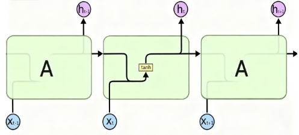
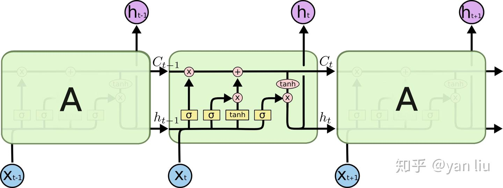
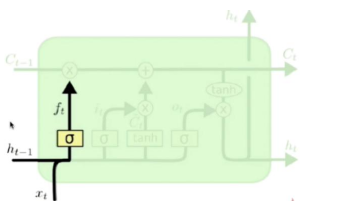
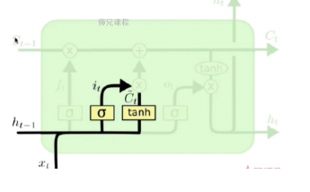
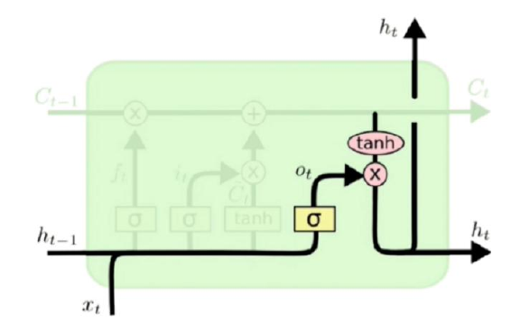

# LSTM

## RNN 中存在的问题

在 RNN 中，由于梯度的计算方式为：

$$
\frac{\partial L_3}{\partial W_{hh}} = \underbrace{\frac{\partial L_3}{\partial \hat{y}_3} \frac{\partial \hat{y}_3}{\partial h_3} \frac{\partial h_3}{\partial W_{hh}}}_{\text{Path 1: 只追溯到t=3}} + \underbrace{\frac{\partial L_3}{\partial \hat{y}_3} \frac{\partial \hat{y}_3}{\partial h_3} \frac{\partial h_3}{\partial h_2} \frac{\partial h_2}{\partial W_{hh}}}_{\text{Path 2: 追溯到t=2}} + \underbrace{\frac{\partial L_3}{\partial \hat{y}_3} \frac{\partial \hat{y}_3}{\partial h_3} \frac{\partial h_3}{\partial h_2} \frac{\partial h_2}{\partial h_1} \frac{\partial h_1}{\partial W_{hh}}}_{\text{Path 3: 追溯到t=1}}
$$

因此越早输入的内容，对于梯度的影响越小。这导致了 RNN 的短期记忆问题，即越晚的输入影响越大，越早的输入影响越小。

在LSTM中为了解决这一问题引入了门控单元。

标准 RNN 的流程：[h_{t-1}, x_t] -> TANH -> h_t

而在 LSTM 中则再次基础上增加了细胞状态（C_{t-1}）和门控的流程。

LSTM：[h_{t-1}, x_t, C_{t-1}] -> [遗忘门，输入门，输出门，候选值] -> [h_t, C_t]

## LSTM 的原理

LSTM 利用当前输入和上一时刻的隐藏状态，通过“门”这种机制，来智能地控制信息的流向。它不是 RNN 那样被动地覆盖记忆，而是通过“门”主动地、智能地管理记忆流。

LSTM 在 RNN 的基础上除了原有的 h_t 之外又引入了一个额外的记忆单元 C_t 。在 C_t 中，会按照一定的比例来记录不同的 t 时刻得到的内容。

而记多少，怎么记则是由通过门控进行控制。这里有 遗忘门 输入门 输出门三种门控。在经过每个门时，会根据此时的输入 x_t 以及隐藏的状态 h_t 来表示，这里的 h_t 代表的是一种上下文之间的联系与总结。

### 遗忘门

在LSTM中，遗忘门（Forget Gate）​ 是一个智能开关，它的唯一任务是：

根据当前的输入，判断需要从“长期记忆”中丢弃哪些信息，保留哪些信息。

在图中的体现就是，它决定了有多少上一时刻的细胞状态 C_{t-1}可以流入当前时刻。

$$f_t = \sigma(W_f x_t + U_f h_{t-1}) $$

### 输入层门

根据当前的新输入，判断有哪些新信息是重要的，并决定将这些新信息中的多大比例更新到长期记忆（细胞状态 C_t）中。

简单来说，它控制着 “哪些新知识值得被记住”。

$$i_t = \sigma(W_i x_t + U_i h_{t-1}) \$$

$\tilde{c}$ 代表着这个单元内状态的更新值

$$\tilde{c}*t = \tanh(W_c x_t + U_c h_{t-1})$$

i_t 用来控制 $\tilde{c}$ 的哪些特征用于更新 C_t 得到这一次的记忆：

$$c_t = f_t \odot c_{t-1} + i_t \odot \tilde{c}_t $$

### 输出层门

基于当前的输入，来调控有多少“处理后的长期记忆”将作为当前时刻的隐藏状态输出。

简单来说，它控制着 “基于我现在知道的一切，我该说多少？”。

其中 o_t 表示了应该输出多少历史信息：

$$o_t = \sigma(W_o x_t + U_o h_{t-1}) \$$

h_t 则表示这个单元的输出：

$$h_t = o_t \odot \tanh(c_t)$$

这里的 σ 代表 Sigmoid 激活函数

### 为什么存在两种激活函数

为什么 LSTM 模型中既存在 sigmoid 又存在 tanh 两种激活函数，而不是选择统一一种 sigmoid 或者 tanh？

在 LSIM 中 sigmoid 和 tanh 分别表示不同的意思。

#### Sigmoid函数：专业的“阀门控制器”

Sigmoid的输出范围是 (0, 1)。这个特性天生适合做“门”。

门控的物理意义：在LSTM中，我们有遗忘门（f_t）、输入门（i_t）​ 和输出（o_t）。门的作用是控制信息的通过比例。

* 输出为 0​ 意味着“完全关闭，不让任何信息通过”。
* 输出为 1​ 意味着“完全打开，让所有信息通过”。
* 输出为 0.6​ 意味着“允许60%的信息通过”。

为什么不用tanh做门？

tanh的输出范围是 (-1, 1)。如果用tanh做门，会出现“允许-20%的信息通过”这种没有物理意义的操作。而Sigmoid的(0, 1)范围完美地对应了“通过率”的概念。

结论：Sigmoid因其数学特性，被选为专门生成门控信号的函数，用于精确调节信息流。

#### tanh函数：专业的“状态转换器”

tanh的输出范围是 (-1, 1)，且是零中心化的。这个特性适合表示“状态”的变化。
状态值的需要：在神经网络中，我们经常需要处理有正有负的值。例如，一个特征可能是积极的也可能是消极的。tanh的输出范围提供了更大的输出空间，使得网络能够更容易地表示和学习这种范围更广的信息。

为什么不用Sigmoid表示状态？​ 

如果只用Sigmoid，所有神经元的输出都是正数。

这在多层网络中会导致后续层的输入全部为正，在反向传播更新权重时，所有梯度的方向会一致为正或一致为负（取决于最终误差）。