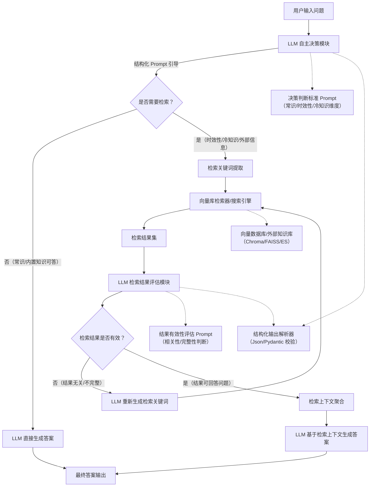

# ai 八股

## agent 开发

### 什么是 AI Agent？与传统的软件程序本质上有什么区别？

Al Agent是一个能够感知环境、自主决策并执行动作的智能系统，它通过大语言模型作为核心推理引擎，结合工具调用、记忆机制和规划能力来完成复杂任务。

与传统软件程序的本质区别在于执行逻辑的根本不同。传统软件程序遵循"输入-处理-输出"的线性流程，整个处理逻辑在设计阶段就已确定，就像一条生产线，每个环节的操作步骡都是预先设定好的。AI Agent则采用"感知-决策-执行"的循环架构，形成一个持续
的反馈闭环:

环境感知模块不仅仅是数据输入，还包括对多模态信息的理解和语义解析。知识库存储的不是简单的数据表，而是结构化的经验和规则，支持动态更新和检索。推理引擎是核心差异所在，传统程序的逻辑是开发者编写的if-else分支或状态机，而AI Agent的推理引擎基于大语言模型或其他AI算法，能够处理模糊信息、进行类比推理。

举个实际应用场景，传统的客服系统只能按照预设规则匹配用户问题，而Al Agent客服能够理解复杂的用户意图，主动调用查询工具获取信息，甚至在对话过程中调整自己的回答策略。这种从确定性执行到概率性推理的转变，是AIAgent与传统软件程序的核心差异。

### Al Agent的可解释性如何保证?

1. 决策链路可视化
    * 对 Agent 的每一步思考、工具调用、结果解析都进行日志记录，形成完整的决策树。
    * 提供可视化界面，让开发者和用户能清晰看到 “Agent 为什么选择这个工具”“基于什么信息得出这个结论”。
2. 推理过程结构化
    * 强制 Agent 在思考时输出结构化的推理链（Chain-of-Thought），例如：“我需要先查询用户的历史订单（工具 A），然后根据订单状态（状态 X），再调用退款接口（工具 B）”。
    * 使用标准化的提示词模板，引导 Agent 将思考过程拆解为 “目标→步骤→依据→结论” 的清晰结构。
3. 信息来源可追溯
    * 所有回答中的事实性陈述，都必须标注信息来源（如 “根据数据库 ID=123 的记录”“来自搜索引擎的第 3 条结果”）。
    * 对于生成的内容，提供置信度评分，让用户了解结论的可靠程度。
4. 审计与合规机制
    * 在高风险场景（如金融、医疗）中，引入人类审核环节，对 Agent 的关键决策进行二次确认。
    * 建立审计日志，记录所有决策和操作，满足监管和合规要求。

### 多个 Agent 之间如何协作避免冲突？

多 Agent 协作的关键是明确分工、统一协议、冲突仲裁，我在项目中采用的是 “中枢调度 + 领域分工” 的模式：

1. 明确角色与边界
    * 为每个 Agent 定义清晰的职责范围，例如：规划 Agent 负责任务拆解，执行 Agent 负责工具调用，监控 Agent 负责结果校验。
    * 通过 MCP 等协议，统一 Agent 之间的通信格式和数据模型，避免因理解偏差导致冲突。
2. 中枢调度与优先级
    * 引入一个 “协调 Agent” 或 “调度器”，作为所有 Agent 的通信中心，负责任务分配、资源调度和冲突检测。
    * 为不同类型的任务和 Agent 设置优先级，当出现资源竞争时，按照优先级进行处理。
3. 冲突检测与仲裁
    * 当多个 Agent 对同一任务提出不同方案时，协调 Agent 会组织辩论（Debate），让各方陈述理由，然后基于预设规则（如多数表决、专家权重）做出最终决策。
    * 对于无法调和的冲突，自动升级到人类进行干预。
4. 状态同步与共识
    * 建立共享的全局状态库，所有 Agent 在修改关键状态前都需要进行共识确认，避免数据不一致。
    * 使用事件驱动的架构，当一个 Agent 的操作影响到全局状态时，及时通知其他相关 Agent 进行状态更新。

### 如何解决 AI Agent 的幻觉问题？

幻觉是 Agent 生成看似合理但与事实不符的内容，解决的核心是从 “生成优先” 转向 “验证优先”，我总结了一套 “四步验证法”：

1. 工具优先，禁止空对空
    * 强制 Agent 在回答任何事实性问题前，必须调用外部工具（如搜索引擎、数据库、API）获取最新、最准确的信息。
    * 禁止 Agent 在没有任何外部信息支撑的情况下，直接生成结论。
2. 多源交叉验证
    * 对于关键信息，要求 Agent 从至少两个独立的来源获取数据，并进行比对。
    * 如果多个来源的信息不一致，Agent 需要主动向用户澄清，而不是自行选择。
3. 结构化输出与事实标注
    * 引导 Agent 将回答拆分为 “事实陈述” 和 “推理结论” 两部分，并为每个事实陈述标注来源。
    * 例如：“根据 2023 年财报（来源：公司官网），公司营收增长了 15%，因此我认为...”。
4. 人类反馈与迭代优化
    * 收集用户对 Agent 回答的反馈，将被标记为 “错误” 或 “误导” 的案例加入训练集，对模型进行微调。
    * 建立幻觉检测模型，对 Agent 的输出进行实时扫描，发现可疑内容立即触发重新验证或人工审核。

### 如何设计Agent的反思机制？何时触发反思？

反思机制是 Agent 的元层能力，它不直接负责推理或执行，而是评估推理质量与执行结果，进而影响下一轮的策略，是在 Chain-of-Thought（推理透明化）和 ReAct（边推理边执行）之上的优化层。

反思闭环包含四个核心模块：

* 触发器：监控执行状态，识别反思触发信号（如用户不满、结果不达标）。
* 评估器：对 Agent 的回答质量、推理过程进行量化与定性评估。
* 归因器：定位问题根源（如未确认用户具体诉求、推理逻辑偏差）。
* 更新器：将反思结论写入记忆，并调整后续执行策略。

反思分为被动触发和主动触发两种模式：

* 被动触发：有明确的错误信号时启动，如工具调用失败、用户明确表示不满、输出格式校验不通过等。适用于对质量要求高的关键节点，必须修正错误。
* 主动触发：无明显错误信号，但 Agent 定期检查自身表现，如每完成三步任务就回顾一次中间结果，或在多轮对话中主动评估是否理解了用户意图。适用于长链路任务，避免方向性偏差累积成大问题。

反思的粒度分为三层，在不同视角上发挥作用：

* 单步反思：关注某一次工具调用或某一段文本生成的质量，如检查调用商品搜索接口返回的商品数量、价格区间是否符合用户查询意图。
* 任务级反思：关注整个任务链路的完成度和效率，如评估 “帮我找个适合送女朋友的礼物” 这一任务中，最终推荐的商品组合是否解决了用户需求，中间是否有冗余步骤。
* 长期经验总结：跨越多个任务周期，评估 Agent 在某类场景下的整体表现，如 “用户咨询优惠券问题时，先查可用券再解释规则的成功率比直接解释规则高 30%。

反思结果的存储和利用是工程实现的关键：

* 短期记忆：记录在当前会话的上下文中，如用ReflectionHistory对象记录本次任务中每一步的反思结论，供后续步骤参考。

* 长期记忆：将反思经验持久化，常见做法是：将经验规则存储到向量数据库，通过语义检索找到相似场景的历史教训。提炼成规则库，把高频问题和对应的最佳实践固化成 if-then 规则，降低每次 LLM 推理的成本。

反思机制与其他 Agent 能力是协作互补的：

* Chain-of-Thought (CoT)：让推理过程显性化，为反思提供可评估的思考链路。
* ReAct：实现 “思考 - 行动” 交替，反思则评估这一过程的质量，并调整下一轮的策略。
* 整体流程：任务开始 → CoT 推理透明化 → ReAct 边思考边执行 → 反思机制评估并调整策略 → 优化输出。

### 如何解决反思陷入死循环的问题？

在 Agent 的反思闭环中，死循环本质上是评估维度单一、修正策略无效或收敛条件缺失导致的 “原地振荡”。结合工程实践，我会从四个层面解决这个问题：

1. 明确收敛条件，避免无限迭代
    * 差距收敛校验：每次反思后，必须量化当前方案与目标的差距，只有差距在缩小，才允许继续反思；如果连续两次反思后差距没有改善，就强制终止反思，避免来回振荡。
    * 外部验证机制：引入小样本测试或真实数据校验，用实际效果判断是否在进步，而不是完全依赖模型的自我评估，避免 “自嗨式” 反思。
2. 设计多维度评估体系，跳出局部最优
    * 避免只从单一维度（如吸引力）评估质量，而是从准确性、完整性、合规性、用户体验等多个角度综合判断。
    * 例如推荐文案，既要考虑吸引力，也要考虑真实性和合规性，这样就不会在某一个维度上反复纠结，导致死循环。
3. 分层反思，控制成本与深度
    * 快速规则预检：第一层用低成本规则（如检查状态码、数据格式）做预过滤，只有发现潜在问题时，才进入第二层调用 LLM 做深度分析，避免不必要的反思。
    * 成本 - 收益权衡：在实时性要求高的场景，要权衡反思的价值和端到端耗时，必要时直接终止反思，避免因过度优化导致性能问题。
4. 引入策略兜底与未来优化方向
    * 策略回滚与降级：当反思连续失败时，自动回滚到上一个有效策略，或直接请求用户澄清、触发人工介入，避免在错误路径上越陷越深。
    * 元反思与自学习：长期来看，可通过元学习让模型自动学习 “在什么场景下用什么反思策略”，或结合强化学习，把反思中发现的好策略强化、差策略抑制，让系统在运行中不断优化反思模型本身。

### Agent对话模块的容错能力怎么设计？用户说话不清楚有歧义怎么办？

对话系统的容错能力核心在于多层识别与主动澄清机制。当遇到用户输入不清晰时，首先通过置信度阈值判断识别结果的可靠性，低于阈值就触发容错流程。

具体来说，你可以设计意图消歧策略:当识别到多个可能意图时，通过追问来确认，比如用户说"我要查一下"，系统回复"您是要查询订单、余额还是物流信息?"。对于sot填槽不完整的情况，用自然的方式引导补充，像用户说"帮我订票"，系统就问"的，请问您要订哪天从哪里出发的票?"。

还要建立上下文修正机制，允许用户随时纠正前面的错误输入。比如用户说"明天"后又说"不对，是后天"，系统能识别否定词更新槽位值。另外模糊匹配和同义词扩展也是基础能力，用户说"退钱"你得理解成"退款"，说"不要了"要关联到"取消订单"。在理解不了的时候，直接坦诚告知比胡乱猜测要好，说"抱歉我没理解，您可以换个说法吗"总比答非所问让用户更抓狂来得强记住容错的目标是让对话继续下去，而不是卡死在某个识别失败的节点上。

### 什么是Agent的辩论？

Agent辩论模式是让多个Agent针对同一问题从不同立场进行论证和反驳，通过对抗性交互来暴露推理漏洞、挖掘多角度视角最终收敛到更优质的答案。这里的辩论模式来自一个朴素的认知规律：当我们被迫为自己的观点辩护时，思考会更加严谨。这个机制的核心是设置至少两个Agent扮演对立角色，一个提出论点，另一个质疑反驳，然后交替行多轮辩论。在这个过程中，每个Agent都会被迫审视自己推理的薄弱环节，同时吸收对方的有效论据。

辞论模式提升答案质量的原理在于对抗性验证能有效减少单一Agent的幻觉和偏见。就像我们开技术评审会，不同同学从架构生能、成本角度互相challenge，比一个人闷头想方案更容易发现盲区。比如在代码审查场景中，一个Agent提出某种实现方案，另一个Agent从性能、安全、可维护性角度挑战这个方案，经过几轮交锋后会暴露出初始方案可能忽略的边界条件或潜在bug。在复杂决策场景如医疗诊断建议、法律咨询中，辩论模式能确保考虑到多种可能性和风险点。

最后由裁判Agent或通过投票机制选出最佳答案，也可以让一个总结Agent整合双方观点形成综合结论。实现上需要注意给不!Agent设定明确且差异化的角色定位，避免陷入无效争论。辩论轮数通常控制在3到5轮，过多会导致成本上升而收益递减。这种模式特别适合答案具有争议性或需要多维度权衡的问题。

辩论模式和RAG其实是很好的互补关系。RAG能提供外部知识支撑，让辩论基于事实而不是空谈。具体来说，可以让每个辩论gent在论证时先通过RAG检索相关证据，然后基于这些证据构建论点。比如在技术选型辩论中，一个Agent主张用Redis做绣存，它可以通过RAG检索Redis的性能基准测试数据、成功案例来支撑观点。另一个Agent主张用Memcached，同样可以检穿相关资料进行反驳。这样辩论就不是凭空臆测，而是有数据支撑的理性对话。实现上需要注意控制检索的范围和质量，不能让Agent检索到互相矛盾的信息源导致辩论陷入混乱，可能需要预先设定可信的知识库边界。

### 什么是MCP协议，解决的问题是什么？

MCP 本质上是一个连接层协议，他规范了AI模型如何与外部进行联系与标准化交互。在MCP出现之前，AI应用想要获取外部数据通常需要人工介入，比如手动导出数据文件、复制粘贴信息，或者开发专门的数据传输脚本。每个AI应用都要重复解决同样的数据连接问题。

从技术架构角度来看，MCP采用了经典的三层架构模式:客户端层、服务端层和传输层。客户端层负责A!模型的请求封装和响应解析，服务端层提供具体的数据源接口实现，传输层则处理协议通信和安全验证。这种分层设计体现了复杂系统的模块化思路，让每一层都可以独立演进和优化。

最关键的是理解MCP与传统API协议的本质区别。MCP不是简单的数据传输，而是带有语义理解的上下文传递。传统的API协议主要解决系统间的数据传输，而MCP专门针对A!模型的上下文理解需求进行了优化，它不只是传输数据，还要让A!理解数据的语义和使用方式。比如电商系统中，当A|查询商品信息时，MCP不仅传递商品属性数据，还会包含这些数据的业务含义，让A!理解什么是库存状态、什么是促销价格，以及这些信息之间的关联逻辑。

### MCP协议的基本架构是怎样的？C/S端如何交互

协议定义 -> 架构层级 -> 交互流程 -> 关键特性

MCP（Model Context Protocol）是为了解决大模型与外部工具、服务之间交互碎片化问题而设计的标准化通信协议，其核心是一个三层架构，为 Agent 开发（包括反思机制）提供了统一的上下文管理和交互规范。

应用层（Application Layer）：作为顶层接口，直接与 Agent 或大模型交互，负责接收高层指令，封装成 MCP 规范的请求，并将执行结果返回给 Agent，是整个系统的 “入口与出口”。
协议层（Protocol Layer）：是架构的核心中枢，定义了统一的请求 / 响应格式、上下文序列化规则和安全机制，确保所有模块间的通信高效、可靠、无歧义。
服务层（Service Layer）：作为 “能力池”，对接各种外部工具、API 和数据库，执行具体操作并返回标准化结果，为 Agent 提供事实校验、数据查询等底层能力。

Client和Server的交互分为三个阶段:初始化握手、能力发现和具体调用。初始化时Client会发送initialize请求，Server返回己支持的能力清单。然后Client可以查询具体有哪些tools、resources和prompts可用。最后根据需要发起具体的功能调用。AI客服需要查询订单信息时，它作为Client先与订单系统的MCP Server建立连接，获取到可用的查询接口列表，然后发送包。
订单号的查询请求，Server返回订单详情。整个过程都遵循标准化的消息格式，保证了不同系统间的互操作性。双向通信能力让Client和Server都可以主动发起交互，不像传统的请求-响应模式那么僵化。传统的AP!调用是单向的，Client请求Server响应。

### MCP 与 rpc 的区别与联系

1. PC 是面向「函数 / 接口」的调用，MCP 是面向「上下文 / 状态」的协作
    * RPC 解决的是：像调用本地方法一样调用远程服务，关注函数调用、参数、返回值。
    * MCP 解决的是：多智能体、多节点之间传递完整上下文状态（对话历史、执行进度、工具结果、思考过程），关注任务流程的连续性。
2. RPC 是同步请求 - 响应模型，不适合可中断、可恢复的 AI 流程
    * RPC 一次调用必须一次返回，不支持暂停、等待人类输入、断点续跑。
    * MCP 天生支持中断 - 恢复、状态持久化、分步执行，非常适合 LangGraph、Agent 这种需要人机交互、多步推理、循环执行的场景。
3. MCP 专为 AI 智能体协作设计，RPC 不具备上下文管理能力
    * 在多智能体系统里，节点之间需要共享记忆、状态、中间结果。
    * RPC 只是调用，不管理状态；MCP 自带状态流转、上下文同步、执行图管理。
4. 耦合度不同：MCP 更松耦合，更适合复杂工作流
    * RPC 强依赖接口签名，改接口就要改客户端。
    * MCP 只依赖统一的状态结构，智能体可以独立升级、独立调度，更适合动态复杂的 AI 工作流。

简单说：RPC 是用来做「服务调用」的，MCP 是用来做「智能体协作」的。
在 AI 智能体、工作流、多步骤任务、人机交互这些场景里，MCP 比 RPC 更贴合、更灵活、更可扩展，所以我们需要 MCP。

### MCP协议支持哪些传输方式各有什么特点

### MCP(Model Context Protocol)协议中的Resource和To0I有什么区别?各自的使用场景?

Resource和TooI在MCP协议中本质上是两种完全不同的数据交互机制。这个问题的核心在于理解静态数据访问和动态功能执行的区别。

Resource是静态数据源，它提供可读取的信息内容，比如文件、数据库记录、API响应等。当你需要获取某个特定的数据时，你通过Resource URl来访问，系统返回的是数据本身。典型场景包括读取配置文件、获取用户档案、访问文档内容等。Resource的交互是单向的读取操作，你请求什么URI，就返回对应的数据内容。

Tool则是可执行的功能单元，它不是数据而是动作。当你调用To0l时，实际上是在执行某个操作或计算过程，然后获得执行结果。比如发送邮件、执行数据库查询、调用计算函数、触发业务流程等。Tool的交互是双向的执行操作，你传入参数，Tool执行逻辑后返回执行结果。

简单说，Resource回答"这里有什么数据"，Tool回答"我能帮你做什么事”。当你需要获取已存在的信息时用Resource，当你需要执行某个操作来产生结果时用To0l。在实际应用中，一个完整的MCP服务往往同时提供Resource来暴露数据访问能力，提供Tool来暴露功能执行能力。

### AI Agent的幻觉问题如何解决？有哪些验证策略？

A!模型本质上是基于统计规律进行文本生成的，它会选择在训练数据中最可能出现的下一个词汇。问题在于，模型无法真正理解事实的真假，它只是在学习语言模式。当训练数据中存在错误信息，或者模型面对训练时未充分见过的问题时，就容易产生看似合理但实际错误的输出。

AlAgent的幻觉问题主要通过多层验证策略来解决。首先在输入端进行事实核查，通过检索增强生成(RAG)技术将Agent的回答与可信知识库进行实时比对，确保信息来源的准确性。在推理过程中，我建议采用多模型交叉验证，让不同的模型对同一间题进行独立判断，通过一致性检查来识别潜在的幻觉内容。

对于输出验证，置信度评分机制非常关键，当Agent对某个回答的置信度低于阈值时，应该主动标记不确定性或拒绝回答。同时配合逻辑一致性检查，验证Agent前后回答是否存在矛盾。

在实际应用中，比如智能客服场景，可以设置人工审核触发点，当检测到高风险回答时自动转人工处理。对于金融或医疗等关钱领域，还需要建立专业知识图谱验证，确保Agent的回答符合行业标准和法规要求。

另外，持续学习和反馈循环也很重要，通过收集用户纠错和专家标注，不断优化Agent的判断能力。最有效的方法是建立分层驴证架构，根据问题的复杂度和风险等级采用不同强度的验证策略，既保证准确性又维持响应效率。

### LangChain是什么?它解决了LLM应用开发的哪些问题?

LangChain是一个专门为大语言模型(LLM)应用开发设计的框架，它通过提供标准化的组件和抽象层来简化复杂应用的构建过程。在实际开发中，我们经常遇到几个核心痛点:提示词管理混乱、多步骤调用逻辑复杂、外部数据源集成困难，LangChain正是为解决这些问题而生的。

具体来说，LangChain解决了几个关键问题。首先是链式调用的编排问题-当你需要让AI先分析用户意图，再查询数据库，最后生成回答时，LangChain的Chain组件让这个流程变得可控可维护。其次是记忆管理-通过Memory组件，你可以轻松实现灭话历史的保存和上下文传递，不用自己处理复杂的状态管理。

另一个重要价值是外部工具集成，比如让A!调用搜索引擎、计算器或数据库查询，LangChain的Agent和Tool机制提供了标准化的接口。最后是提示词模板化，通过PromptTemplate组件，你可以将提示词逻辑从代码中分离，便于维护和优化。

总的来说，LangChain让原本需要大量胶水代码的LLM应用开发变成了组装积木式的编程，显著降低了开发复杂度和维护成本。

### LangChain的核心组件有哪些?各自的作用是什么?

在 LangChain 的设计中它分为四层：基础能力层 → 增强扩展层 → 流程编排层 → 应用层。

基础能力层（核心底座）

这一层是所有 AI 应用的基础，负责**最原始的输入、输出、记忆**。

1. **LLM 封装（LLMs / ChatModels）**
    - 作用：统一对接各类大模型接口（OpenAI、文心、通义、本地模型）。
    - 设计价值：屏蔽底层差异，让上层代码**不依赖具体模型**，可随时切换。

2. **Prompt Template（提示词模板）**
    - 作用：结构化、可复用地生成提示词，支持变量、多轮对话格式。
    - 设计价值：让提示工程**工程化、可维护、可批量生成**，而不是手写字符串。

3. **Memory（记忆模块）**
    - 作用：管理对话历史，提供**上下文记忆能力**。
    - 包含：Buffer、Window、Summary、向量记忆、PG/Redis 持久化等。
    - 设计价值：让无状态的 LLM 变成**有状态、可连贯对话**的智能体。

增强扩展层（给 LLM 外挂能力）

这一层解决 LLM 本身**知识过时、幻觉、无法操作外部系统**的问题。

1. **Document Loader & Text Splitter（文档加载与分片）**
    - 作用：读取各类文件（PDF/MD/Excel/HTML），切分成适合模型输入的块。
    - 设计价值：让私有数据**可接入、可检索**。

2. **Embeddings + VectorStore（向量与向量库）**
    - 作用：把文本转为向量，存入向量库，支持**相似度检索**。
    - 设计价值：是 **RAG 的核心基础**。

3. **Retrieval（检索器）**
    - 作用：从向量库/数据库中召回相关内容，给模型提供外部知识。
    - 设计价值：实现 **RAG 检索增强生成**，大幅降低幻觉。

4. **Tools / Toolkits（工具）**
    - 作用：给模型提供调用外部能力的接口，如搜索、计算器、代码解释、数据库、API。
    - 设计价值：让 LLM 从“语言模型”变成“**能做事的智能体**”。

流程编排层（核心灵魂）

这一层是 LangChain 最有价值的部分，把零散组件**串成可执行流程**。

1. **Chain（链）**
    - 作用：将 LLM、Prompt、Memory、Tools 封装成**一步或多步的固定执行流程**。
    - 设计价值：实现**模块化、可组合、可复用**的 AI 逻辑。

2. **Agent（智能体）**
    - 作用：不写死流程，让 LLM **自主判断**：要不要调用工具、调用哪个、是否继续。
    - 设计价值：从固定流程 → **自主决策智能体**，处理复杂未知任务。

3. **LangGraph**
    - 作用：基于**状态图 + 节点 + 边**构建**可中断、可循环、可恢复**的工作流。
    - 设计价值：解决传统 Agent 不稳定、不可控、不可观测问题，支持**人机交互、多智能体协作**。

### LangGraph 是什么？与 Langchain 的关系是什么？

LangGraph是LangChain生态系统中的一个专门模块，用于构建具有状态管理和循环控制的复杂AI应用程序。它基于图结构来编排多个处理节点，每个节点可以是LLM调用、工具执行或数据处理步骤。

与传统的LangChain链式调用不同，LangGraph允许创建非线性的执行流程。比如在构建一个代码审查助手时，LangGraph可以让程序在"分析代码"→"发现问题"→"生成修复建议"→"验证修复"之间循环执行，直到代码质量达标才结束流程。而普通的LangChain只能按预设顺序执行。

LangGraph的核心优势在于状态持久化和条件分支。它维护一个全局状态对象，各节点可以读取和修改状态，支持基于状态内容进行路径选择。这让你能够构建真正的Al Agent，而不仅仅是简单的问答系统。

在实际应用中，LangGraph特别适合构建需要多步推理、错误重试、动态决策的场景，比如自动化客服系统需要在"理解问题"→"查询知识库"→"生成回答"→"确认用户满意度"之间灵活跳转。它本质上是LangChain从简单链式调用向复杂图状态机的进化，为构建生产级AI应用提供了更强大的控制能力。

### LangGraph 的人机交互功能如何实现？

LangGraph的人机交互功能主要通过interrupt机制和人工节点来实现。你可以在图中设置特定的节点作为中断点，当执行流到达这些节点时，系统会暂停执行并等待人工干预。

核心实现方式是使用 interrupt_before 或 interrupt_after 参数来标记需要人工介入的节点。比如在一个文档审核流程中，你可以在AI生成初稿后设置中断点，让人工审核员检查内容质量。审核员可以直接修改生成的内容，或者提供反馈指令，然后通过 invoke或 stream 方法恢复执行。

状态持久化是关键特性，LangGraph会保存中断时的完整状态，包括所有变量和执行上下文。你可以使用内存存储或数据库来持久化这些状态，确保即使系统重启也能从中断点继续执行。

实际应用中，这种机制特别适用于需要人工判断的场景，比如法律文档生成中的合规性检查、客服对话中的复杂问题升级、或者代码生成后的安全审查。人工干预可以是简单的确认操作，也可以是复杂的内容编辑和参数调整，系统会根据人工输入更新状态图并继续后续的自动化流程。

### 如何调试LangGraph工作流

LangGraph工作流调试主要通过内置日志系统和可视化工具来实现。你可以在每个节点中添加 system.out.printin()语句或使用Logger 来跟踪数据流转，这样能清楚看到状态在节点间的传递过程。

LangSmith是最核心的调试工具，它能提供完整的执行轨迹可视化，包括每个节点的输入输出、执行时间和错误信息。配置方式是设置 LANGCHAIN TRACING V2=true 环境变量，然后在LangSmith界面查看详细的执行图谱。
对于实时调试，你可以使用断点调试，在关键节点设置断点来暂停执行，检查当前状态内容。另外，graph.getGraph().drawMermaid()方法能生成工作流的结构图，帮助你理解节点连接关系。

在处理复杂工作流时，建议使用状态检查器功能，通过 graph.invoke(input，debug=true)启用详细输出模式。如果遇到条件路由问题，可以在路由函数中添加日志记录，明确显示路由决策的依据。

性能调试方面，LangSmith的时间轴视图能帮你识别瓶颈节点，而内存使用情况可以通过性能监控库来监控。这些工具组合使用，基本能覆盖LangGraph工作流的所有调试需求。

### 如何在LangGraph中实现超时控制?

在LangGraph中实现超时控制主要通过asyncio的timeout机制和自定义节点超时逻辑来完成。最直接的方式是在执行图的入口处使用 asyncio.wait_for()包装整个执行流程，设置全局超时时间。比如在调用LLM进行文档分析时，你可以设置30秒超时避免长时间等待。更精细的控制则需要在节点级别实现超时，通过在每个节点的执行函数中添加timeout参数，或者使用asyncio.timeout 上下文管理器包装具体的操作。

对于流式处理场景，还需要考虑中间状态的处理。当某个节点超时时，可以通过状态管理机制记录当前进度，支持从断点继续执行或者优雅降级。实际应用中，比如构建RAG系统时，检索节点可能因为向量数据库响应慢而超时，这时你可以设置备用检索策略或返回缓存结果。

LangGraph还支持条件路由来处理超时情况，你可以定义超时后的fallback路径，确保整个workflow不会完全中断。关键是要在设计图结构时就考虑超时场景，将异常处理节点作为正常流程的一部分，而不是简单地抛出异常。这样既保证了系统的鲁棒性，又能为用户提供更好的体验。

### 如何在LangGraph中定义状态?状态管理的最佳实践?

在LangGraph中，状态是通过TypedDict或自定义类来定义的，它作为图中所有节点间共享的数据结构。你需要在创建StateGrap时明确指定状态类型，比如 stateGraph(Mystate)，其中MyState包含了所有需要在节点间传递的数据字段。

状态管理的核心在于保持不可变性和明确的数据流向。每个节点函数接收当前状态作为输入，返回状态的更新部分，LangGraph会自动合并这些更新。你应该避免在节点内直接修改状态对象，而是返回包含变更字段的字典。

最佳实践方面，首先要合理设计状态结构，将相关数据分组，避免过度扁平化。对于复杂的对话系统，可以将用户输入、对话历史、中间结果分别作为独立字段管理。其次，利用状态的历史追踪能力，LangGraph支持checkpointing，能够回溯和恢复到任意执行点。

在处理大型数据时，考虑使用引用传递而非直接存储，比如将大文档的ID存储在状态中，实际数据存储在外部系统。同时，要注意状态的序列化兼容性，确保所有字段都能被正确序列化和反序列化，这对于分布式执行和持久化至关重要。合理使用条件边来控制状态流转，避免无效的状态传播。

### 如何在LangGraph中实现循环和迭代?

在LangGraph中实现循环和选代主要通过条件边(conditional edges)和状态管理来完成。与传统编程的for/while循环有本质区别，LangGraph的循环是基于图的状态流转来实现的。你需要在图的节点中定义判断逻辑，当满足特定条件时让执行流程回到之前的节点，形成循环结构。

核心实现方式是使用 add_conditional_edges 方法，在节点执行后根据状态值决定下一步走向。比如在RAG系统中，你可以设计一个检索-验证-里试的循环:检索节点获取文档后，验证节点判断结果质量，如果不满足要求就通过条件边回到检索节点重新执行，直到达到质量标准或达到最大迭代次数。

状态控制是关键所在，需要在图的状态中维护循环计数器和终止条件。例如设置retry_count 字段记录迭代次数，在条件函数中检查这个值来决定是继续循环还是退出。同时要确保每次迭代都更新相关状态，避免无限循环。实际应用场景包括多轮对话中的意图澄清、API调用失败重试、多步推理中的结果验证等。要设置合理的最大迭代限制和明确的退出条件。

### NLG 在对话系统中的应用方式，模板检索生成各自有什么优缺点？

自然语言生成（NLG）在对话系统中，核心是将系统的内部状态 / 决策转化为人类可理解的自然语言回复，主要有三种典型实现方式：

1. 模板式生成
    * 原理：通过预定义的文本模板（如 您的订单{order_id}已发货，预计{time}送达），结合槽位填充（slot filling）生成回复。
    * 对话应用：常见于客服机器人、FAQ 问答、订单 / 物流通知等场景，回答结构固定、信息明确。
2. 检索式生成
    * 原理：从知识库 / 对话语料库中检索与用户问题最匹配的已有回复，或检索相关片段后拼接生成。
    * 对话应用：企业知识库问答、智能客服、RAG 系统等，强调答案的准确性和可溯源性。
3. 生成式生成
    * 原理：基于大语言模型（LLM），根据用户输入和上下文动态生成全新的自然语言回复。
    * 对话应用：开放域聊天、多轮复杂对话、创意生成等，强调灵活性和自然度。

| 方式 | 核心优点 | 核心缺点 | 典型适用场景 |
| :--- | :--- | :--- | :--- |
| **模板式生成** | ✅ 实现简单，开发成本低 ✅ 回复可控、稳定、无幻觉 ✅ 响应速度快，资源消耗小 | ❌ 依赖人工编写大量模板，扩展性差 ❌ 回复生硬、缺乏自然度 ❌ 无法处理未覆盖的新问题 | 客服FAQ、订单通知、固定流程问答 |
| **检索式生成** | ✅ 答案准确、可溯源，适合专业领域 ✅ 可接入最新知识，无需重训模型 ✅ 可控性优于纯生成式 | ❌ 依赖知识库质量，无匹配项时表现差 ❌ 回复多样性受限，不够自然 | 企业知识库、医疗/法律等专业问答、RAG 系统 |
| **生成式生成** | ✅ 灵活性高，可应对开放域和复杂语义 ✅ 回复自然流畅，拟人化程度高 ✅ 无需大量人工配置 | ❌ 易产生幻觉、不准确或无关内容 ❌ 可控性弱，成本和资源消耗高 ❌ 对训练数据和算力要求高 | 开放域聊天、创意助手、多轮复杂对话 |

### 什么是对话历史窗口?保留多少轮对话合适?

对话历史窗口是指在多轮对话中保留的历史消息数量，用于为大模型提供上下文信息。由于模型的token限制和成本考虑，我们不能无限制地保留所有历史对话，需要通过窗口机制来截阁取最近的若干轮对话。这就像人的短期工作记忆，只能记住最近发生的几件事，时间久远的细节就会自然遗忘。

保留多少轮其实没有固定答案，这取决于你的具体场景。一般来说3-10轮是比较常见的选择。如果是客服场景，可能5轮左右就够了，因为用户的问题往往比较聚焦，"我的订单为什么还没发货""怎么申请退款"这类咨询基本几轮就能解决。但如果是技术咨询或复杂的任务型对话，可能需要保留10轮甚至更多，因为后续问题经常依赖前面的大量上下文，比如用户先描述系统架构，然后问数据库设计，接着讨论性能优化，这些环节环环相扣。

实际应用中你需要权衡几个因素:token成本会随窗口增大线性增长，窗口每扩大一倍，每次调用的费用就跟着翻倍;响应延迟也会变长，模型需要对输入的所有token做Attention计算，输入越长计算量越大;但窗口太小又会导致上下文丢失，模型回答变得答非所问，用户明明刚问过的事情，下一轮就"失忆"了。比较实用的做法是采用滑动窗口策略，保留最近N轮对话，或者使用智能截断，优先保留system提示词和最近几轮，对中间的历史做摘要缩。有些场景还会根据对话的重要性动态调整窗口大小，比如检测到话题切换时就清空历旲更力计在本国保重新开始计数。关键是要在你的实际业务中测试和调优，找到成本和效果的最佳平衡点。

这里需要计算好模型的上下文窗口大小。

同时可以对历史对话做出总结：

### agent 的记忆机制如何设计？短期记忆和长期记忆的区别？

Al Agent的记忆机制是系统维持状态连续性和知识积累的核心组件。短期记忆主要存储当前会话或任务执行过程中的临时信息，包括用户输入历史、中间计算结果、上下文状态等，通常采用有限长度的缓冲区或滑动窗口实现，当超出容量限制时会自动清除最早的记录。长期记忆则负责持久化存储重要知识和经验，包括用户偏好、历史交互模式、学习到的规则等，常通过向量数据库、知识图谱或结构化存储实现。

在技术实现上，短期记忆直接影响当前推理过程，需要快速读写访问，而长期记忆需要检索机制来激活相关信息。比如在客服Agent中，短期记忆保存本次对话的问题描述和解决步骤，长期记忆则存储用户的产品使用历史和问题解决偏好。两者的关键区别在于生命周期、存储容量和访问模式:短期记忆具有会话级生命周期、有限容量和顺序访问特性;长期记忆具有持久化生命周期、大容量存储和基于相似度的检索访问特性。设计时需要考虑记忆更新策略、检索效率和存储成本的平衡。

### agent 的Self-Refinement是如何实现的？需要哪些关键组件？

Agent的Self-Refinement本质是让Agent通过自我反馈循环来迭代优化输出结果。你可以把它类比成我们写文档的过程一.-先快速写个初稿，然后回过头审视哪里逻辑不通、哪里表达不清，再针对性修改。实现机制是Agent先生成初始响应，然后对这个响应进行critique评估，发现问题后重新生成改进版本，这个过程可以多轮迭代直到满足质量标准。

关键组件主要包括三个部分:Generator生成器负责产生初始输出，Critic评估器对输出进行批判性分析找出缺陷，Refiner改进器根据评估反馈重新生成优化后的结果。这三个角色可以是同一个大模型切换不同prompt实现，成本很可控。整个过程就是个闭环--生成结果后立刻自我批判，发现具体问题就带着改进建议重新生成，这个循环可以跑多轮直到质量达标。

实现时需要设计好评估维度，比如代码生成场景会检查语法正确性、逻辑完整性、边界条件处理等;文本生成则关注事实准确性、逻辑连贯性、表达清晰度。终止条件也很关键，可以设置最大迭代次数，或者当Critic评分达到阈值时停止。核心价值在于将人类的选代思考过程内化到Agent的执行流程中，相比传统的单次生成，这种机制能显著提升复杂任务的成功率。

### agent 在执行过程中可能遇到哪些错误？如何处理？

Al Agent的错误可以从三个维度来分析，分别是基础设施层、业务逻辑层和智能决策层的错误。基础设施层的错误主要是网络异常、服务调用失败这类传统分布式系统都会遇到的问题，对于这类错误，我们通常采用重试加降级的策略。业务逻辑层的错误包括数据格式异常、参数校验失败等，这需要在Agent的输入输出环节建立严格的校验机制。最有技术含量的是智能决策层的错误，也就是Agent理解偏差或推理错误，与传统系统不同，AIAgent的错误往往具有不确定性，需要通过置信度机制和人工介入来兜底。

输入数据异常的处理：数据异常的识别需要在多个层次进行校验。最直观的是格式校验，比如用户输入的商品ID应该是数字，但收到的却是包含特殊字符的字符串。这种错误相对容易检测，但更复杂的是语义层面的异常。电商用户搜索"苹果"，可能指水果也可能指手机，Agent需要通过上下文来判断意图。如果判断错误，需要有机制让用户进行澄清，而不是直接按照系统理解执行操作。

模型推理错误的特殊性在于它往往不会直接抛出异常，而是产生看似合理但实际错误的结果。监测这类错误需要建立多重验证机制。比较有效的方法是设置检查点，在Agent做出关键决策时进行一致性检验。拿电商场景举例，当Agent推荐商品时，可以检查推荐结果是否与用户历史偏好矛盾，价格区间是否合理，库存状态是否正常。如果发现不一致，就需要降低置信度或触发人工审核。

外部服务调用失败的处理策略需要重点强调渐进式降级的思路。我们不能简单地把外部服务失败当作系统错误，而是要设计优雅的降级方案。以支付服务为例，如果主要的支付渠道故障，Agent应该自动切换到备用支付方式，而不是直接向用户报错。更进一步，如果所有支付渠道都有问题，可以引导用户稍后重试，并提供其他购买方式的建议。
重试机制的设计也有讲究，指数退避这个概念在系统设计中非常重要。第一次重试间隔1秒，第二次2秒，第三次4秒，这样既避免了系统雪崩，又给外部服务恢复留出了时间。

### 什么是ReAct模式?它如何提升AI Agent的推理能力?

ReAct模式是Reasoning+Acting的缩写，本质上是让AI Agent具备了边思考边行动的能力。传统的Al Agent要么只能思考不能行动，要么只能执行预设操作，而ReAct打破了这种局限。具体来说，ReAct让Agent在每个步骤中都经历"思考-行动-观察"的循环。Agent首先分析当前情况并推理下一步应该做什么，然后执行具体的行动(比如调用AP1、搜索信息、运行代码)，最后观察行动结果，再基于新的信息继续推理。这个过程会持续进行直到完成任务。

这种模式显著提升了推理能力，主要体现在几个方面:首先是动态信息获取，Agent可以根据推理需要主动获取外部信息，而不是仅依赖初始输入;其次是错误自我纠正，当行动结果不符合预期时，Agent能够重新推理并调整策略;最后是复杂任务分解，Agent可以将大任务拆分成多个推理-行动步骤。

比如在数据分析场景中，Agent会先推理需要什么数据，然后查询数据库，观察查询结果后再推理下一步的分析方法，最终逐步完成复杂的分析任务。这种方式让AIAgent具备了更接近人类的问题解决能力。

### 什么是多Al Agent系统(Multi-Agent System)?Al Agent之间如何协作?

多AlAgent系统是由多个具备感知、决策和行动能力的自主智能体组成的分布式系统，每个Agent都能独立处理任务并与其他Agent交互协作。相比单一AI系统，多Agent系统通过分工合作能够处理更复杂的问题。

Agent之间的协作主要通过消息传递、任务分解和角色分工实现。在消息传递机制中，Agent通过定义好的通信协议交换信息，比如在自动驾驶系统中，路况监控Agent会将交通数据传递给路径规划Agent。任务分解是将复杂问题拆分成子任务，分配给不同专长的Agent处理，就像软件开发中的代码生成Agent、测试Agent和文档生成Agent各司其职。

协作模式包括协调式协作和竞争式协作。协调式如智能客服系统中，意图识别Agent、知识检索Agent和回复生成Agent按流程协同工作;竞争式如金融交易系统中，多个策略Agent同时分析市场，系统选择最优结果。

关键技术挑战在于冲突解决、负载均衡和一致性保证。当多个Agent给出不同建议时，需要仲裁机制;当某个Agent过载时，需要云态调度;当处理同一数据时，需要保证状态同步。这些机制确保整个系统能够高效稳定地运行。

## GoT如何表示复杂推理，优势是什么？

GoT 表示复杂推理的核心：将推理拆解为「思维节点」，通过分支、合并、反馈等边关系构建图结构，支持多路径、迭代、回溯的复杂推理逻辑，替代 CoT 的线性思维；

CoT（思维链）：引导 LLM 按 “一步一步思考” 的方式，把复杂多跳问题拆解为有序、可执行的单跳子问题（线性推理）；

GoT（思维图）：把多跳检索的每一步（子问题检索、结果验证、分支选择）映射为「思维节点」，通过分支 / 合并 / 反馈边处理多路径检索（图状推理）；

核心优势：
贴合复杂推理的自然逻辑，降低 “一步错、步步错” 的风险；
多路径推理提升结果可靠性，适配多假设、多验证场景；
图结构可解释性强，满足企业级落地要求；
支持多 Agent 协作推理，拓展应用边界；
核心价值：解决 CoT 在复杂推理任务中 “容错性差、可解释性弱、无法协作” 的痛点，是 LLM 从 “简单推理” 走向 “复杂决策” 的关键框架。

### Agent系统的监控指标有哪些?如何实时追踪Agent的执行状态?

Agent系统的监控需要关注执行层面和性能层面两个维度的指标。执行层面主要追踪任务完成率、决策准确率、工具调用成功率，以及Agent在规划阶段生成的步骤数和实际执行步骤的偏差。你还需要监控异常中断次数、重试次数、超时事件，这些能直接反映Agent的稳定性。对于多Agent协作场景，消息传递延迟和协作冲突次数也是关键指标。

性能层面要盯住LLM调用次数、Token消耗量、平均响应时间、内存占用。特别是Token消耗，直接关系到成本控制，你需要区分输入和输出Token分别统计。实时追踪方面，建议在Agent的每个关键节点埋点上报，具体来说就是在推理前后、工具调用前后、状态转换时记录时间戳和上下文快照。可以用OpenTelemetry这类框架做分布式追踪，把每个Agent执行过程串成完整链路，同时配置Prometheus采集指标，通过Grafana实时可视化。

实际应用中，比如客服Agent系统，你会里点关注问题解决率和平均处理时长;而在数据分析Agent里，更看里SQL生成准确率和查询执行效率。建议设置告警阈值，当Token消耗突然飙升或成功率骤降时立即通知，避免Agent失控运行产生高额费用或错误决策。

## Rag

### rag系统中如何处理多跳问答

多跳问答的核心是指用户问题无法通过单条文档 / 单次检索回答，需要跨多个文档、多轮推理、多步检索 才能拼接出完整答案（比如 “2026 年北京 GDP 占全国 GDP 的比例是多少？” 需要先检索 “2026 北京 GDP”→再检索 “2026 全国 GDP”→最后计算比例）。

RAG 处理多跳问答的核心痛点：

1. 单轮检索只能召回与问题表面匹配的文档，无法关联 “中间信息”；
2. 缺乏推理能力，无法拆解问题为 “多步子问题”，也无法基于子问题的结果继续检索；
3. 中间检索结果无法有效传递，导致多步检索的关联性断裂。

RAG 处理多跳问答的核心逻辑：

核心思路是「问题拆解→多步检索→结果聚合→答案生成」，将复杂的多跳问题拆解为多个单跳子问题，通过 “子问题检索→结果反馈→下一轮检索” 的闭环，逐步获取完整信息，最终聚合所有子问题的结果生成答案。

例如要比较两家公司的市值谁的更高，这里首先会分别对每家公司的市值进行查询，然后再进行对比。而不是直接搜索哪家公司市值更高。

处理多跳问答的关键优化点：

1. 子问题验证：避免错误拆解导致检索偏差
    * 核心逻辑：拆解子问题后，先验证子问题的合理性（如 “是否与原始问题相关”“是否可单跳检索”）；
    * 实现方式：添加验证节点，若子问题不合理，重新拆解（比如 LLM 自检 + 人工规则兜底）。
2. 检索结果过滤：提升多步检索的准确性
    * 核心逻辑：每一步检索后，过滤低置信度的结果（如相似度 < 0.7 的文档），避免错误信息传递到下一步；
    * 实现方式：在 retriever 中设置score_threshold，或通过 LLM 验证检索结果的相关性。
3. 多路径检索：应对子问题拆解的不确定性
    * 核心逻辑：同一多跳问题生成多个拆解路径（如 2-3 组子问题），分别检索后聚合结果，避免单一拆解路径的错误；
    * 落地场景：高风险场景（如金融问答），通过多路径交叉验证提升答案可靠性。
4. 记忆机制：传递多步检索的上下文
    * 核心逻辑：用 LangChain 的 Memory 组件（如 ConversationSummaryMemory）存储每一步的检索结果，避免上下文丢失；
    * 优势：适配更复杂的多跳问题（如 5 跳以上），简化上下文传递逻辑。
5. 与 GoT/CoT 结合：增强推理能力
    * 核心逻辑：将多跳检索的 “节点” 映射为 GoT 的思维节点，通过分支 / 合并边处理多路径检索，或用 CoT 引导 LLM 完成子问题拆解；
    * 价值：突破纯检索的局限性，适配 “推理 + 检索” 的复杂多跳场景（如逻辑推理类问答）。

### 什么是Self-Rag？如何让模型自主判断是否需要检索

Self-RAG（Self-Retrieval-Augmented Generation）是一种自适应的 RAG 框架，核心是让 LLM 自身具备「判断是否需要检索→自主决定检索策略→评估检索结果有效性→生成最终答案」的全流程自主能力，而非传统 RAG 中 “无论问题类型，一律先检索” 的固定流程。

简单类比：

* 传统 RAG 是 “机械检索”：不管用户问 “1+1 等于几” 还是 “2026 年北京 GDP”，都先去向量库检索；
* Self-RAG 是 “智能检索”：模型先判断问题 —— 若属于 “已知常识 / 自身知识可回答”，直接生成答案；若属于 “时效性 / 外部知识类问题”，主动触发检索；若检索结果无效，还能重新检索或放弃检索。

Self-RAG 的核心目标：解决传统 RAG 的「过度检索」（常识问题也检索，浪费资源）和「检索不足」（需要检索的问题未检索，产生幻觉）两大痛点，平衡检索效率与答案准确性。

模型自主判断检索的本质是「让 LLM 基于问题特征，输出带决策指令的思考结果」，核心分为 3 层逻辑：

1. 决策维度定义：明确 “是否检索” 的判断标准（如问题是否涉及时效性、是否超出模型知识截止期、是否为领域冷知识等）；
2. 思考 - 决策机制：让模型先 “思考” 问题特征，再输出 “检索 / 不检索” 的决策指令；
3. 决策执行 + 反馈：根据决策指令执行检索 / 直接回答，若检索结果无效，模型可自主调整决策（如重新检索、放弃检索）。

### RAG系统如何支持多模态检索?图文检索如何实现?

理解多模态RAG首先要明白它和传统文本RAG的本质区别。传统文本RAG处理的是同质数据，用BERT这类文本编码器把一段话编码成768维向量，查询的时候也用同样的编码器把问题变成768维向量，然后做余弦相似度计算。

多模态的本质是要在高维空间里建立一种映射关系，让描述同一个事物的图片和文字在空间中靠得很近。比如一张猫的照片和"一只橘色的猫趴在沙发上"这段文字，虽然它们的原始数据完全不同--一个是像素矩阵，一个是token序列，但在经过特殊设计的编码器处理后，它们的向量表示应该距离很近。这就是所谓的跨模态对齐，这个概念是整个多模态RAG系统的理论基础。

实现这种对齐的关键是对比学习，CLIP就是个典型例子。它的训练方式很巧妙--准备大量的图文配对数据，比如4亿对图片和对应的描述文字。训练时用两个编码器，一个图像编码器处理图片(通常是ViT或ResNet)，一个文本编码器处理文字(通常是Transformer)，它们各自输出向量。训练目标是让配对的图文向量相似度高，不配对的相似度低。具体来说，一个batch里如果有1000对图文，那每张图片的向量要和它对应的文字向量距离最近，和其他999个文字向量距离尽可能远。

这种双塔结构的设计有个巨大的优势:图像和文本的编码过程是独立的，不需要交叉attention，所以可以提前把知识库的所有图文都编码好存起来。查询的时候只需要编码query，然后做向量检索就行，速很快。如果采用early fusion的方式，每次查询都要把query和候选文档拼一起送进模型，那在百万级知识库上根本不可行。从工程角度看，这种架构能够让我们在检索性能和语义理解之间找到平衡点。

工程优化：

1. 模型推理加速
   * 量化与推理引擎：使用 TensorRT 或 ONNX Runtime 将 CLIP 模型量化到 INT8，可将推理速度提升 2-3 倍，同时对精度影响极小。
   * 核心价值：大幅降低单次请求的计算耗时，是提升单机承载能力的基础。
2. 缓存策略：
   * 热门查询缓存：将高频查询（query）的向量缓存到 Redis，避免对相同查询进行重复的模型编码。
   * 核心价值：显著减少模型推理次数，降低整体延迟。
3. 混合检索（粗排 + 精排）
   * 粗排过滤：并非所有查询都需要进行全量向量召回。先用商品类目等结构化信息做粗排，将候选集从百万级快速缩小到几万级。
   * 精排优化：在粗排后的小范围候选集上，再进行向量相似度精排。
   * 核心价值：大幅减少向量检索的计算量，提升检索效率。

### 什么是知识图谱?实体、关系、属性分别是什么?