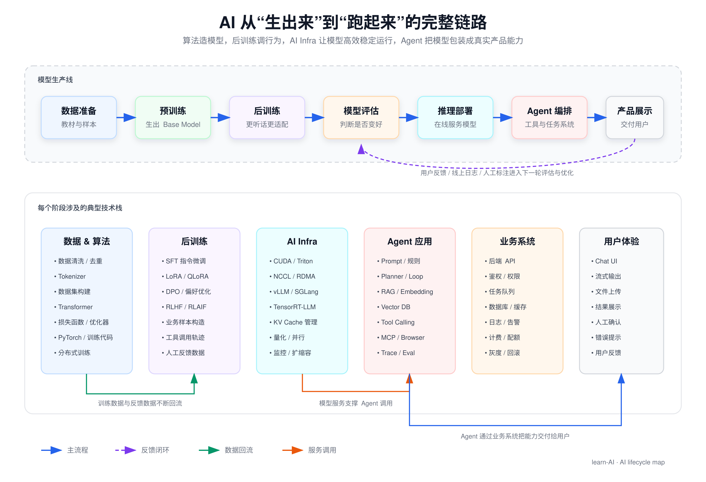
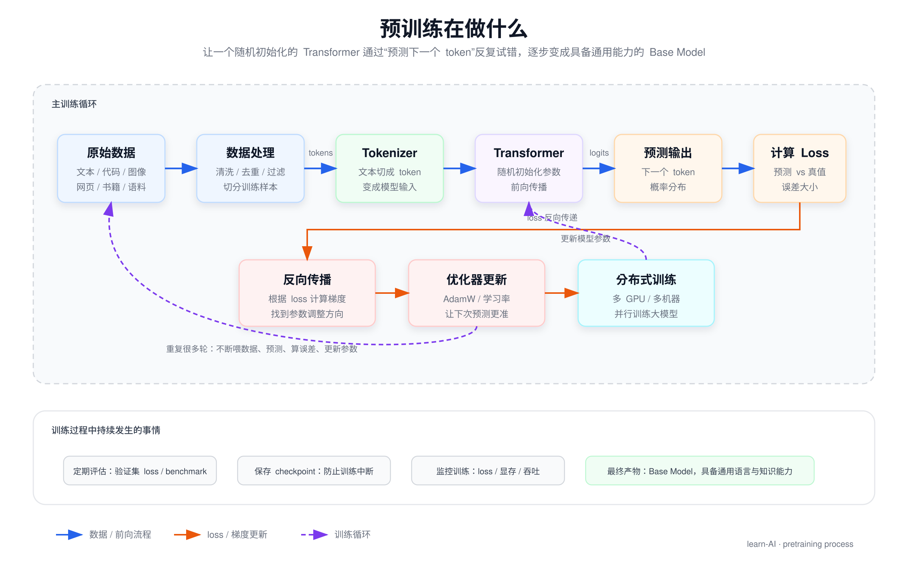
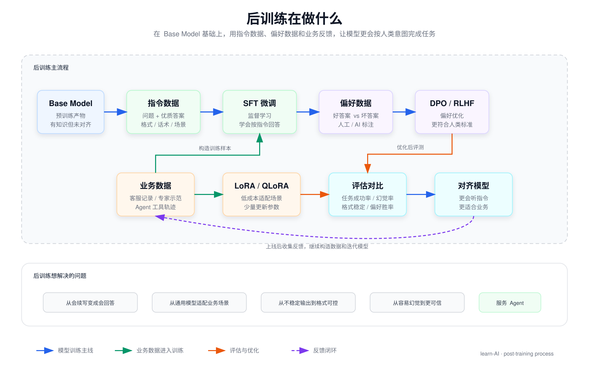
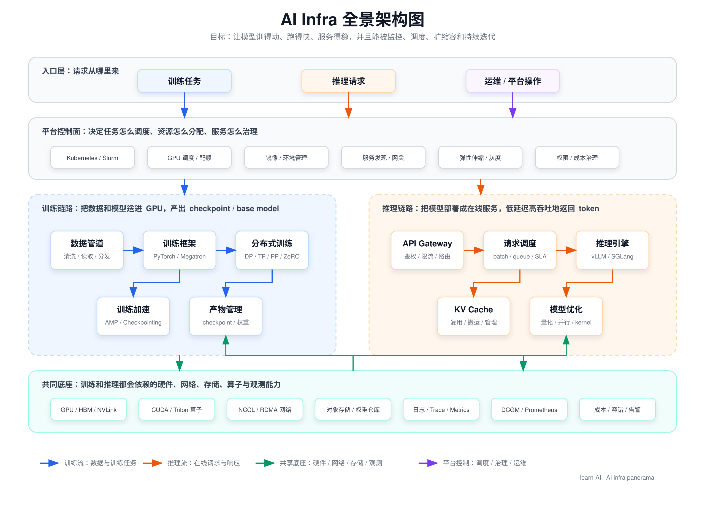
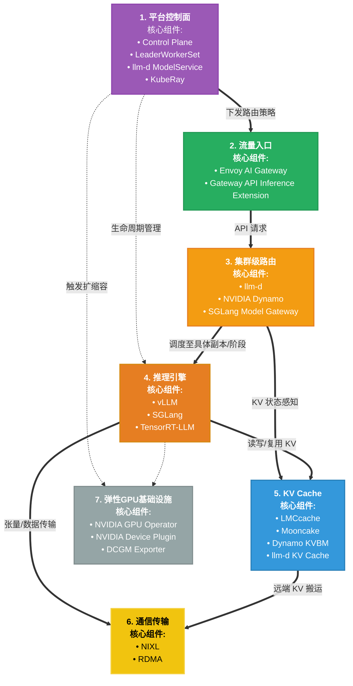
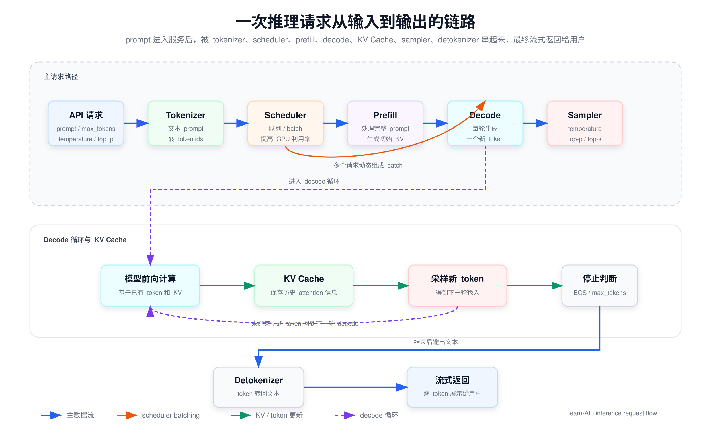
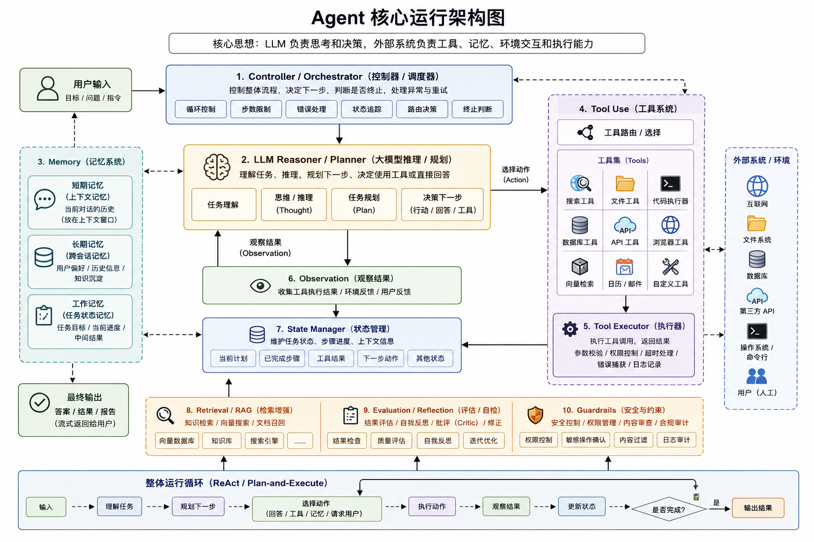

# AI相关

## 为什么要学习 AI

关于为什么要学习 AI ，主要有以下几点：

1. AI 工具非常提效，善用 AI 可以让我们事半功倍省下很多时间。
2. 面试刚需，现在无论是面试什么方向的技术岗位，面试官至少都会问一句 “你用过 AI 吗？”。
3. 通往未来技术时代的钥匙，在当下互联网的传统业务均趋于饱和。无论是当下很火的大模型，还是未来的具身智能，要想通往下一个信息时代，AI 是必须要了解的内容。

## 工具使用

在 AI 时代首先要学会善用 AI 工具。

### 利用 AI 学习编程

#### 知识的学习与理解

在学习知识时不要把 AI 当作自己的外置大脑。

这里在学习一个新知识时我推荐的方式是：

1. 通过 AI 快速了解浅层概念
2. 在简单理解的基础上在浏览器搜寻高质量博客并进行阅读
3. 在阅读过程中对这个知识点进行思考
4. 先把文章丢给 AI 再将自己的理解输出给 AI 与其进行探讨

相比于直接问 AI 答案，我更推荐先自己思考然后与 AI 对话。把 AI 当作一个有耐心且可以随时陪伴你的倾听者，主动去输出自己的想法说给 AI 听。

```text
和AI深度思考方法论
├── 一、核心底层原则
│   ├── 先自我思考，再求助AI
│   ├── 主动思想碰撞，不被动接收答案
│   ├── 路径：模糊想法 → 结构化 → 补漏洞 → 建知识体系
│   └── 定位：把AI当思考陪练，不是直接给答案工具
├── 二、标准5步思考对话流程
│   ├── 1. 先独立输出自己想法
│   │   ├── 不先看AI答案
│   │   ├── 先口述/写下零散观点
│   │   └── 允许想法不成熟、不完整
│   ├── 2. 让AI帮梳理结构化
│   │   ├── 保留你原本的原意
│   │   ├── 把碎片思路整理成逻辑框架
│   │   └── 梳理因果、分层、分点
│   ├── 3. 让AI质疑、挑逻辑漏洞
│   │   ├── 站对立面逐条反问
│   │   ├── 指出逻辑跳跃、思维盲区
│   │   ├── 抛出反例、边界场景
│   │   └── 倒逼你自己再深度作答
│   ├── 4. 横向关联+思维延伸
│   │   ├── 关联上下游、相关知识点
│   │   ├── 跨领域迁移思考方式
│   │   ├── 拔高一层看底层本质
│   │   └── 换多个视角重新解读
│   └── 5. 复盘沉淀固化
│       ├── 提炼核心结论
│       ├── 总结易错点、关键逻辑
│       └── 整理成笔记 / 个人Skill
├── 三、四大万能指令类型
│   ├── 强迫自我思考类
│   ├── 梳理逻辑思路类
│   ├── 倒逼深度质疑类
│   └── 思维延伸拔高类
├── 四、必守好习惯
│   ├── 坚持「先己后AI」
│   ├── 不被AI观点带偏，保持独立判断
│   ├── 每次深度思考后必沉淀
│   └── 固化成思维习惯，越练越强
└── 五、通用固定对话模板
    ├── 先说出自己初步理解
    ├── 让AI先倾听、不抢先给标准答案
    └── 按：梳理 → 质疑 → 延伸 → 沉淀 走完流程
```

#### 个人知识库管理

看了太多文章但是懒得打字整理，写了一大堆文章但是时间久了都忘了放哪了，以上问题在之前总是困扰我们。害得我们还得把宝贵的时间分出来整理笔记仓库。但是有了 AI 后这些问题可以利用 AI 轻松解决。

利用 AI 构建自己的知识库，不仅可以节省下维护仓库的时间同时还能利用 AI 将自己的技术栈从单个的点变成连续的网，后续再看时也可以使用 AI 迅速定位。

[LLM wiki 一种知识库构建范式](https://www.google.com.hk/search?q=AI%E6%90%AD%E5%BB%BA%E4%B8%AA%E4%BA%BA%E7%9F%A5%E8%AF%86%E5%BA%93&oq=AI%E6%90%AD%E5%BB%BA%E4%B8%AA%E4%BA%BA%E7%9F%A5%E8%AF%86%E5%BA%93&gs_lcrp=EgZjaHJvbWUyBggAEEUYOTIKCAEQABiABBiiBDIHCAIQABjvBTIKCAMQABiABBiiBDIKCAQQABiABBiiBDIKCAUQABiABBiiBNIBCjQ4MjI0MGowajeoAgCwAgA&sourceid=chrome&ie=UTF-8#fpstate=ive&vld=cid:14a6b2bf,vid:CTyx5XF2KVA,st:0)

#### 源码与论文阅读工具

源码阅读推荐使用 code agent 工具，随便哪个上层工具都行(codex cluade code ...)，但是基模一定要选比较好的，否则幻觉问题会比较严重。

这里我推荐的方式是：

1. 先结合网上博客（如果有）让 AI 梳理目录，说明整个项目的作用、架构层级、目录结构与这段代码文件做了什么。
2. 找到感兴趣的模块，让 AI 解读该模块内部的实现、时序图、并给出对应源码的位置
3. 结合源码内容与AI输出的解释进行理解

**这里一定要自己看源码！！！大模型有时会骗人。**

论文阅读：

[一个自动拉取感兴趣的论文并进行解析的工具](http://xhslink.com/o/9WGB14YIUrn)

### 装上skills让你的AI变得更强

模型有时候不是笨，而是还不清楚做事的流程与你喜欢的风格。

Skills是为AI智能体准备的“标准化工作手册+工具箱”文件夹，是实现复杂任务自动化、可复用、提升AI输出稳定性的核心能力包。它通常包含一个Markdown文件（如 SKILL.md）及相关模板、脚本，能让AI在需要时动态加载专家级能力，像是在执行一套SOP（标准作业程序）。

这里我们可以通过 skill 激发模型潜力，让大模型如虎添翼。

以下是一些各类 skill 合集的仓库

1. anthropics/skills（Anthropic 官方，标杆）

- GitHub：https://github.com/anthropics/skills
- 规模：⭐57k+，生产级，元技能齐全
- 特点：官方标准、安全审计、含 skill-creator（用自然语言生成新 Skill）
- 适配：Claude Code、Cursor、Windsurf
- 安装：
  ```bash
  git clone https://github.com/anthropics/skills ~/.claude/skills/anthropic-official
  ```

2. composiohq/awesome-claude-skills（社区第一大合集）

- GitHub：https://github.com/composiohq/awesome-claude-skills
- 规模：⭐16.5k+，300+ 技能，60+ 场景
- 特点：全场景（开发/运维/写作/数据/安全）、高活跃、持续更新
- 适配：Claude 全系、Cursor、Copilot
- 安装：
  ```bash
  git clone https://github.com/composiohq/awesome-claude-skills ~/.claude/skills/composio
  ```

3. voltagent/awesome-openclaw-skills（OpenClaw 生态最强）

- GitHub：https://github.com/voltagent/awesome-openclaw-skills
- 规模：500+ 技能，覆盖自动化/爬虫/办公/部署
- 特点：中文友好、浏览器自动化、文件处理、批量任务强
- 适配：OpenClaw、Claude Code、Cursor
- 安装：
  ```bash
  git clone https://github.com/voltagent/awesome-openclaw-skills ~/.claude/skills/openclaw
  ```

**在使用 Skills 的同时也不要忘了沉淀自己的 Skill。把自己的经验变成可以复用的工具**


### vibcoing

CS146S：The Modern Software Developer。

核心口号：不准手写代码，必须用 AI 写大型项目（纯 Vibe Coding）

[课程地址](https://themodernsoftware.dev/)

[中文版](https://github.com/ShouZhengAI/CS146S_CN)

[课程介绍](https://zhuanlan.zhihu.com/p/1982222968479298289)

* 范式：40% 规划 + 20% AI 生成 + 40% 测试 / 验证，全程不手写代码。
* 工具链：Cursor、Claude Code、GitHub Copilot 等 AI IDE / 代理。
* 项目驱动：期末需用 AI 独立完成全栈大型项目（前后端 + 部署）。

vibcoing 虽好，但是还得先学习计算机基础，在对计算机体系有了一个认知之后再去使用 vibcoding。

### 不要让 AI 代替你的思考！！！

大一的同学一定不要用 AI 一键编写小组plan！！！在打基础的阶段还是需要好好学习，不要养成惰性思维。长期使用 AI 做自己的外置大脑，会让自己失去对基本事实的判断与对代码的敏感度。

现在偷的懒都会成为找工作上班时精准的报应🤦。

## AI 学习路线

在正式拆分算法、AI infra、agent 这些方向之前，最好先从整体上理解一个 AI 系统是怎么从“模型还不存在”一步步变成“用户能在网页或 APP 里使用”的。



AI 算法解决的是“模型能力从哪里来”，AI infra 解决的是“模型如何高效稳定地训练和运行”，Agent 解决的是“如何让模型使用工具完成真实任务”，业务系统解决的是“如何把 AI 能力交付给用户并持续迭代”。


在 AI 从生出来到跑起来到跑的更好这条链路上，每一个环节都有很多事情值得做。比起盲目跟风各种教程，思考清楚自己现有的能力并与 AI 做结合，把自己的能力转化成为产品线上的一环更有意义。

同时因为 ai 发展太过迅速，这里的学习路线只能带大家度过入门时期。想真正从事这个行业还需要多多关注学术论文，开源社区，ai 公司的新动向，多读论文读源码多动手实践。

最后也欢迎大家对该文章进行补充与纠错。

### 前置知识

#### 数学

AI 学习对于数学的前置知识要求并没有大家想象中那么高，只要能看得到高数线代概率论作业的答案知道基本的数学性质，就可以在 AI 和优质博客的帮助下看懂算法中的公式推导。

数学模块不需要单独学习，可以在学习深度学习算法相关的内容时遇到不会的数学问题，再去搜浏览器问 AI 进行一个查漏补缺。

线性代数讲解推荐：

[b站视频：线性代数的本质](https://www.bilibili.com/video/BV1ib411t7YR?spm_id_from=333.788.videopod.episodes&vd_source=6b3c3d3db76b0fcf84a9f66466b9ed53)

[电子书：线性代数不难](https://github.com/Visualize-ML/Linear-Algebra-Made-Easy---Learn-with-Python-and-Visualization)

#### python 与 pytorch

这块在语言的使用方面没有必要单独学习，python 本身的语法都不是很难，在看其他模块时穿插学习自己需要的就够了。

[深入浅出PyTorch](https://github.com/datawhalechina/thorough-pytorch)

### AI 基础知识

**此栏目为所有人必学！！！**

算法 infra agent 只要是 AI 相关的方向必然会问到关于 AI 的底层实现。

#### 深度学习基础

机器学习与深度学习是 AI 的起源，后续无论是 Transformer 还是其他更加先进的架构，都用到了深度当中的一些理念，为了再后续学习中更好的理解 Transformer

吴恩达的视频课比较简短，每节课大概就10分钟左右。讲解的内容偏向概念性比较基础，适合速成。

* 视频课：[吴恩达——深度学习](https://www.bilibili.com/video/BV12urfB1E7s/?spm_id_from=333.337.search-card.all.click&vd_source=6b3c3d3db76b0fcf84a9f66466b9ed53)

动手学深度学习这里讲的更加深入一些，有很多代码细节。适合想要对算法深度了解的同学。

* 文档+部分代码：[动手学深度学习](https://zh.d2l.ai/index.html)

在学习此栏目时主要要搞清楚以下问题：f

1. 模型学到了什么？
2. 深度学习的基础概念，如：神经网络、向前传播、损失函数、梯度下降、反向传播、激活函数、归一化等基础概念...
3. 从 FNN -> RNN -> LSMT ->Transformer 的发展历史

#### Transformer

Transformer 是现代大模型架构的鼻祖，无论是做算法还是 ai infra又或者是 agent 甚至你只是面一个传统的后端，都有可能会被问到 Transformer 的问题。所以 transformer 所有人必须学习。只是学习深度有区分。

这里论文原文比较学术风味缺少一些非常细节的技术再加上是英文版，对英语不好的同学来说不太友好。

* Transformer 论文原文：[Attention Is All You Need](https://arxiv.org/abs/1706.03762)

探秘Transformer系列讲解的更加细致针对每个组件都单独用一篇文章进行讲解，还对前面深度学习的内容进行了一些回顾。

* 文档：[探秘Transformer系列](https://www.cnblogs.com/rossiXYZ/p/18785601)

李宏毅老师的课图文并茂且讲解的层次更浅一点，适合想要速成的同学。

* 视频课：[李宏毅 | 自注意力机制和Transformer详细解析](https://www.bilibili.com/video/BV1r8nMz4EAj?spm_id_from=333.788.recommend_more_video.16&trackid=web_related_0.router-related-2479604-gjmc5.1777742192827.410&vd_source=6b3c3d3db76b0fcf84a9f66466b9ed53)

happy-llm 当中包含了一些注意力机制等的实现，可以看到更多代码细节

* 代码实战：[happy-llm](https://github.com/datawhalechina/happy-llm/tree/main)

在学习此栏目时主要要搞清楚以下问题：

1. 文本向量化与embedding模型
2. 位置编码
3. 注意力机制
4. decode-only 架构与 encode-only 架构

### 预训练

预训练可以理解为“大模型从零开始读书识字”的过程。我们先准备海量文本、代码、图片等数据，然后让一个还没有能力的模型反复做预测任务：给它前面一段内容，让它预测下一个 token 是什么。模型一开始会乱猜，但每猜错一次，训练程序就会根据损失函数计算误差，再通过反向传播和梯度下降调整模型参数。

这个过程重复很多很多次后，模型会逐渐学到语言规律、世界知识、代码模式、推理模式和不同概念之间的关系。预训练结束后得到的就是 base model，也就是基础模型。它已经具备很强的通用能力，但还不一定会像 ChatGPT 这样自然地回答用户问题，也不一定听指令、懂拒绝、符合某个业务场景的表达规范。

预训练大致在做这几件事：

1. 数据准备：收集、清洗、去重、过滤低质量数据，并把文本切成 token。
2. 模型初始化：搭建 Transformer 结构，随机初始化模型参数。
3. 前向传播：把 token 输入模型，预测下一个 token 的概率分布。
4. 计算损失：比较模型预测和真实答案之间的差距。
5. 反向传播：根据误差更新模型参数，让下一次预测更准。
6. 分布式训练：把数据和模型切到多张 GPU / 多台机器上，提高训练速度。
7. 评估与保存：定期评估模型效果，保存 checkpoint，防止训练崩掉后从头再来。



预训练招聘时往往对训练集群对规模要求，如千卡万卡集群。大多数普通学校并无如此庞大的计算集群资源。因此对于面向找工作的同学来说这个方向难以入行。

但是从头到位训练一个参数规模较小的模型并阅读其代码，可以让我们对训练过程有更深的体会，因此感兴趣的同学可以去看一下 minimind 这个开源的小模型项目，在该项目中会从头到尾教你去训练一个小模型且由于该模型参数量不大只需要一张显卡即可。适合想要感受训练但是没钱买卡的同学，这里只要租一张计算卡就够了。

* 代码实战：[minimind](https://github.com/jingyaogong/minimind)

### 后训练

后训练是在预训练得到的 base model 基础上，继续用更高质量、更贴近人类意图或业务场景的数据进行训练，让模型从“会续写文本”变成“会按照指令完成任务”。如果把预训练类比成小初高阶段学习基础知识，那么后训练就像进入大学后选择专业方向：它不一定让模型获得全新的底层能力，但会让模型更听话、更稳定、更适合具体任务。

预训练后的 base model 通常已经有很强的语言和知识能力，但它未必知道应该如何回答用户问题，也未必会遵守格式要求、拒绝危险请求、按照业务话术表达，或者稳定调用工具。后训练要解决的就是这些“可用性”和“对齐”问题。

后训练常见会做几类事情：

1. SFT：用高质量的“问题-答案”样本教模型按照指令回答。
2. LoRA / QLoRA：用较低成本让模型适配某个领域或业务场景。
3. 偏好优化：用“好答案 vs 坏答案”的对比数据，让模型更偏向人类喜欢的回答。
4. RLHF / RLAIF：通过人类反馈或 AI 反馈构造奖励信号，进一步优化模型行为。
5. 工具调用训练：让模型学会什么时候调用工具、如何组织参数、如何根据工具返回继续回答。



这里比较推荐在 agent 项目中加入后训练的内容，这样会让项目更加全面且有深度一些，同时也给后训练提供了一个场景。比如可以把 Agent 运行过程中的用户问题、工具调用轨迹、人工修正结果、好坏回答对比整理成训练数据，再用 LoRA / DPO 这类方法做小规模优化。但是在加入时要思考清楚该场景下是否真的需要后训练：如果问题只是知识缺失，优先做 RAG；如果问题只是流程混乱，优先优化 Agent 编排；只有当模型在固定场景里反复出现同类错误，且你有高质量数据和评测集时，后训练才更值得加入。

#### 微调

微调就是：固定或少量解冻基座参数，用自己的专属小数据集，继续训练几轮，让模型适配你的专属场景、专属话术、专属任务，不改模型底座架构，只做能力定向定制。

微调当中现下最常用到的就是 LoRA。这里理论较少，了解微调的过程，以及 LoRA 的概念即可。

学习过程中更多需要进行实践。这里比较推荐和 agent 项目结合，找到一个 agent+微调 的项目，实践感受一下微调的过程。

[LoRA原理介绍](https://www.zhihu.com/tardis/zm/art/623543497?source_id=1003)

#### 强化学习

强化学习是 AI 领域的核心分支之一，属于无监督学习与监督学习之外的第三种机器学习范式，其核心思想源于生物学习机制——通过“试错”与“奖励反馈”，让智能体在与环境的持续交互中，自主学习最优行为策略，最终实现特定目标的最大化收益。

* 视频课：[深度强化学习(DRL)-李宏毅1-8课（全）](https://www.bilibili.com/video/BV124411S7au/?vd_source=6b3c3d3db76b0fcf84a9f66466b9ed53)
* 文档：[easy-rl](https://datawhalechina.github.io/easy-rl/#/)
* 开源项目：[开源强化学习框架介绍内含github地址](https://www.cnblogs.com/aifrontiers/p/19504633)

### AI infra

AI infra 主要是围绕 AI 的训练与推理做一些基础架构的建设，例如训练/推理框架，算子优化等等。该方向的意义是用更少的硬件资源让 AI 跑的更快，跑的更稳。

更通俗一点说，AI infra 做的是“把模型从实验室里的代码，变成可以大规模训练、稳定部署、持续服务用户的工程系统”。算法同学关心模型结构和效果，AI infra 同学则关心：模型这么大，数据这么多，请求这么密，GPU 这么贵，怎么让它训得动、跑得快、不炸、不浪费钱。

AI infra 大致可以分成三块：



1. 训练侧 infra：负责让大模型训练任务跑起来。这里要处理海量数据读取、多机多卡调度、分布式训练、checkpoint 保存、训练容错、显存优化、通信优化等问题。比如模型太大单卡放不下，就要做张量并行、流水线并行、ZeRO；训练太慢，就要优化数据管道、通信和算子。
2. 推理侧 infra：负责把训练好的模型变成在线服务。这里要处理 API 请求、动态 batch、KV Cache 管理、模型并行、量化、流式输出、限流、扩缩容、监控告警等问题。比如 vLLM / SGLang 这类推理框架，本质上就是在提高 GPU 利用率，让同样的卡服务更多用户。
3. 底层系统能力：负责训练和推理共同依赖的硬件与系统底座，包括 GPU 体系结构、CUDA / Triton 算子、AI 编译器、NCCL / RDMA 高性能网络、对象存储、容器编排、日志监控、成本治理等。越往底层走，越接近传统系统、OS、网络、分布式和高性能计算。

所以 AI infra 不是单纯“部署模型”，而是在模型、GPU、网络、存储、调度系统之间做工程优化。它的核心目标通常有三个：降低延迟、提高吞吐、降低成本。对于公司来说，同样一个模型，如果 infra 做得好，可能少用很多 GPU；对于用户来说，表现就是回答更快、服务更稳、并发更高。

这里的优化思路与传统的 infra 有很多相似之处。对于之前就开发过传统 infra 组件的同学来说会更加容易上手。比较推荐做过 kv OS 网络 等方向的同学学习。

在 infra 学习时，图中 AI infra 这一栏目里的概念都需要有所了解，在对整体有一个认知后再对一个感兴趣的方向进行深入学习

#### 体系结构与编程框架

GPU 体系结构与算子开发/优化 属于是 AI infra 人不得不品的一环，在面试中时常会问到各类算子的优化以及算法题出手搓算子。同时了解底层也更有利于我们对上层内容的学习。因此这一块内容对于要做 AI infra 的人来说也是必学项。

这里我们以 CUDA 与英伟达系列为例。

在这部分学习中类似于cuda这样的编程框架相当于一个语言最基础的语法，真正的侧重点应该是GPU体系结构。

学习过程：

第一阶段：先掌握 CUDA 编程模型。

这一阶段目标是能写出最基础的 kernel，知道 CPU 代码和 GPU 代码是如何协作的。重点理解：

1. host / device 的区别。
2. kernel 函数如何启动。
3. grid、block、thread 的层级关系。
4. `threadIdx`、`blockIdx`、`blockDim`、`gridDim` 怎么定位数据。
5. GPU 显存如何申请、拷贝和释放。
6. CUDA 程序如何编译、运行和 debug。

练习上可以从 vector add、矩阵转置、reduce sum、softmax 这类小算子开始。这个阶段不追求性能，只追求能写对、能跑通、能理解每个线程在处理哪一份数据。

第二阶段：理解 GPU 体系结构和性能瓶颈。

CUDA 语法只是表层，真正决定性能的是 GPU 的硬件结构。要搞清楚：

1. SM、warp、thread block 是什么关系。
2. global memory、shared memory、register、L2 cache 各自适合存什么。
3. 为什么访存合并会影响性能。
4. 什么是 warp divergence。
5. 什么是 shared memory bank conflict。
6. occupancy、吞吐、延迟隐藏这些指标在看什么。

这一阶段要养成一个意识：GPU 算子优化多数时候不是“少写几行代码”，而是让更多线程更规律地访问数据，让 GPU 少等内存、多做计算。

第三阶段：系统练习经典算子。

建议按难度从低到高练：

1. elementwise：向量加法、ReLU、Sigmoid、LayerNorm 的逐元素部分。
2. reduction：sum、max、mean、softmax。
3. scan / prefix sum：理解并行规约和并行前缀。
4. transpose：重点练 shared memory 和访存合并。
5. GEMM：矩阵乘法是 CUDA 优化的核心练习题。
6. LayerNorm / RMSNorm：大模型里非常常见，适合练 reduction + elementwise 融合。
7. attention：最后再看 attention / flash attention。

每个算子最好都经历三个版本：

1. naive 版本：先写出最直观的正确实现。
2. optimized 版本：优化访存、并行划分、shared memory、循环展开等。
3. benchmark 版本：和 PyTorch / cuBLAS / Triton 实现对比性能。

第四阶段：学会性能分析工具。

写 CUDA 不能只靠感觉优化，需要会看 profiler。至少要了解：

1. `nsys`：看整体时间线，判断瓶颈在 CPU 调度、数据拷贝还是 GPU kernel。
2. `ncu`：看单个 kernel 的访存、occupancy、warp stall、SM 利用率。
3. roofline：判断算子是 compute-bound 还是 memory-bound。
4. benchmark：多次 warmup、多次计时，避免被首次启动和数据拷贝干扰。

如果不知道瓶颈在哪里，优化往往就是玄学。真正的优化流程应该是：先 profile，找到瓶颈，再有针对性地改 kernel。

第五阶段：进入大模型相关算子。

有了前面的基础后，再看大模型常见算子会容易很多：

1. GEMM / batched GEMM：大模型计算量核心。
2. LayerNorm / RMSNorm：Transformer 中高频出现。
3. RoPE：位置编码相关算子。
4. Softmax：attention 中的关键步骤。
5. KV Cache 操作：推理框架里非常重要。
6. Attention / FlashAttention：综合考验 tiling、shared memory、访存、数值稳定性。

这个阶段可以去读 vLLM、SGLang、FlashAttention、CUTLASS、Triton 相关代码。不要一开始就要求完全看懂，先抓住输入输出、数据布局、并行划分和优化目标。

CUDA 算子的学习顺序应该是：**CUDA 语法 -> GPU 体系结构 -> 经典算子练习 -> 性能分析 -> 大模型算子 -> 开源项目源码**。

下面是一个比较简单的 CUDA 的教程，讲了一些基础的工具和 CUDA 语法。可以对最基础的概念进行学习。CUDA 可以理解为是一个 c++ 的库。

[CUDA 基础](https://face2ai.com/CUDA-F-0-0-Tencent-GPU-Cloud/)

LeetCUDA 是一一个涵盖了大部份算子写法的一个练习题库，同时还附带了一些讲解。要做算子开发的话就像刷力扣一样刷 LeetCUDA，但是这里没有测试环境，要测试需要自己租有 GPU 的服务器测试。

[LeetCUDA](https://github.com/xlite-dev/LeetCUDA)

和上面的 LeetCUDA 一个定位，但是 LeetGPU 提供了一个 GPU 测试环境，但是这个不充钱每天会有次数限制，可以在限制内白嫖一下。

[LeetGPU](https://leetgpu.com/)

下面是一个更加细节的学习合集，这个合集内的内容比较深入：

[CUDA学习合集](https://zhuanlan.zhihu.com/p/1998883357870794080)

除了 CUDA 之外还有一些比较上层的 GPU 编程框架，如 Triton 这类。这里的 Triton 等更加上层，因此学起来也更简单一些。这里如果一开始学 CUDA 觉得非常晦涩难懂可以先学 Triton 能直接上手学 CUDA 的就直接学 CUDA 。Triton 这种上层的等到有需要了再学。

#### 训练框架

我没研究过这一块，所以无法给出好的建议，等一个有缘人补全。

#### 推理框架

推理框架是专门用于部署、加速和运行已训练完成的 AI 大模型的软件工具集。它专注于生产环境下的效率和工程化问题，通过模型并行、量化、算子优化等技术，实现低延迟、高吞吐量的实时推理，降低计算成本。

推理框架做的事情是把一个训练好的模型变成一个能被大量用户稳定调用的在线服务。用户发来一句 prompt 后，推理框架需要完成请求接入、分词、调度、显存管理、模型前向计算、token 生成、流式返回等一整套流程。

如果只是本地跑一个 demo，我们可以直接用 transformers 加载模型然后生成文本。但生产环境不一样，它需要同时处理很多用户请求，还要尽可能榨干 GPU 利用率。这里会遇到几个核心问题：

1. 请求怎么排队：多个用户的请求长度不同、到达时间不同，框架需要动态调度，避免 GPU 空等。
2. 显存怎么管理：大模型推理时 KV Cache 会占用大量显存，框架需要高效分配、复用和回收。
3. token 怎么批处理：生成过程是一 token 一 token 往外吐，框架要把不同请求拼成 batch，提高吞吐。
4. 模型怎么切分：单卡放不下模型时，需要张量并行、流水线并行等方式把模型拆到多张卡上。
5. 算子怎么优化：Attention、矩阵乘法、采样等步骤需要用更高效的 kernel 来降低延迟。
6. 服务怎么稳定：需要支持限流、超时、监控、日志、故障恢复、弹性扩缩容等工程能力。

所以推理框架不是“把模型跑起来”这么简单，它更像是大模型时代的高性能服务器。vLLM 的 PagedAttention、SGLang 的 RadixAttention、TensorRT-LLM 的 kernel 优化，本质上都是在解决“如何让模型在有限 GPU 资源下服务更多请求、更快返回结果”的问题。

推理全景图：



##### 推理框架学习路线

推理框架的学习不要一上来就直接啃 vLLM / SGLang 全量源码，这类项目工程量很大，里面混着调度、算子、分布式、API 服务、模型适配、测试和大量兼容逻辑。比较推荐的路线是：先理解一次推理请求的生命周期，再看一个极简实现，最后带着问题去读成熟框架。

第一阶段：运行 nano-vllm，观察推理流程并阅读源码

nano-vllm 是一个缩小版的 vllm 框架，只有2000多行代码，适合入门学习。建议大家可以花一周多时间迅速跑通并阅读一下源码，对推理框架最基础的概念有一个基本的认知。

* [nano-vllm](https://github.com/GeeeekExplorer/nano-vllm)

在这一阶段可以先把 nano-vllm 跑起来，观察一个 prompt 从输入到输出经历了什么。并建立直觉：大模型推理不是一次函数调用结束，而是一个不断生成 token 的循环过程。尤其要区分 **prefill** 和 **decode**：prefill 阶段一次性处理较长 prompt，计算量大；decode 阶段每次只生成一个 token，但会不断循环，延迟敏感。



跑通 demo 后再阅读并仿写 nano-vllm 源码。这里不要只停留在“看懂”，最好照着它的结构自己实现一个最小版推理框架。阅读和仿写时建议重点看：

1. 请求对象如何表示。
2. scheduler 如何组织 batch。
3. KV Cache 如何分配和复用。
4. prefill 和 decode 如何分开执行。
5. attention backend 如何接入。
6. 输出 token 如何流式返回。

第二阶段：深入学习核心优化点的概念

推理框架最核心的优化目标是：**让 GPU 尽量别闲着，同时让用户尽快拿到 token**。需要重点理解下面这些方面：

1. Continuous batching：动态把不同时间到达的请求塞进同一个 batch。
2. 分布式推理：单卡放不下或算不快时，把模型切到多张 GPU，组合应用dp pp tp ep cp sp等策略
3. PagedAttention：像操作系统分页一样管理 KV Cache，减少显存碎片。
4. KV Cache 管理：决定长上下文、多并发下显存能不能扛住。
5. Prefix Cache：复用相同前缀，减少重复 prefill。
6. Speculative Decoding（投机解码）：用小模型提前猜 token，再由大模型验证。
7. 量化：用 FP8 / INT8 / INT4 等方式降低显存和计算成本。
8. AI 编译 / 图优化：通过算子融合、计算图重写、kernel 选择与生成、layout 优化等方式减少调度和访存开销。

第三阶段：阅读成熟框架源码，并给开源社区贡献。

在当今推理框架的生态位当中，vllm 和 sglang 可以说各占据了推理的半壁江山。我们在学习的过程中可以去阅读这两个项目的源码去看一看推理领域的经典实现。

阅读源码时不要从项目入口一路硬读，更好的方式是带问题读：

1. 一个请求进来后在哪里排队？
2. scheduler 怎么决定下一轮跑哪些请求？
3. KV Cache block 是在哪里分配和释放的？
4. prefill 和 decode 的执行路径分别在哪里？
5. attention backend 是如何调用底层 kernel 的？
6. 多卡推理时通信发生在哪里？

读到一定程度后，可以开始尝试给开源社区做贡献。

这里可以先在issue列表找可以做的issue。

如果没有找到合适的可以：

1. 用 AI 辅助扫描代码仓库，寻找各种潜在问题。
2. 也可以看比较新的推理论文，尝试把其中的优化方法在开源项目中复现，整理成实验结果后提交 PR。

* [vllm](https://github.com/vllm-project/vllm)
* [sglang](https://github.com/sgl-project/sglang)

同时 vLLM 和 SGLang 也在推进多模态推理相关的能力，可以关注下面两个项目。

* [vLLM-omni](https://github.com/vllm-project/vllm-omni)
* [sglang-omni](https://github.com/sgl-project/sglang-omni)

除了推理框架本体之外，还有一些与之相关的生态。在下面的仓库当中包含了分布式 kv cache，推理时的网络通信库，推理感知调度器等。这些项目当中也有许多不完善的地方，可以关注一下看看有没有机会提pr。

* [mooncake](https://github.com/kvcache-ai/Mooncake)
* [FlexKV](https://github.com/taco-project/FlexKV)
* [LMCache](https://github.com/LMCache/LMCache)
* [dynamo](https://github.com/ai-dynamo/dynamo)

#### 高性能网络

面向 AI 的高性能网络，核心是搞定低延迟、高带宽、无损传输、拓扑感知，围绕 RDMA/RoCE/IB、NCCL、Clos 架构、GPU 集群通信 这条主线系统学即可。

NCCL 是英伟达开发的一款用于多GPU、多节点高效通信的开源集合通信库。它通过优化通信原语（如AllReduce、AllGather），显著提升深度学习大模型训练和推理时的通信效率，主要利用 NVLink、PCIe 和 InfiniBand 等技术实现低延迟、高带宽的并行数据交换。

RDMA 是一种高性能网络技术，允许一台计算机直接读写另一台计算机的内存，而无需操作系统内核、CPU或TCP/IP协议栈的参与。它具有零拷贝（Zero-copy）和内核旁路（Kernel bypass）特性，显著降低了数据传输延迟并释放了CPU资源。

这块我没学过所以先不放学习资料了感兴趣的同学可以了解一下继续补充内容。

### agent开发


agent 开发虽然现阶段需求量很大，但是该方向其实和后端并无太大区别，且在技术深度逊于算法 infra 在业务积累上弱于传统后端。这里不建议只学 agent 开发，更适合作为业务后端的一种技术栈上的一种补全。

#### 建议学习路线

Agent 开发的核心不是“会调用大模型 API”，而是围绕 **LLM + Memory + Tools + Loop** 搭建一个稳定可控的业务系统。因此学习时不要一上来就沉迷框架，应该先搞清楚 Agent 的运行链路：用户输入任务，Planner 进行任务拆解，LLM Core 做推理与决策，Tool Selector 选择并调用工具，Memory 提供上下文，最后输出答案、执行动作并记录 Trace 用于评估与调试。

对于这部分我推荐面向项目学习，在网上找一个技术栈全面的项目，跟着项目从数据准备到代码实现效果测评项目优化全部走一遍。

##### 第一阶段：补齐后端与大模型应用基础

如果目标是做 Agent 开发，后端基础一定不能太弱。Agent 本质上还是一个带有大模型能力的后端系统，涉及 API 设计、任务调度、权限控制、数据存储、异步执行、日志监控和稳定性治理。

这一阶段需要掌握：

1. Python / TypeScript 至少熟练一个，推荐 Python 优先。
2. HTTP API、WebSocket、异步任务、数据库、缓存、消息队列等后端基础。
3. 大模型 API 的基本使用方式，包括 chat completion、streaming、function calling / tool calling、结构化输出等。
4. Prompt 的基本写法，重点理解 system prompt、上下文组织、few-shot、约束输出和错误兜底。
5. Transformer、Embedding、RAG 的基础概念，不需要做到算法岗深度，但要知道模型为什么会受上下文窗口、幻觉、召回质量影响。

这一阶段可以做一个最简单的项目：封装一个支持流式输出、历史对话、模型切换和工具调用的 AI Chat 服务。

##### 第二阶段：理解 Agent Core

Agent Core 是图中的智能体核心层，重点包括 Planner、LLM Core、Tool Selector 和 Harness 配置层。学习这一块时要重点理解 Agent 的循环机制，而不是只会套 LangChain / LangGraph 模板。

需要掌握：

1. 任务拆解：如何把用户目标拆成多个可执行步骤。
2. 推理循环：Plan -> Act -> Observe -> Replan 的基本流程。
3. 工具选择：什么时候调用搜索、代码执行、数据库、浏览器、外部 API。
4. 上下文管理：如何把用户问题、历史结果、工具返回和约束条件组织进 prompt。
5. 权限与安全：哪些工具允许自动执行，哪些动作必须让用户确认。
6. 失败恢复：工具调用失败、模型输出格式错误、上下文过长、任务陷入死循环时如何处理。

这一阶段建议先手写一个 mini agent，不要直接上复杂框架。比如实现一个“资料搜索 + 总结 + 生成 markdown 报告”的 Agent：它可以根据问题调用搜索工具，读取网页内容，整理关键信息，最后输出结构化报告。手写一次后再看框架，会更容易理解 LangGraph 这类框架为什么要引入状态图、节点和边。

##### 第三阶段：学习 Memory 与 RAG

Memory 层决定 Agent 能不能处理长任务、长期知识和业务私有数据。图中提到的 Working Memory、Vector Store、Graph DB、File System，其实对应了不同类型的记忆。

需要掌握：

1. Working Memory：当前任务上下文如何保留，哪些内容应该进入 prompt。
2. Vector Store：向量数据库的基本原理，了解 Pinecone、Chroma、Qdrant 等工具即可。
3. Embeddings：理解文本如何被向量化，以及 embedding 模型质量对召回的影响。
4. RAG 流程：文档切分、向量化、召回、重排、上下文拼接、答案生成。
5. Retrieval Strategies：Hybrid Search、Rerank、HyDE、GraphRAG 等策略先了解思想，再按项目需要深入。
6. File System Memory：很多 Agent 不是只靠向量库，而是会把中间产物、代码、报告、配置文件写入文件系统。

这一阶段建议做一个垂直知识库问答项目，不要只做“上传 PDF 然后聊天”。更好的项目是：围绕一个真实领域，比如课程笔记、项目文档、代码仓库，做一个能引用来源、能追问、能更新知识库的 RAG Agent。

##### 第四阶段：学习 Tools / MCP / Browser Use

Agent 真正区别于普通 Chatbot 的地方在于它能使用工具。工具层包括 Web Search、Code Exec、Browser Use、External API、MCP Servers、Sub-Agent 等。

需要掌握：

1. Tool Calling：如何定义工具 schema，如何解析模型的工具调用请求。
2. Web Search：搜索、网页读取、信息去重、来源引用。
3. Code Exec：本地代码执行、沙箱隔离、超时控制、输出截断。
4. Browser Use：用 Playwright 等工具进行网页自动化操作。
5. MCP：理解 MCP Server / MCP Client 的关系，知道它是工具标准化接入协议。
6. Sub-Agent：复杂任务如何拆给多个 Agent 协作，比如研究 Agent、代码 Agent、评审 Agent。

这一阶段可以做一个“自动化工作流 Agent”：例如给定一个 GitHub issue，让 Agent 自动阅读仓库、定位相关文件、提出修改方案、运行测试并生成 PR 描述。这个项目会同时练到搜索、代码执行、文件系统、工具权限和评估。

##### 第五阶段：学习 Eval、Observability 与 Inference

Agent 项目最容易被忽略的是评估和可观测性。Demo 能跑不代表系统能上线，真正落地时最重要的是知道它为什么错、错在哪里、怎么稳定复现和改进。

需要掌握：

1. Trace：记录每次模型调用、工具调用、输入输出、耗时和错误。
2. Eval：为核心任务设计测试集，评估成功率、准确率、幻觉率、工具调用正确率。
3. RAG 评估：了解 Ragas、DeepEval 等工具，重点看召回质量和答案忠实度。
4. Prompt 实验：使用 LangSmith、Braintrust、Promptfoo 等工具做 prompt 对比实验。
5. Observability：了解 LangSmith、Phoenix、Langfuse 这类工具如何帮助调试 Agent。
6. Inference：了解 vLLM / SGLang / Ollama / LiteLLM，知道模型部署、模型代理和本地模型调用的基本方式。

这一阶段的目标是把前面做的小项目从“能用”改造成“可评估、可观测、可迭代”的工程项目。比如给知识库问答 Agent 增加一套评测集，每次改 prompt、换 embedding、换 rerank 策略后都能看到指标变化。
