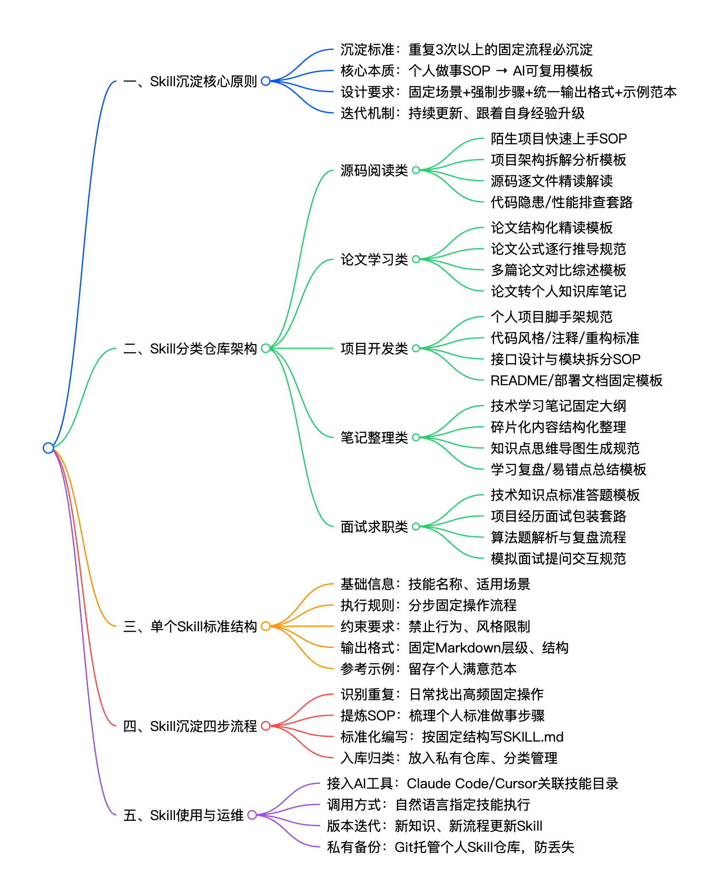
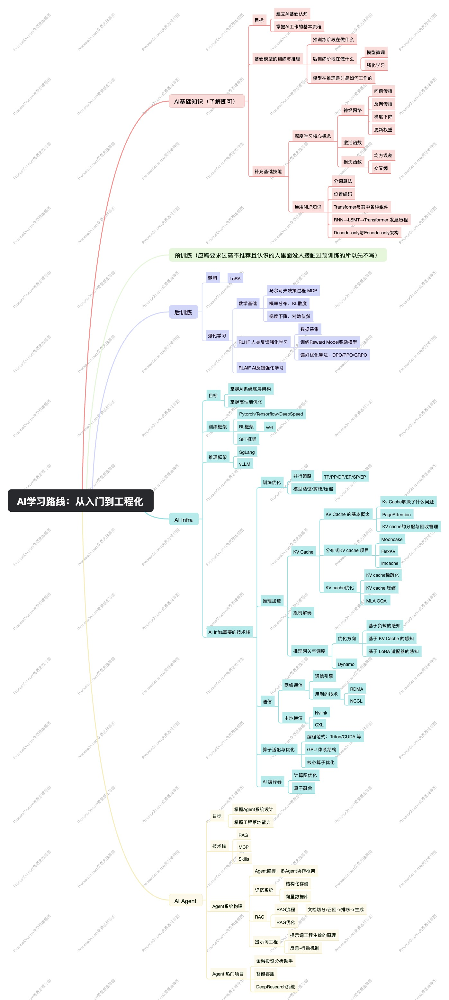
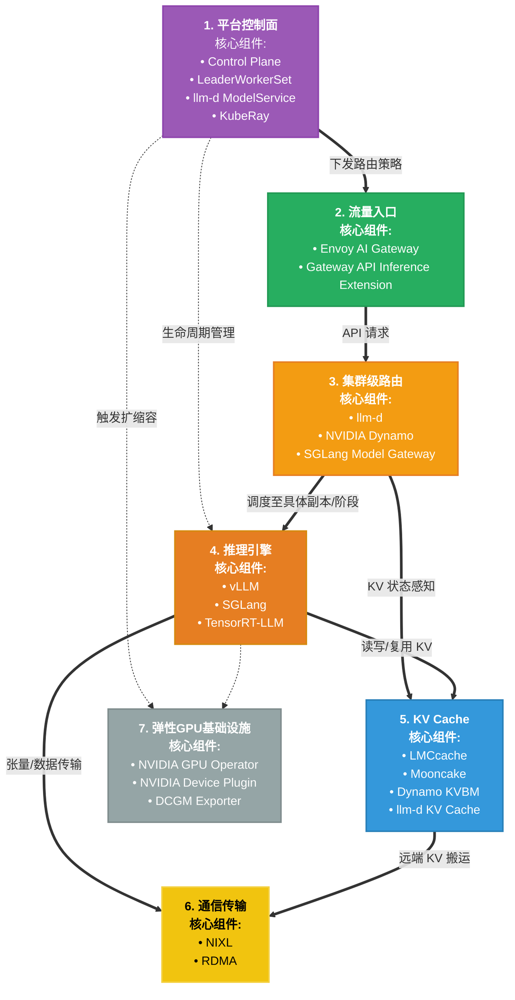

# AI相关

## 为什么要学习 AI

关于为什么要学习 AI ，主要有以下几点：

1. AI 工具非常提效，善用 AI 可以让我们事半功倍省下很多时间。
2. 面试刚需，现在无论是面试什么方向的技术岗位，面试官至少都会问一句 “你用过 AI 吗？”。
3. 通往未来技术时代的钥匙，在当下互联网的传统业务均趋于饱和。无论是当下很火的大模型，还是未来的具身智能，要想通往下一个信息时代，AI 是必须要了解的内容。

## 工具使用

在 AI 时代首先要学会善用 AI 工具。


### 利用 AI 学习编程

#### 知识的学习与理解

在学习知识时不要把 AI 当作自己的外置大脑。

这里在学习一个新知识时我推荐的方式是：

1. 通过 AI 快速了解浅层概念
2. 在简单理解的基础上在浏览器搜寻高质量博客并进行阅读
3. 在阅读过程中对这个知识点进行思考
4. 先把文章丢给 AI 再将自己的理解输出给 AI 与其进行探讨

相比于直接问 AI 答案，我更推荐先自己思考然后与 AI 对话。把 AI 当作一个有耐心且可以随时陪伴你的倾听者，主动去输出自己的想法说给 AI 听。

```text
和AI深度思考方法论
├── 一、核心底层原则
│   ├── 先自我思考，再求助AI
│   ├── 主动思想碰撞，不被动接收答案
│   ├── 路径：模糊想法 → 结构化 → 补漏洞 → 建知识体系
│   └── 定位：把AI当思考陪练，不是直接给答案工具
├── 二、标准5步思考对话流程
│   ├── 1. 先独立输出自己想法
│   │   ├── 不先看AI答案
│   │   ├── 先口述/写下零散观点
│   │   └── 允许想法不成熟、不完整
│   ├── 2. 让AI帮梳理结构化
│   │   ├── 保留你原本的原意
│   │   ├── 把碎片思路整理成逻辑框架
│   │   └── 梳理因果、分层、分点
│   ├── 3. 让AI质疑、挑逻辑漏洞
│   │   ├── 站对立面逐条反问
│   │   ├── 指出逻辑跳跃、思维盲区
│   │   ├── 抛出反例、边界场景
│   │   └── 倒逼你自己再深度作答
│   ├── 4. 横向关联+思维延伸
│   │   ├── 关联上下游、相关知识点
│   │   ├── 跨领域迁移思考方式
│   │   ├── 拔高一层看底层本质
│   │   └── 换多个视角重新解读
│   └── 5. 复盘沉淀固化
│       ├── 提炼核心结论
│       ├── 总结易错点、关键逻辑
│       └── 整理成笔记 / 个人Skill
├── 三、四大万能指令类型
│   ├── 强迫自我思考类
│   ├── 梳理逻辑思路类
│   ├── 倒逼深度质疑类
│   └── 思维延伸拔高类
├── 四、必守好习惯
│   ├── 坚持「先己后AI」
│   ├── 不被AI观点带偏，保持独立判断
│   ├── 每次深度思考后必沉淀
│   └── 固化成思维习惯，越练越强
└── 五、通用固定对话模板
    ├── 先说出自己初步理解
    ├── 让AI先倾听、不抢先给标准答案
    └── 按：梳理 → 质疑 → 延伸 → 沉淀 走完流程
```

#### 个人知识库管理

看了太多文章但是懒得打字整理，写了一大堆文章但是时间久了都忘了放哪了，以上问题在之前总是困扰我们。害得我们还得把宝贵的时间分出来整理笔记仓库。但是有了 AI 后这些问题可以利用 AI 轻松解决。

利用 AI 构建自己的知识库，不仅可以节省下维护仓库的时间同时还能利用 AI 将自己的技术栈从单个的点变成连续的网，后续再看时也可以使用 AI 迅速定位。

[LLM wiki 一种知识库构建范式](https://www.google.com.hk/search?q=AI%E6%90%AD%E5%BB%BA%E4%B8%AA%E4%BA%BA%E7%9F%A5%E8%AF%86%E5%BA%93&oq=AI%E6%90%AD%E5%BB%BA%E4%B8%AA%E4%BA%BA%E7%9F%A5%E8%AF%86%E5%BA%93&gs_lcrp=EgZjaHJvbWUyBggAEEUYOTIKCAEQABiABBiiBDIHCAIQABjvBTIKCAMQABiABBiiBDIKCAQQABiABBiiBDIKCAUQABiABBiiBNIBCjQ4MjI0MGowajeoAgCwAgA&sourceid=chrome&ie=UTF-8#fpstate=ive&vld=cid:14a6b2bf,vid:CTyx5XF2KVA,st:0)

#### 源码与论文阅读工具

源码阅读推荐使用 code agent 工具，随便哪个上层工具都行(codex cluade code ...)，但是基模一定要选比较好的，否则幻觉问题会比较严重。

这里我推荐的方式是：

1. 先结合网上博客（如果有）让 AI 梳理目录，说明整个项目的作用、架构层级、目录结构与这段代码文件做了什么。
2. 找到感兴趣的模块，让 AI 解读该模块内部的实现、时序图、并给出对应源码的位置
3. 结合源码内容与AI输出的解释进行理解

**这里一定要自己看源码！！！大模型有时会骗人。**

论文阅读：

[一个自动拉取感兴趣的论文并进行解析的工具](http://xhslink.com/o/9WGB14YIUrn)

### 装上skills让你的AI变得更强

模型有时候不是笨，而是还不清楚做事的流程与你喜欢的风格。

Skills是为AI智能体准备的“标准化工作手册+工具箱”文件夹，是实现复杂任务自动化、可复用、提升AI输出稳定性的核心能力包。它通常包含一个Markdown文件（如 SKILL.md）及相关模板、脚本，能让AI在需要时动态加载专家级能力，像是在执行一套SOP（标准作业程序）。

这里我们可以通过 skill 激发模型潜力，让大模型如虎添翼。

以下是一些各类 skill 合集的仓库

1. anthropics/skills（Anthropic 官方，标杆）
- GitHub：https://github.com/anthropics/skills
- 规模：⭐57k+，生产级，元技能齐全
- 特点：官方标准、安全审计、含 skill-creator（用自然语言生成新 Skill）
- 适配：Claude Code、Cursor、Windsurf
- 安装：
    ```bash
    git clone https://github.com/anthropics/skills ~/.claude/skills/anthropic-official
    ```

2. composiohq/awesome-claude-skills（社区第一大合集）
- GitHub：https://github.com/composiohq/awesome-claude-skills
- 规模：⭐16.5k+，300+ 技能，60+ 场景
- 特点：全场景（开发/运维/写作/数据/安全）、高活跃、持续更新
- 适配：Claude 全系、Cursor、Copilot
- 安装：
    ```bash
    git clone https://github.com/composiohq/awesome-claude-skills ~/.claude/skills/composio
    ```

3. voltagent/awesome-openclaw-skills（OpenClaw 生态最强）
- GitHub：https://github.com/voltagent/awesome-openclaw-skills
- 规模：500+ 技能，覆盖自动化/爬虫/办公/部署
- 特点：中文友好、浏览器自动化、文件处理、批量任务强
- 适配：OpenClaw、Claude Code、Cursor
- 安装：
    ```bash
    git clone https://github.com/voltagent/awesome-openclaw-skills ~/.claude/skills/openclaw
    ```

**在使用 Skills 的同时也不要忘了沉淀自己的 Skill。把自己的经验变成可以复用的工具**



### vibcoing

CS146S：The Modern Software Developer。

核心口号：不准手写代码，必须用 AI 写大型项目（纯 Vibe Coding）

[课程地址](https://themodernsoftware.dev/)

[中文版](https://github.com/ShouZhengAI/CS146S_CN)

[课程介绍](https://zhuanlan.zhihu.com/p/1982222968479298289)

* 范式：40% 规划 + 20% AI 生成 + 40% 测试 / 验证，全程不手写代码。
* 工具链：Cursor、Claude Code、GitHub Copilot 等 AI IDE / 代理。
* 项目驱动：期末需用 AI 独立完成全栈大型项目（前后端 + 部署）。

vibcoing 虽好，但是还得先学习计算机基础，在对计算机体系有了一个认知之后再去使用 vibcoding。

### 不要让 AI 代替你的思考！！！

大一的同学一定不要用 AI 一键编写小组plan！！！在打基础的阶段还是需要好好学习，不要养成惰性思维。长期使用 AI 做自己的外置大脑，会让自己失去对基本事实的判断与对代码的敏感度。

现在偷的懒都会成为找工作上班时精准的报应🤦。

## AI 学习路线



### 前置知识

#### 数学

AI 学习对于数学的前置知识要求并没有大家想象中那么高，只要能看得到高数线代概率论作业的答案知道基本的数学性质，就可以在 AI 和优质博客的帮助下看懂算法中的公式推导。

这里不需要单独学习，比较推荐在学习深度学习算法相关的内容时遇到不会的数学问题，再去搜浏览器问 AI 进行一个查漏补缺。

#### python 与 pytorch

这块在语言的使用方面没有必要单独学习，python 本身的语法都不是很难，在看其他模块时穿插学习自己需要的就够了。

[深入浅出PyTorch](https://github.com/datawhalechina/thorough-pytorch)

### AI 基础知识

**此栏目为所有人必学！！！**

算法相关的课比较推荐吴恩达老师和李宏毅老师的课。

#### 深度学习基础 

机器学习与深度学习是 AI 的起源，后续无论是 Transformer 还是其他更加先进的架构，都用到了深度当中的一些理念，为了再后续学习中更好的理解 Transformer

吴恩达的视频课比较简短，每节课大概就10分钟左右。讲解的内容偏向概念性比较基础，适合速成。

* 视频课：[吴恩达——深度学习](https://www.bilibili.com/video/BV12urfB1E7s/?spm_id_from=333.337.search-card.all.click&vd_source=6b3c3d3db76b0fcf84a9f66466b9ed53)

动手学深度学习这里讲的更加深入一些，有很多代码细节。适合想要对算法深度了解的同学。

* 文档+部分代码：[动手学深度学习](https://zh.d2l.ai/index.html)

在学习此栏目时主要要搞清楚以下问题：

1. 模型学到了什么？
2. 深度学习的基础概念，如：神经网络、向前传播、损失函数、梯度下降、反向传播、激活函数、归一化等基础概念...
3. 从 FNN -> RNN -> LSMT ->Transformer 的发展历史

#### Transformer 

Transformer 是现代大模型架构的鼻祖，无论是做算法还是 ai infra又或者是 agent 甚至你只是面一个传统的后端，都有可能会被问到 Transformer 的问题。所以 transformer 所有人必须学习。只是学习深度有区分。

这里论文原文比较学术风味缺少一些非常细节的技术再加上是英文版，对英语不好的同学来说不太友好。

* Transformer 论文原文：[Attention Is All You Need](https://arxiv.org/abs/1706.03762)

探秘Transformer系列讲解的更加细致针对每个组件都单独用一篇文章进行讲解，还对前面深度学习的内容进行了一些回顾。

* 文档：[探秘Transformer系列](https://www.cnblogs.com/rossiXYZ/p/18785601)

李宏毅老师的课图文并茂且讲解的层次更浅一点，适合想要速成的同学。

* 视频课：[李宏毅 | 自注意力机制和Transformer详细解析](https://www.bilibili.com/video/BV1r8nMz4EAj?spm_id_from=333.788.recommend_more_video.16&trackid=web_related_0.router-related-2479604-gjmc5.1777742192827.410&vd_source=6b3c3d3db76b0fcf84a9f66466b9ed53)

happy-llm 当中包含了一些注意力机制等的实现，可以看到更多代码细节

* 代码实战：[happy-llm](https://github.com/datawhalechina/happy-llm/tree/main)

在学习此栏目时主要要搞清楚以下问题：

1. 文本向量化与embedding模型
2. 位置编码
3. 注意力机制
4. decode-only 架构与 encode-only 架构

### 预训练

预训练招聘时往往对训练集群对规模要求，如千卡万卡集群。大多数普通学校并无如此庞大的计算集群资源。因此对于面向找工作的同学来说这个方向难以入行。

但是从头到位训练一个参数规模较小的模型并阅读其代码，可以让我们对训练过程有更深的体会，因此感兴趣的同学可以去看一下 minimind 这个开源的小模型项目，在该项目中会从头到尾教你去训练一个小模型且由于该模型参数量不大只需要一张显卡即可。适合想要感受训练但是没钱买卡的同学，这里只要租一张计算卡就够了。

* 代码实战：[minimind](https://github.com/jingyaogong/minimind)

### 后训练

**想做算法但是又害怕 bar 不够可选，最好搭配 agent 食用**

后训练是在特定场景下对于预训练的一种补充。可以把预训练阶段类比成小初高阶段对基础知识进行学习，后训练则是进入大学后对细分的专业进行进一步学习。

后训练的 hc 相比预训练和 AI infra 要充足一些，很多业务团队会招人针对自己的业务场景进行微调。

#### 微调

微调就是：固定或少量解冻基座参数，用自己的专属小数据集，继续训练几轮，让模型适配你的专属场景、专属话术、专属任务，不改模型底座架构，只做能力定向定制。

微调当中现下最常用到的就是 LoRA。这里理论较少，了解微调的过程，以及 LoRA 的概念即可。

学习过程中更多需要进行实践。这里比较推荐和 agent 项目结合，找到一个 agent+微调 的项目，实践感受一下微调的过程。

[LoRA原理介绍](https://www.zhihu.com/tardis/zm/art/623543497?source_id=1003)

#### 强化学习

强化学习是 AI 领域的核心分支之一，属于无监督学习与监督学习之外的第三种机器学习范式，其核心思想源于生物学习机制——通过“试错”与“奖励反馈”，让智能体在与环境的持续交互中，自主学习最优行为策略，最终实现特定目标的最大化收益。

* 视频课：[深度强化学习(DRL)-李宏毅1-8课（全）](https://www.bilibili.com/video/BV124411S7au/?vd_source=6b3c3d3db76b0fcf84a9f66466b9ed53)

* 文档：[easy-rl](https://datawhalechina.github.io/easy-rl/#/)

* 开源项目：[开源强化学习框架介绍内含github地址](https://www.cnblogs.com/aifrontiers/p/19504633)
### AI infra

**喜欢 infra 可选**

AI infra 主要是围绕 AI 的训练与推理做一些基础架构的建设，例如训练/推理框架，算子优化等等。该方向的意义是用更少的硬件资源让 AI 跑的更快，跑的更稳。这里的优化思路与传统的 infra 有很多相似之处。对于之前就开发过传统 infra 组件的同学来说会更加容易上手。

这里比较推荐做过 kv OS 网络 等方向的同学学习。

在 infra 学习时，图中 AI infra 这一栏目里的概念都需要有所了解，在对整体有一个认知后再对一个感兴趣的方向进行深入学习

#### GPU 体系结构与 CUDA 算子开发/优化

GPU 体系结构与 CUDA 算子开发/优化 属于是 AI infra 人不得不品的一环，在面试中时常会问到各类算子的优化以及算法题出手搓算子。同时了解底层也更有利于我们对上层内容的学习。因此这一块内容是必学向。

下面是一个比较简单的 CUDA 的教程，讲了一些基础的工具和 CUDA 语法。可以对最基础的概念进行学习。CUDA 可以理解为是一个 c++ 的库。

[CUDA 基础](https://face2ai.com/CUDA-F-0-0-Tencent-GPU-Cloud/)

LeetCUDA 是一一个涵盖了大部份算子写法的一个练习题库，同时还附带了一些讲解。要做算子开发的话就像刷力扣一样刷 LeetCUDA，但是这里没有测试环境，要测试需要自己租有 GPU 的服务器测试。

[LeetCUDA](https://github.com/xlite-dev/LeetCUDA)

和上面的 LeetCUDA 一个定位，但是 LeetGPU 提供了一个 GPU 测试环境，但是这个不充钱每天会有次数限制，可以在限制内白嫖一下。

[LeetGPU](https://leetgpu.com/)

下面是一个更加细节的学习合集，这个合集内的内容比较深入：

[CUDA学习合集](https://zhuanlan.zhihu.com/p/1998883357870794080)

除了 CUDA 之外还有一些比较上层的 GPU 编程框架，如 Triton 这类。这里的 Triton 等更加上层，因此学起来也更简单一些。这里如果一开始学 CUDA 觉得非常晦涩难懂可以先学 Triton 能直接上手学 CUDA 的就直接学 CUDA 。Triton 这种上层的等到有需要了再学。

#### 训练框架

我没研究过这一块，所以无法给出好的建议，等一个有缘人补全。

#### 推理框架

在训练和推理框架任选一个进行深入学习即可。这里我更推荐推理框架一些，因为训练框架面试要求更高且 hc 相比推理框架要更少。

推理框架是专门用于部署、加速和运行已训练完成的 AI 大模型的软件工具集。它专注于生产环境下的效率和工程化问题，通过模型并行、量化、算子优化等技术，实现低延迟、高吞吐量的实时推理，降低计算成本。

推理全景图：


nano-vllm 是一个缩小版的 vllm 框架，只有2000多行代码，适合入门学习。建议大家可以花一周多时间迅速阅读一下源码，对推理框架最基础的概念有一个基本的认知。

* [nano-vllm](https://github.com/GeeeekExplorer/nano-vllm)

在当今推理框架的生态位当中，vllm 和 sglang 可以说各占据了推理的半壁江山。在看开源项目的同学可以这些项目，给他们提 issues 或者 pr 都是非常加分的。

* [vllm](https://github.com/vllm-project/vllm)
* [sglang](https://github.com/sgl-project/sglang)

vllm-omni 是一个多模态的推理框架，这个项目里有一些针对多模态场景的优化，这块能做的issue很多。但是多模态这块没什么好的资料只能自己去扒论文和源码，学习难度比较高。

[vllm-omni](https://github.com/vllm-project/vllm-omni)

除了推理框架本体之外，还有一些与之相关的生态。在下面的仓库当中包含了分布式 kv cache，推理时的网络通信库，推理感知调度器等。这些项目当中也有许多不完善的地方，可以关注一下看看有没有机会提pr。

* [mooncake](https://github.com/kvcache-ai/Mooncake)
* [FlexKV](https://github.com/taco-project/FlexKV)
* [LMCache](https://github.com/LMCache/LMCache)
* [dynamo](https://github.com/ai-dynamo/dynamo)

#### 高性能网络

面向 AI 的高性能网络，核心是搞定低延迟、高带宽、无损传输、拓扑感知，围绕 RDMA/RoCE/IB、NCCL、Clos 架构、GPU 集群通信 这条主线系统学即可。

NCCL 是英伟达开发的一款用于多GPU、多节点高效通信的开源集合通信库。它通过优化通信原语（如AllReduce、AllGather），显著提升深度学习大模型训练和推理时的通信效率，主要利用 NVLink、PCIe 和 InfiniBand 等技术实现低延迟、高带宽的并行数据交换。

RDMA 是一种高性能网络技术，允许一台计算机直接读写另一台计算机的内存，而无需操作系统内核、CPU或TCP/IP协议栈的参与。它具有零拷贝（Zero-copy）和内核旁路（Kernel bypass）特性，显著降低了数据传输延迟并释放了CPU资源。

这块我没学过所以先不放学习资料了感兴趣的同学可以了解一下。
### agent开发

**喜欢做业务不想搞太底层可选，但是必须要和后端或算法内容结合**

agent 开发虽然现阶段需求量很大，但是该方向其实和后端并无太大区别，且在技术深度逊于算法 infra 在业务积累上弱于传统后端。这并不建议单出 agent 开发。

在 agent 开发的学习上我更建议作为后端/后训练技术栈上的补全。这里建议 agent+后端 或 agent + 后训练 或者直接三管齐下。

#### Rag


