# Transformer

## 整体架构

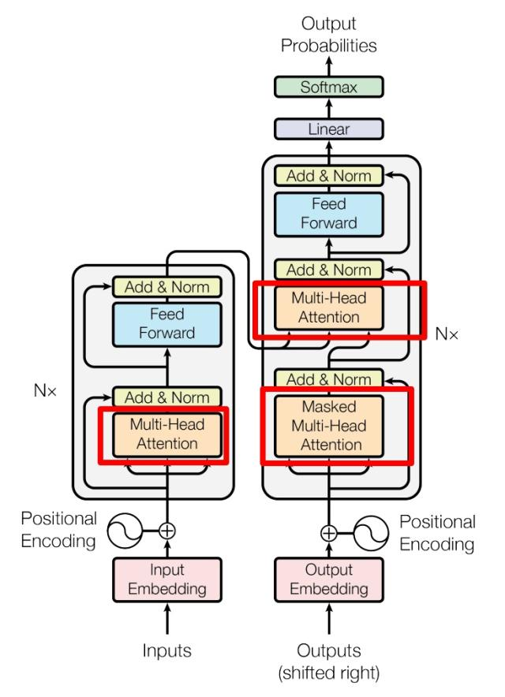

NX模块是由 N 层Encoder Layer堆叠起来的。一组输入数据（例如一个句子）会依次通过 N 个完全相同的编码器层，然后再通过 N 个完全相同的解码器层。​​这里的 ​​N​​ 是一个超参数，代表模型的深度。

每一层（Encoder Layer）包含：

* Multi-Head Self-Attention（多头自注意力）
* Feed Forward Network (FFN)（前馈全连接网络）
* Add & Norm（残差 + 层归一化）

所以 Nx 层 = “N 个 Encoder Layer 的堆叠”。

## 输入

### 分词

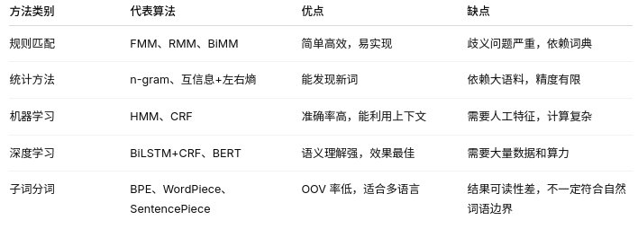

### Token Embedding（词向量）

初始 embedding 是随机的，在训练过程中通过损失函数（比如交叉熵）和反向传播逐步优化，最终得到一个能够在高维空间表示词语语义的向量。

**1.初始化**
初始 token embedding 向量是随机的，通常用均匀分布或正态分布生成。这时候它没有语义信息，只是占位的向量。

**2.训练阶段**
模型接收输入 token 的 embedding（加上位置编码），经过 Transformer 的注意力和前馈网络，生成预测输出。计算损失（比如语言模型用交叉熵损失，分类任务用交叉熵或其他损失函数）。

反向传播会计算每个 token embedding 对损失的梯度，然后更新 embedding 向量：

这里的梯度来自整个模型的计算，不仅仅是 embedding 层，整个模型会告诉 embedding 该怎么调整，以便减少预测错误。

训练多轮后，每个 token embedding 就会落在一个“最佳位置”，使得模型能够：

* 表示这个词的语义
* 在下游任务中做出准确预测

这也是为什么语义相近的词在向量空间中距离更近的原因，例如：

$$\text{king} - \text{man} + \text{woman} \approx \text{queen}$$

### Positional Embedding（位置向量）

Transformer 中除了单词的 Embedding，还需要使用位置 Embedding 表示单词出现在句子中的位置。因为 Transformer 不采用 RNN 的结构，而是使用全局信息，不能利用单词的顺序信息，而这部分信息对于 NLP 来说非常重要。所以 Transformer 中使用位置 Embedding 保存单词在序列中的相对或绝对位置。
Transformer 原始论文中固定的正弦/余弦编码（Sinusoidal Encoding, Transformer 原始论文）

除此之外还有以下多种位置编码方式：

### 最终的输入结果

Transformer 中单词的输入表示 x由单词 Embedding 和位置 Embedding （Positional Encoding）相加得到。

## 自注意力机制

自注意力机制（Self-Attention）是Transformer模型的核心组件，其核心思想是通过计算序列中每个元素与其他所有元素的相关性（注意力权重），动态地为每个位置生成一个加权聚合的上下文表示。
自注意力机制允许模型在处理序列数据时，直接捕捉任意两个位置之间的依赖关系（无论距离远近）。其核心特点是：

* 动态权重分配​​：根据输入序列的当前内容计算注意力权重，而非依赖固定模式（如RNN的逐步传递或CNN的局部窗口）。
* ​​全局感知​​：每个位置的输出是所有位置的加权组合，能直接建模长距离依赖。

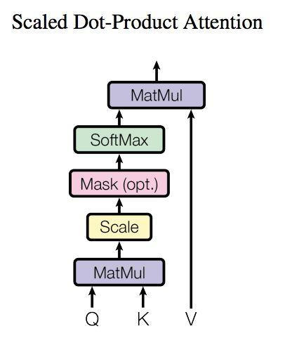

上图是 Self-Attention 的结构，在计算的时候需要用到矩阵Q(查询),K(键值),V(值)。在实际中，Self-Attention 接收的是输入(单词的表示向量x组成的矩阵X) 或者上一个 Encoder block 的输出。而Q,K,V正是通过 Self-Attention 的输入进行线性变换得到的。

矩阵的意义：

|矩阵| 含义	|类比|
|---|---|---|
|Q (Query)	|查询向量，用来“询问”其他 token 的相关性	|我手里的问题/查询|
K (Key)	|键向量，用来表示 token 的内容特征，供查询匹配	|每个 token 的标签或索引卡片|
V (Value)|值向量，用来提供 token 的实际信息，最后输出加权	|每个 token 的具体答案或信息|

假设句子：

"The cat sat on the mat"

* 对 token "cat"：
  * Q：表示 "cat" 想关注哪些信息
  * K：表示句子里每个 token 的特征标签
  * V：每个 token 的实际 embedding 信息

### 计算QKV

Self-Attention 的输入用矩阵X进行表示，则可以使用线性变阵矩阵WQ,WK,WV计算得到Q,K,V。计算如下图所示，注意 X, Q, K, V 的每一行都表示一个单词。这里的WQ、WK、WV一开始也是随机定义的，他们和词向量类似会在学习的过程中逐渐进行优化。

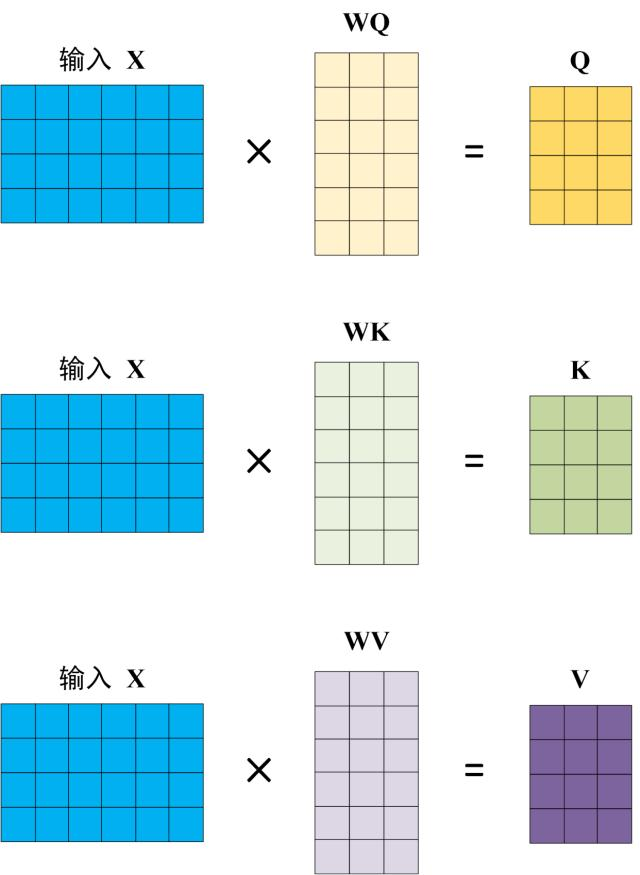

### Self-Attention 的计算过程

在自注意力（Self-Attention）中，每个 token 会根据整个序列的上下文来更新自己的表示。公式：

$$\text{softmax}\Big(\frac{Q K^T}{\sqrt{d_k}}\Big)V$$

#### Q矩阵乘K的转置方程

意义：计算查询（Query）与所有键（Key）之间的相关性或相似度得分。​

这里以在图书馆寻找想要找到的书为例：

* Query (Q)​​： 就是我的查询条，上面写着我想找的书的特点（例如：“关于人工智能的科普书”）。
* Key (K)​​： 是图书馆里每本书的​​索引卡​​（例如：一本书的索引卡上写着“机器学习、深度学习、科普”）。

那么 ​​Q 乘 K的转置 (QKᵀ)​​ 这个操作就是在：将查询条Q与图书馆里所有书的索引卡K进行一一比对，为每一本书计算出一个“匹配分数”。​​分数越高，就代表那本书的索引卡K与查询条Q越匹配，越可能是用户想要的结果。

计算过程：公式中计算矩阵Q和K每一行向量的内积，为了防止内积过大，因此除以dk的平方根。Q乘以K的转置后，得到的矩阵行列数都为 n，n 为句子单词数，这个矩阵可以表示单词之间的 attention 强度。下图为Q乘以K的转置，1234 表示的是句子中的单词。

为什么需要除$\sqrt{d_k}$

对点积结果的数值过大会对其进行缩放，从而避免经过Softmax函数后梯度消失​​。

1. 避免溢出：使得 Softmax 输入不至于过大，从而防止指数函数溢出。
2. 防止梯度消失或爆炸：通过缩放，防止梯度在反向传播时变得过大或过小，帮助梯度保持在一个合适的范围内。
3. 稳定训练过程：帮助 Softmax 在训练过程中产生平滑且有效的梯度，提升模型训练的稳定性。

#### Softmax

得到Q矩阵乘K的转置方程的结果之后，使用Softmax将原始的矩阵转换为一组​​概率分布，即每一个单词对于其他单词的 attention 系数，公式中的 Softmax 是对矩阵的每一行进行 Softmax，即每一行的和都变为 1。

Softmax 是一个数学函数，它可以将  任意一组实数  （正数、负数、零都可以）转换为一组概率分布。
公式：

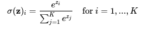

* $z_i$: 第 i 个类别的原始得分（logit）。
* $e^{z_i}$：对每个得分取指数。这是因为原始得分可能为负，取指数后能确保所有值为正。
* $sum_{j=1}^{K} e^{z_j}$: 对所有 K 个类别的指数值求和。这个和作为归一化分母。
* $\sigma(\mathbf{z})_i$: 最终得到的第 i 个类别的概率。它的值在 (0, 1) 之间，并且所有 K 个类别的概率之和为 1。

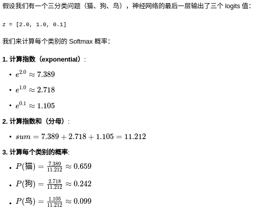

在实际编程中，直接计算$e^{z_i}$可能会导致数值溢出（如果很大）。

$e^{z_i}$过大的危害：

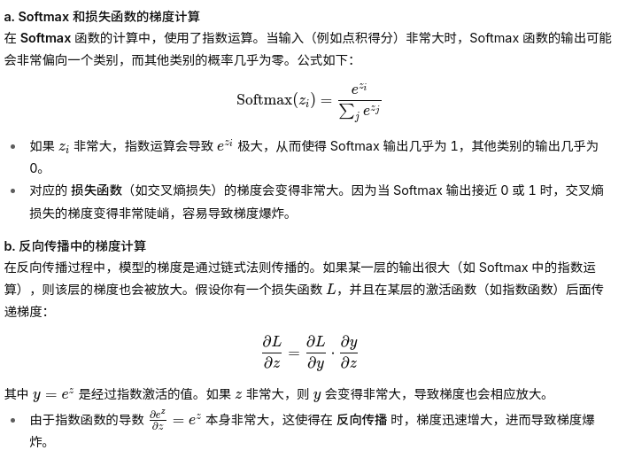

因此，我们使用一个数学上的等价形式来增强数值稳定性：

$$\sigma(\mathbf{z})_i = \frac{e^{z_i - \max(\mathbf{z})}}{\sum_{j=1}^{K} e^{z_j - \max(\mathbf{z})}}$$

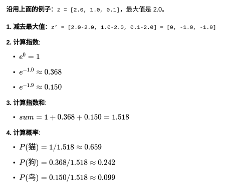

总体过程可以总结为：

1. 取指数​​：对每个输入数值进行指数函数（e^x）计算，确保所有结果都为​​正数​​。
2. 求和​​：将所有指数计算结果加起来，得到一个总和。
3. 归一化​​：将每个指数计算结果除以上一步得到的总和。

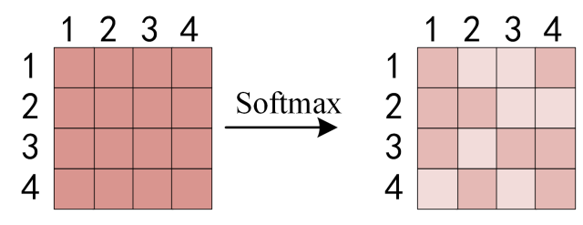

#### 与V相乘

得到 Softmax 矩阵之后可以和V相乘，得到最终的输出Z。

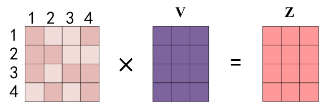

上图中 Softmax 矩阵的第 1 行表示单词 1 与其他所有单词的 attention 系数，最终单词 1 的输出等于所有单词 i 的值。

根据 attention 系数的比例加在一起得到，如下图所示：

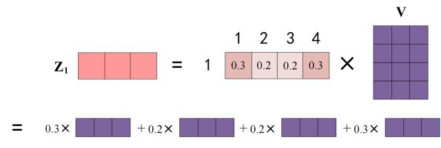

这样产生的 Z₁是一个全新的向量，它融合了整个句子的信息，但​​侧重于（注意力系数）那些与“单词1”最相关的词所提供的信息​​。

这个过程就像开一场​​研讨会​​：

* 每个词都带有自己的观点和信息组成Value矩阵。
* ​单词1要发言时​​，会先思考其他每个人的观点与你现在要讲的内容有多大的关联性（计算注意力系数）。
* 计算Z1就相当于综合所有人的观点​​，但更侧重于采纳那些与你当前话题关联性高的人的意见（加权求和），最终形成你自己的新发言（输出Z₁）。

### 为什么需要自注意力机制

**1.长距离依赖问题**

传统的RNN和LSTM网络虽然设计上能够处理序列数据，但它们在处理长序列时会面临“长距离依赖”问题。随着序列长度的增加，RNN和LSTM的模型在传递梯度时会逐渐丧失对较远时刻信息的依赖，导致模型无法有效捕捉到长距离的依赖关系。这种问题被称为梯度消失或爆炸问题，它使得网络很难记住长期的信息。
自注意力机制通过直接计算序列中各个元素之间的相关度，避免了信息的丢失。每个词（或token）在计算过程中可以与序列中的其他所有词进行“注意力”计算，从而有效捕捉到长距离的依赖关系。

**2.并行化计算**

传统的RNN和LSTM模型由于其计算顺序性（每一步的输出依赖于前一步的计算），在处理长序列时无法进行并行计算，这使得训练过程变得非常慢，尤其是在GPU等硬件加速设备上。
自注意力机制不同于RNN和LSTM的顺序计算，它能够在每个步骤中同时考虑整个输入序列，这使得其计算过程非常适合并行化。这样，在GPU中可以实现高效的加速，显著提高训练速度和计算效率。

## 多注意力头

同样一个词，在不同的场景下会有不同的语义。以苹果为例，如果与吃联系，那么就是水果。如果和用这个词关联那么就可能表示的是苹果品牌的电子产品。一个单一的注意力头很难同时、同等地捕获所有这些不同类型的关系。它可能会被迫学习一种所有关系的“平均值”，从而导致信息模糊。这里的多注意力头就是为了解决这个问题，通过多个QKV矩阵来得到更多的关联可能性。

它通过设置多个（例如8个）并行的“注意力头”来解决这个问题。每个头都有自己独立的一套 Q, K, V权重矩阵，因此可以学习到不同的关注模式。

* ​头1​​：可能专门关注​​语法关系​​（如主谓一致）。在处理“apple”时，它主要关注“He”。
* ​头2​​：可能专门关注​​语义-动作关系​​。对于第一个“apple”，它高度关注“ate”；对于第二个“Apple”，它高度关注“used”和“send”。
* 头3​​：可能专门关注​​指代或修饰关系​​。它可能关注“the”来确定第一个“apple”是普通名词。
* ...​​（其他头会捕捉其他更细微的模式）

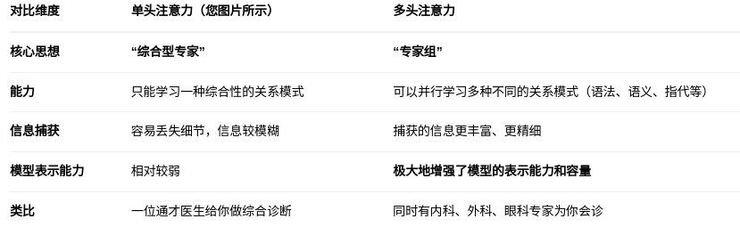

### Multi-Head Attention结构

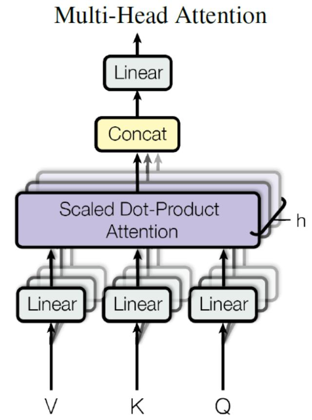

从上图可以看到 Multi-Head Attention 包含多个 Self-Attention 层，首先将输入X分别传递到 h 个不同的 Self-Attention 中，计算得到 h 个输出矩阵Z。下图是 h=8 时候的情况，此时会得到 8 个输出矩阵Z。

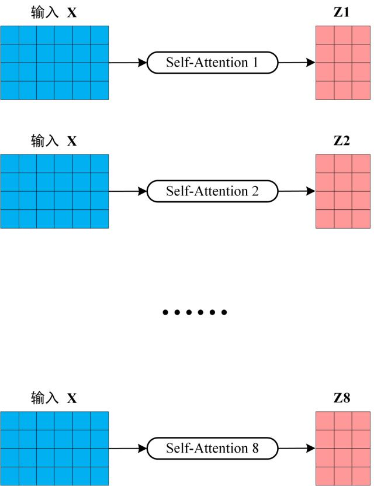

得到 8 个输出矩阵Z1到Z8之后，Multi-Head Attention 将它们拼接在一起 (Concat)，然后传入一个Linear层，得到 Multi-Head Attention 最终的输出Z。

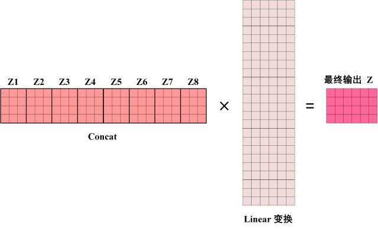

这里的目的是通过Linear变换将拼接起来的Concat矩阵压缩回原来的维度。这里用来Linear变换的矩阵也是通过学习得到的。

**1.初始化**

在训练开始前，这个Linear变换的​​权重矩阵（W）​​ 和​​偏置向量（b）​​（图中可能未明确画出b）会被​​随机初始化​​。

随机初始化的目的是给模型一个起点，让每个参数都有一个初始值，从而可以开始前向计算和后续的梯度更新。常用的初始化方法包括Xavier初始化、He初始化等，它们会根据矩阵的输入输出维度来设置初始值的范围，以利于训练的稳定性和收敛速度。

**2.学习与优化**
​​前向传播​​：输入数据（拼接后的 Concat[Z1, Z2, ..., Z8]）会与这个随机初始化的矩阵相乘，加上偏置，得到“最终输出Z”。这个初始的输出显然会很不准确。

​​计算损失​​：将模型的输出与真实标签进行比较，通过损失函数（Loss Function）计算出一个误差值。这个误差值衡量了模型当前预测的“糟糕”程度。

​​反向传播​​：误差信号会从模型的输出端反向传播回每一层。在这个过程中，会计算出损失函数对权重矩阵（W）和偏置（b）中每一个参数的​​梯度​​。梯度指明了为了使损失减小，每个参数应如何调整（是增加还是减少）。

​​参数更新​​：优化器（如SGD、Adam）根据计算出的梯度，按照一定的步长（学习率）来更新权重矩阵和偏置向量中的每一个值。

新权重 = 旧权重 - 学习率 * 梯度

**3.最终结果**

上述“前向传播 -> 计算损失 -> 反向传播 -> 参数更新”的过程会在整个训练数据集上反复迭代成千上万次。

每次迭代，这个Linear变换的矩阵都会被微调一点，其数值朝着能够减少预测误差、提高模型性能的方向逐渐演变。

训练结束后，这个矩阵就不再是随机的了，它包含了模型从训练数据中学到的、用于成功融合多个注意力头信息的最优权重。

## 编码器与解码器的作用

### 编码器 (Encoder) 的任务

​​特征提取与降维​​：将高维的输入数据（如图片、文本）映射到一个低维的、稠密的​​潜在空间（Latent Space）​​。

​​学习数据的本质特征​​：捕捉数据中最重要、最具代表性的模式和信息，过滤掉噪声和冗余细节。

​​例如​​：将一张 256x256 的图片压缩为一个 100 维的向量，这个向量包含了图片的核心特征（如风格、内容）。

### 解码器 (Decoder) 的任务

​​从特征重建数据​​：将潜在空间中的低维特征向量​​还原​​或​​生成​​为高维的、人类可理解的数据。

​​生成新数据​​：通过输入不同的潜在向量，可以生成全新的、与原始数据类似的数据样本。
​​
例如​​：将一个 100 维的特征向量解码生成一张新的 256x256 的图片。

## 编码器（Encoder）

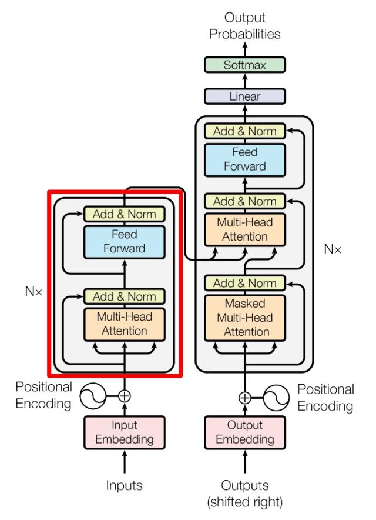

上图红色部分是 Transformer 的 Encoder block 结构。

### Add & Norm

在 Transformer 的 Encoder 和 Decoder 中，每个子层（Self-Attention 子层 / Feed Forward 子层）后面都会有一个 Add & Norm 层。这一层的作用主要是为了保证在深层次的传播过程中梯度的稳定性并加速模型的收敛速度。在深度网络中，梯度通过​​链式法则​​反向传播。梯度消失/爆炸通常发生在连续乘法中。

* 梯度消失​​：当连续相乘的梯度（或雅可比矩阵的值）​​小于1​​时，梯度会以指数级速度衰减到接近零。
* ​梯度爆炸​​：当连续相乘的梯度（或雅可比矩阵的值）​​大于1​​时，梯度会以指数级速度增长到无穷大。

#### Add（残差连接）

将子层的输入与子层的输出相加，形成一个“残差”连接。

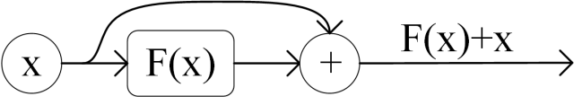

对于图中的结构来说，第一个Add & Norm子层的输入为原始的输入矩阵，而子层的则来自于多注意力机制的层。第二个Add & Norm子层的输入为第一个Add & Norm的输出，子层的输出为FFN层的输出。

这样做是为了解决的核心问题：​​退化问题​​。在深层网络中，简单地堆叠更多层不一定带来性能提升。某些层可能学习到"无效变换"甚至"有害变换"。通过残差连接可以确保最差情况下，网络至少能保持原有性能​。

在深层网络里，梯度要层层反向传播，容易越来越小或越来越大。

有了残差连接：梯度可以“直接穿过捷径”传播到前层，避免中间层太深导致的梯度衰减。

所以即使网络很深，模型也能训练下去。

#### Norm（层归一化）

##### Norm的作用

**1. 统一特征尺度，避免“ zig-zag”下降，加速模型收敛**

这里的操作可以理解为每一份数据本身拥有不同的起点，在不同的起点上去评判最终到达的结果。

比如在没有归一化的网络中，不同特征的尺度（范围）可能差异巨大。比如特征A的范围是[0, 1]，特征B的范围是[0, 1000]。

这会导致损失函数的等高线图是又高又窄的“椭圆形峡谷”。在梯度下降时，参数更新会沿着陡峭的方向剧烈震荡（“zig-zag”路径），而沿着平缓的方向进展缓慢。为了稳定，不得不使用一个极小的学习率，导致收敛极慢。

**2.将激活函数维持在敏感区，稳定梯度**

* 问题​​：如Sigmoid或Tanh这样的激活函数存在饱和区。当输入值的绝对值很大时，梯度会变得非常小（梯度消失）。
* 后果​​：如果某一层的输入分布不稳定，很容易进入饱和区，导致梯度消失，参数无法更新，学习停滞。
* LayerNorm的作用​​：通过归一化，它保证了输入到激活函数的值大部分时间都落在梯度较大的区域（如Tanh的线性区）。这使得梯度信号足够强，能够有效地反向传播，​​避免了训练停滞，加快了学习速度​​。

**3.减轻对参数初始化的依赖**

* ​问题​​：网络的初始状态对训练能否顺利开始至关重要。糟糕的初始化可能直接导致梯度消失或爆炸。
* ​LayerNorm的作用​​：无论初始权重如何，LayerNorm都会尽力将数据分布“拉回”标准范围。这降低了网络对初始权重的敏感性，让模型更容易从一个随机的起点开始学习，​​提高了训练的鲁棒性和可重复性​​。

##### LayerNorm的工作方式

$$\text{LayerNorm}(x') = \frac{x' - \mu}{\sigma} \cdot \gamma + \beta$$

μ：均值，σ：标准差 ，γ,β：可学习参数，用于恢复模型表达能力。

假设我们有一个非常简单的Transformer模型，隐藏层维度只有4（现实中通常是512或768等）。现在，我们处理一个序列中的一个词，它的特征向量（LayerNorm的输入）是：x = [2, 4, 6, 8]

1. 计算均值和方差​：

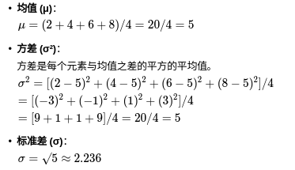

2. 归一化（减去均值，除以标准差）​

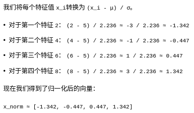

3. 仿射变换（可学习的缩放和偏移）​

如果LayerNorm只做前两步，那么它的输出就会被严格限制在特定的分布内，这可能会损害模型的表达能力，因此，我们引入两个可学习的参数γ和β。

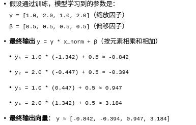

这个最终输出的分布不再是为0均值、1方差，但它是在一个​​稳定、规整的分布基础上进行变换的结果​​。γ和β让模型自己决定每个特征维度的最佳均值和方差。这确保了​​输入到激活函数的数据始终被稳定在一个标准的分布范围内。

##### 为什么这里是 LayerNorm 而不是 BatchNorm？

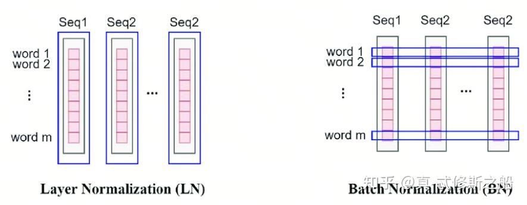

**Batch Normalization（BatchNorm）**

在​​Batch维度​​上进行归一化，对一个Batch中所有样本的​​同一个特征​​计算均值和方差。

这是一种对整个批次数据进行归一化的方法。具体来说，BatchNorm关注的是批次中每一列的数据，这些数据代表了不同样本的同一个特征。因为这些特征在统计上是相关的，所以它们可以被合理地放在一起进行归一化处理。这就像是在同一个班级里，比较不同学生的同一科目成绩，因为这些成绩都在相同的评分标准下，所以可以直接比较。

Batch 在CNN中比较有效，因为图像任务的batch size很大且同一张图片上的元素会拥有相似的特征。

**Layer Normalization（LayerNorm）**

在​​特征维度​​上进行归一化，对​​单个样本​​的所有特征计算均值和方差。

LayerNorm适用于那些在不同样本之间难以直接比较的情况，如Transformer中的自注意力机制。在这些模型中，每个位置上的数据代表了不同的特征，因此直接归一化可能会失去意义。

LayerNorm的解决方案是对每个样本的所有特征进行单独归一化，而不是基于整个批次。这就像是评估每个学生在所有科目中的表现，而不是仅仅关注单一科目，这样可以更全面地理解每个学生的整体表现。

**对于transformer的适用性**

1. 对Batch Size的敏感性（推理时的不一致性）
   * BN在训练时依赖于Batch统计量（Batch内的均值和方差）。但在推理时，如果Batch Size很小（甚至是1），它的性能会显著下降。推理时通常使用训练时计算的​​滑动平均​​来近似全局均值和方差。
   * 在训练时，我们可能使用较大的Batch Size。但在推理时，尤其是在进行​​自回归生成​​（如机器翻译、文本生成）时，我们通常是逐个样本（或很小Batch）进行生成的。如果使用BN，推理时的统计量与训练时差异巨大，会导致性能不稳定。
   * LN的统计量仅依赖于单个样本，与Batch Size完全无关。因此，无论训练时Batch Size是128还是推理时是1，其行为都是一致的、稳定的。这对于自回归生成至关重要。
2. 处理变长序列的能力
   * BatchNorm的问题​​：为了提高效率，训练时通常会将多个序列​​填充​​到相同长度。对于BN来说，它会计算所有位置（包括填充部分）的统计量。这会导致问题，因为填充符（如<pad>）的表示会污染BN的均值和方差计算，使归一化结果不准确。
   * ​​LayerNorm的优势​​：LN为每个序列位置独立计算归一化参数。如果一个序列的有效长度很短，后面都是填充符，LN只会在计算自身特征时被填充符影响，而不会影响同一Batch内其他序列的归一化。这使得模型对填充更不敏感。虽然更优的做法是在计算注意力时使用填充掩码，但LN提供了天然的鲁棒性。
3. 与自注意力机制的协同
   * BatchNorm的问题​​：BN会​​混合不同序列、不同位置​​的信息。这意味着一个序列中某个词的表示，在归一化时会被同一Batch内其他序列的、可能完全不相关的词所影响。这可能会“污染”自注意力精心计算的上下文信息。
   * ​LayerNorm的优势​​：LN​​独立处理每个位置的表示​​。序列中第i个词的归一化结果，只依赖于该词当前的表示向量，而不依赖于同一Batch内其他序列的第i个词。这更好地保持了自注意力机制为每个词生成的​​独立上下文信息​​。

#### 小结

残差连接通过保留原始输入，缓解了梯度问题。

LayerNorm通过计算使数值稳定分布，加快收敛速度。

### FNN（前馈神经网络）

前馈神经网络​​是一种人工神经网络，其中神经元之间的连接不形成循环或环。当进行一次推理时信息从输入层开始，单向地向前传播，经过隐藏层（如果有的话），最终到达输出层。没有反馈连接，即输出不会传回给自身或前一层的神经元作为输入。FNN它紧随在​​多头自注意力机制​​之后。它的结构就是一个标准的​​两层前馈神经网络​​，中间有一个ReLU激活函数。
#### FNN的结构

对于一个输入向量 x（通常是自注意力层的输出，维度为 d_model，例如512），FNN层进行的操作是：

FFN(x) = max(0, x * W1 + b1) * W2 + b2

其中：

W1, b1是第一层的权重和偏置。

W2, b2是第二层的权重和偏置。

max(0, …)是ReLU激活函数。

维度变化  ：

输入 x的维度：[d_model](例如 512)

第一层将其投影到一个更高的维度（称为  内维数  ）：[d_ff](例如 2048)。即 W1的形状为 [d_model, d_ff]。
ReLU激活函数在此高维空间中进行非线性变换。

第二层将其投影回原始维度：[d_model]。即W2的形状为 [d_ff, d_model]。
所以，FNN层是一个“放大后再缩小”的过程。这种“瓶颈”设计（Bottleneck）有助于增加模型的容量和非线性，同时保持输入输出维度一致，以便进行残差连接。

FNN的作用

**提供非线性变换能力​​**

自注意力层本质上是​​线性操作​​的加权和（尽管计算注意力权重时用了Softmax，但value值的加权和是线性的）。
FNN中的ReLU激活函数引入了​​非线性​​，使得模型能够学习更复杂的函数和表征。没有它，整个Transformer层就只是线性变换的堆叠，表达能力将大幅下降。

​**​独立处理每个位置的信息​​**

​​“Position-wise”​​ 是这个模块名字的关键。它意味着FNN​​独立地、完全相同地​​应用于序列中的​​每一个位置​​。
序列中的每个token（位置）经过自注意力机制后，都聚合了全局信息。FNN则负责让每个token“独自消化”这些聚合来的信息，进行更深层的加工和转换。
它与一维卷积（kernel size=1）的效果类似，因为它不混合不同位置之间的信息（这一点与自注意力形成鲜明对比）。

**​​增强模型容量和表征空间​​**

通过先投影到高维空间（如2048维），FNN在一个非常​​高维、富有表现力的空间​​中对特征进行变换和精炼，然后再压缩回原始维度。这大大增加了模型的参数量和学习能力。

## 解码器（Encoder）

### 掩码注意力

让解码器在生成当前词之前，先对​​已经生成的目标序列部分​​进行建模，即理解当前已生成词之间的内部关系。

#### 掩码自注意力的目的

在解码器中，当我们生成序列时，模型应该只能使用当前时刻及之前的信息，而不能使用未来的信息。例如，在翻译句子时，模型在生成第t个词时只能看到前t-1个词。为了达到这个目的，我们需要防止解码器在计算自注意力时“窥视”到未来的信息。
掩码自注意力通过一个掩码矩阵来实现这一点。掩码矩阵通常是一个上三角矩阵，其角线及以下的元素为0，对角线以上的元素为负无穷（或一个非常大的负数）。这样，在计算softmax之前，将未来位置的注意力权重置为一个极小的值，使得softmax后这些位置的权重几乎为0。

#### 掩码自注意力的实现

假设我们有一个序列长度为T，那么掩码矩阵M是一个T×T的矩阵，其中：

$$M_{ij}=\begin{cases}0 & i \geq  j(允许当前位置访问当前及之前的位置)\\-\propto  &  i \leq j(禁止当前位置访问未来的位置)
​\end{cases}$$

在计算自注意力时，我们将掩码矩阵加到缩放后的点积得分上：

$$\text{softmax}\Big(\frac{Q K^T}{\sqrt{d_k}}+M\Big )V$$

由于softmax函数会将负无穷输入变为0，所以未来位置的注意力权重为0，从而避免了未来信息的影响。

假设序列长度为3，则掩码矩阵M为：

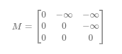

在计算自注意力时，对于第一个位置（第一行），它只能关注第一个元素（因为第二、三个位置是负无穷）；第二个位置可以关注第一和第二个元素；第三个位置可以关注所有三个元素。

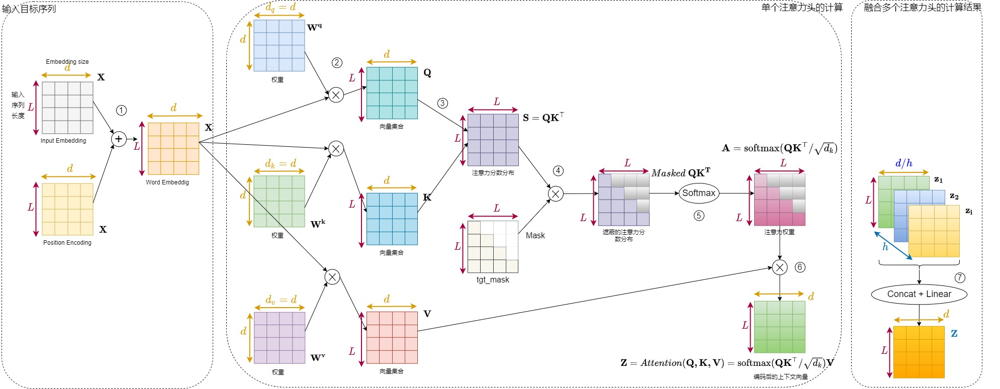

### 交叉注意力

在已经理解目标序列已生成部分的基础上，让解码器有选择地从​​源序列​​中提取相关信息，以帮助生成下一个词。

#### 交叉注意力的目的

交叉注意力（Cross-Attention）发生在Transformer的解码器层中。在解码器中，自注意力层用于处理目标序列（掩码自注意力），而交叉注意力层则用于将目标序列的表示与源序列的表示进行关联。

核心思想：通过交叉注意力，解码器在生成目标序列的每一个词时，可以“关注”源序列中哪些部分是最相关的。
交叉注意力的实现

具体来说，交叉注意力使用来自两个不同序列的向量来生成Query、Key和Value：

* Query（Q）通常来自解码器（即目标序列的表示）。
* Key（K）和Value（V）来自编码器（即源序列的表示）。

这样，解码器中的每个位置都可以根据当前已经生成的目标序列（作为Query）去编码器的输出（Key/Value）中查找相关信息。

计算过程与自注意力类似，但Q、K、V的来源不同：

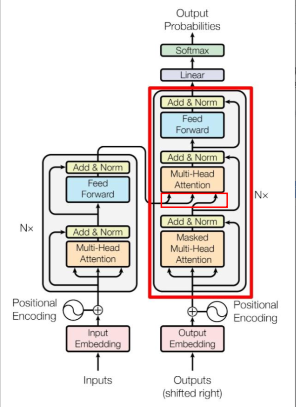

这一步相当于我们拿着解码器输入的问题（Q）来在知识库中查询（K,V）已经准备好的答案。

### 为什么先是掩码自注意力再交叉注意力

先掩码自注意力再交叉注意力的顺序确保了：

​​自回归性质​​：在生成过程中，模型不会看到未来的目标序列词。

​​信息分层处理​​：先处理目标序列内部依赖，再根据处理后的目标表示去源序列中提取相关信息。

​​避免混淆​​：防止源序列信息过早与目标序列未来信息混合（尽管未来词被掩码，但设计顺序保证了逻辑清晰）。

这种设计使得Transformer解码器能够有效地进行自回归生成，同时在每一步生成时充分利用源序列的信息。

## 模型训练

### 为什么需要在Transformer中使用交叉熵来作为损失函数

#### 问题背景：Transformer 在做什么？

Transformer（例如 GPT、BERT）在训练时通常是一个分类问题：
给定前面的 token 序列，预测下一个 token 的概率分布。
例如句子：

>I love deep ___

模型输出一个对整个词表（vocabulary，比如 50,000 个单词）的概率分布：

```
P("learning" | I love deep) = 0.9
P("sea" | I love deep) = 0.05
P("blue" | I love deep) = 0.03
...
```

目标是让真实标签（例如 "learning"）的概率最大，也就是最大化：

$$P(y_{\text{true}} | x)$$

#### 交叉熵与概率的关系

交叉熵损失（Cross-Entropy Loss）本质是：

$$L = -\sum_i y_i \log(\hat{y_i})$$

* 其中：$y_i$是真实标签的分布（one-hot 向量）
* $\hat{y_i}$是模型的 softmax 输出（预测的概率分布）

在分类任务中，真实标签是 one-hot 的，比如词表中第 42 个词是正确答案：

$$y = [0, 0, …, 1, …, 0]$$

所以损失函数变成：

$$L = -\log(\hat{y}_{\text{true}})$$

这正好对应于最大似然估计（MLE）：
最大化真实词出现的概率。

#### 为什么不用 MSE？

MSE（均方误差）是：

$$L = \frac{1}{N} \sum_i (y_i - \hat{y_i})^2$$

这在回归问题（预测连续值）中很合理，但在 Transformer 的场景下，会出现几个严重问题：

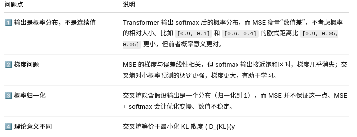

#### 直观例子对比

假设词表有 3 个词，真实标签为：

$$y = [0,1,0]$$

模型预测：

$$\hat{y}_1=[0.33,0.34,0.33], \hat{y}_2=[0.05,0.9,0.05]$$

计算损失：

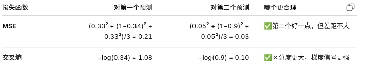

交叉熵在分类精度上能提供更强的信号，MSE 太“温和”。
总结

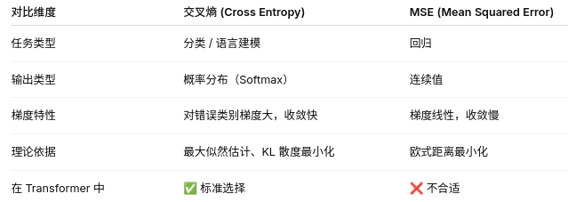