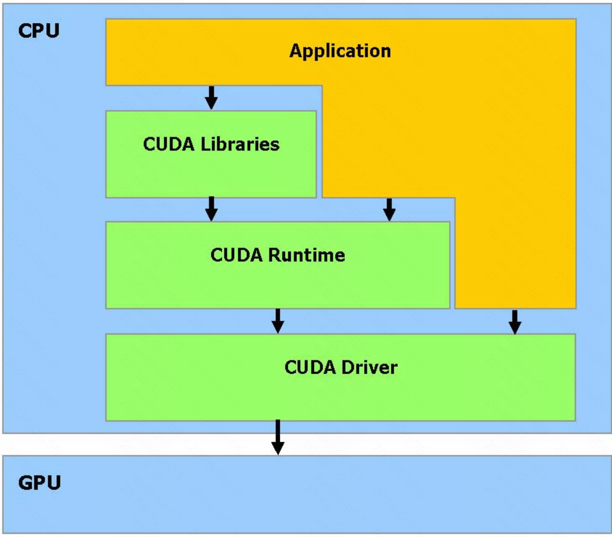
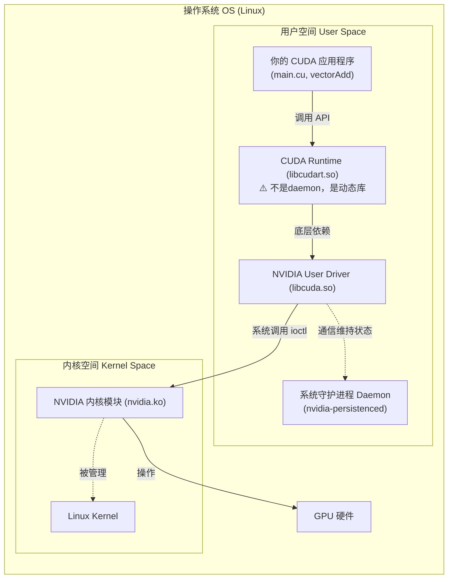
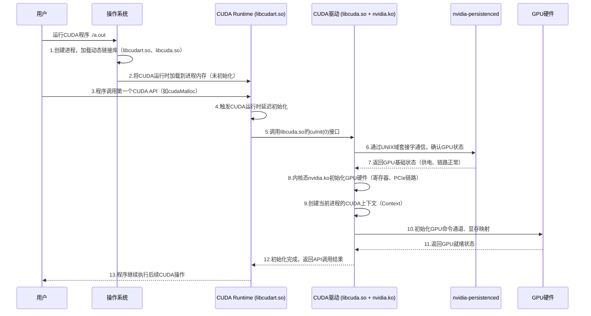

# CUDA软件构成

在GPU并行计算领域，CUDA（Compute Unified Device Architecture）是NVIDIA推出的核心编程模型，它允许开发者利用GPU的大规模并行计算能力加速各类计算密集型任务。CUDA程序的启动初始化是程序运行的基础，而CUDA运行时（CUDA Runtime）则是连接开发者代码与GPU硬件的核心桥梁。



## 一、核心概念

在深入讲解启动初始化和运行时之前，先明确几个高频出现的核心概念，避免理解偏差：

- **CUDA运行时（CUDA Runtime）**：本质是一套动态链接库（如Linux下的libcudart\.so、Windows下的cudart\.dll），封装了底层CUDA驱动API，为开发者提供简洁、易用的高层接口（如cudaMalloc、cudaMemcpy），无需直接操作GPU硬件寄存器，降低编程门槛。

- **CUDA驱动（NVIDIA Driver）**：运行在操作系统内核态（nvidia\.ko模块）和用户态（libcuda\.so）的底层软件，负责直接与GPU硬件通信，管理GPU资源、下发指令，是CUDA运行时的依赖基础。

- **CUDA上下文（CUDA Context）**：GPU上的“执行环境”，类似于CPU编程中的进程上下文，包含GPU内存分配、内核代码、流（Stream）、事件（Event）等所有GPU执行所需的状态信息和资源，是CUDA程序运行的核心载体，实现不同任务的资源隔离。

- **系统守护进程（nvidia\-persistenced）**：系统级用户态守护进程，root权限运行，负责保持 GPU 驱动状态不销毁、避免反复初始化硬件底层链路，降低程序启动时的初始化开销，但不负责进程私有上下文的创建。

- **PTX（Parallel Thread Execution）**：CUDA的中间代码，属于虚拟指令集，与具体GPU硬件型号无关，由nvcc编译器（CUDA Toolkit自带）将CUDA C++源码编译生成，可理解为“GPU的汇编语言”，具备可移植性。

- **SASS（Streaming Multiprocessor Assembly）**：GPU硬件的机器码，与具体GPU架构（如Turing、Ampere）强相关，由CUDA驱动（libcuda.so）将PTX中间代码编译生成，是GPU能够直接执行的指令，包含SM（流式多处理器）的具体操作指令（如寄存器操作、内存访问）。



## 二、CUDA程序启动初始化

CUDA程序的启动初始化并非简单的“运行可执行文件”，而是一个从用户态到内核态、从软件到硬件的多环节协同过程。整个流程可分为5个核心步骤，结合时序图和实例，清晰呈现每一步的具体操作。

## 2\.1 初始化总时序图

以下时序图完整展示了CUDA程序启动初始化的全链路，涵盖操作系统、CUDA运行时、CUDA驱动、守护进程与GPU的交互：



## 2\.2 分步拆解初始化流程（结合实例）

以一个简单的CUDA向量加法程序为例，拆解每一步初始化的具体行为，结合代码片段更易理解。

### 步骤1：操作系统加载程序与动态链接库

当用户在终端运行编译好的CUDA程序（如`\./vectorAdd`）时，操作系统会先创建一个新的进程，然后由动态链接器（ld\-linux\.so）自动查找并加载程序依赖的所有动态库，其中核心是：

- CUDA运行时库（libcudart\.so）：提供高层API，随程序进程启动，进程退出时自动卸载。

- CUDA用户态驱动库（libcuda\.so）：作为CUDA运行时与内核驱动的中间层，提供底层驱动API。

此时，CUDA运行时已被加载到进程内存中，但并未进行任何初始化操作，处于“待命”状态。

### 步骤2：触发CUDA运行时延迟初始化

CUDA运行时采用“延迟初始化”机制——并非程序启动就初始化，而是在程序第一次调用任何CUDA API（如cudaMalloc、cudaStreamCreate）时，才触发完整的初始化流程。这一设计的目的是避免不必要的资源消耗（若程序仅加载但不使用GPU，无需初始化）。

示例代码（触发初始化的关键行）：

```cpp
#include <cuda_runtime.h>
#include <vector>

int main() {
    const int N = 1024;
    size_t bytes = N * sizeof(float);
    std::vector<float> h_A(N);
    float *d_A = nullptr;

    // 第一次调用CUDA API，触发CUDA运行时初始化
    cudaMalloc(&d_A, bytes);  // 关键触发点

    cudaFree(d_A);
    return 0;
}

```

### 步骤3：CUDA运行时与驱动、守护进程通信

CUDA运行时初始化的核心是与CUDA驱动（libcuda\.so）建立连接，并通过驱动与系统守护进程（nvidia\-persistenced）通信：

1. CUDA运行时调用libcuda\.so的`cuInit\(0\)`接口，告知驱动“需要使用GPU资源”。

2. libcuda\.so通过UNIX域套接字与nvidia\-persistenced通信，查询当前GPU的基础状态（如是否供电正常、驱动是否已加载、PCIe链路是否正常）。

3. nvidia\-persistenced返回GPU状态，确保GPU未进入休眠、驱动未被卸载，避免程序重新初始化硬件底层链路（这也是守护进程的核心作用）。

### 步骤4：内核驱动初始化GPU与创建上下文

当驱动确认GPU状态正常后，内核态的nvidia\.ko模块会执行GPU硬件初始化和CUDA上下文创建：

- GPU硬件初始化：初始化GPU寄存器、建立PCIe链路通信、配置GPU时钟和供电，确保GPU处于可执行状态。

- 创建CUDA上下文：为当前进程创建一个私有CUDA上下文，分配进程专属的GPU资源（如显存地址空间、命令队列、寄存器堆），上下文与进程绑定，进程退出时自动销毁。需要注意的是，nvidia\-persistenced仅维持全局GPU基础状态，进程私有上下文必须由驱动在初始化时创建，无法提前预创建。

从CUDA 13\.1开始，CUDA运行时引入了“执行上下文（Execution Context）”抽象，可对应传统的主上下文（Primary Context）或轻量级的绿色上下文（Green Context）。绿色上下文可分区GPU资源（如SM和工作队列），减少不同任务间的资源干扰，无需修改内核代码，仅需修改主机端代码即可使用，适用于低延迟任务场景。

在前文中提到了会使用守护进程防止 GPU 硬件反复被销毁初始化。那么这里提到的初始化又是哪一部分？

这里的初始化其实是两层不同的概念：

* nvidia-persistenced 保证的是：驱动全局硬件状态、GPU 供电 / 时钟、驱动模块不退出

* CUDA 程序里每次初始化 做的是：当前进程私有的 CUDA Context、地址映射、命令队列

一个是全局公共状态，一个是进程私有上下文，完全两层东西

### 步骤5：初始化完成，程序正常执行

GPU初始化和上下文创建完成后，驱动会将“就绪信号”返回给CUDA运行时，运行时再将API调用结果返回给用户程序。此时，程序可以正常调用各类CUDA API，执行内核函数、内存拷贝等操作。

## 2\.3 初始化失败的常见原因

实际开发中，初始化失败是常见问题，主要原因包括：

- 显卡驱动版本过低：CUDA Toolkit与驱动版本不匹配（如CUDA 11\.8需驱动版本≥470）。

- 环境变量配置错误：`CUDA\_VISIBLE\_DEVICES`设置不当，指向不存在或不可用的GPU。

- GPU资源被占用：其他进程占用全部GPU资源，导致新程序无法初始化上下文。

- 权限不足：程序缺少对GPU设备文件（如`/dev/nvidia\*`）的访问权限。

- 硬件兼容性问题：GPU不支持当前CUDA版本的功能（如老款GPU不支持绿色上下文）。

## 三、CUDA运行时

CUDA运行时（libcudart\.so）是CUDA程序开发的核心，它封装了复杂的底层驱动逻辑，为开发者提供简洁的高层API，同时负责管理CUDA上下文、内存、流等核心资源，确保程序高效、稳定地与GPU交互。

## 3\.1 CUDA运行时的核心功能

CUDA运行时的功能可概括为5大类，每类功能对应核心API，结合实例说明其用法：

### 1\. 上下文管理

负责CUDA上下文的创建、绑定、切换和销毁，默认情况下，运行时会自动为进程创建一个主上下文，开发者也可手动管理上下文（适用于多GPU、多线程场景）。

关键API：`cudaSetDevice`（指定使用的GPU设备）、`cudaDeviceReset`（重置当前设备的上下文）、`cudaCtxCreate`（手动创建上下文）。

示例（手动创建上下文）：

```cpp
cudaContext_t ctx;
// 手动创建上下文，绑定到第0块GPU
cudaCtxCreate(&ctx, 0, 0);
// 切换到创建的上下文
cudaCtxSetCurrent(ctx);

// 执行CUDA操作...

// 销毁上下文，释放资源
cudaCtxDestroy(ctx);

```

### 2\. 内存管理

管理GPU内存（设备内存）与CPU内存（主机内存）的分配、释放和数据传输，是CUDA程序的核心操作之一。

关键API：

- `cudaMalloc`：分配GPU设备内存。

- `cudaFree`：释放GPU设备内存。

- `cudaMemcpy`：在主机与设备之间传输数据（同步传输）。

- `cudaMemcpyAsync`：异步传输数据，配合流使用，提升效率。

- `cudaHostAlloc`：分配页锁定内存（Pinned Memory），减少数据传输延迟。

示例（内存分配与数据传输）：

```cpp
const int N = 1 << 20;  // 1048576个元素
size_t bytes = N * sizeof(float);

// 1. 分配主机内存（页锁定内存，提升传输效率）
float *h_A;
cudaHostAlloc(&h_A, bytes, cudaHostAllocDefault);

// 2. 分配设备内存
float *d_A;
cudaMalloc(&d_A, bytes);

// 3. 主机→设备传输数据（同步）
cudaMemcpy(d_A, h_A, bytes, cudaMemcpyHostToDevice);

// 4. 设备→主机传输数据（异步，配合流）
cudaStream_t stream;
cudaStreamCreate(&stream);
cudaMemcpyAsync(h_A, d_A, bytes, cudaMemcpyDeviceToHost, stream);
cudaStreamSynchronize(stream);  // 等待异步传输完成

// 5. 释放内存
cudaFree(d_A);
cudaHostFree(h_A);
cudaStreamDestroy(stream);
```

### 3\. 内核启动与执行控制

负责将CUDA内核函数（GPU上执行的函数）下发到GPU，并配置内核的执行参数（网格、块尺寸等）。内核启动的语法是CUDA编程的核心特性之一。

关键API与语法：

- 内核启动语法：`kernel\&lt;\&lt;\&lt;gridDim, blockDim, sharedMem, stream\&gt;\&gt;\&gt;\(args\);`

- `cudaLaunchKernel`：显式启动内核（适用于动态配置参数场景）。

- `cudaDeviceSynchronize`：等待所有GPU操作完成，实现主机与设备同步。

示例（内核启动，结合2D网格/块配置）：

```cpp
// 核函数：2D向量加法，每个线程处理一个像素/元素
__global__ void vectorAdd2D(const float *A, const float *B, float *C, int width) {
    // 计算全局坐标（结合grid/block/thread维度）
    int x = blockIdx.x * blockDim.x + threadIdx.x;
    int y = blockIdx.y * blockDim.y + threadIdx.y;
    int idx = y * width + x;
    C[idx] = A[idx] + B[idx];
}

int main() {
    const int width = 512, height = 512;
    const int N = width * height;
    size_t bytes = N * sizeof(float);

    // 分配内存、初始化数据...（省略）

    // 配置网格和块尺寸（2D配置，贴合图像数据形状）
    dim3 blockDim(16, 16);  // 每个块16×16个线程
    dim3 gridDim((width + blockDim.x - 1) / blockDim.x, 
                 (height + blockDim.y - 1) / blockDim.y);  // 32×32个块

    // 启动内核（同步启动）
    vectorAdd2D<<<gridDim, blockDim>>>(d_A, d_B, d_C, width);
    cudaDeviceSynchronize();  // 等待内核执行完成

    // 后续操作...
    return 0;
}

```

补充：运行时还支持协同内核启动（`cudaLaunchCooperativeKernel`），允许线程块之间协同同步，适用于需要跨块通信的场景；同时可通过`cudaFuncSetAttribute`设置内核属性，优化执行性能。

### 4\. 流与事件管理

流（Stream）是CUDA运行时用于实现异步执行的核心机制，可将GPU操作（内核执行、数据传输）按顺序放入流中，多个流可并行执行，提升GPU利用率；事件（Event）用于标记流中的特定执行点，实现同步和计时。

关键API：

- `cudaStreamCreate`：创建流。

- `cudaStreamDestroy`：销毁流。

- `cudaEventCreate`：创建事件。

- `cudaEventElapsedTime`：计算两个事件之间的时间差（用于性能测试）。

示例（流与事件的使用，异步执行内核和传输）：

```cpp
cudaStream_t stream1, stream2;
cudaEvent_t start, end;

// 创建流和事件
cudaStreamCreate(&stream1);
cudaStreamCreate(&stream2);
cudaEventCreate(&start);
cudaEventCreate(&end);

// 记录开始事件
cudaEventRecord(start, stream1);

// 异步执行：stream1中执行内核，stream2中执行数据传输，并行进行
vectorAdd2D<<<gridDim, blockDim, 0, stream1>>>(d_A, d_B, d_C, width);
cudaMemcpyAsync(h_C, d_C, bytes, cudaMemcpyDeviceToHost, stream2);

// 等待所有流完成
cudaStreamSynchronize(stream1);
cudaStreamSynchronize(stream2);

// 记录结束事件，计算执行时间
cudaEventRecord(end, stream1);
cudaEventSynchronize(end);
float elapsedTime;
cudaEventElapsedTime(&elapsedTime, start, end);
printf("执行时间：%.2f ms\n", elapsedTime);

// 释放资源
cudaStreamDestroy(stream1);
cudaStreamDestroy(stream2);
cudaEventDestroy(start);
cudaEventDestroy(end);

```

### 5\. 错误处理

提供错误检查机制，帮助开发者定位CUDA API调用和内核执行中的错误，是CUDA程序调试的核心工具。通常通过宏定义封装错误检查逻辑，简化代码。

示例（错误检查宏）：

```cpp
#define CUDA_CHECK(call)                                                     \
do {                                                                 \
    cudaError_t err__ = (call);                                  \
    if (err__ != cudaSuccess) {                                 \
        std::cerr << "CUDA error at " << __FILE__ << ":" \
              << __LINE__ << ": "                    \
              << cudaGetErrorString(err__) << "\n";  \
        std::exit(1);                                       \
    }                                                            \
} while (0)

// 使用示例
CUDA_CHECK(cudaMalloc(&d_A, bytes));
CUDA_CHECK(cudaMemcpy(d_A, h_A, bytes, cudaMemcpyHostToDevice));
CUDA_CHECK(cudaDeviceSynchronize());

```

## 3\.2 CUDA运行时的工作机制（核心逻辑）

CUDA运行时的本质是“中间层封装”，它不直接操作GPU硬件，而是通过调用底层CUDA驱动API（libcuda\.so）实现与GPU的通信，其工作机制可概括为3点：

1. **API封装与转发**：开发者调用的高层API（如cudaMalloc），会被CUDA运行时封装成对应的底层驱动API（如cuMemAlloc），转发给CUDA驱动，由驱动与GPU硬件交互。

2. **上下文管理自动化**：默认情况下，运行时会自动为进程创建、绑定和销毁CUDA上下文，开发者无需手动管理，降低编程门槛；同时支持手动管理，满足复杂场景需求。

3. **资源调度与优化**：运行时会对GPU资源（如显存、线程块）进行调度，例如根据内核配置自动分配SM资源；同时支持CUDA Graphs（静态计算图），将一系列GPU操作打包成图，减少API调用开销，提升重复执行效率。

## 3\.3 CUDA运行时与CUDA驱动的区别

很多开发者会混淆CUDA运行时和CUDA驱动，两者的核心区别的如下表所示：

|对比维度|CUDA运行时（libcudart\.so）|CUDA驱动（libcuda\.so \+ nvidia\.ko）|
|---|---|---|
|所处层级|用户态，高层封装|用户态（libcuda\.so）\+ 内核态（nvidia\.ko），底层实现|
|核心作用|提供简洁API，管理上下文、内存、流，转发API调用|直接与GPU硬件通信，下发指令，管理GPU资源|
|编程难度|低，无需关注底层硬件细节|高，需直接操作硬件寄存器和指令|
|依赖关系|依赖CUDA驱动，无法直接与GPU交互|依赖GPU硬件，是CUDA运行时的基础|
|更新频率|随CUDA Toolkit更新|随NVIDIA显卡驱动更新|

## 四、完整实例

下面给出一个完整的CUDA程序，整合启动初始化、内存管理、内核启动、流与事件、错误处理等所有核心环节，帮助开发者将前面的知识点串联起来，直观理解CUDA运行时的实际应用。

```cpp
#include <cuda_runtime.h>
#include <vector>
#include <iostream>
#include <cstdio>

// 错误检查宏
#define CUDA_CHECK(call)                                                     \
do {                                                                 \
    cudaError_t err__ = (call);                                  \
    if (err__ != cudaSuccess) {                                 \
        std::cerr << "CUDA error at " << __FILE__ << ":" \
              << __LINE__ << ": "                    \
              << cudaGetErrorString(err__) << "\n";  \
        std::exit(1);                                       \
    }                                                            \
} while (0)

// 核函数：2D向量加法（处理512×512图像/矩阵）
__global__ void vectorAdd2D(const float *A, const float *B, float *C, int width) {
    // 计算全局坐标（grid/block/thread多维配合）
    int x = blockIdx.x * blockDim.x + threadIdx.x;
    int y = blockIdx.y * blockDim.y + threadIdx.y;
    // 边界检查：避免线程越界
    if (x < width && y < width) {
        int idx = y * width + x;
        C[idx] = A[idx] + B[idx];
    }
}

int main() {
    // 1. 配置参数（512×512图像，16×16线程块）
    const int width = 512;
    const int N = width * width;
    size_t bytes = N * sizeof(float);

    // 2. 分配主机内存（页锁定内存，提升传输效率）
    float *h_A, *h_B, *h_C;
    CUDA_CHECK(cudaHostAlloc(&h_A, bytes, cudaHostAllocDefault));
    CUDA_CHECK(cudaHostAlloc(&h_B, bytes, cudaHostAllocDefault));
    CUDA_CHECK(cudaHostAlloc(&h_C, bytes, cudaHostAllocDefault));

    // 3. 初始化主机数据
    for (int i = 0; i < N; ++i) {
        h_A[i] = float(i);        // A[i] = i
        h_B[i] = float(2 * i);    // B[i] = 2i
    }

    // 4. 分配设备内存（第一次调用cudaMalloc，触发CUDA运行时初始化）
    float *d_A, *d_B, *d_C;
    CUDA_CHECK(cudaMalloc(&d_A, bytes));
    CUDA_CHECK(cudaMalloc(&d_B, bytes));
    CUDA_CHECK(cudaMalloc(&d_C, bytes));

    // 5. 创建流和事件（异步执行+计时）
    cudaStream_t stream;
    cudaEvent_t start, end;
    CUDA_CHECK(cudaStreamCreate(&stream));
    CUDA_CHECK(cudaEventCreate(&start));
    CUDA_CHECK(cudaEventCreate(&end));

    // 6. 异步传输数据（主机→设备）
    CUDA_CHECK(cudaMemcpyAsync(d_A, h_A, bytes, cudaMemcpyHostToDevice, stream));
    CUDA_CHECK(cudaMemcpyAsync(d_B, h_B, bytes, cudaMemcpyHostToDevice, stream));

    // 7. 配置网格和块尺寸（2D配置，贴合数据形状）
    dim3 blockDim(16, 16);  // 每个块16×16个线程（总256线程，符合上限）
    dim3 gridDim((width + blockDim.x - 1) / blockDim.x, 
                 (width + blockDim.y - 1) / blockDim.y);  // 32×32个块

    // 8. 记录开始事件，异步启动内核
    CUDA_CHECK(cudaEventRecord(start, stream));
    vectorAdd2D<<<gridDim, blockDim, 0, stream>>>(d_A, d_B, d_C, width);

    // 9. 异步传输数据（设备→主机）
    CUDA_CHECK(cudaMemcpyAsync(h_C, d_C, bytes, cudaMemcpyDeviceToHost, stream));

    // 10. 等待流完成，记录结束事件，计算执行时间
    CUDA_CHECK(cudaStreamSynchronize(stream));
    CUDA_CHECK(cudaEventRecord(end, stream));
    CUDA_CHECK(cudaEventSynchronize(end));
    float elapsedTime;
    CUDA_CHECK(cudaEventElapsedTime(&elapsedTime, start, end));

    // 11. 验证结果（打印前2个元素，确认计算正确）
    std::printf("执行时间：%.2f ms\n", elapsedTime);
    std::printf("C[0] = %.1f (预期0.0), C[1] = %.1f (预期3.0)\n", h_C[0], h_C[1]);

    // 12. 释放所有资源
    CUDA_CHECK(cudaFree(d_A));
    CUDA_CHECK(cudaFree(d_B));
    CUDA_CHECK(cudaFree(d_C));
    CUDA_CHECK(cudaHostFree(h_A));
    CUDA_CHECK(cudaHostFree(h_B));
    CUDA_CHECK(cudaHostFree(h_C));
    CUDA_CHECK(cudaStreamDestroy(stream));
    CUDA_CHECK(cudaEventDestroy(start));
    CUDA_CHECK(cudaEventDestroy(end));

    return 0;
}

```

## CPP→PTX→SASS编译

这是衔接CUDA源码与GPU执行的核心环节，也是解答“提前编译还是运行时边跑边编”的关键，全程由CUDA驱动（libcuda.so）执行，且遵循延迟触发、按需编译的机制：

1. 第一步 cpp→ptx，离线提前编译：程序开发/编译阶段，开发者通过CUDA Toolkit自带的nvcc编译器，对包含内核函数的 CUDA C++ 源码（.cu或.cpp文件）进行编译。nvcc会将内核源码转化为PTX中间代码——这是一种与具体GPU硬件架构无关的虚拟指令集，可理解为“GPU通用汇编语言”，具备良好的可移植性。编译完成后，PTX代码会被嵌入到最终的可执行文件中，或打包为独立的.ptx文件，随程序一起分发，全程离线完成，无需等到程序运行时再处理。

2. 第二步 ptx→sass，运行时JIT编译：程序运行后，当第一次启动内核、或首次加载对应PTX代码时，CUDA驱动（libcuda.so）会触发即时编译（JIT）。驱动会先从进程内存中读取已加载的PTX中间代码，再根据当前GPU的具体硬件架构（如Ampere架构的RTX 30系列、Ada Lovelace架构的RTX 40系列），将PTX代码编译为该GPU专属的SASS机器码——SASS是GPU硬件能直接识别和执行的指令，包含流式多处理器（SM）的寄存器操作、内存访问、运算指令等，与硬件强相关，不同架构GPU的SASS指令无法通用。

3. 第三步 SASS加载、绑定与缓存：驱动将编译好的SASS机器码加载到当前进程的CUDA上下文中，与GPU的SM进行绑定，确保后续内核启动时，SM能直接读取并执行SASS指令，无需再次编译。同时，CUDA驱动会将编译后的SASS机器码缓存到系统中（如Linux下的/var/cache/nvidia/GPU-xxx目录），后续重复启动该内核、或重启程序时，驱动会直接复用缓存中的SASS代码，避免重复进行JIT编译，减少程序启动和内核执行的延迟。

核心结论：

✅ CUDA C++→PTX：提前离线编译，编译好的PTX随程序打包；
✅ PTX→SASS：运行时延迟JIT编译，第一次用才触发、边跑边编，且只编译一次、后续复用。

补充说明：若开发者希望提前编译PTX→SASS（避免运行时JIT延迟），也可通过nvcc的--gpu-architecture（缩写-arch）参数，指定目标GPU架构，提前将PTX编译为对应架构的SASS机器码，嵌入可执行文件中。这种方式的弊端是失去可移植性，编译后的程序只能在指定架构的GPU上运行；而默认的JIT编译方式，虽首次启动有轻微延迟，但能保证程序在所有支持该CUDA版本的GPU上正常运行，灵活性更高。

1. 驱动从进程内存中读取已加载的PTX中间代码（该代码由nvcc编译器在程序编译阶段，将CUDA C++内核源码（cpp）编译生成，与具体GPU无关）。

2. 驱动根据当前GPU的硬件架构（如Ampere架构的RTX 30系列、Ada Lovelace架构的RTX 40系列），将PTX中间代码编译为对应的SASS机器码（与硬件强相关，不同GPU架构的SASS指令不同）。

3. 驱动将编译生成的SASS机器码加载到CUDA上下文中，与GPU的SM（流式多处理器）绑定，确保后续内核启动时，SM能直接读取并执行SASS指令。
