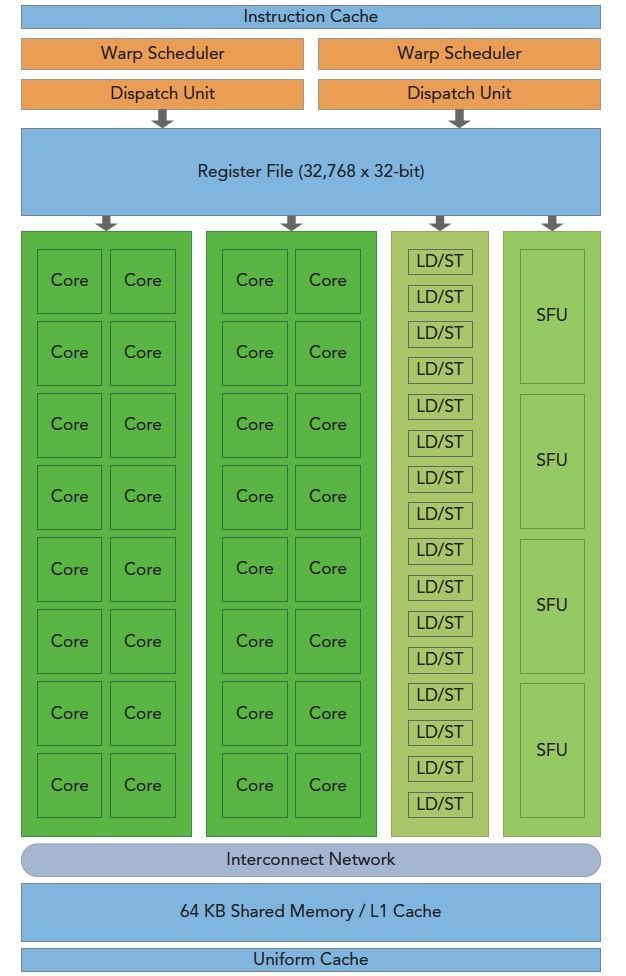
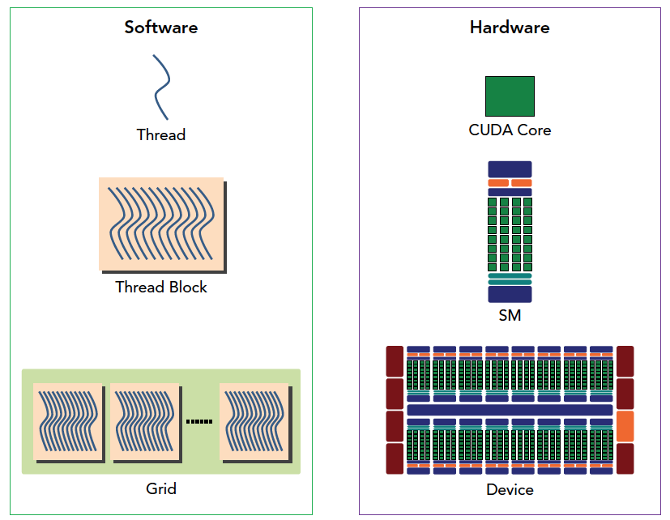
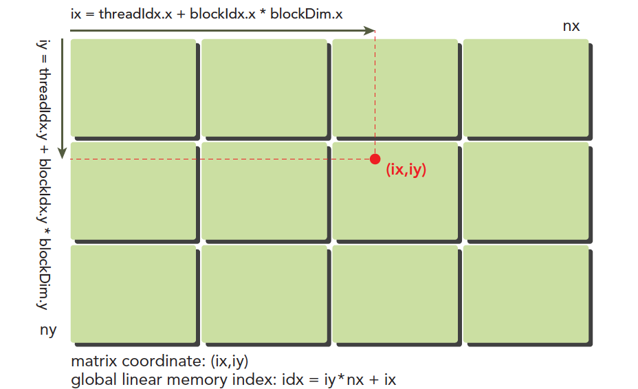
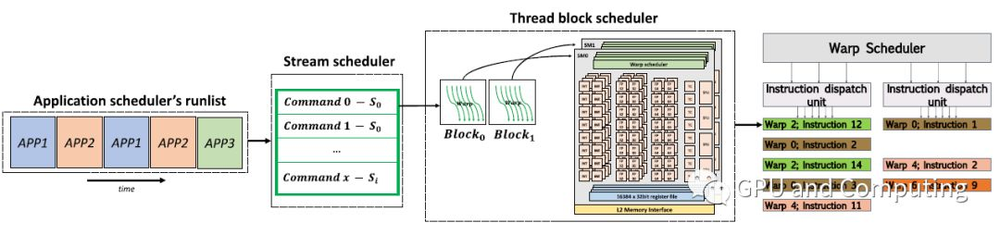

# GPU体系结构

## SIMD（单指令多数据）/ SIMT（单指令多线程）

### SIMD

定义：一条指令驱动 N 条 lane，对 N 份数据 做同样的操作。

在 GPU 上对应了：

```txt
warp = 32 threads
↓
同一条指令
↓
32 个 lane 并行执行
```

### SMIT

**定义**：

你写的是：

  ```c
  if (tid < 16) A();
  else B();
  ```

每个 thread有自己的：PC（逻辑）、register、控制流

### GPU的定位

GPU 的实际硬件属于 SIMD ，而编程模型为了简化开发屏蔽了底层细节则是 SMIT。

## GPU 的硬件结构

它展示的是现代NVIDIA GPU中一个流多处理器（Streaming Multiprocessor, SM）的核心架构。



### 上层：指令获取与调度（Control Logic）

**Instruction Cache（指令缓存）**：存储着即将要执行的指令。因为很多线程会执行相同的指令，所以这里缓存起来可以高效复用，减少访问显存的延迟。

Warp Scheduler（线程束调度器） & Dispatch Unit（分发单元）：

* Warp（线程束） 是GPU执行的基本单位，在NVIDIA GPU中，1个Warp通常包含32个线程。这些线程执行的是同一条指令（Single Instruction, Multiple Threads - SIMT）。
* SM通常有多个（图中是2个）Warp调度器。这意味着一个SM可以同时管理和调度多个不同的Warp。
* 每个调度器每个时钟周期可以从多个就绪的Warp中选出一个，并通过其分发单元，将指令分发给下层的执行单元去执行。
* 多个调度器的设计是实现高性能并行计算的关键，它允许当一个Warp在等待数据（如从显存加载）时，调度器可以立刻切换到另一个就绪的Warp去执行计算，从而隐藏延迟，保持计算核心始终繁忙（极高的吞吐量）。

### 中层：执行核心与功能单元（Execution Units）

* Register File（寄存器文件）：这是SM内部非常大的一块超高速内存。每个线程都有自己独享的寄存器，用于存储局部变量和中间计算结果。图中 (32,768 x 32-bit) 表示这个SM拥有32768个32位的寄存器。
* Core（核心）：图中绿色格子，通常指的是CUDA Core（或简称Streaming Processor, SP）。它是执行基本整数（INT）和单精度浮点（FP）运算的主力单元，例如基本的数学运算 a + b = c。
* LD/ST（加载/存储单元）：负责处理数据的搬运，即从显存（Global Memory）或共享内存（Shared Memory）中加载（Load）数据到寄存器，或者将寄存器中的数据存储（Store） 回去。
* SFU（特殊功能单元）：用于执行一些更复杂、计算周期更长的操作，例如超越函数（如sin, cos, log, exp等）、插值运算和双精度浮点计算。

### 底层：数据存储与交换（Memory and Interconnect）

这是SM的“仓库”和“高速公路”，负责存储和交换数据。

* Interconnect Network（互连网络）：这是一张高速交换网络，连接着上方的所有执行单元（Core, LD/ST, SFU）和底部的缓存/内存。所有对数据的访问请求都通过这个网络来路由。
* 64 KB Shared Memory / L1 Cache（共享内存 / L1缓存）：
* 这是SM内部的一块关键的可编程高速缓存。
* 它可以被配置为一部分是L1缓存（由硬件自动管理），另一部分是Shared Memory（由程序员显式控制），或者全部作为其中一种。
* Shared Memory 的特点是：SM内部的所有线程都可以共享访问这片内存，速度极快。是实现线程间通信、优化内存访问模式（如减少对显存的重复访问）的重要手段。
* Uniform Cache（统一缓存）：用于缓存一些所有线程都需要一致访问的只读数据，例如常量内存（Constant Memory）。

### 工作流程

1. 指令准备：Instruction Cache 准备好指令。
2. 调度分配：Warp Scheduler 选择就绪的Warp，Dispatch Unit 将指令分发给不同的执行单元（Core, LD/ST, SFU）。
3. 数据准备：执行单元需要数据时，通过 Interconnect Network 向 Register File（自己的寄存器）、Shared Memory/L1 Cache（共享数据）或通过它们向更远的显存索取数据。
4. 执行计算：Cores 执行基础计算，SFUs 执行复杂计算，LD/ST Units 负责搬运数据。
5.写入结果：计算结果写回寄存器或通过LD/ST单元写回共享内存/显存。

## GPU体系结构与CUDA框架

```txt

应用程序层级
    ↓
Grid（整个kernel网格）
    ↓
Block（线程块）← 线程级并行在这里
    ↓
Warp（线程束，32线程）← SIMT并行单元
    ↓
Lane（单个线程）← 不独立执行
```



### Grid

Grid 不对应 GPU 硬件中的某一级，它是一个软件/编程模型中的概念，用于组织线程的层次结构。多个 Grid 可以执行不同的 kernel。

每一个 Grid 都可以视作是一个 kernel 的实例，就像进程是代码的实例。

#### 不同Grid的执行模式

模式1：默认串行执行

```c
// 默认：Grid 2等待Grid 1完成
kernel1<<<grid1, block1>>>(...);  // Grid 1开始
cudaDeviceSynchronize();           // 等待Grid 1完成
kernel2<<<grid2, block2>>>(...);  // Grid 2开始
```

模式2：使用流（Stream）并行执行

```c
cudaStream_t stream1, stream2;
cudaStreamCreate(&stream1);
cudaStreamCreate(&stream2);

// 两个Grid可以同时执行！
kernel1<<<grid1, block1, 0, stream1>>>(...);  // Grid 1
kernel2<<<grid2, block2, 0, stream2>>>(...);  // Grid 2

// 硬件调度器会尽量并行执行它们
```

GPU硬件资源：

```txt
┌─────────────────────────────────────┐
│            GPU 设备                 │
├─────────────────────────────────────┤
│ 多个SM（流多处理器）                |
│  ┌─────┐ ┌─────┐ ┌─────┐ ┌─────┐    │
│  │ SM1 │ │ SM2 │ │ SM3 │ │ SM4 │    │
│  └─────┘ └─────┘ └─────┘ └─────┘    │
│                                     │
│  Grid 1的Block: ■ ■ ■ ■         │
│  Grid 2的Block: □ □ □ □         │
│                                     │
│  Grid 1占用SM1, SM2                 │
│  Grid 2占用SM3, SM4                 │
└─────────────────────────────────────┘
```

#### 实际编程示例

```c
// 复杂应用：多个不同功能的Grid
void processImage(Image& img) {
    cudaStream_t streams[3];
    for (int i = 0; i < 3; i++) cudaStreamCreate(&streams[i]);

    // 并行执行三个处理阶段
    // Grid 1: 预处理（去噪）
    denoiseKernel<<>>(img.data);
    
    // Grid 2: 特征提取
    extractFeaturesKernel<<>>(img.data);
    
    // Grid 3: 颜色校正
    colorCorrectKernel<<>>(img.data);
    
    // 等待所有Grid完成
    for (int i = 0; i < 3; i++) cudaStreamSynchronize(streams[i]);
}
```

#### 多 Grid 的优劣

|好处|挑战|
|---|---|
|真正的任务级并行|资源竞争可能降低性能|
|可执行完全不同的算法|需要显式同步|
|灵活的资源配置|调度开销|
|可流水线执行|内存访问冲突|

#### 总结

1. Grid = Kernel实例：每个kernel启动创建一个Grid
2. 完全不同的代码：不同Grid执行完全不同的kernel函数
3. 独立配置：每个Grid可以有独立的grid/block维度、动态共享内存
4. 执行独立性：
   * 默认串行执行
   * 可用流实现并行执行
5. 通信方式：通过全局内存和事件
6. 调度层级：GPU调度器在Grid间分配SM资源
7. 最高级并行：Grid级并行是GPU上最高级别的并行粒度

### block

一个CUDA框架中的 Thread Block 对应一个 GPU 的 SM，但是同一个 SM 上可以有多个 Thread block 交替执行。

block 属于线程级别的并行，即不同的 block 虽然会使用同样的代码但是会执行不同的指令。

```c
__global__ void myKernel(float* data) {
    int blockId = blockIdx.x;
    int threadId = threadIdx.x;
    int globalId = blockId * blockDim.x + threadId;
    
    // 不同block可以执行不同的代码路径
    if (blockId % 2 == 0) {  // 这个判断在不同block间是独立的
        // 偶数block执行这里
        data[globalId] = sin(data[globalId]);
    } else {
        // 奇数block执行这里
        data[globalId] = cos(data[globalId]);
    }
}
```

这里我们可以将一个网格中的 Thread Block 在逻辑上划分为多个维度。



### Thread

每一个块上又有多个线程，一个线程对应一个core结构，这里我们也可以将同一个 Thread Block 在逻辑上划分为多个维度。

一个 Block 上的所有 Thread 都执行着同样的命令。

如果一个threadblock上的线程多于32，那么就会分组交替的执行，但是这里最好为32的整数倍，如果不是32的整数倍可能会导致一部分核心是空转的，导致性能的下降。

这里的维度划分主要取决于训练中给出的数据的维度，是 $N*N$ 还是 $N*N*N$ 。

## GPU 调度层级



### 应用调度器运行列表（Application scheduler's runlist）

这一层的调度由 CPU 的操作系统管理，主要负责决定哪个应用可以向 GPU 提交工作。

这里的调度对象是 进程/CUDA 的上下文。

GPU 不直接感知 Linux 进程，GPU 只看到「被 driver 提交的 command stream」

### 第二层：流调度器（Stream scheduler）

这一层的调度属于 GPU 设备级，调度对象为 CUDA Stream。那这里的 CUDA Stream 指什么？

CUDA Stream 是 GPU 上的「命令队列（Command Queue）他不等于线程也不对应任何硬件单元，它指的是是“命令的顺序容器”。

CUDA Stream 是一组在 GPU 上按提交顺序执行的操作序列。

这些操作包括：kernel launch、cudaMemcpyAsync、cudaMemsetAsync、cudaEventRecord、cudaEventWait

换成硬件视角的定义

Stream = GPU Driver 维护的一条 command buffer

例如你往一个 stream 里塞的是：

```c
cudaStream_t s0, s1;

kernelA<<<... , s0>>>();
kernelB<<<... , s1>>>();
kernelC<<<... , s0>>>();
```

GPU driver 会看到：

```txt
Stream s0: A → C
Stream s1: B
```

这里可以保证一组操作被化为一个 stream 内后的顺序语义。即必须 A 先执行，C 再执行。不管 GPU 多忙，这个顺序不可破坏

这一层调度决定的是：一个 kernel「什么时候具备被执行的资格」。

该层的调度保证了：

* 同一 stream：严格顺序
* 不同 stream：尽量并行

不同 stream 之间：没有顺序约束，GPU 可以同时跑多个 kernel，同时 memcpy + kernel。

### 第三层：Thread Block Scheduler

这一层决定了哪个 SM 执行哪个 Block。

```txt
┌─────────────────────────────────────────────┐
│           全局调度器（GigaThread引擎）      │
├─────────────────────────────────────────────┤
│ 全局工作队列（GigaThread）                  │
│  [K1-Blocks]  [K2-Blocks]  [K3-Blocks]      │
│                                             │
│ 调度策略：                                  │
│ 1. 优先级调度（如果有）                     │
│ 2. Round-Robin（默认）                      │
│ 3. 考虑亲和性                               │
└─────────────────┬───────────────────────────┘
                  ↓
          按SM资源情况分发
                  ↓
┌─────────────────────────────────────────────┐
│         SM本地调度（每个SM独立）            │
├─────────────────────────────────────────────┤
│ SM本地工作队列：                            │
│  [已分配的Blocks]                           │
│                                             │
│ 实际执行顺序由SM调度器决定，考虑：          │
│ 1. Warp就绪状态                             │
│ 2. 资源局部性                               │
│ 3. 依赖关系                                 │
└─────────────────────────────────────────────┘
```

这里的调度分为两个层级，一个本地队列，一个是全局队列。

在调度时会优先本地队列中的任务进行调度，这样可以提高资源利用率。

但当 sm 间存在任务不均衡时则会由 GigaThread Engine 这一 GPU 上负责任务调度的硬件进行负载均衡。

它会从超载的 SM 中窃取任务调度上空闲的 SM 上去执行。

```txt
全局队列（GigaThread）：
[K1-B0][K1-B1][K1-B2][K1-B3][K2-B0][K2-B1][K2-B2]

SM本地队列（每个SM有多个队列）：
SM0: [K1-B0][K1-B1][K1-B2]  ← 亲和性：继续同kernel
SM1: [K2-B0][K2-B1]         ← 另一个kernel

调度决策：
if (SM有同kernel的block正在执行) {
    // 优先分发同kernel的block
    分配相同kernel的block;
} else if (SM资源充足) {
    // 尝试新kernel
    分配不同kernel的block;
} else {
    // 等待或负载均衡
    考虑其他SM;
}
```

sm本地的调度：

```txt
一个SM的调度视图：
┌─────────────────────────────────────────────┐
│                SM（流多处理器）             │
├─────────────────────────────────────────────┤
│ Warp调度器（例如4个）                       │
│  ┌─────┐ ┌─────┐ ┌─────┐ ┌─────┐            │
│  │ WS0 │ │ WS1 │ │ WS2 │ │ WS3 │            │
│  └─────┘ └─────┘ └─────┘ └─────┘            │
│                                             │
│ 可用资源池：                                │
│  • 线程槽位：2048个                         │
│  • 寄存器：64K/128K                         │
│  • 共享内存：96KB/128KB                     │
│  • Block槽位：16-32个                       │
├─────────────────────────────────────────────┤
│ 硬件工作队列（来自Grid的所有blocks）        │
│  [block0][block1][block2]...[blockN]        │
└─────────────────────────────────────────────┘
```

调度过程：

1. 所有1024个blocks进入全局工作队列
2. 每个空闲的SM从队列中取blocks
3. SM检查自己是否有足够资源执行该block
4. 如果有，加载block到SM
5. 如果没有，等待或跳过

调度状态机：

```txt
Block生命周期：
未调度 → 就绪 → 执行中 → 完成
      ↑       ↓
      资源等待
      
SM中的block状态：
┌──────────┐        ┌──────────┐        ┌──────────┐
│  等待    │→资源→│  活跃    │→完成→│  完成    │
│ (Queued) │ 可用   │(Active)  │        │ (Done)   │
└──────────┘        └──────────┘        └──────────┘
                     │
                     ↓
                ┌──────────┐
                │ 挂起     │
                │(Stalled) │← 等待内存/同步
                └──────────┘
```

### 第四层：SM 内部调度（Warp Scheduler）

1.硬件基础：SM 与 Warp Scheduler​​

GPU 的计算核心由多个 ​​SM（Streaming Multiprocessor，流多处理器）​​ 组成。每个 SM 内部不仅包含大量计算单元（CUDA Cores），更关键的是集成了多个 ​​Warp Scheduler​​（或称调度器）。每个调度器在每个时钟周期都可以独立地从一个准备好的 Warp 中取指并分派到计算单元执行。

2.线程束（Warp）的概念​​

为了高效管理海量线程，GPU 将线程分成组来执行。一个 ​​Warp​​ 是包含 32 个线程的基本执行和调度单元。这 32 个线程采用 ​​SIMT（单指令多线程）​​ 方式运行，即所有线程同步执行同一条指令，但操作的数据可以不同。

3.“等待”与“切换”如何隐藏延迟​

当 Warp Scheduler 发现当前正在执行的 Warp 需要等待一个耗时的操作（最典型的就是从全局显存中读取数据），它不会让计算核心干等着。调度器会立刻​​挂起（Stall）​​ 这个 Warp，然后​​瞬间切换到另一个已经准备好所有运算数据、处于就绪状态的 Warp​​ 上去执行计算指令。

4.实现高吞吐量​​

通过这种方式，​​计算核心（CUDA Cores）总是在执行计算工作​​，而不是空转等待数据。由于 SM 中有多个 Warp Scheduler 并且维护着大量 Warp，通常会有足够多的就绪 Warp 来填补等待时间。只要需要执行的 Warp 数量足够多（GPU 喜欢处理大规模并行任务），就可以让计算资源的利用率接近 100%，从而在宏观上实现极高的吞吐量。

**为什么是两个甚至更多的warp？**

用一个调度器无法充分利用SM内所有的计算单元，会造成硬件资源的巨大浪费。双调度器（甚至四调度器）的设计是为了实现更高程度的指令级并行（ILP）这里的计算、取指令、数据加载/存储以及其他操作是高度并行的。​
1.指令获取与执行的并行

两个 Warp Scheduler (线程束调度器)​​ 和 ​​Dispatch Unit (分发单元)​​：这是并行的​​控制核心​​。每个调度器在每个时钟周期可以独立地从就绪的Warp中选择一个，并将其指令分发给下方的执行单元。

关键点​​：当一个调度器在分发一条计算指令时，另一个调度器可以同时分发一条内存访问指令。​​指令的调度和分发本身就是并行的。​

2.计算与数据搬运的并行

绿色 Core 阵列 (计算核心)​​：用于执行整数和浮点运算（如加减乘除）。

浅绿色 LD/ST (加载/存储单元)​​：专门负责将数据从寄存器与缓存/内存之间进行搬运。

​​关键点​​：这是最典型的并行场景。​​一组Core正在执行计算的同时，LD/ST单元可以同时在为下一次计算加载数据，或者将上一次的计算结果存回内存。​​ 计算和数据的I/O操作完全重叠，从而隐藏了内存访问的巨大延迟。

3.不同功能计算的并行

​​绿色 Core 阵列​​：处理常规计算。

浅绿色 SFU (特殊功能单元)​​：专门处理一些复杂、耗时的计算，如平方根、三角函数(sin, cos)、指数函数等。

​​关键点​​：​​常规计算和特殊函数计算可以同时进行​​。例如，Core可以在进行矩阵乘法的同时，SFU在计算激活函数（如tanh）。

4.内存系统的并行

​​关键点​​：​​多个执行单元发出的内存访问请求可以通过互连网络并行处理​​，从而支持了上述所有操作的并行进行。

即：

```txt
Scheduler 0 → warp A → FP32
Scheduler 1 → warp B → LD/ST
Scheduler 2 → warp C → Tensor
Scheduler 3 → warp D → INT
```

同一个周期发射多条指令（来自不同 warp）

### 第五层：Instruction Dispatch

这一层主要从 warp 的 PC 取指，发射到：ALU、Tensor Core、LD/ST 单元、SFU 等部件。

在这由 scheduler 决定做 “选谁、发什么”，而 issue / dispatch 则决定做“怎么送、送到哪”。

Issue / Dispatch 用于检查：scoreboard（依赖）、pipeline 可用性

决定：发到 FP / INT / Tensor / LDST

物理发射：drive 执行单元端口

## 分支发散

### 硬件执行机制

在GPU的SIMT架构中，线程束是​​基本的执行单元​​。每个线程束中的32个线程（对于NVIDIA架构）在​​同一时钟周期​​内执行相同的指令。当遇到条件分支时，线程束中的所有线程实际上会​​依次执行所有分支路径​​，但在执行每个路径时，只有满足该路径条件的线程处于活动状态，不满足条件的线程会被临时​​禁用​​（inactive）。

具体来说，分支处理的硬件机制如下：

1. 线程束遇到条件分支时，​​评估所有线程的条件值​​
2. 如果所有线程的条件值相同（全真或全假），则整个线程束执行​​同一路径​​
3. 如果线程间条件值不同，则GPU必须​​序列化执行​​所有分支路径：
   * 首先执行条件为真的线程，条件为假的线程被禁用
   * 然后执行条件为假的线程，条件为真的线程被禁用
4. 每个分支路径执行完毕后，​​线程状态恢复​​，继续执行后续共同指令

这种序列化执行机制导致原本可以并行执行的操作变成了部分串行操作，显著降低了指令吞吐量。更重要的是，即使被禁用的线程不执行实际操作，它们仍然​​占用处理器资源​​并消耗指令周期。

分支发散导致的性能下降主要来自以下几个方面：

1. ​指令吞吐量损失​​：序列化执行分支路径意味着需要执行更多指令来完成相同工作。对于有两个分支的简单if-else语句，实际执行的指令数可能是没有分支发散时的​​两倍​​
2. ​资源利用率低下​​：当线程被禁用时，它们仍然占用​​寄存器文件​​和​​线程槽位​​，但这些资源在此期间并未贡献有效计算。这导致GPU的计算资源得不到充分利用
3. ​内存访问效率降低​​：分支发散经常导致​​内存访问模式​​变得不规则和不连续，从而降低内存带宽利用率。分散的内存访问模式难以合并，导致内存事务数量增加和带宽利用率下降
4. ​​同步开销增加​​：在执行不同分支路径时，线程束需要在线程掩码之间进行切换，这引入了额外的​​同步开销​​。虽然这种开销在单个线程束级别很小，但在大规模并行计算中累积起来会影响整体性能

### 代码示例

```c
// CUDA内核函数 - 有严重分支发散
__global__ void divergentKernel(float* data, int* flags, int n) {
    int idx = blockIdx.x * blockDim.x + threadIdx.x;
    
    if (idx < n) {
        // 分支发散：相邻线程可能执行不同路径
        if (flags[idx] % 2 == 0) {
            // 偶数标志：执行复杂计算
            for (int i = 0; i < 100; i++) {
                data[idx] = sin(data[idx]) * cos(data[idx]);
            }
        } else {
            // 奇数标志：执行简单计算
            data[idx] = data[idx] * 2.0f;
        }
    }
}
```

因为 GPU 属于细粒度数据级并行。这说明所有线程在同一个warp中必须执行相同的指令。

假设有32个线程（tid = 0-31）：

```txt
线程号: 0  1  2  3  4  5  6  7  ... 30 31
条件:   ✓  ✗  ✓  ✗  ✓  ✗  ✓  ✗  ... ✓  ✗
      真 假 真 假 真 假 真 假  ... 真 假
```

1. 步骤1：所有32个线程都检查条件 if (tid % 2 == 0)
2. 步骤2：GPU发现warp内线程不统一
   * 偶数线程（0,2,4,...）：条件为真
   * 奇数线程（1,3,5,...）：条件为假
3. 步骤3：GPU必须序列化执行：

   a. 先激活"真"路径的线程（偶数线程），执行 data[tid] *= 2，奇数线程在这个阶段被禁用，什么都不做

   b. 再激活"假"路径的线程（奇数线程），执行 data[tid] += 1，偶数线程在这个阶段被禁用

### 分支发散的量化和测量

分支发散的程度可以通过​​分支效率​​（Branch Efficiency）指标来量化。分支效率的定义如下：

其中，"branches"表示总分支指令数，"Divergent branches"表示发散分支指令数。

在实际编程中，可以使用性能分析工具（如NVIDIA的nvprof或Nsight Compute）来测量分支效率。例如，在前述的奇偶分支示例中，理论分支效率为50%，但由于编译器的优化（如使用谓词执行或指令重排），实际测量值可能达到85%甚至更高。
