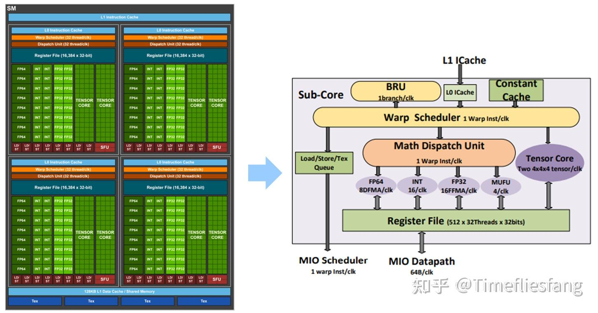

# Tensor Core

如图，一个SM中有4个Sub-core，而每个Sub-core里面除了执行标量运算的多个CUDA Core以外，还有两个Tensor Core。

Tensor Core是专用矩阵乘法单元，专门用于加速深度学习中的矩阵运算。每个Tensor Core可以在一个时钟周期内完成 16×16×16 的矩阵乘法累加操作，性能远超CUDA Core。



在每个时钟周期，Sub-core中的Warp Scheduler会选择一个就绪的Warp，将其指令发射到执行单元。此时：
CUDA Core和Tensor Core都执行这个Warp的指令

Register File为这个Warp提供数据

其他Warp处于等待状态

这种设计实现了时分复用：虽然Sub-core中有多个执行单元，但每个时钟周期只能服务一个Warp。通过快速切换不同的Warp，可以隐藏内存访问延迟，提高硬件利用率。

假设有多个Warp等待执行：

1. Warp Scheduler选择Warp 0
2. 如果Warp 0的指令是矩阵乘法，Tensor Core执行；如果是标量运算，CUDA Core执行
3. 如果Warp 0需要等待数据（如从全局内存加载），Warp Scheduler立即切换到Warp 1
4. 当Warp 0的数据就绪后，再次被调度执行

Tensor Core实现高性能矩阵乘法的核心机制是通过**专用硬件电路**和**混合精度计算**，在单个时钟周期内完成16×16×16的矩阵乘法累加操作。

## 专用硬件架构

Tensor Core采用**脉动阵列（Systolic Array）**架构，这是一种专门为矩阵乘法设计的并行计算结构：

### 1. 脉动阵列工作原理

- **数据流设计**：矩阵A的行和矩阵B的列以流水线方式流入阵列
- **局部计算单元**：阵列中的每个处理单元（PE）执行一次乘累加操作
- **数据重用**：每个数据元素被多个PE复用，减少内存访问

```text
示例：4×4脉动阵列
A矩阵的行从左向右流动
B矩阵的列从上向下流动
每个PE计算：C[i,j] += A[i,k] * B[k,j]
```

### 2. 16×16×16的实现

- **计算单元规模**：包含256个专用PE（16×16）
- **流水线深度**：16级流水线，对应K维度
- **单周期吞吐**：每个时钟周期完成16×16×16=4096次乘累加操作

## 混合精度计算

Tensor Core采用**FP16/FP16输入，FP32累加**的混合精度模式：

### 1. 计算流程

```text
输入：A(FP16), B(FP16)
乘法：A × B → FP16中间结果
累加：Σ(A×B) → FP32累加器
输出：C(FP32)
```

### 2. 精度优势
- **输入精度**：FP16减少50%内存带宽和存储需求
- **累加精度**：FP32避免累加过程中的精度损失
- **数值稳定性**：适合深度学习训练，梯度更新更稳定

## 性能对比CUDA Core

### 1. 计算密度对比

```text
Tensor Core（FP16）：
- 单周期：16×16×16 = 4096次乘累加
- 等效：4096 FLOPS/周期

CUDA Core（FP32）：
- 单周期：1次乘累加
- 等效：2 FLOPS/周期（乘+加）

性能比：4096 ÷ 2 = 2048倍
```

### 2. 实际性能提升

- **理论峰值**：Volta架构中，Tensor Core提供125 TFLOPS，CUDA Core提供15 TFLOPS，提升约8倍
- **实际应用**：在矩阵乘法密集型任务中，可达到10-50倍加速

## 硬件实现细节

### 1. 数据路径优化

- **专用数据总线**：独立于CUDA Core的数据通路
- **寄存器文件共享**：与CUDA Core共享寄存器，减少硬件开销
- **缓存层次**：专用L1缓存，优化矩阵块访问

### 2. 指令流水线

```text
时钟周期0：加载A、B矩阵块到寄存器
时钟周期1-16：脉动阵列计算
时钟周期17：写回结果到累加器
```

### 3. 内存访问模式

- **合并访问**：16×16矩阵块以连续地址访问
- **数据重用**：A、B矩阵块在阵列中多次复用
- **预取机制**：提前加载下一个矩阵块

## 软件接口

### 1. 指令集扩展

- **WMMA API**：Warp Matrix Multiply Accumulate
- **PTX指令**：wmma.mma.sync
- **CUDA C++ API**：nvcuda::wmma

### 2. 编程模型

```cpp
// 使用WMMA API的示例
using namespace nvcuda::wmma;

fragment<matrix_a, 16, 16, 16, half, row_major> a_frag;
fragment<matrix_b, 16, 16, 16, half, col_major> b_frag;
fragment<accumulator, 16, 16, 16, float> c_frag;

// 加载矩阵块
load_matrix_sync(a_frag, a_ptr, lda);
load_matrix_sync(b_frag, b_ptr, ldb);

// 矩阵乘法累加
mma_sync(c_frag, a_frag, b_frag, c_frag);

// 存储结果
store_matrix_sync(c_ptr, c_frag, ldc, mem_row_major);
```

## 总结

Tensor Core通过**专用脉动阵列硬件**、**混合精度计算**和**深度流水线**，在单个时钟周期内完成16×16×16的矩阵乘法累加，相比CUDA Core实现了数量级的性能提升。这种设计专门针对深度学习中的矩阵运算密集型任务，是现代GPU架构的核心创新之一。