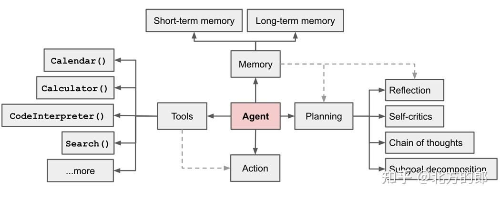
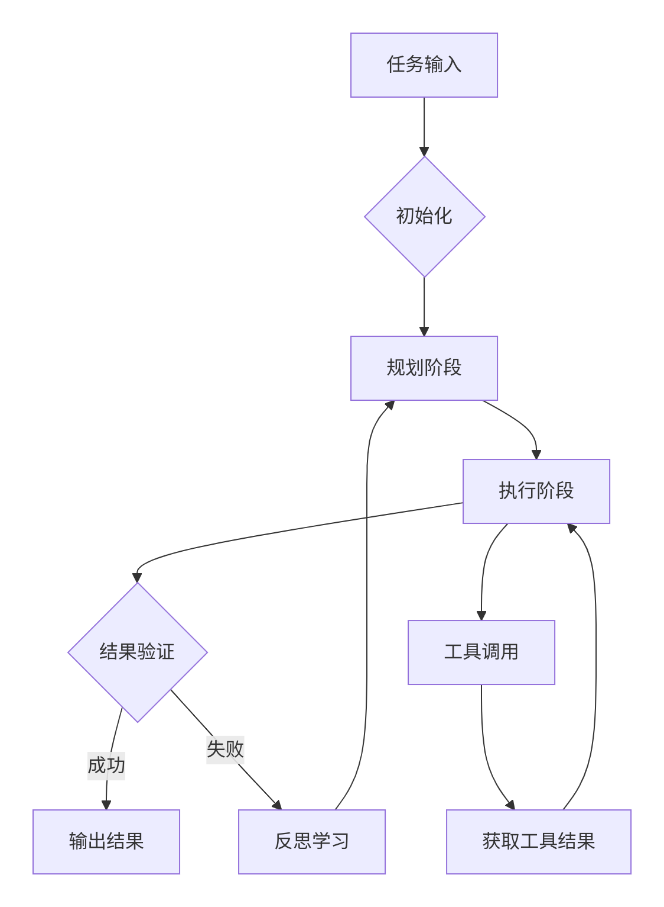
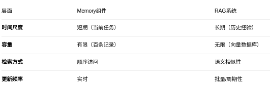
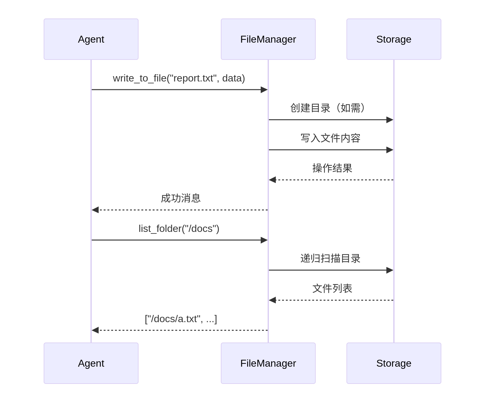
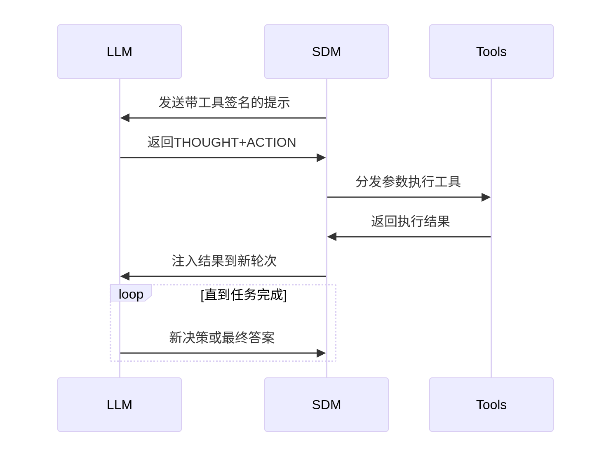
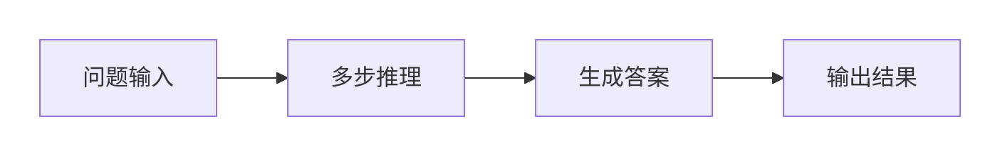
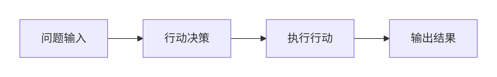
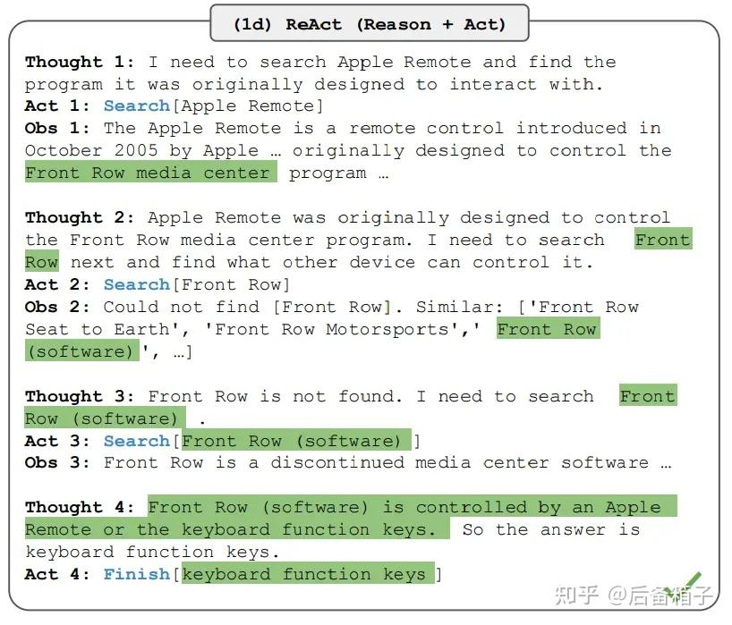
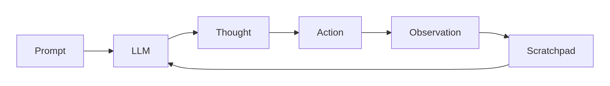

# agent是什么

AI Agent是一种超越简单文本生成的人工智能系统。它使用大型语言模型（LLM）作为其核心计算引擎，使其能够进行对话、执行任务、推理并展现一定程度的自主性。简而言之，Agent是一个具有复杂推理能力、记忆和执行任务手段的系统。



在LLM赋能的自主agent系统中(LLM Agent)，LLM充当agent大脑的角色，并与若干关键组件协作。

## AI Agent 的主要组成部分

AI Agent的工作流程：



### 记忆（Memory）

* ​​短期记忆（Short-term Memory）​​：类似于人类的工作记忆，存储当前任务相关的上下文信息（例如，多轮对话的历史、当前步骤的结果）。它容量有限，但访问快速。
* ​​长期记忆（Long-term Memory）​​：存储智能体的“经验”和“知识”，例如过去成功解决过的问题、从用户交互中学到的偏好等。可以通过向量数据库等技术实现，供长期检索。

​​作用​​：为Agent提供上下文和背景知识，使其能够进行连贯的、个性化的交互。

Memory组件与RAG系统的协作：



### 工具（Tools）

​​组成​​：一系列可供Agent调用的外部功能模块，例如：

* ​​计算器（Calculator）​​：进行精确的数学计算。
* ​​搜索引擎（Search）​​：获取实时、外部知识。
* ​​代码解释器（Code Interpreter）​​：执行代码来解决复杂问题或处理数据。
* ​​日历（Calendar）​​：管理时间和日程。

​​作用​​：极大地扩展了Agent的能力边界，使其能够完成超越其原生知识库和生成能力的任务（如获取最新信息、执行代码）。

调用工具的流程图：



### 规划（Planning）

​​组成​​：这是一组关键的认知策略，是Agent“思考”过程的体现：

* ​​思维链（Chain of Thought）​​：让Agent将复杂问题分解为一步步的推理过程，而不是直接给出答案，提高了准确性和可解释性。
* ​​子目标分解（Subgoal Decomposition）​​：将一个宏大、复杂的目标（如“开发一个网站”）分解成一系列更小、可执行的子目标（设计UI -> 编写前端 -> 搭建后端 -> 部署）。
* ​​反思（Reflection）​​：在行动或得到一个结果后，Agent会评估当前进展和效果。“我目前的方法有效吗？有没有更好的方式？”
* ​​自我批评（Self-critics）​​：反思的一种具体形式，Agent会主动寻找自己计划或成果中的错误和不足。

​​作用​​：确保Agent的行为是​​有目的、有结构、可调整的​​，而不是盲目试错。这是实现复杂任务的关键。



### 行动（Action）

​​位置​​：Agent下方

​​作用​​：这是Agent“思考”的最终输出。行动可以是对外部的（如调用一个Tool、在环境中执行一个操作），也可以是对内的（如将一个新结论保存到长期记忆中）。

## AI Agent的意义

基于大模型的Agent不仅可以让每个人都有增强能力的专属智能助理，还将改变人机协同的模式，带来更为广泛的人机融合。生成式AI的智能革命演化至今，从人机协同呈现了三种模式：

1. 嵌入（embedding）模式。用户通过与AI进行语言交流，使用提示词来设定目标，然后AI协助用户完成这些目标，比如普通用户向生成式AI输入提示词创作小说、音乐作品、3D内容等。在这种模式下，AI的作用相当于执行命令的工具，而人类担任决策者和指挥者的角色。

2. 副驾驶（Copilot）模式。在这种模式下，人类和AI更像是合作伙伴，共同参与到工作流程中，各自发挥作用。AI介入到工作流程中，从提供建议到协助完成流程的各个阶段。例如，在软件开发中，AI可以为程序员编写代码、检测错误或优化性能提供帮助。人类和AI在这个过程中共同工作，互补彼此的能力。AI更像是一个知识丰富的合作伙伴，而非单纯的工具。

3. 智能体（Agent）模式。人类设定目标和提供必要的资源（例如计算能力），然后AI独立地承担大部分工作，最后人类监督进程以及评估最终结果。这种模式下，AI充分体现了智能体的互动性、自主性和适应性特征，接近于独立的行动者，而人类则更多地扮演监督者和评估者的角色。实际上，2021年微软在GitHub首次引入了Copilot（副驾驶）的概念。GitHub Copilot是一个辅助开发人员编写代码的AI服务。2023年5月，微软在大模型的加持下，Copilot迎来全面升级，推出Dynamics 365 Copilot、Microsoft 365 Copilot和Power Platform Copilot等，并提出“Copilot是一种全新的工作方式”的理念。工作如此，生活也同样需要“Copilot”，“出门问问”创始人李志飞认为大模型的最好工作，是做人类的“Copilot”。

## ReAct agent

ReAct 框架能够生成推理轨迹，使模型能够滚动跟踪并逐步逼近终点以完成目标，甚至可以处理异常。

Action 阶段允许与外部来源（如知识库或环境）交互，或通过 MCP 协议收集外界信息，从而产生更可靠和事实性的响应。

并且，ReAct 通过与外部知识库（如 Wikipedia API）交互，可以克服仅推理方法（如 CoT）的“幻觉”问题，并超越仅行动方法（Act），避免陷入“仅操作不反思”和“仅推理不操作”两大陷阱。

CoT模式（思维链模式）:



ACT模式（纯行动模式）:



核心在于旨在通过提示（prompting）大型语言模型（LLMs），使其在解决各种任务时能够协同进行推理（Reasoning）和行动（Acting）。

### 核心思想与动机

人类智能的启发：人类在执行任务（如在厨房做饭）时，会自然地将具体行动（如切菜、开冰箱）与口头推理（如“现在该烧水了”、“没有盐，用酱油代替吧”、“我需要上网查一下面团怎么做”）结合起来。这种“行动”与“推理”的紧密结合，使得人类能够快速学习新任务，并在面对未知情况或信息不确定时做出稳健的决策。
现有方法的局限：

* 仅推理（如 Chain-of-Thought, CoT）：模型仅在内部生成思维链，缺乏与外部世界的交互，容易产生事实性幻觉（hallucination）和错误累积。
* 仅行动（如 WebGPT）：模型主要根据语言先验生成动作，缺乏高层次的抽象推理来制定、维护和调整计划，或利用工作记忆来支持行动，导致在复杂任务中表现不佳。

ReAct 的解决方案：

ReAct 通过提示 LLMs 以交错（interleaved）的方式生成 推理轨迹（Thoughts） 和 任务相关动作（Actions），从而实现两者的协同：

* 推理指导行动（Reason to Act）：推理帮助模型分解目标、制定计划、跟踪进度、处理异常并决定下一步行动。
* 行动辅助推理（Act to Reason）：通过与外部环境（如 Wikipedia API、模拟游戏、购物网站）交互获取新信息，使推理过程更接地气、更准确。

### ReAct 的工作原理

#### 增强的动作空间

将代理（Agent）的动作空间A扩展为 ，其中 L是语言空间。在L中的动作被称为 Thought，它不改变外部环境，但会更新上下文，为后续的推理或行动提供支持。

```text
# 传统代理的动作空间
A = {action1, action2, action3, ...}  # 只能执行物理/数字行动
# 增强后的动作空间  
Ā = A ∪ L  # 新增语言空间L
# 其中：
L = {thought1, thought2, thought3, ...}  # Thought集合
```

Thought 是代理可以执行的​​一种特殊类型的动作​​，属于​​语言空间​​而非​​物理行动空间​​。

```text
# 物理行动 vs Thought行动
物理行动: execute("打开冰箱") → 环境改变: 冰箱门打开
Thought行动: generate_thought("需要检查冰箱食材") → 环境不变，内部状态更新
```

```python
​​在实际应用中的例子​:
# Thought示例1：问题分解
thought = "这个任务需要分三步：1.收集数据 2.分析模式 3.生成报告"

# Thought示例2：策略调整  
thought = "当前方法无效，应该尝试替代方案B"

# Thought示例3：进度跟踪
thought = "已完成数据收集，下一步进行模式分析"

# 完整循环示例
for cycle in range(max_cycles):
    # Thought阶段：内部推理
    thought = "基于现有信息，下一步应该搜索相关研究论文"
    
    # Action阶段：外部执行  
    action = "search_academic_database('关键词')"
    
    # Observation阶段：获取反馈
    observation = get_search_results()
    
    # 更新：Thought影响下一轮决策
    next_thought = f"搜索得到{len(observation)}条结果，需要筛选相关文献"
```

#### 灵活的提示设计

对于推理密集型任务（如问答），采用密集思考模式，即 “Thought → Action → Observation” 的循环。

# 适用场景：科学研究、复杂问题解决

thought_pattern = "Thought→Action→Observation→Thought→Action→..."

# 实际案例：数学证明

```py
thought_sequence = [
    "思考：需要证明定理A成立",
    "行动：查阅相关引理", 
    "观察：找到引理B和C",
    "思考：结合引理B和C推导定理A",
    "行动：进行数学推导",
    "观察：推导成功，定理得证"
]
```

对于决策密集型任务（如文本游戏），采用稀疏思考模式，仅在关键时刻（如分解目标、跟踪进度、处理异常）插入 “Thought”，由模型自行决定何时思考。

```py
# 适用场景：游戏策略、实时决策
thought_strategy = "在关键时刻才触发Thought"

# 实际案例：文本游戏
game_states = [
    "状态：遇到怪物 → 行动：直接攻击",           # 无需思考
    "状态：获得关键道具 → Thought：这个道具可能用于解锁新区域",  # 关键思考
    "状态：多个路径选择 → Thought：根据地图分析最优路径",      # 关键思考
    "状态：简单对话 → 行动：标准回应"            # 无需思考
]
```



#### 交错生成推理与动作

这是 ReAct 的核心机制。模型被提示以特定的格式生成输出，这个格式强制或鼓励模型在生成动作之前或之后插入思考步骤。

* 推理指导行动 (Reason to Act)：Thoughts 用于：

   * 分解目标：将复杂任务拆解成子目标（如：“1. 我需要先找到胡椒瓶 2. 然后把它放进抽屉。”）。制定和调整计划：根据当前状态决定下一步该做什么（如：“现在胡椒瓶找到了，下一步是去抽屉。”）。
   * 处理异常：当行动失败或信息不符时，调整策略（如：“搜索‘iPhone2077’ wiki 没找到，我应该转变思路通过 Google 搜索关键词”）。
   * 提取和总结信息：从环境观察中提炼关键事实（如：“之前有提到，当前最新的 iPhone 是 16”）。
   * 注入常识或进行计算：利用模型的内部知识辅助决策（如：“应该告知用户想要的东西并不存在”）。

* 行动辅助推理 (Act to Reason)：Actions 用于：
   * 与外部环境交互：通过执行动作（如搜索、点击、移动）从外部世界（如 Wikipedia API、模拟游戏环境、购物网站）获取新的、模型内部知识库可能没有或已过时的信息。
   * 验证或修正推理：获取到的新信息可以用来验证之前的假设，或修正错误的推理路径。

这种交错模式创造了一个动态的、闭环的决策过程：



### ReAct 提示词工程

ReAct 提示词是一种精心设计的输入模板，通过少样本学习教会大型语言模型遵循 Thought → Action → Observation 的循环模式。其核心由三个关键组件构成，共同构建了一个完整的推理-行动框架。

**前缀 (PREFIX)：**

定义任务目标和可用工具集，清晰说明任务性质和模型可调用的工具

```text
Answer the following questions as best you can.

You have access to the following tools: 
List <tool_name>:
```

**循环参考 (CONTEXT)：**

定义以什么方式进行运行，明确循环的开头和边界

```text
Use the following format:
Question: <Question> 
Thought: ... 
Action: <tool_name> 
Action Input: <tool_input> 
Observation: <result>
```

**后缀 (SUFFIX)：**

让 LLM 能够沿着设定好的路线进行 Next Token Prediction 
典型内容：

```text
Begin! Question: {input} + {agent_scratchpad} Thought:
```

关键作用：{agent_scratchpad} 动态包含之前的 Thought/Action/Action Input/Observation 历史，使模型能在完整上下文中进行决策。组合起来就是：强制执行思考-行动循环
