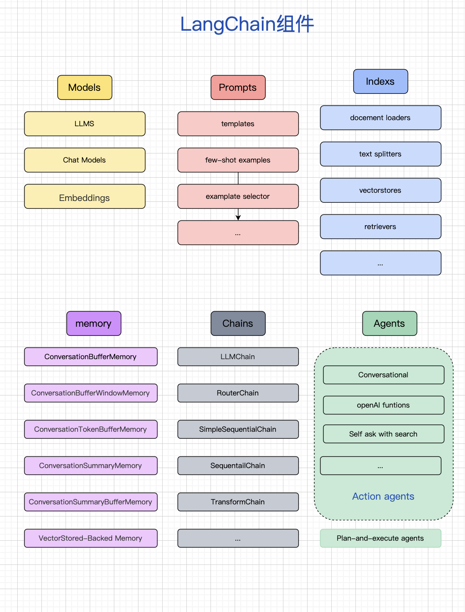
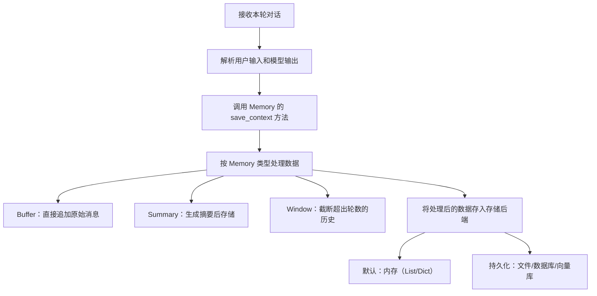
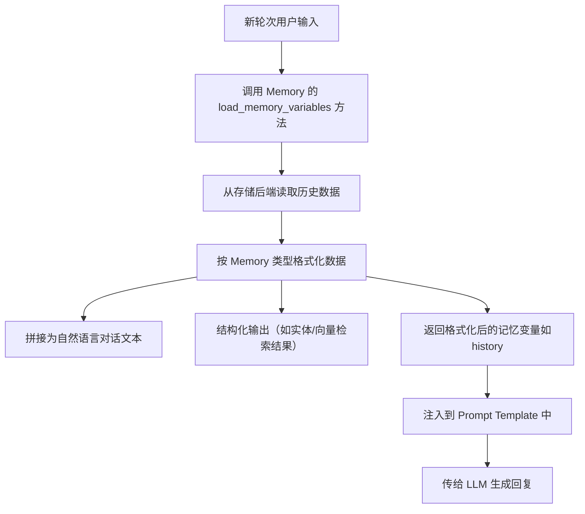
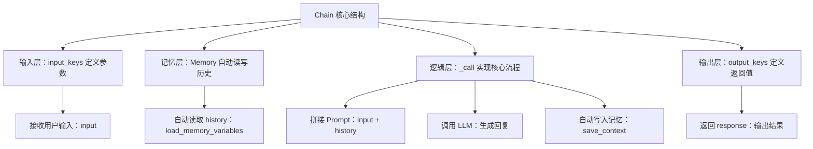
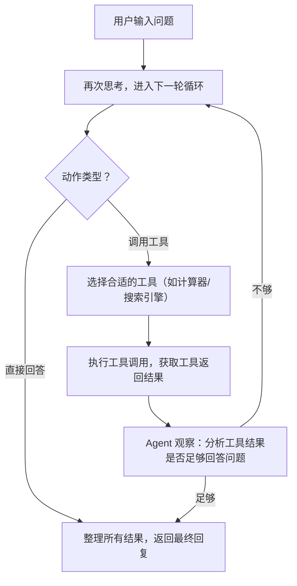

# Langchain

## 什么是Langchain

LangChain是一个专门为大语言模型(LLM)应用开发设计的框架，它通过提供标准化的组件和抽象层来简化复杂应用的构建过程。在实际开发中，我们经常遇到几个核心痛点:提示词管理混乱、多步骤调用逻辑复杂、外部数据源集成困难，LangChain正是为解决这些问题而生的。

具体来说，LangChain解决了几个关键问题。首先是链式调用的编排问题-当你需要让AI先分析用户意图，再查询数据库，最后生成回答时，LangChain的Chain组件让这个流程变得可控可维护。其次是记忆管理-通过Memory组件，你可以轻松实现话历史的保存和上下文传递，不用自己处理复杂的状态管理。

另一个重要价值是外部工具集成，比如让AI调用搜索引擎、计算器或数据库查询，LangChain的Agent和Tool机制提供了标准化的接口。最后是提示词模板化，通过PromptTemplate组件，你可以将提示词逻辑从代码中分离，便于维护和优化。

总的来说，LangChain让原本需要大量胶水代码的LLM应用开发变成了组装积木式的编程，显著降低了开发复杂度和维护成

## Langchain 组件



### Models模型

| 模型类型 | 作用 | 常见选择 |
|---------|------|----------|
| **LLMs** | 基础文本生成 | GPT-3.5/4、Claude、LLaMA、通义千问 |
| **Chat Models** | 对话优化 | ChatGPT、Claude-instant |
| **Embeddings** | 文本向量化 | OpenAI Embeddings、Sentence Transformers |

模型是外部资源，LangChain 不提供模型本身，而是提供与各种模型的连接和调用接口。

#### Chat Models

聊天模型的接口是基于消息而不是原始文本。LangChain 目前支持的消息类型有 AIMessage、HumanMessage、SystemMessage 和 ChatMessage，其中 ChatMessage 接受一个任意的角色参数。大多数情况下，您只需要处理 HumanMessage、AIMessage 和 SystemMessage。

```py
# 导入OpenAI的聊天模型，及消息类型
from langchain.chat_models import ChatOpenAI
from langchain.schema import (
    AIMessage,
    HumanMessage,
    SystemMessage
)

# 初始化聊天对象
chat = ChatOpenAI(openai_api_key="...")

# 向聊天模型发问
chat([HumanMessage(content="Translate this sentence from English to French: I love programming.")])
OpenAI 聊天模式支持多个消息作为输入。这是一个系统和用户消息聊天模式的例子:

messages = [
    SystemMessage(content="You are a helpful assistant that translates English to French."),
    HumanMessage(content="I love programming.")
]
chat(messages)
```

当然也可以进行批量处理，批量输出。

```py
batch_messages = [
    [
        SystemMessage(content="You are a helpful assistant that translates English to French."),
        HumanMessage(content="I love programming.")
    ],
    [
        SystemMessage(content="You are a helpful assistant that translates English to French."),
        HumanMessage(content="I love artificial intelligence.")
    ],
]
result = chat.generate(batch_messages)
result
```

LangChain 提供了缓存的功能。并且提供了两种缓存方案，内存缓存方案和数据库缓存方案，当然支持的数据库缓存方案有很多种。可以加速回答以及减少对大模型 api 的调用。

```py
# 导入聊天模型，SQLiteCache模块
import os
os.environ["OPENAI_API_KEY"] = 'your apikey'
import langchain
from langchain.chat_models import ChatOpenAI
from langchain.cache import SQLiteCache

# 设置语言模型的缓存数据存储的地址
langchain.llm_cache = SQLiteCache(database_path=".langchain.db")

# 加载 llm 模型
llm = ChatOpenAI()

# 第一次向模型提问
result = llm.predict('tell me a joke')
print(result)

# 第二次向模型提问同样的问题
result2 = llm.predict('tell me a joke')
print(result2)
另外聊天模式也提供了一种流媒体回应。这意味着,而不是等待整个响应返回,你就可以开始处理它尽快。
```

#### Embedding

Embedding 更多的是用于文档、文本或者大量数据的总结、问答场景，一般是和向量库一起使用，实现向量匹配。其实就是把文本等内容转成多维数组，可以后续进行相似性的计算和检索。他相比 fine-tuning 最大的优势就是，不用进行训练，并且可以实时添加新的内容，而不用加一次新的内容就训练一次，并且各方面成本要比 fine-tuning 低很多。

```py
# 导入os, 设置环境变量，导入OpenAI的嵌入模型
import os
from langchain.embeddings.openai import OpenAIEmbeddings
os.environ["OPENAI_API_KEY"] = 'your apikey'

# 初始化嵌入模型
embeddings = OpenAIEmbeddings()

# 把文本通过嵌入模型向量化
res = embeddings.embed_query('hello world')
/*
[
   -0.004845875,   0.004899438,  -0.016358767,  -0.024475135, -0.017341806,
    0.012571548,  -0.019156644,   0.009036391,  -0.010227379, -0.026945334,
    0.022861943,   0.010321903,  -0.023479493, -0.0066544134,  0.007977734,
   0.0026371893,   0.025206111,  -0.012048521,   0.012943339,  0.013094575,
   -0.010580265,  -0.003509951,   0.004070787,   0.008639394, -0.020631202,
  -0.0019203906,   0.012161949,  -0.019194454,   0.030373365, -0.031028723,
   0.0036170771,  -0.007813894, -0.0060778237,  -0.017820721, 0.0048647798,
   -0.015640393,   0.001373733,  -0.015552171,   0.019534737, -0.016169721,
    0.007316074,   0.008273906,   0.011418369,   -0.01390117, -0.033347685,
    0.011248227,  0.0042503807,  -0.012792102, -0.0014595914,  0.028356876,
    0.025407761, 0.00076445413,  -0.016308354,   0.017455231, -0.016396577,
    0.008557475,   -0.03312083,   0.031104341,   0.032389853,  -0.02132437,
    0.003324056,  0.0055610985, -0.0078012915,   0.006090427, 0.0062038545,
  ... 1466 more items
]
*/
```

#### LLMS

LLMS 是 LangChain 的核心，从官网可以看到 LangChain 继承了非常多的大语言模型。

#### 传入模型的具体方式

 **A. 直接传入 API 模型：**

```python
from langchain_openai import ChatOpenAI

# 传入 OpenAI 模型
llm = ChatOpenAI(
    model="gpt-3.5-turbo",
    temperature=0.7,
    api_key="your-openai-key"
)
```

**B. 传入本地模型：**

```python
from langchain_community.llms import Ollama

# 传入本地运行的模型
llm = Ollama(
    model="qwen:7b",  # 本地部署的通义千问
    base_url="http://localhost:11434"
)
```

**C. 传入嵌入模型：**

```python
from langchain_openai import OpenAIEmbeddings

# 传入向量化模型
embeddings = OpenAIEmbeddings(
    model="text-embedding-ada-002",
    api_key="your-openai-key"
)
```

#### 在 LangChain 工作流中的角色

```text
外部模型服务/本地模型
        ↓
    传入 LangChain
        ↓
    被其他组件调用
        ↓
Prompts → Models → Chains → Agents
        ↑
   Indexes (需要 Embeddings)
```

**具体组件依赖：**

1. **Chains** 需要 LLMs 来生成内容
2. **Agents** 需要 Chat Models 来做决策
3. **Indexes** 需要 Embeddings 来向量化文本
4. **Memory** 可能使用 Embeddings 来存储记忆

#### 完整应用配置

```python
from langchain_openai import ChatOpenAI, OpenAIEmbeddings
from langchain_community.vectorstores import Chroma
from langchain.chains import RetrievalQA
from langchain.prompts import PromptTemplate

# 1. 传入模型
llm = ChatOpenAI(model="gpt-4", temperature=0)
embeddings = OpenAIEmbeddings()

# 2. 构建索引（使用传入的嵌入模型）
vectorstore = Chroma.from_documents(
    documents=your_documents,
    embedding=embeddings  # 使用您传入的模型
)

# 3. 创建链（使用传入的LLM）
qa_chain = RetrievalQA.from_chain_type(
    llm=llm,  # 使用您传入的模型
    chain_type="stuff",
    retriever=vectorstore.as_retriever()
)

# 4. 使用
result = qa_chain.run("你的问题")
```

## Prompts 组件

在图中，**Prompts** 位于架构的第二层，是连接 **Models（模型）** 和 **Chains（链）** 的关键桥梁。它负责将用户输入和系统指令格式化为大语言模型能够理解和处理的标准格式。

### Prompts 组件的三层结构

**1. Templates（模板）**：

- **作用**：可复用的提示词骨架，包含变量占位符
- **示例**：

    ```python
    from langchain.prompts import PromptTemplate

    template = """
    你是一个{role}助手。请用{style}风格回答关于{topic}的问题。

    问题：{question}
    回答："""

    prompt = PromptTemplate(
        input_variables=["role", "style", "topic", "question"],
        template=template
    )
    ```

**2. Few-shot Examples（少样本示例）**：

- **作用**：提供少量输入-输出示例，引导模型学习任务格式
- **应用场景**：
  
    ```python
    examples = [
        {"input": "苹果", "output": "水果"},
        {"input": "汽车", "output": "交通工具"},
        {"input": "巴黎", "output": "城市"}
    ]

    # 模型通过这些示例学习分类任务
    ```

**3. Example Selector（示例选择器）**：

- **作用**：动态选择最相关的示例，提升提示质量
- **工作流程**：
  1. 分析当前查询的语义
  2. 从示例库中选择最相关的示例
  3. 组合成最终提示词

### Prompts 在架构中的数据流

**向上游连接**：

```text
Models（模型） 
    ↑
Prompts（提示词格式化）
    ↑
用户输入/应用逻辑
```

**向下游连接**：

```text
Prompts（格式化后的提示词）
    ↓
Chains（执行链）
    ↓
Agents/其他组件
```

#### Prompts 组件的技术价值

**1. 提示工程标准化**

- 将零散的提示词技巧封装为可复用组件
- 支持团队协作和知识沉淀

**2. 动态优化能力**

```python
# 根据查询动态选择示例
selector = SemanticSimilarityExampleSelector.from_examples(
    examples,
    embeddings,
    vectorstore,
    k=3  # 选择3个最相关的示例
)
```

**3. 效率提升**

- 减少重复编写类似提示词的工作
- 支持批量处理和大规模部署

#### 实际应用示例

**场景1：客服机器人**：

```python
# 定义客服提示模板
customer_service_template = """
你是{company_name}的客服专员。请{attitude}地回答客户问题。

客户历史：{history}
当前问题：{question}

请回复："""

# 填充模板
prompt = customer_service_template.format(
    company_name="ABC科技",
    attitude="专业且友好",
    history="用户之前询问过产品价格",
    question="你们的售后服务怎么样？"
)
```

**场景2：代码生成助手**：

```python
# 包含few-shot examples的提示
code_examples = [
    {"input": "Python列表排序", "output": "sorted(my_list)"},
    {"input": "读取CSV文件", "output": "import pandas as pd\ndf = pd.read_csv('file.csv')"}
]

prompt = f"""
请根据示例生成代码：

示例：
{code_examples}

新请求：{user_request}
代码："""
```

**可能的扩展功能**：

1. **Prompt Versioning**：提示词版本管理
2. **A/B Testing**：不同提示词效果对比
3. **Automated Optimization**：自动优化提示词
4. **Safety Filters**：安全过滤和内容审查
5. **Multi-language Support**：多语言提示支持

### 与其他组件的协同

**与 Memory 结合**：

```python
# 从 Memory 获取对话历史
history = memory.load_memory_variables({})
prompt = f"对话历史：{history}\n当前问题：{query}"
```

**与 Indexes 结合**：

```python
# 结合检索结果构建提示
docs = retriever.get_relevant_documents(query)
context = "\n".join([doc.page_content for doc in docs])
prompt = f"参考信息：{context}\n问题：{query}"
```

#### 作用

图中展示的 **Prompts 组件** 是 LangChain 的**指令编排中心**，它将：

- ✅ **模板化**：结构化提示生成
- ✅ **示例化**：少样本学习支持
- ✅ **动态化**：智能示例选择
- ✅ **标准化**：统一提示管理

## Indexes

索引是指对文档进行结构化的方法，以便 LLM 能够更好的与之交互。该组件主要包括：Document Loaders（文档加载器）、Text Splitters（文本拆分器）、VectorStores（向量存储器）以及 Retrievers（检索器）。

## memory

Memory 围绕 BaseMemory 基类实现，所有记忆类型都遵循统一接口：

* save_context：保存本轮用户输入与模型响应到历史。
* load_memory_variables：读取历史并格式化为提示词可用的变量（如 {history}）。
* clear：清空记忆。

### 主流记忆类型

|记忆类型|核心机制|Token 效率|信息完整性|适用场景|
|--------|--------|----------|----------|--------|
|ConversationBufferMemory|全量保存|低|最高|短对话、调试|
|ConversationBufferWindowMemory|滑动窗口|中|高|中等长度对话|
|ConversationTokenBufferMemory|Token 截断|中高|高|严格 Token 限制|
|ConversationSummaryMemory|自动摘要|高|中|长对话、客服|
|ConversationSummaryBufferMemory|近期原文 + 远期摘要|高|中高|通用长对话|
|ConversationEntityMemory|实体槽记忆|高|结构化高|多角色、知识图谱|
|VectorStoreRetrieverMemory|向量检索|极高|语义级|超长对话、知识库|

### 典型执行流程（以 ConversationChain 为例）

写入记忆（Save）流程：



读取记忆（Load）流程：



Langchain 的 memory 本身并没有存储，这里是由 Langchain 进行压缩并写入到底层的存储中。这里底层的存储通过传参的方式告诉 Langchain 。这里通过 langchain_community.chat_message_histories 的模块与数据库构建联系。

### 对话历史存储层

langchain_community.chat_message_histories 是 LangChain 生态中专门负责对话历史持久化的核心模块，属于 langchain_community 子包（原 langchain 拆分后的社区贡献模块，包含各类第三方集成）。

|类名|作用|适用场景|
|---|---|-----|
|InMemoryChatMessageHistory|内存存储（默认）|测试 / 临时会话，重启丢失|
|PostgresChatMessageHistory|PGSQL 存储|生产环境、多用户持久化|
|SQLChatMessageHistory|通用 SQL 存储（支持 SQLite/MySQL/PGSQL）|轻量 SQL 存储场景|
|FileChatMessageHistory|文件存储（JSON 格式）|单机持久化、简单场景|
|RedisChatMessageHistory|Redis 存储|高并发、缓存型会话|
|MongoDBChatMessageHistory|MongoDB 存储|非结构化数据、文档型存储|
|ChromaChatMessageHistory|Chroma 向量库存储|语义检索型记忆|
|CassandraChatMessageHistory|Cassandra 存储|分布式高可用场景|

### 使用示例

```py
from dotenv import load_dotenv
import os
from langchain.memory import ConversationBufferMemory
from langchain_openai import OpenAI
from langchain.chains import ConversationChain
# 关键：导入 PGSQL 对话历史存储类
from langchain_community.chat_message_histories import PostgresChatMessageHistory

# 加载环境变量
load_dotenv()

# 1. 初始化 PGSQL 连接配置
pg_config = {
    "host": os.getenv("PG_HOST"),
    "port": os.getenv("PG_PORT"),
    "user": os.getenv("PG_USER"),
    "password": os.getenv("PG_PASSWORD"),
    "database": os.getenv("PG_DATABASE"),
}

# 2. 初始化 PGSQL 对话历史存储
# session_id：唯一标识对话会话（比如用户ID，区分不同用户的记忆）
# 首次运行时，会自动在 PGSQL 中创建 `langchain_pg_chat_history` 表
chat_history = PostgresChatMessageHistory(
    session_id="user_001",  # 自定义会话ID，比如用户ID
    connection_string=f"postgresql+psycopg2://{pg_config['user']}:{pg_config['password']}@{pg_config['host']}:{pg_config['port']}/{pg_config['database']}"
)

# 3. 初始化 Memory，关联 PGSQL 存储（替代默认内存存储）
memory = ConversationBufferMemory(
    chat_memory=chat_history,  # 核心：指定自定义的 chat_memory
    return_messages=True,      # 返回 Message 对象，便于查看
    memory_key="history"       # 记忆变量名，默认是 "history"
)

# 4. 初始化对话链
llm = OpenAI(temperature=0)
conversation = ConversationChain(
    llm=llm,
    memory=memory,
    verbose=True  # 开启日志，可看到 Prompt 拼接过程
)

# 5. 多轮对话测试（记忆会自动写入 PGSQL）
print("===== 第一轮对话 =====")
response1 = conversation.invoke({"input": "你好，我叫小明，我是一名Python程序员"})
print("回复：", response1["response"])

print("\n===== 第二轮对话 =====")
response2 = conversation.invoke({"input": "我刚才告诉你我的名字和职业了吗？"})
print("回复：", response2["response"])

# 6. 手动验证 PGSQL 中的数据（可选）
print("\n===== 从 PGSQL 读取记忆 =====")
memory_vars = memory.load_memory_variables({})
print("当前记忆：", memory_vars["history"])

# 7. 清空记忆（可选，会删除 PGSQL 中该 session_id 的数据）
# chat_history.clear()
```

在初始化 Chain 时传入 memory=你的memory实例，LangChain 会在每次调用 invoke()（或 __call__/run）时，自动执行以下操作：

1. 读取记忆：调用 memory.load_memory_variables() 获取历史对话；
2. 注入 Prompt：把读取到的记忆拼接到 Prompt Template 中，传给 LLM；
3. 生成回复：LLM 基于「记忆 + 新输入」生成回复；
4. 写入记忆：调用 memory.save_context() 把本轮「用户输入 + 模型回复」写入记忆（无论是内存 / PGSQL / 文件等存储介质）。

## chain

LangChain 中的 Chain 不是单一功能模块，而是**一套标准化的「任务流程编排框架」** —— 它把「输入处理→调用 LLM/工具→记忆读写→输出格式化」等零散步骤，封装成可复用、可组合的执行单元。

简单类比：

- 单个组件（LLM/Memory/工具）是「零件」；
- Chain 是「组装好的功能模块」，定义了零件的执行顺序和数据流转规则；
- 多个 Chain 组合可形成更复杂的「工作流」（比如 Agent 本质就是嵌套了工具调用的 Chain）。

### Chain 的核心基类：BaseChain（所有 Chain 的根）

LangChain 中所有官方 Chain（如 `ConversationChain`/`LLMChain`/`SequentialChain`）都继承自 `langchain.chains.base.BaseChain`，这个基类定义了 Chain 的**标准化接口和核心属性**，是整个 Chain 体系的骨架。

#### 1. BaseChain 的核心属性（必实现/可配置）

| 属性名 | 类型 | 作用 | 是否必实现 |
|--------|------|------|------------|
| `input_keys` | List[str] | 定义 Chain 接收的输入参数名（如 `["input", "history"]`） | ✅ 必实现 |
| `output_keys` | List[str] | 定义 Chain 返回的输出参数名（如 `["response"]`） | ✅ 必实现 |
| `memory` | BaseMemory | 绑定记忆模块，用于自动读写对话历史 | ❌ 可选 |
| `verbose` | bool | 是否输出详细日志（执行流程、Prompt 内容等） | ❌ 可选（默认 False） |
| `callbacks` | List[BaseCallbackHandler] | 回调函数，用于监控/记录 Chain 执行过程 | ❌ 可选 |

#### 2. BaseChain 的核心方法（必实现/内置）

| 方法名 | 作用 | 是否必实现 | 说明 |
|--------|------|------------|------|
| `_call(self, inputs, run_manager=None)` | Chain 的核心执行逻辑 | ✅ 必实现 | 处理输入、调用 LLM/工具、生成输出 |
| `invoke(self, input, config=None)` | 对外暴露的调用入口 | ❌ 内置 | 封装 `_call`，处理输入格式化、记忆读写、日志等 |
| `run(self, *args, **kwargs)` | 简化版调用方法 | ❌ 内置 | 适合快速测试，返回单个输出值 |
| `predict(self, **kwargs)` | 类似 `run`，更贴近 LLM 预测语义 | ❌ 内置 | 主要用于单输入单输出场景 |
| `batch(self, inputs, config=None)` | 批量处理输入 | ❌ 内置 | 提高批量执行效率 |

### 三、Chain 的核心结构组成

一个完整的 Chain 通常由 4 个核心部分组成，以 `ConversationChain` 为例拆解：


#### 1. 输入层（Input Layer）

- 由 `input_keys` 定义接收的参数，比如 `ConversationChain` 的 `input_keys = ["input"]`；
- 调用 `invoke({"input": "用户问题"})` 时，Chain 会先校验输入参数是否符合 `input_keys` 定义，不符合则报错；
- 如果绑定了 Memory，会自动把记忆变量（如 `history`）加入输入参数，无需手动传。

#### 2. 记忆层（Memory Layer）

- 可选模块，通过 `memory` 属性绑定 `BaseMemory` 实例；
- BaseChain 内置了记忆自动处理逻辑：
  - 执行 `_call` 前，自动调用 `memory.load_memory_variables()` 读取记忆，并入输入参数；
  - 执行 `_call` 后，自动调用 `memory.save_context()` 写入本轮对话；
- 无记忆绑定则跳过此层。

#### 3. 逻辑层（Logic Layer）

- Chain 的核心，由 `_call` 方法实现，是你自定义 Chain 时唯一需要手写的部分；
- 典型逻辑：
  1. 解析输入参数（用户输入、记忆等）；
  2. 拼接 Prompt（结合模板+输入+记忆）；
  3. 调用 LLM/工具（核心计算步骤）；
  4. 格式化输出结果。

#### 4. 输出层（Output Layer）

- 由 `output_keys` 定义返回的参数名，比如 `ConversationChain` 的 `output_keys = ["response"]`；
- 执行完 `_call` 后，Chain 会校验输出结果是否符合 `output_keys` 定义，确保返回格式统一；
- 对外返回的是字典（如 `{"response": "模型回复"}`），便于多输出场景使用。

### 四、Chain 的核心执行流程（以 invoke 为例）

以 `ConversationChain.invoke({"input": "你好"})` 为例，拆解完整执行流程：

```mermaid
graph TD
    A[调用 invoke] --> B[输入校验：检查 input 是否在 input_keys 中]
    B --> C[记忆读取：调用 memory.load_memory_variables() 获取 history]
    C --> D[参数合并：input + history 组成完整输入参数]
    D --> E[执行 _call：核心逻辑（拼 Prompt→调 LLM→生成回复）]
    E --> F[记忆写入：调用 memory.save_context() 保存本轮对话]
    F --> G[输出格式化：按 output_keys 返回结果（如 {"response": "..."}）]
    G --> H[返回最终结果给用户]
```

### 五、LangChain 中常见的 Chain 类型（按功能分类）

#### 1. 基础单步 Chain（核心原子链）

- **LLMChain**：最基础的 Chain，仅实现「Prompt 拼接→调用 LLM→返回结果」，无记忆；
  适用场景：单次问答、简单文本生成。
- **ConversationChain**：LLMChain + Memory，专为多轮对话设计，自动处理记忆；
  适用场景：多轮聊天机器人。

#### 2. 多步组合 Chain（流程编排链）

- **SequentialChain**：按顺序执行多个子 Chain，前一个 Chain 的输出作为后一个的输入；
  示例：先调用 `LLMChain` 生成标题，再调用另一个 `LLMChain` 生成正文。
- **RouterChain**：根据输入内容，路由到不同的子 Chain 执行；
  示例：用户问技术问题→路由到「技术问答 Chain」，问闲聊→路由到「闲聊 Chain」。
- **SimpleSequentialChain**：SequentialChain 的简化版，仅支持单输入单输出的子 Chain 串联。

#### 3. 工具调用 Chain（Agent 底层）

- **LLMChain + Tool**：结合工具调用的 Chain，可调用外部工具（如搜索引擎、计算器）；
- **AgentExecutor**：本质是特殊的 Chain，封装了「思考→调用工具→总结结果」的循环逻辑；
  适用场景：复杂任务（如数据分析、代码生成、多工具协作）。

#### 4. 定制化 Chain（领域专用）

- **AnalyzeDocumentChain**：专为文档分析设计的 Chain；
- **SqlDatabaseChain**：专为 SQL 数据库查询设计的 Chain；
- **TranslationChain**：专为文本翻译设计的 Chain。

### 六、自定义 Chain 示例（巩固结构认知）

基于 BaseChain 实现一个极简的自定义 Chain，直观体现核心结构：

```python
from langchain.chains.base import BaseChain
from langchain_openai import OpenAI
from langchain.schema import BasePromptTemplate
from pydantic import Field
import os
from dotenv import load_dotenv

load_dotenv()

class MyCustomLLMChain(BaseChain):
    """自定义基础 LLM Chain，体现核心结构"""
    # 1. 定义属性（LLM + Prompt 模板）
    llm: OpenAI
    prompt_template: str = Field(default="请回答以下问题：{question}")
    
    # 2. 必实现：输入/输出 keys
    @property
    def input_keys(self):
        return ["question"]  # 接收的输入参数名是 question
    
    @property
    def output_keys(self):
        return ["answer"]  # 返回的输出参数名是 answer
    
    # 3. 必实现：核心执行逻辑 _call
    def _call(self, inputs, run_manager=None):
        # 解析输入参数
        question = inputs["question"]
        
        # 拼接 Prompt
        prompt = self.prompt_template.format(question=question)
        
        # 调用 LLM 生成回复
        answer = self.llm.invoke(prompt).strip()
        
        # 返回结果（必须匹配 output_keys）
        return {"answer": answer}

# 使用自定义 Chain
llm = OpenAI(temperature=0)
custom_chain = MyCustomLLMChain(llm=llm)
result = custom_chain.invoke({"question": "LangChain 的 Chain 核心是什么？"})
print("回答：", result["answer"])
```

### 总结

1. **核心骨架**：所有 Chain 都继承自 `BaseChain`，核心是 `input_keys`/`output_keys`（定义参数）和 `_call`（核心逻辑）；
2. **核心价值**：标准化流程编排，把「输入→处理→调用→输出」封装成可复用单元，且支持记忆、回调、批量执行等通用能力；
3. **结构组成**：输入层+记忆层（可选）+逻辑层+输出层，四层协同完成任务；
4. **执行流程**：invoke 是对外入口，内部自动处理输入校验、记忆读写，最终执行 `_call` 完成核心逻辑。

理解 Chain 的结构后，你不仅能灵活使用官方 Chain，也能根据业务需求自定义 Chain，甚至组合多个 Chain 实现复杂的 LLM 应用。

## agent

LangChain 中的 Agent 不是单一组件，而是一套「能自主思考、规划、调用工具」的智能工作流框架—— 它是 Chain 的超集，比普通 Chain 多了「决策」和「工具调用」能力。。

简单类比：

普通 Chain：像一条固定的流水线，按你写死的逻辑执行（比如「读记忆→拼 Prompt→调 LLM」），只会做你明确告诉它的事；

Agent：像一个有自主意识的「助理」，能根据用户问题，自主判断：

* 要不要用工具？
* 用哪个工具？
* 工具返回结果后，要不要继续调用工具？
* 最终怎么整理结果回复用户？

你想了解 LangChain 中 Agent（智能体）的核心概念、结构和工作原理，我会从「Agent 的本质定义、核心价值、工作流程、核心结构、常见类型」几个维度，用通俗的语言+实战示例拆解，帮你彻底理解 Agent 是什么、怎么用。

### 一、Agent 的本质：有「自主决策能力」的高级 Chain

LangChain 中的 Agent 不是单一组件，而是**一套「能自主思考、规划、调用工具」的智能工作流框架**—— 它是 Chain 的超集，比普通 Chain 多了「决策」和「工具调用」能力。

简单类比：

- **普通 Chain**：像一条固定的流水线，按你写死的逻辑执行（比如「读记忆→拼Prompt→调LLM」），只会做你明确告诉它的事；
- **Agent**：像一个有自主意识的「助理」，能根据用户问题，自主判断：
  1. 要不要用工具？
  2. 用哪个工具？
  3. 工具返回结果后，要不要继续调用工具？
  4. 最终怎么整理结果回复用户？

核心差异：

| 特性                | 普通 Chain                | Agent                          |
|---------------------|---------------------------|--------------------------------|
| 决策能力            | 无（完全按预设逻辑执行）| 有（LLM 自主判断下一步动作）|
| 工具调用            | 需手动写死调用逻辑        | 自动选择/调用工具              |
| 流程灵活性          | 固定流程                  | 动态流程（可循环调用工具）|
| 适用场景            | 简单、固定流程的任务      | 复杂、需要多步推理/工具的任务  |

### 二、Agent 的核心价值：解决「LLM 原生能力不足」的问题

LLM 本身有很多短板：

- 无法实时获取信息（比如问「2026年最新的Python框架」）；
- 无法执行计算（比如问「12345*67890等于多少」）；
- 无法操作外部系统（比如「查我的MySQL数据库里的用户数」）；

Agent 就是为解决这些问题而生——它让 LLM 能「调用外部工具」弥补自身不足，完成复杂任务。

### 三、Agent 的核心工作流程（关键！）

Agent 的执行是一个「思考→行动→观察→总结」的循环，核心流程如下：


**举个具体例子**：
用户问：「2026年北京的GDP是多少？用这个数除以12345，结果是多少？」
Agent 的执行流程：

1. 思考：这个问题需要先查2026北京GDP（调用搜索引擎），再做除法（调用计算器）；
2. 行动1：调用搜索引擎工具，获取「2026北京GDP=X亿元」；
3. 观察：已获取GDP数值，但还需要计算除法；
4. 思考：下一步调用计算器工具，输入「X/12345」；
5. 行动2：调用计算器工具，获取计算结果；
6. 观察：所有信息足够，无需再调用工具；
7. 总结：整理「GDP数值+计算结果」，返回最终回复。

### 四、Agent 的核心结构组成

LangChain 的 Agent 由 4 个核心组件构成，缺一不可：

#### 1. Agent 核心控制器（Agent）

- 负责「思考决策」的核心模块，本质是一个特殊的 LLM Chain；
- 作用：解析用户问题→生成「动作指令」（比如「调用搜索引擎，关键词：2026北京GDP」）；
- 常见实现：`OpenAIFunctionsAgent`、`ReActAgent`、`StructuredChatAgent` 等。

#### 2. 工具集（Tools）

- Agent 能调用的「外部能力」集合，每个 Tool 对应一个具体功能；
- LangChain 内置了大量现成 Tool：
  - 通用工具：搜索引擎（SerpAPI）、计算器（Calculator）、文件读写（FileTool）；
  - 开发工具：代码执行（PythonREPL）、Git、Docker；
  - 数据库工具：SQLDatabaseTool、MongoDBTool；
  - 自定义工具：你可以封装自己的业务逻辑（比如「查订单」「调接口」）。

#### 3. 工具执行器（ToolExecutor）

- 负责「执行工具调用」的模块，把 Agent 生成的「动作指令」转换成实际的工具调用；
- 作用：接收动作指令→调用对应的 Tool→返回工具执行结果。

#### 4. 执行器（AgentExecutor）

- Agent 的「总调度器」，本质是一个特殊的 Chain；
- 作用：串联「思考→行动→观察」的循环，控制 Agent 的执行流程（比如最多循环多少次、是否输出日志）；
- 你平时调用 Agent 其实是调用 `AgentExecutor.invoke()`。

### 五、Agent 的核心组件关系（一句话总结）

`AgentExecutor` 是总调度，它让 `Agent`（控制器）根据用户问题生成动作指令，通过 `ToolExecutor` 调用 `Tools`（工具），并循环这个过程，直到能回答用户问题。

### 六、实战示例：最简单的 Agent（计算器+搜索引擎）

```python
from dotenv import load_dotenv
import os
from langchain_openai import ChatOpenAI
from langchain.agents import AgentExecutor, create_openai_functions_agent
from langchain_core.prompts import ChatPromptTemplate, MessagesPlaceholder
from langchain_core.tools import Tool
from langchain_community.tools import CalculatorTool, SerpAPIWrapper

# 加载环境变量
load_dotenv()

# ====================== 1. 初始化工具集 ======================
# 工具1：搜索引擎（SerpAPI）
search_tool = SerpAPIWrapper(serpapi_api_key=os.getenv("SERPAPI_API_KEY"))
# 工具2：计算器
calculator_tool = CalculatorTool()

# 定义工具列表（每个Tool包含：名称、功能、调用函数）
tools = [
    Tool(
        name="Search",  # 工具名（Agent会识别这个名字）
        func=search_tool.run,  # 工具执行函数
        description="用于搜索实时信息、最新数据（比如GDP、天气、新闻）"
    ),
    Tool(
        name="Calculator",
        func=calculator_tool.run,
        description="用于执行数学计算（加减乘除、平方、开方等）"
    )
]

# ====================== 2. 初始化 Agent 控制器 ======================
# 定义 Prompt 模板（告诉 Agent 如何思考、如何调用工具）
prompt = ChatPromptTemplate.from_messages([
    ("system", "你是一个智能助理，能调用工具解决问题。优先用工具获取准确信息，再回答问题。"),
    ("user", "{input}"),  # 用户输入
    MessagesPlaceholder(variable_name="agent_scratchpad")  # Agent 思考过程的临时存储
])

# 初始化 LLM（必须用支持函数调用的模型，比如 gpt-3.5-turbo/gpt-4）
llm = ChatOpenAI(model="gpt-3.5-turbo", temperature=0)

# 创建 OpenAI Functions Agent（最常用的 Agent 类型）
agent = create_openai_functions_agent(llm, tools, prompt)

# ====================== 3. 初始化 Agent 执行器 ======================
agent_executor = AgentExecutor(
    agent=agent,
    tools=tools,
    verbose=True,  # 开启详细日志，能看到 Agent 的思考和工具调用过程
    max_iterations=5  # 最大循环次数，避免无限循环
)

# ====================== 4. 测试 Agent ======================
print("===== 测试 Agent =====")
# 问题：需要先搜索（2024北京GDP），再计算（除以12345）
result = agent_executor.invoke({
    "input": "2024年北京市GDP是多少亿元？用这个数值除以12345，结果是多少？"
})

print("\n===== 最终回复 =====")
print(result["output"])
```

#### 运行效果（关键日志解读）

```text
> Entering new AgentExecutor chain...
思考：我需要先搜索2024年北京GDP，再用计算器计算除法。
调用工具：Search，参数：2024年北京市GDP 亿元
工具返回结果：2024年北京市GDP为43760.7亿元。
思考：已获取GDP数值，现在需要调用计算器计算43760.7/12345。
调用工具：Calculator，参数：43760.7 / 12345
工具返回结果：3.54481179425
思考：所有信息足够，现在整理结果回复用户。
> Finished chain.

最终回复：
2024年北京市GDP为43760.7亿元，将该数值除以12345的结果约为3.5448。
```

### 七、LangChain 中常见的 Agent 类型

| Agent 类型               | 特点                                  | 适用场景                          |
|--------------------------|---------------------------------------|-----------------------------------|
| OpenAIFunctionsAgent     | 基于 OpenAI 函数调用，稳定、易用      | 绝大多数场景（推荐首选）|
| ReActAgent               | 基于 ReAct 论文，思考过程更透明       | 需要调试/观察思考过程的场景       |
| StructuredChatAgent      | 支持结构化对话，适合多轮工具调用      | 复杂任务、多工具协作              |
| SelfAskWithSearchAgent   | 先拆解问题，再逐步搜索                | 需要分步推理的问题（比如多条件查询） |
| ConversationalAgent      | 结合 Memory，支持多轮对话+工具调用    | 带记忆的智能助理                  |

### Agent vs Chain 的核心区别（再强调）

- **Chain**：「执行者」，按你写死的步骤做事，无自主决策；
- **Agent**：「决策者+执行者」，自主判断步骤、调用工具，能处理未知的复杂问题。

## Langchain 对 RAG 的支持

|步骤|LangChain 核心组件|作用与定制点|
|文档加载|DocumentLoader 系列|支持 PDF/Word/Excel/Markdown/ 网页 / 数据库等，可自定义 Loader 加载私有数据（如企业内网文档）|
|文档分割|RecursiveCharacterTextSplitter|可调整 chunk_size/chunk_overlap，或自定义分割规则（比如按标题 / 章节分割）|
|向量化|Embeddings 系列|可选 OpenAI Embeddings / 国产 Embeddings（BGE/ERNIE）/ 本地 Embeddings，影响检索精度|
|向量存储|VectorStore 系列|测试用 Chroma/FAISS，生产用 Pinecone/Weaviate/Milvus（分布式、高可用）|
|检索|Retriever 接口|可定制检索策略（如相似性检索 + 关键词检索、过滤检索、多向量库融合）|
|Prompt 拼接|ChatPromptTemplate|定制 Prompt 规则（如强调引用来源、控制回答格式），是提升 RAG 效果的关键|
|LLM 调用|ChatOpenAI/ 国产模型封装|替换为任意 LLM（智谱 / 通义千问 / 文心一言），适配不同语言 / 场景|
