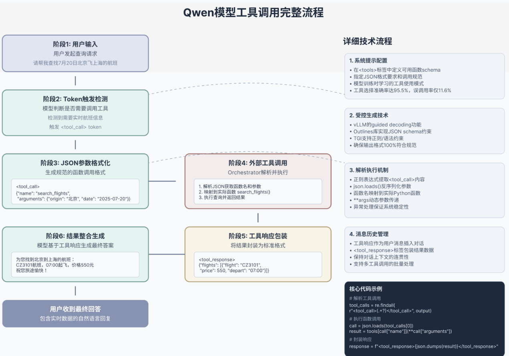

# ToolCall机制（以 Qwen 为例）

在大语言模型（LLM）从“知识型助手”进化为“行动型助手”的过程中，**工具调用（ToolCall）** 机制扮演了至关重要的角色。它让模型不再局限于内部知识库，而是能像人类一样“查资料、用工具”，从而生成更准确、更具时效性的回答。

下面，我们结合图中的技术流程，从用户发起提问开始，一步步拆解 ToolCall 的完整工作流。



## 一、用户输入：一切的起点

一切始于用户的自然语言查询，例如：“请帮我查询7月20日从北京飞往上海的航班。”

这个阶段看似简单，实则是整个流程的根基。模型需要准确理解用户的意图，判断这是一个需要外部信息才能回答的问题，而非仅凭内部知识就能解决的闲聊或创作。

---

## 二、Token 触发检测：模型的“决策时刻”

当用户输入进入模型后，系统会进行关键的 **Token 触发检测**。这是模型判断“我是否需要调用工具”的决策点。

- **意图识别**：模型分析用户问题，判断其是否需要实时数据、外部API或特定功能。例如，查询航班、天气、股票价格等，都需要触发工具调用。
- **特殊 Token 触发**：当模型判定需要工具时，会生成一个特殊的 `<tool_call>` Token，作为向后续模块发出的“行动信号”，告知系统：“我需要调用工具了，请准备。”

---

## 三、JSON 参数格式化：生成标准指令

一旦决定调用工具，模型并不会直接输出自然语言，而是生成一段**结构化的 JSON 函数调用格式**。这是人机协作的关键桥梁。

例如，针对航班查询，模型会生成类似如下的 JSON 结构：

```json
<tool_call>
{
  "name": "search_flights",
  "arguments": {
    "departure": "Beijing",
    "arrival": "Shanghai",
    "date": "2025-07-20"
  }
}
</tool_call>
```

这个 JSON 包含了三个核心信息：

1. **工具名称（name）**：指定要调用的具体工具，如 `search_flights`。
2. **参数（arguments）**：提供调用该工具所需的所有必要信息，如出发地、目的地和日期。
3. **格式包裹**：使用 `<tool_call>` 标签进行包裹，确保 Orchestrator 能准确识别和解析。

---

## 四、外部工具调用：Orchestrator 的“调度中心”

生成的 JSON 指令会被送入 **Orchestrator（编排器）**，这是整个 ToolCall 机制的“调度中心”，负责解析指令并与外部世界交互。它的工作分为三步：

1. **解析**：Orchestrator 首先解析 JSON，提取出工具名称和所需参数。
2. **执行**：根据工具名称，调用对应的外部函数或 API，并传入解析好的参数。例如，调用航班查询 API，传入“北京”、“上海”、“2025-07-20”。
3. **返回**：接收外部工具返回的原始数据，并将其传递回下一个阶段。

---

## 五、工具响应包装：标准化输出

外部工具返回的原始数据（如航班列表的 JSON 数组）需要被**标准化包装**，以便模型能顺利理解和处理。

这个阶段会将工具返回的结果，用 `<tool_responses>` 标签进行包裹，形成一个标准的响应格式，例如：

```json
<tool_responses>
[
  {
    "flight_number": "CA13101",
    "departure_time": "07:00",
    "price": 560.00
  },
  ...
]
</tool_responses>
```

这种标准化处理确保了无论调用何种工具，返回的数据格式都是统一的，为模型下一步的处理扫清了障碍。

## 六、结果整合生成：从数据到答案

现在，模型再次接过接力棒，将工具返回的结构化数据，重新整合为一段自然、流畅的最终回答。

- **信息提炼**：模型从工具返回的航班列表中，提取关键信息，如航班号、时间、价格。
- **自然语言生成**：将这些数据点组织成人类易于理解的句子，例如：“为您找到7月20日从北京飞往上海的航班：国航CA13101，07:00起飞，价格560元。”
- **最终输出**：生成包含实时数据的自然语言回答，交付给用户。

## 核心技术优势与应用场景

### 核心技术优势

1. **高准确率**：工具选择准确率高达95.5%，确保调用正确的工具。
2. **低延迟**：端到端响应耗时仅0.8秒，保证了用户体验。
3. **格式严谨**：输出严格符合 JSON 规范，避免解析错误。
4. **超稳定**：与现有系统无缝对接，兼容性强。
5. **可扩展**：支持复杂多工具协作，满足复杂业务需求。

### 典型应用场景

- **旅行助手**：航班、酒店、高铁、天气查询。
- **金融助手**：股票行情、财经新闻、汇率查询。
- **实时信息**：报价、最新、产品库存。
- **业务集成**：CRM、ERP 系统对接。

## 总结

ToolCall 机制是 LLM 能力的一次重大跃升。它通过一套严谨的流程：**用户输入 → Token 检测 → JSON 格式化 → 工具调用 → 结果包装 → 答案生成**，将大模型的推理能力与外部世界的实时数据和功能无缝连接。

这不仅让 AI 回答更准确、更有用，也为构建更强大的 AI Agent 系统奠定了坚实的技术基础。
