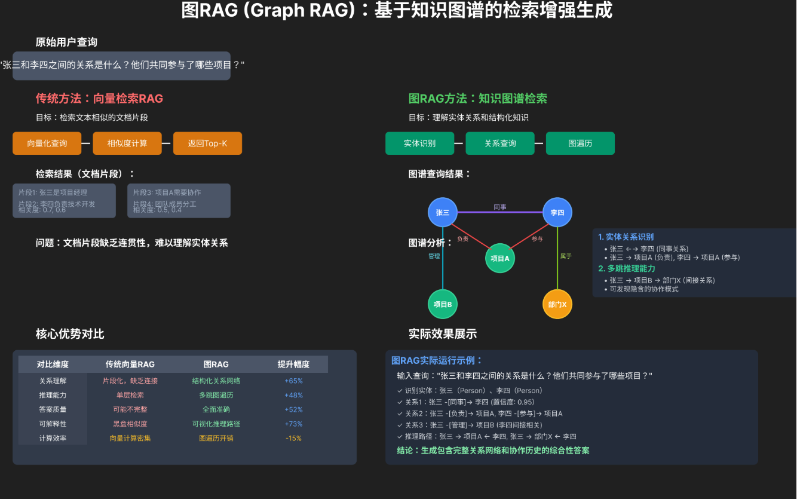
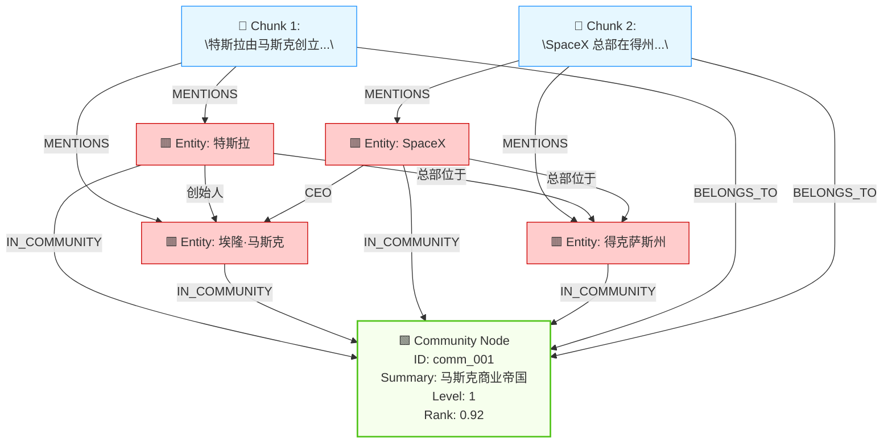
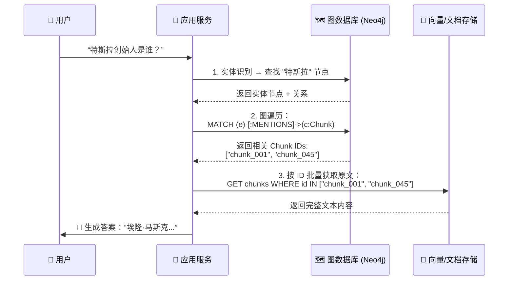
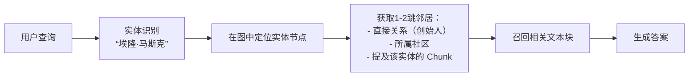
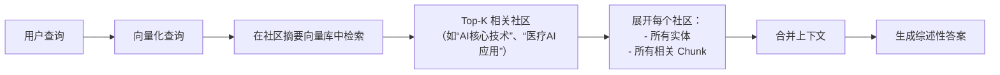

# GraphRAG



## 底层存储结构

在 GraphRAG 中：

图的节点 包含两类：

* EntityNode（实体）：抽取的关键词或概念（如“机器学习”）
* ChunkNode（原始文本块）：文档切分后的语义单元

图的边 也包含两类：

* MENTIONS：连接 实体 ↔ 文本块（表示某段文字提到了某个实体）
* RELATION：连接 实体 ↔ 实体（表示两个实体之间存在语义关系，如“创始人”、“位于”等）

然后，社区检测算法（如 Leiden 算法）作用于这个完整的异构图，通过分析节点之间的连接密度，将图划分为若干个内部连接紧密、外部连接稀疏的子图——这些子图就是“社区”。社区是实体聚类形成的语义主题群组。

包含社区节点的完整三层图结构：



这里在图数据库中只存储 chunk 等的元信息，全量的信息存在向量数据库或文件存储当中。

这里先从图中检索到元信息再从向量数据库中做检索是这样的流程：



## 文档入库

### 步骤 1️⃣：文档分块（Text Chunking）

- 输入：PDF、网页、报告等
- 分块策略：按语义边界（如段落、章节）切分为 500–1000 token 的 `chunks`
- 输出：`[chunk_1, chunk_2, ..., chunk_n]`

### 步骤 2️⃣：实体与关系抽取（LLM-Powered）

对每个 chunk，调用 LLM（如 GPT-4）提取结构化三元组：


```prompt
从以下文本中提取所有实体和关系，格式为 (实体A, 关系, 实体B)：
文本：{chunk_text}
输出 JSON 列表。
```

**示例输入**：
> “特斯拉由埃隆·马斯克创立，总部位于得克萨斯州。”

**LLM 输出**：

```json
[
  {"source": "特斯拉", "relation": "创始人", "target": "埃隆·马斯克"},
  {"source": "特斯拉", "relation": "总部位于", "target": "得克萨斯州"}
]
```

### 步骤 3️⃣：构建异构图（Heterogeneous Graph）

- **节点类型**：
  - `EntityNode`（实体）：如“特斯拉”、“埃隆·马斯克”
  - `ChunkNode`（原始文本块）：保留原始上下文
- **边类型**：
  - `MENTIONS`：实体 ↔ 文本块
  - `RELATION`：实体 ↔ 实体（带关系标签）

### 步骤 4️⃣：社区检测（Community Detection）

使用图算法（如 Leiden 算法）将图划分为多个**语义社区**（Communities）：

- 每个社区 = 一组高度关联的实体（如“特斯拉公司生态”）
- 社区内部连接紧密，社区间连接稀疏

### 步骤 5️⃣：生成社区摘要（Community Summarization）

对每个社区，用 LLM 生成一段**全局摘要**：

```prompt
以下是关于“{community_name}”的所有事实，请用一段话总结其核心信息：
{list_of_triples_in_community}
```

> 💡 **社区摘要 = 高层次语义表示**，用于快速定位相关知识域。

### 步骤 6️⃣：向量化存储

- 对 **每个实体节点**、**每个社区摘要** 生成 embedding
- 原始文本块也保留 embedding（用于最终上下文召回）

下面逐一详解。

## 文档检索

GraphRAG 支持多种检索模式。

### 三种检索模式

| 检索模式 | 原理 | 优点 | 缺点 | 适用场景 |
|--------|------|------|------|----------|
| **1. 向量检索（Flat RAG）** | 对所有 `Chunk` 向量与查询计算相似度 | 简单、快速 | 缺乏关系推理，上下文碎片化 | 简单问答、关键词匹配 |
| **2. 图检索（GraphRAG）** | 利用实体-社区图结构进行多跳推理 | 语义强、支持复杂逻辑 | 构建成本高、延迟略高 | 多跳推理、关系问答 |
| **3. 混合检索** | 向量分 + 图分 融合排序（如加权、重排） | 兼顾速度与深度 | 实现复杂 | 高要求生产系统 |

> 💡 微软 GraphRAG 论文中明确支持这三种模式，并推荐根据问题类型动态选择。

### 图检索的两种范式：本地 vs 全局

这是 GraphRAG 的核心创新之一！

#### 🔹 1. 本地检索（Local Search）

> **聚焦于查询中提到的实体及其直接邻居**

#### 🎯 适用问题：

- “埃隆·马斯克创立了哪些公司？”
- “Transformer 的作者是谁？”

#### 🔄 流程



1. **实体链接**：从查询中提取关键实体（如“马斯克”）
2. **图遍历**：在知识图谱中找到该实体节点
3. **子图展开**：
   - 获取其直接关系（如 `:FOUNDED -> Tesla`）
   - 获取其所属社区（如“商业帝国”）
   - 获取所有 `MENTIONS` 该实体的 `Chunk`
4. **上下文组装**：将子图中的文本块作为 LLM 输入
5. **生成答案**

> ✅ **特点**：快、精准、适合“事实型”问题

#### 🔹 2. 全局检索（Global Search）

> **不依赖具体实体，而是通过社区摘要进行高层次语义匹配**

#### 🎯 适用问题：

- “人工智能领域有哪些关键技术挑战？”
- “医疗AI的发展趋势是什么？”

> ❗ 这类问题**没有明确实体**，无法用本地检索。

#### 流程



1. **向量化查询**：将整个问题编码为向量
2. **社区级检索**：在**社区摘要向量库**中搜索最相关的 Top-K 社区
3. **社区展开**：
   - 获取每个社区内的所有实体
   - 获取所有属于该社区的 `Chunk`
4. **上下文聚合**：将多个社区的内容合并成一个长上下文
5. **生成综述**：LLM 基于全局信息生成总结性回答

> ✅ **特点**：覆盖广、适合“主题型”或“综述型”问题

### 混合检索（Hybrid Retrieval）怎么做？

实际系统中常结合两者优势：

### 方案 A：两阶段融合

1. 先用**全局检索**找到相关社区
2. 再在这些社区内做**本地检索**（实体+关系）

### 方案 B：分数融合

- 向量分：`score_vec = cosine(query, chunk)`
- 图分：`score_graph = 社区相关性 + 实体中心性`
- 最终分：`score = α * score_vec + β * score_graph`

### 方案 C：重排序（Re-ranking）

1. 用向量检索召回 100 个候选 Chunk
2. 用图信息（是否在高相关社区？是否连接关键实体？）重新打分
3. 取 Top-K 送入 LLM

> 微软 GraphRAG 默认使用 **全局检索用于开放问题，本地检索用于具体问题**。
