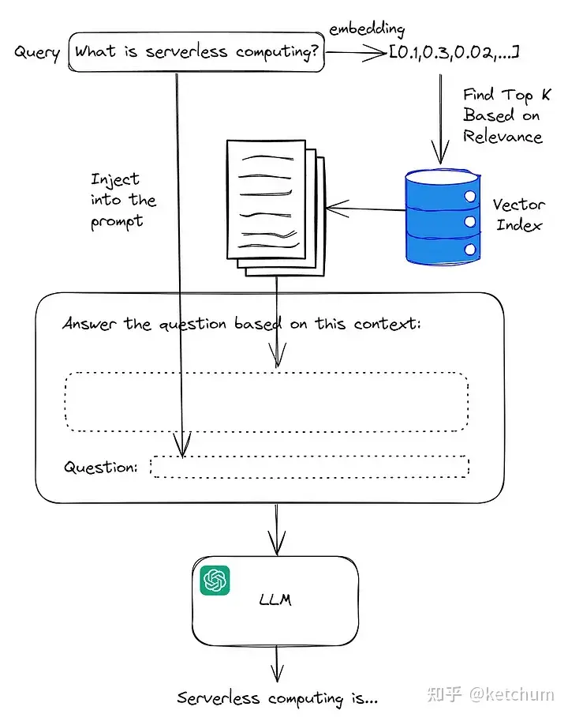
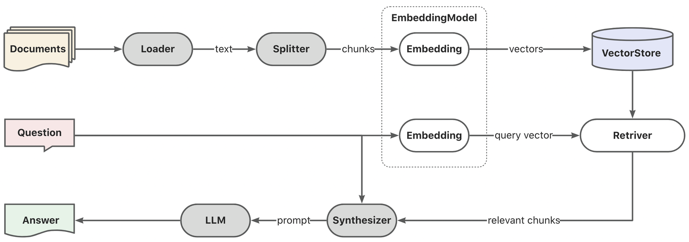
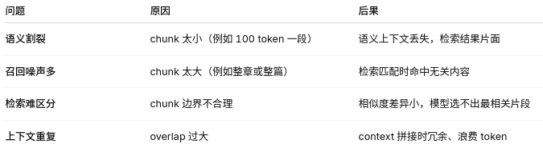
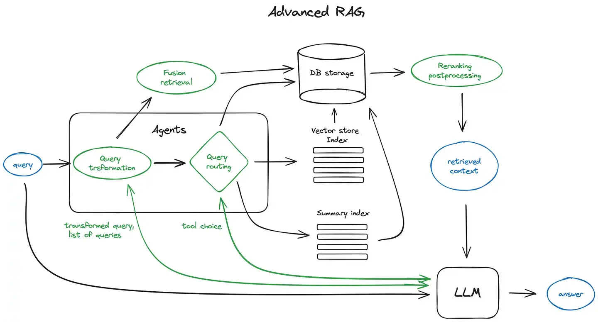
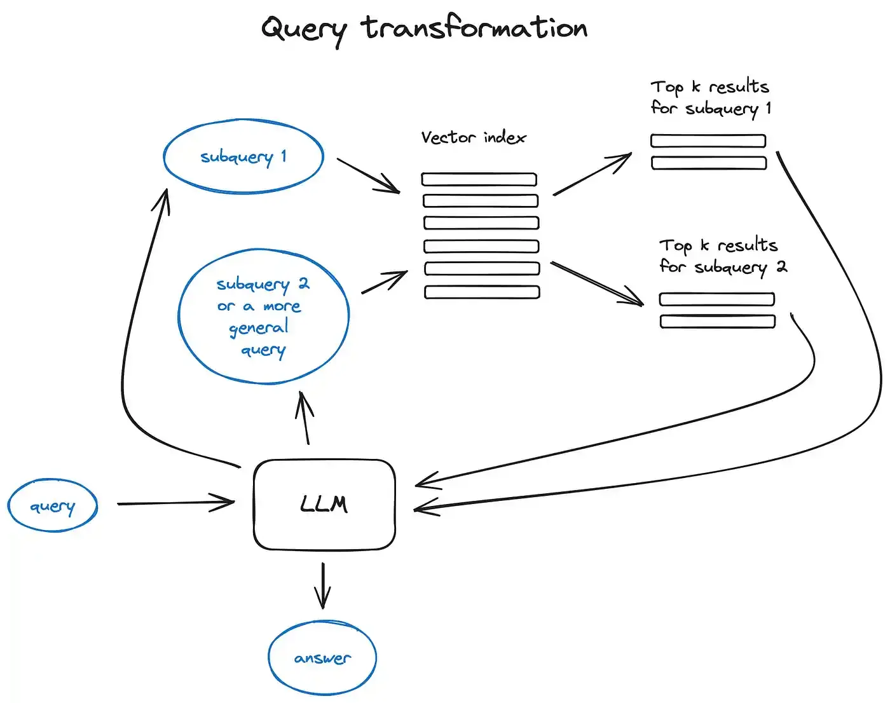
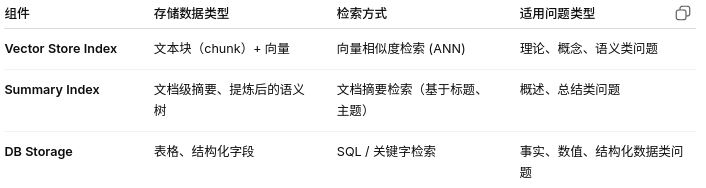
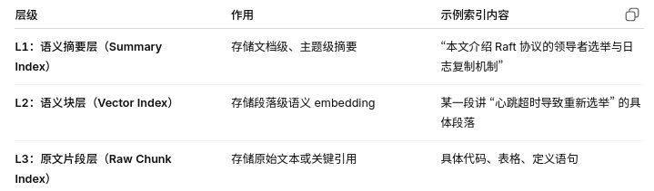
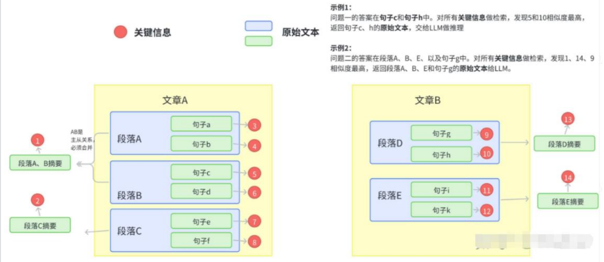

# RAG

## RAG 解决了什么问题？

在大模型的应用中会发现以下一些问题：

* 知识的局限性：大模型自身的知识完全源于训练数据，而现有的主流大模型（deepseek、文心一言、通义千问…）的训练集基本都是构建于网络公开的数据，对于一些实时性的、非公开的或私域的数据是没有。
* 幻觉问题：所有的深度学习模型的底层原理都是基于数学概率，模型输出实质上是一系列数值运算，大模型也不例外，所以它经常会一本正经地胡说八道，尤其是在大模型自身不具备某一方面的知识或不擅长的任务场景。
* 数据安全性：对于企业来说，数据安全至关重要，没有企业愿意承担数据泄露的风险，尤其是大公司，没有人将私域数据上传第三方平台进行训练会推理。这也导致完全依赖通用大模型自身能力的应用方案不得不在数据安全和效果方面进行取舍。

而RAG是解决上述问题的有效方案。

RAG 是 检索增强生成(Retrieval-Augmented Generation) 的缩写，是一种将信息检索技术与大型语言模型(LLM) 相结合的AI 框架。 通过在生成回答前从外部知识库检索相关信息，RAG 可以让LLM 生成更准确、更及时且更具上下文相关性的答案。 这使得LLM 能够在不重新训练的情况下，利用特定的私有或最新数据。

简单来说：

RAG = 检索技术 + LLM 提示。
例如，向 LLM 提问一个问题（qustion），RAG 从各种数据源检索相关的信息，并将检索到的信息和问题（answer）注入到 LLM 提示中，LLM 最后给出答案。



在这个过程中，有两个主要步骤：语义搜索和生成输出。在语义搜索步骤中，从知识库中找到与要回答的查询最相关的部分内容。然后，在生成步骤中，将使用这些内容来生成响应。

## RAG的运转流程

RAG就是通过检索获取相关的知识并将其融入Prompt， 让大模型能够参考相应的知识从而给出合理回答。因此，可以将RAG的核心理解为“检索+生成”，前者主要是利用向量数据库的高效存储和检索能力，召回目标知识；后者则是利用大模型和Prompt工程，将召回的知识合理利用，生成目标答案。



RAG 的使用可以分为数据准备阶段和检索阶段。

### 数据准备阶段

数据准备阶段：数据提取——>文本分割——>向量化（embedding）——>数据入库

### 数据提取

数据加载：包括多格式数据加载、不同数据源获取等，根据数据自身情况，将数据处理为同一个范式。

数据处理：包括数据过滤、压缩、格式化等。

元数据获取：提取数据中关键信息，例如文件名、Title、时间等 。

### 分块 

首先要知道为什么需要对文档进行切分，RAG 中的文档切分是为了：

1. 建立高效的向量索引：长文无法直接做 embedding，模型有 token 限制。
2. 提高检索精度：细粒度切分能让搜索到的内容更聚焦。
3. 减少无关信息（噪声）：避免把整篇不相关内容喂给 LLM。

但在这里切分粒度产生两个关键的“矛盾”：

1. 切得太小 → 信息碎片化、语义丢失。
2. 切得太大 → 引入噪声、降低相似度匹配精度。



那在这里我们应该怎么切分？

基于语义结构的切分（Semantic Chunking）

这样的切分不按字数、而按自然语言的语义边界切。利用 LLM 或句向量模型识别自然断句，保留同一主题、同一逻辑段落。

常见方法：根据标题、句号、换行、Markdown 标记、HTML tag 切分。

滑动窗口切分（Sliding Window Chunking）

为防止割裂上下文，设置 overlap（重叠区）

比如设置chunk_size = 500 tokens，overlap = 100 tokens则会有：

* Chunk1: [0~500]
* Chunk2: [400~900]

这样相邻块会共享部分内容，保证跨段语义连续。

动态切分（Adaptive Chunking）

根据内容密度动态调整 chunk 大小。

实现方式：

* 如果文档逻辑紧密（如代码、论文公式） → 切小；
* 如果是叙述性文本（如新闻、论文摘要） → 切大；

可用句向量距离判断边界：当相邻句子向量余弦相似度 < 阈值 → 分块

### 向量化（embedding）

向量化是一个将文本数据转化为向量矩阵的过程，该过程会直接影响到后续检索的效果。目前常见的embedding模型如表中所示，这些embedding模型基本能满足大部分需求，但对于特殊场景（例如涉及一些罕见专有词或字等）或者想进一步优化效果，则可以选择开源Embedding模型微调或直接训练适合自己场景的Embedding模型。

## 应用阶段



### 整体思路

传统 RAG 的流程是：

Query → 向量检索 → 返回文档 → 拼 Prompt 给 LLM → 生成答案

而这张图展示的是 高级 RAG 管线，它在中间加入了一个 Agents 层，让模型能：

* 自动理解 query 的意图；
* 动态决定「怎么查、查哪里」；
* 进行多源融合、重排优化。

### 用户输入：query

用户输入问题，例如：

“介绍一下 Transformer 的注意力机制原理”

### Agents 层（智能检索代理）

Agents 是核心改进部分，包含两个子模块：

#### Query Transformation（查询改写）

利用LLM 或规则系统将原始 query 改写成更利于检索的形式。



例如当你问：“在 Github 上，Langchain 和 LlamaIndex 这两个框架哪个更受欢迎？”

一般不太可能直接在语料库找到它们的比较，所以将这个问题分解为两个更简单、具体的合理的子查询：

“Langchain 在 Github 上有多少星？”

“Llamaindex 在 Github 上有多少星？”

这些子查询会并行执行，检索到的信息随后被汇总到一个 LLM 提示词中。在这一步决定了“怎么查”。

#### Query Routing（查询路由）

查询路由是 LLM 驱动的决策步骤，决定在给定用户查询的情况下下一步该做什么——选项通常是总结、对某些数据索引执行搜索或尝试许多不同的路由，然后将它们的输出综合到一个答案中。在这一步决定了“去哪查”。

* 若问题偏理论 → 查 Vector Store
* 若问题偏总结类 → 查 Summary Index
* 若问题涉及表格数据 → 查 DB Storage

相当于一个智能的检索调度器。

LLM 可以学习或规则化地判断路由。根据路由结果，Agents 调用不同的数据源：



### 检索阶段

#### 分层索引

基于 LLM 的文档对话架构分为两部分，先检索，后推理。重心在检索（推荐系统）。为了加快索引速度，提高召回率减少无关信息。

在这里会将所有的文本组织成多级索引：



检索部分只对关键信息做 embedding，参与相似度计算，把召回结果映射的 原始文本交给给 LLM 整合即可。
主要架构图如下：



那在这个过程中的关键词与摘要等如何提取？

1. 文本结构化分析​​：识别标题层级、按主题分段，构建​​主题树​​，保持上下文关联。
2. 关键词与实体抽取​​：使用NLP工具或LLM提取关键词、命名实体、专有术语，用于语义聚类和索引。
3. 摘要生成​​：对每段内容生成​​抽取式或生成式摘要​​，形成摘要索引（Summary Index）。
4. 语义嵌入分层​​：为摘要、段落、文本块分别生成向量，支持从​​主题召回​​到​​精确内容匹配​​的多级检索。
5. 信息压缩与对齐​​：通过聚类、主题归并、层间映射表（如SummaryID与VectorID的关联）优化检索效率，减少冗余。

#### Fusion Retrieval（融合检索）

把来自不同源的检索结果合并（Fusion），通常使用：

* RR Fusion (Reciprocal Rank Fusion)：多结果列表加权融合；
* Hybrid Search：语义匹配 + 关键词匹配结果融合。

目的是让召回尽可能全面、去重、排序合理。

#### Reranking & Postprocessing（重排与后处理）

对融合后的结果进行：

* 精排（使用 cross-encoder 或 reranker）
* 去噪（剔除低相关、重复、冗余文本）
* 片段拼接、去格式化等。

输出最有代表性的上下文：retrieved contex

#### 生成阶段（LLM）

将 retrieved context（检索到的上下文） 与用户问题一起拼接进 Prompt：

```txt
系统提示：你是一个专业问答助手。
上下文：
[context1]
[context2]
问题：
请解释 Transformer 注意力机制。
```

LLM 进行推理、整合，生成最终答案。
