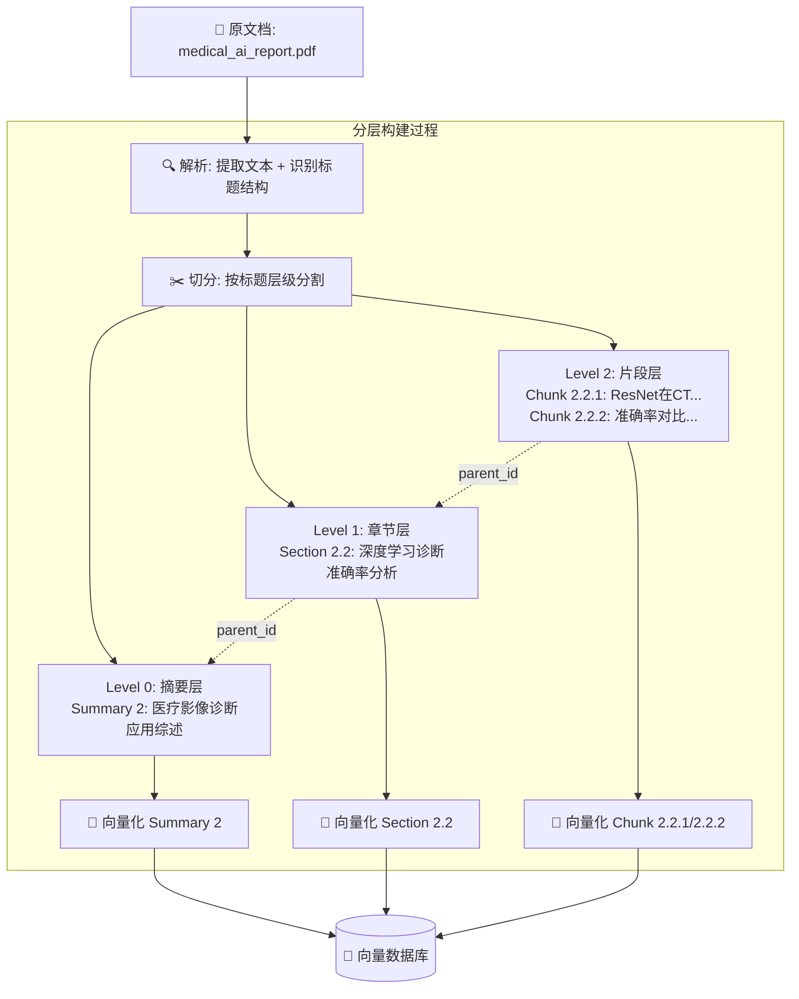
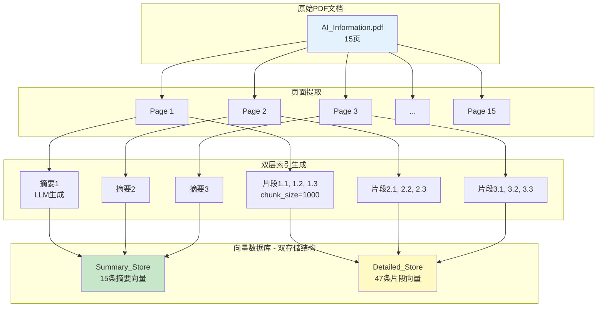
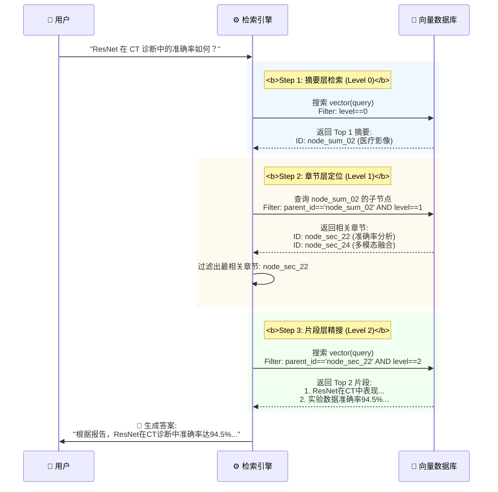

# 分层检索rag


分层检索（Hierarchical Retrieval）是一种是一种将文档按“摘要 → 章节 → 片段”三级结构组织，并通过逐层导航高效检索相关信息的技术。它解决了传统“扁平检索”在面对海量数据时精度低、噪声多、计算开销大的问题。

## 为什么需要分层检索

在 RAG 或信息检索系统中，直接对百万级文档做向量检索会遇到：

| 问题 | 说明 |
|------|------|
| ❌ **高噪声** | Top-K 结果可能包含大量表面相似但语义无关的片段 |
| ❌ **上下文碎片化** | 检索到的是孤立句子，缺乏整体逻辑 |
| ❌ **计算成本高** | 全库扫描耗时长，尤其在长上下文场景 |
| ❌ **推理能力弱** | LLM 难以从零散片段中进行复杂推理 |



这里的 Summary Section Chunk 都是存储各层级向量化存储的库。

## 文档分层结构（Document Hierarchy Structure）

以《医疗AI研究报告.pdf》为例，构建三层索引：

| 层级 | 名称 | 内容 | 作用 |
|------|------|------|------|
| **第1层：摘要层（Summary Level）** | 摘要索引 | 每章生成一个简短摘要（如 50~100 字） | 快速定位主题 |
| **第2层：章节层（Section Level）** | 章节索引 | 每个章节标题 + 页面数 | 缩小搜索范围 |
| **第3层：片段层（Chunk Level）** | 片段索引 | 实际文本块（如 512-token） | 获取精确内容 |

## 文档入库



```py
def process_document_hierarchically(pdf_path, chunk_size=1000, chunk_overlap=200):
    """
    将文档处理为分层索引。

    参数:
        pdf_path (str): PDF文件的路径
        chunk_size (int): 每个详细块的大小
        chunk_overlap (int): 块之间的重叠部分

    返回:
        Tuple[SimpleVectorStore, SimpleVectorStore]: 摘要和详细的向量存储
    """
    # 从PDF中提取页面
    pages = extract_text_from_pdf(pdf_path)
    
    # 为每一页创建摘要
    print("Generating page summaries...")
    summaries = []
    for i, page in enumerate(pages):
        print(f"Summarizing page {i+1}/{len(pages)}...")
        summary_text = generate_page_summary(page["text"])
        
        # 创建摘要元数据
        summary_metadata = page["metadata"].copy()
        summary_metadata.update({"is_summary": True})
        
        # 将摘要文本和元数据追加到摘要列表中
        summaries.append({
            "text": summary_text,
            "metadata": summary_metadata
        })
    
    # 为每一页创建详细的块
    detailed_chunks = []
    for page in pages:
        # 对页面的文本进行分块
        page_chunks = chunk_text(
            page["text"], 
            page["metadata"], 
            chunk_size, 
            chunk_overlap
        )
        # 使用当前页面的块扩展详细的块列表
        detailed_chunks.extend(page_chunks)
    
    print(f"Created {len(detailed_chunks)} detailed chunks")
    
    # 为摘要创建嵌入
    print("Creating embeddings for summaries...")
    summary_texts = [summary["text"] for summary in summaries]
    summary_embeddings = create_embeddings(summary_texts)
    
    # 为详细的块创建嵌入
    print("Creating embeddings for detailed chunks...")
    chunk_texts = [chunk["text"] for chunk in detailed_chunks]
    chunk_embeddings = create_embeddings(chunk_texts)
    
    # 创建向量存储
    summary_store = SimpleVectorStore()
    detailed_store = SimpleVectorStore()
    
    # 向摘要存储中添加摘要
    for i, summary in enumerate(summaries):
        summary_store.add_item(
            text=summary["text"],
            embedding=summary_embeddings[i],
            metadata=summary["metadata"]
        )
    
    # 向详细的存储中添加块
    for i, chunk in enumerate(detailed_chunks):
        detailed_store.add_item(
            text=chunk["text"],
            embedding=chunk_embeddings[i],
            metadata=chunk["metadata"]
        )
    
    print(f"Created vector stores with {len(summaries)} summaries and {len(detailed_chunks)} chunks")
    return summary_store, detailed_store
```

## 分层检索流程（Hierarchical Search Process）

### ✅ 示例查询

> “深度学习在医疗影像诊断中的最新应用和技术挑战”



### 🔁 检索步骤（逐层递进）

#### **步骤1：摘要层检索（粗筛）**

- 查询：`"医疗影像诊断最新应用"`
- 在所有**章节摘要**中进行向量检索
- 匹配结果：
  - ✅ 摘要2: 医疗影像诊断应用 (0.91)
  - ✅ 摘要3: 技术挑战与限制 (0.83)

> 📌 结果：确定用户关心的是**第二章和第三章**

#### **步骤2：章节层检索（中筛）**

- 只在**匹配的章节内**继续搜索
- 查询：`"深度学习在CT诊断中的应用"`
- 在“第2章”下查找相关子章节
- 匹配结果：
  - ✅ 2.2 深度学习诊断准确率分析 (0.89)
  - ✅ 2.4 多模态影像融合技术 (0.86)


> 📌 结果：聚焦到两个具体技术点

#### **步骤3：片段层检索（精筛）**
- 在**匹配的章节内**进一步细化
- 查询：`"ResNet在CT诊断中的表现"`
- 查找对应片段
- 匹配结果：
  - ✅ Chunk 2.2.1: ResNet在CT诊断
  - ✅ Chunk 2.2.2: 准确率对比实验

> 📌 结果：获取最相关的原始内容用于生成答案