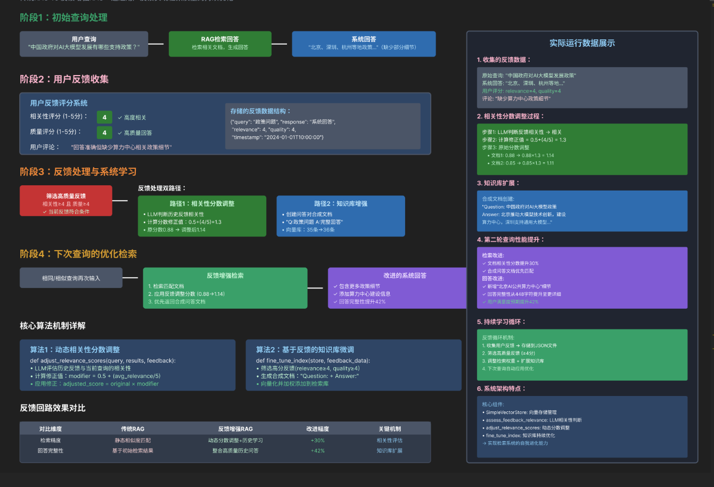
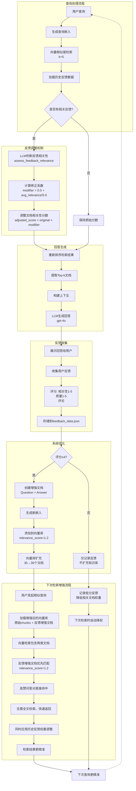
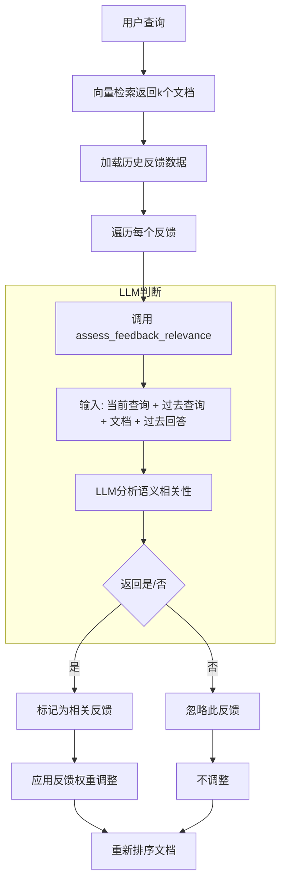

# 反馈回路机制





## 反馈回路机制的五大核心组件

### 用户反馈收集

```py
def get_user_feedback(query, response, relevance, quality, comments=""):
    """
    格式化用户反馈为字典。

    参数:
        query (str): 用户的查询
        response (str): 系统的回复
        relevance (int): 相关性评分 (1-5)
        quality (int): 质量评分 (1-5)
        comments (str): 可选的反馈评论

    返回:
        Dict: 格式化的反馈
    """
    return {
        "query": query,
        "response": response,
        "relevance": int(relevance),
        "quality": int(quality),
        "comments": comments,
        "timestamp": datetime.now().isoformat()
    }
```

### 相关性分数动态调整

```py
def adjust_relevance_scores(query, results, feedback_data):
    # 根据历史反馈调整检索文档的相关性得分
    modifier = 0.5 + (avg_relevance / 5.0)  # 转换为0.5-1.5的修正系数
    adjusted_score = original_score * modifier
```

工作原理：

* 分析历史反馈，判断哪些与当前查询相关
* 根据反馈评分调整文档的相关性得分
* 高分反馈（≥4）提升文档权重，低分反馈降低权重
* 示例效果： 文档相关性从 0.9457 提升到 1.2294（提升约30%）

### 索引微调

```py
def fine_tune_index(current_store, chunks, feedback_data):
    # 筛选高质量反馈（评分≥4）
    good_feedback = [f for f in feedback_data if f['relevance'] >= 4 and f['quality'] >= 4]
    
    # 将高赞问答对转化为"合成文档"
    enhanced_text = f"Question: {feedback['query']}\nAnswer: {feedback['response']}"
    
    # 添加到向量库并提升权重
    new_store.add_item(
        text=enhanced_text,
        embedding=embedding,
        metadata={"type": "feedback_enhanced", "relevance_score": 1.2}
    )
```

作用： 将验证过的高质量问答对直接加入知识库，下次相似问题可直接命中。

### 反馈相关性智能判断

```py
def assess_feedback_relevance(query, doc_text, feedback):
    # 使用LLM判断历史反馈是否与当前查询相关
    # 只回答"是"或"否"
    return '是' in response
```

作用： 避免无关反馈干扰当前检索，确保只有相关反馈才会影响结果。

使用 LLM 判断历史反馈是否相关.



### 持续学习闭环

用户查询 → 检索文档 → 生成回复 → 收集反馈 → 调整权重/扩充知识库 → 下次查询更准确
循环过程：

系统初始化：原始文档片段（如35个chunk）
用户交互后收集反馈
高质量反馈转化为新文档加入向量库（如增加到36个）
相关性分数根据反馈历史动态调整
下次查询时检索更精准