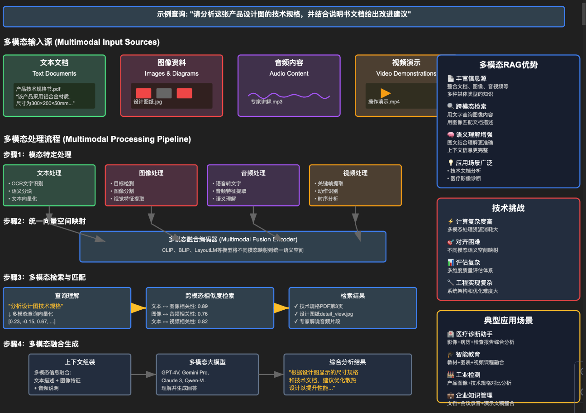
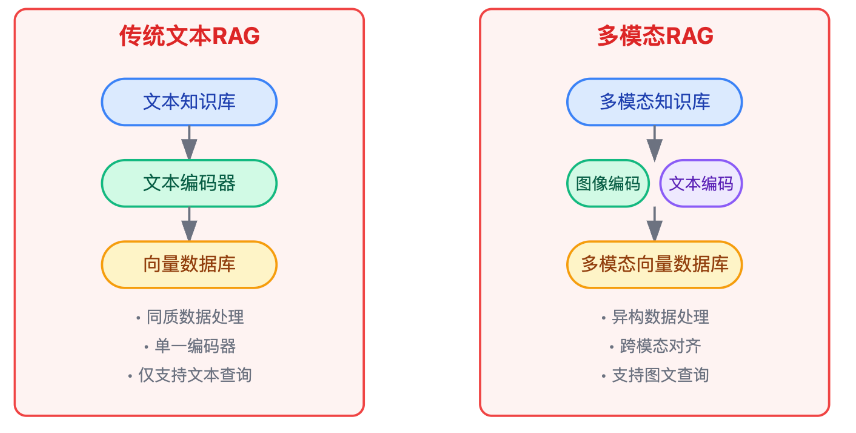
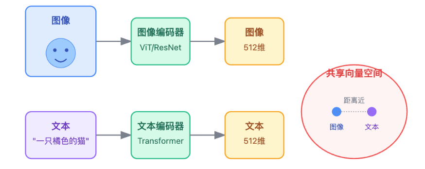
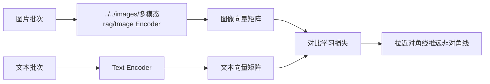
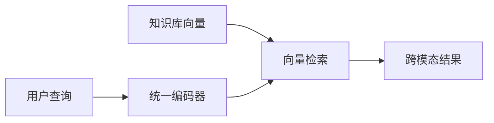
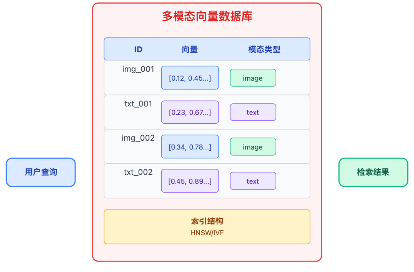

# 多模态rag

理解多模态RAG首先要明白它和传统文本RAG的本质区别。传统文本RAG处理的是同质数据，用BERT这类文本编码器把一段话编码成768维向量，查询的时候也用同样的编码器把问题变成768维向量，然后做余弦相似度计算。这个过程完全工作在文本空间里，非常简单直接。但如果我们的知识库里有图片呢?最直观的想法可能是给图片配文字描述，然后检索这些描述，但这样就丢失了图像本身的视觉信息，而且也无法支持用户直接上传图片来检索。

## 多模态 rag 的核心架构

多模态的本质是要在高维空间里建立一种映射关系，让描述同一个事物的图片和文字在空间中靠得很近。比如一张猫的照片和"一只橘色的猫趴在沙发上"这段文字，虽然它们的原始数据完全不同--一个是像素矩阵，一个是token序列，但在经过特殊设计的编码器处理后，它们的向量表示应该距离很近。这就是所谓的跨模态对齐，这个概念是整个多模态RAG系统的理论基础。

在这里会通过多模态模型如 CLIP、BLIP、Qwen-VL 等先对图像进行处理，将图形切割并将切割开的块转换为视觉 token。

同时文本也会被处理为文本token。

在完成了对文本与图片的向量化处理之后会对其进行语义对齐训练的操作。

训练目标是让配对的图文向量相似度高，不配对的相似度低。具体来说，一个batch里如果有1000对图文，那每张图片的向量要和它对应的文字向量距离最近，和其他999个文字向量距离尽可能远。

### 语义对齐的训练阶段

在训练阶段会进行如下步骤。

步骤1：分别编码

* 图像 → 经过 ../../images/多模态rag/Image Encoder（如 ViT/ResNet）→ 得到 图像向量矩阵
* 文本 → 经过 Text Encoder（如 Transformer）→ 得到 文本向量矩阵
* 此时两个编码器是独立运行的，没有直接交互。
步骤2：计算对比损失

* 将图像向量和文本向量组合成一个 相似度矩阵
* 对于每一对匹配图文：
   * 让它们的向量距离尽可能近（对角线）
   * 让它们与其他不匹配文本的距离尽可能远（非对角线）

这个过程称为 对比学习损失（Contrastive Loss）。

这里采取了一种双塔结构的设计：

这种双塔结构的设计有个巨大的优势:图像和文本的编码过程是独立的，不需要交叉attention，所以可以提前把知识库的所有图文都编码好存起来。查询的时候只需要编码query，然后做向量检索就行，速度很快。如果采用early fusion的方式，每次查询都要把query和候选文档拼一起送进模型，那在百万级知识库上根本不可行。从工程角度看，这种架构能够让我们在检索性能和语义理解之间找到平衡点。

### 统一编码器

经过对齐训练后会得到统一编码器。“统一编码器”并不是一个物理上合并的单一模型，而是指经过对齐训练后的一对编码器（图像编码器 + 文本编码器），它们共同构成了一个语义对齐的“统一向量空间”。

#### 1. **训练前：两个独立编码器**

- **图像编码器**（如 ViT）：只见过图片，输出图像向量
- **文本编码器**（如 BERT/Transformer）：只见过文字，输出文本向量 

→ 它们的向量空间**互不相关**，维度可能相同，但语义无法比较。

#### 2. **训练中：通过对比学习强制对齐**

使用大量图文配对数据（如 LAION 数据集），通过 **对比损失函数**（Contrastive Loss / InfoNCE）：

- 拉近匹配图文对的向量距离
- 推远不匹配图文对的向量距离

> 🔁 这个过程会**同时优化两个编码器的参数**，让它们“学会用同一种语言说话”。

#### 3. **训练后：形成“统一语义空间”**

- 虽然仍是两个独立模型，但它们的输出向量：
  - 具有**相同的维度**（如 512 维）
  - 处于**同一个语义坐标系**中
  - 可以直接计算余弦相似度进行跨模态检索

常见误解：

| 误解 | 正确理解 |
|------|--------|
| “统一编码器 = 一个融合模型” | 实际是**两个对齐的独立编码器** |
| “图像和文本在编码时就融合了” | 编码过程**完全分离**，融合发生在向量空间 |
| “只要结构一样就能对齐” | 必须通过**大规模对比学习训练**才能对齐 |

### 推理阶段

用户输入（文本或图像）→ 使用训练好的编码器生成向量

在已经对齐的共享向量空间中进行搜索，找到最相关的图文片段返回。

因为训练时已经让“猫的图片”和“猫的文字”靠近，所以现在可以用文字找图，也可以用图找文。

## 向量存储

多模态向量库和单模态的主要区别在于需要记录模态类型。比如Milvus在建索引时，除了存512维的向量，还会有个metadata字段标记这条数据是../../images/多模态rag/image还是text，以及它的原始ID。这样做有两个好处:一是可以做模态过滤，比如用户只想看图片结果;二是在结果融合时可以根据模态类型做不同的后处理。

## 实战落地中的工程实践

生产环境最大的挑战其实是QPS和延迟。假设系统要支持1000 QPS，单次CLIP推理大概50ms，向量检索10ms，这样算下来单机根本扛不住。优化思路要从三个方向入手。第一是模型推理加速，用TensorRT或者ONNX Runtime把CLIP模型量化到INT8，推理速度能提升2-3倍，对精度影响不大。第二是加缓存，把热门query的向量缓存在Redis，省去重复编码的开销。第三是混合检索，不是所有query都要走向量召回，可以先用商品类目做粗筛，把候选集从百万降到几万，然后再做精排。

实际落地中有几个坑值得注意。

第一个是冷启动问题，新上架的商品可能没有足够的图文配对数据，CLIP编码出来的向量质量不稳定，需要人工标注一些种子数据做微调。

第二个是模态不平衡，如果商品库里图片占90%，文本只占10%，检索时容易偏向图片结果，需要在軍排序时做模态均衡。

第三个是向量更新策略，商品信息会变化，向量也要更新，全量重建成本太高，得设计增量更新机制，比如每天凌晨只更新变更的商品。上线后要盯着召回率和响应时间两个指标。召回率可以通过人工标注的测试集来离线评估，比如准备1000个query，看top10结果里相关商品的占比。响应时间要在Milvus查询日志里统计P99延迟，如果超过100ms就得排查是索引参数不合适还是数据倾斜。
