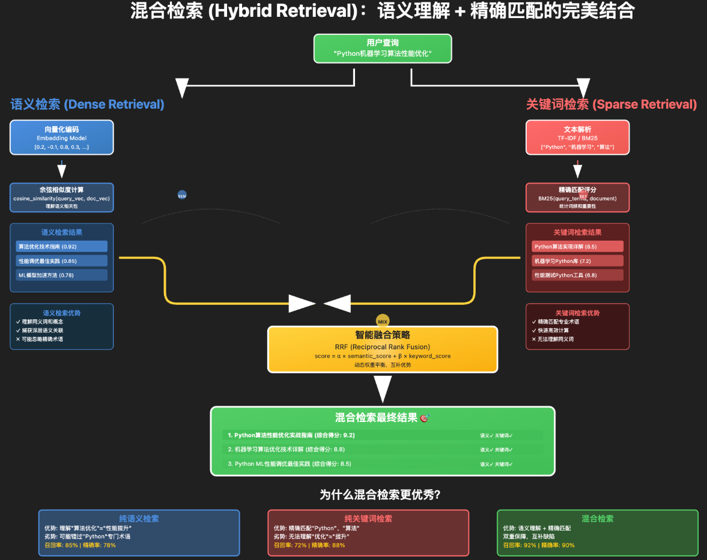

# 多路召回融合



## 为什么需要多路召回

多路召回融合是构建高质量RAG系统的核心策略，主要基于以下关键原因：

**1. 弥补单一召回方式的固有缺陷**：

每种召回技术都有局限性：

- **向量检索**：擅长语义理解但可能召回不相关文档（如"苹果"同时匹配水果和科技公司）
- **关键词检索**：精确匹配但无法处理同义词和自然语言变化（如"AI"无法匹配"人工智能"）
- **元数据检索**：快速筛选但依赖元数据质量

单一召回器无法同时满足语义理解、精确匹配和结构化过滤的需求。

 **2.提升复杂查询的覆盖能力**：

现实中的用户查询往往是混合型的：

- **示例**："2023年苹果公司发布了哪些AI相关产品"
  - 需要语义理解（AI产品）
  - 需要精确匹配（苹果公司）
  - 需要时间过滤（2023年）
  
多路融合能同时满足语义、关键词和时间要求，而单一召回器只能覆盖部分需求。

**3.适应多样化的用户查询习惯**：

不同用户有不同表述方式：

- 专业用户："机器学习算法有哪些"（关键词检索更有效）
- 普通用户："教我怎么用AI写文章"（向量检索更有效）
- 混合查询："那个做AI的公司，总部在加州"（需要融合策略）

多路召回能自适应不同查询习惯，提供一致的良好体验。

**4. 平衡召回率与准确率**：

- **向量检索**：高召回率但准确率可能较低
- **关键词检索**：高准确率但召回率有限

融合策略可以在保持较高召回率的同时提升准确率，找到最佳平衡点。

**5. 增强系统鲁棒性和可扩展性**：

- **容错能力**：某一路召回失败时，其他路径仍可工作
- **易于扩展**：添加新领域知识时，只需增加相应检索器
- **多语言支持**：不同语言的检索器可以并行工作

**6. 提升用户体验和业务价值**：

- **减少"未找到相关信息"的情况**：多路召回显著提高覆盖度
- **提供更相关的答案**：融合策略优化排序，将最相关文档排在前列
- **支持自然对话**：适应不同表述方式和查询复杂度

多路召回融合本质上是通过**技术组合互补**来解决单一技术的局限性，在保持系统性能的同时，显著提升召回效果和用户体验。对于需要处理复杂、多样化查询的生产级RAG系统来说，多路召回融合不是可选项，而是必选项。

## 多路召回融合的核心思想

### **基本理念**

```python
# 单一召回路径的局限性
vector_results = vector_retriever.search(query)  # 语义相似但可能漏召
keyword_results = keyword_retriever.search(query)  # 精确匹配但语义理解弱
hybrid_results = fusion(vector_results, keyword_results)  # 优势互补
```

## 🔧 多路召回融合的实现步骤

### **步骤1：定义多种召回器**

```python
from langchain.retrievers import (
    BM25Retriever, 
    EnsembleRetriever,
    ContextualCompressionRetriever
)
from langchain_community.vectorstores import Chroma
from langchain_openai import OpenAIEmbeddings

class MultiPathRetrieval:
    def __init__(self, documents):
        # 1. 向量检索器（语义相似度）
        embeddings = OpenAIEmbeddings()
        self.vector_store = Chroma.from_documents(documents, embeddings)
        self.vector_retriever = self.vector_store.as_retriever(
            search_kwargs={"k": 10}
        )
        
        # 2. 关键词检索器（精确匹配）
        self.bm25_retriever = BM25Retriever.from_documents(documents)
        self.bm25_retriever.k = 10
        
        # 3. 元数据检索器（结构化过滤）
        self.metadata_retriever = self._create_metadata_retriever()
        
        # 4. 其他召回器（可选）
        # - 图检索器（关系查询）
        # - 时间序列检索器（时效性优先）
        # - 领域专用检索器
```

### **步骤2：实现融合策略**

#### **策略1：加权融合（Weighted Fusion）**
```python
def weighted_fusion(self, query, weights=None):
    """加权融合策略"""
    if weights is None:
        weights = {"vector": 0.6, "bm25": 0.3, "metadata": 0.1}
    
    # 并行执行多路召回
    vector_results = self.vector_retriever.get_relevant_documents(query)
    bm25_results = self.bm25_retriever.get_relevant_documents(query)
    metadata_results = self.metadata_retriever.get_relevant_documents(query)
    
    # 计算加权分数
    scored_docs = {}
    
    # 向量检索结果加权
    for i, doc in enumerate(vector_results):
        score = (len(vector_results) - i) * weights["vector"]
        if doc.metadata.get("id") not in scored_docs:
            scored_docs[doc.metadata.get("id")] = {
                "doc": doc, 
                "score": score,
                "sources": ["vector"]
            }
        else:
            scored_docs[doc.metadata.get("id")]["score"] += score
            scored_docs[doc.metadata.get("id")]["sources"].append("vector")
    
    # BM25结果加权
    for i, doc in enumerate(bm25_results):
        score = (len(bm25_results) - i) * weights["bm25"]
        if doc.metadata.get("id") not in scored_docs:
            scored_docs[doc.metadata.get("id")] = {
                "doc": doc, 
                "score": score,
                "sources": ["bm25"]
            }
        else:
            scored_docs[doc.metadata.get("id")]["score"] += score
            scored_docs[doc.metadata.get("id")]["sources"].append("bm25")
    
    # 排序并返回
    sorted_docs = sorted(scored_docs.values(), key=lambda x: x["score"], reverse=True)
    return [item["doc"] for item in sorted_docs[:20]]
```

#### **策略2：级联融合（Cascade Fusion）**

```python
def cascade_fusion(self, query, stages=3):
    """级联融合策略：逐步细化召回"""
    all_results = []
    
    # 阶段1：粗召回（快速但覆盖广）
    stage1_results = self.vector_retriever.get_relevant_documents(
        query, search_kwargs={"k": 50}
    )
    all_results.extend(stage1_results)
    
    # 阶段2：精确召回（较慢但准确）
    if len(all_results) < 30:
        stage2_results = self.bm25_retriever.get_relevant_documents(query)
        all_results.extend(stage2_results)
    
    # 阶段3：重排序（精细排序）
    if len(all_results) > 20:
        # 使用重排序模型
        reranked_results = self.rerank_documents(query, all_results[:50])
        return reranked_results[:20]
    
    return all_results[:20]
```

#### **策略3：动态路由融合**

```python
def dynamic_fusion(self, query):
    """根据查询特征动态选择召回策略"""
    # 分析查询特征
    query_features = self.analyze_query_features(query)
    
    if query_features["is_factual"]:
        # 事实查询：优先关键词检索
        return self.bm25_retriever.get_relevant_documents(query)
    elif query_features["is_complex"]:
        # 复杂语义查询：优先向量检索
        return self.vector_retriever.get_relevant_documents(query)
    else:
        # 混合查询：融合召回
        return self.weighted_fusion(query)
```

### **步骤3：结果去重与重排序**

```python
def deduplicate_and_rerank(self, documents, query):
    """去重和重排序"""
    # 基于内容去重
    seen_content = set()
    unique_docs = []
    
    for doc in documents:
        content_hash = hash(doc.page_content[:200])  # 前200字符作为指纹
        if content_hash not in seen_content:
            seen_content.add(content_hash)
            unique_docs.append(doc)
    
    # 重排序（可选）
    if self.reranker:
        reranked_docs = self.reranker.rerank(query, unique_docs)
        return reranked_docs
    
    return unique_docs
```

## 🚀 高级融合技术

### **1. 基于学习的融合（Learning to Rank）**
```python
class LearnedFusion:
    def __init__(self):
        # 训练排序模型
        self.ranker = self.train_ranker()
    
    def train_ranker(self):
        """训练融合模型"""
        # 特征工程：提取每个文档的多维度特征
        features = [
            "vector_similarity",
            "bm25_score", 
            "metadata_relevance",
            "document_length",
            "freshness_score",
            "quality_score"
        ]
        
        # 使用LambdaMART、GBDT等算法训练排序模型
        return trained_model
    
    def fusion_with_learning(self, query, candidate_docs):
        """基于学习的融合"""
        features = self.extract_features(query, candidate_docs)
        scores = self.ranker.predict(features)
        
        # 按预测分数排序
        sorted_indices = np.argsort(scores)[::-1]
        return [candidate_docs[i] for i in sorted_indices]
```

### **2. 图神经网络融合**
```python
def graph_based_fusion(self, query, documents):
    """基于图结构的融合"""
    # 构建文档关系图
    graph = self.build_document_graph(documents)
    
    # 使用GNN进行信息传播
    node_embeddings = self.gnn_propagate(graph)
    
    # 计算查询与文档节点的相关性
    query_embedding = self.encode_query(query)
    similarities = self.calculate_similarities(query_embedding, node_embeddings)
    
    return self.sort_by_similarity(documents, similarities)
```

## 📊 权重调优策略

### **基于评估指标的调优**
```python
def optimize_weights(self, test_queries, ground_truth):
    """自动优化融合权重"""
    best_weights = None
    best_score = 0
    
    # 网格搜索权重组合
    weight_combinations = [
        {"vector": 0.7, "bm25": 0.2, "metadata": 0.1},
        {"vector": 0.6, "bm25": 0.3, "metadata": 0.1},
        {"vector": 0.5, "bm25": 0.4, "metadata": 0.1},
        # ... 更多组合
    ]
    
    for weights in weight_combinations:
        total_score = 0
        for query, gt in zip(test_queries, ground_truth):
            results = self.weighted_fusion(query, weights)
            score = self.evaluate_recall(results, gt)
            total_score += score
        
        avg_score = total_score / len(test_queries)
        if avg_score > best_score:
            best_score = avg_score
            best_weights = weights
    
    return best_weights, best_score
```

## 🎯 实际部署建议

### **1. 渐进式融合策略**
```python
class ProgressiveFusion:
    def __init__(self):
        self.fast_retriever = BM25Retriever(k=5)  # 快速路径
        self.accurate_retriever = VectorRetriever(k=10)  # 准确路径
    
    def retrieve(self, query, timeout_ms=100):
        """渐进式召回"""
        # 第一阶段：快速召回
        fast_results = self.fast_retriever.search(query)
        
        # 第二阶段：如果时间允许，进行精细召回
        if time_remaining > 50:
            accurate_results = self.accurate_retriever.search(query)
            return self.fusion(fast_results, accurate_results)
        
        return fast_results
```

### **2. 缓存优化**
```python
def cached_fusion(self, query):
    """带缓存的多路召回"""
    cache_key = f"fusion:{hash(query)}"
    
    # 检查缓存
    cached_result = self.cache.get(cache_key)
    if cached_result:
        return cached_result
    
    # 执行多路召回
    result = self.weighted_fusion(query)
    
    # 缓存结果
    self.cache.set(cache_key, result, ttl=3600)  # 缓存1小时
    return result
```

通过多路召回融合，可以显著提升 RAG 系统的**召回率**和**准确率**，特别是在处理复杂、多样化的查询场景时效果尤为明显。
