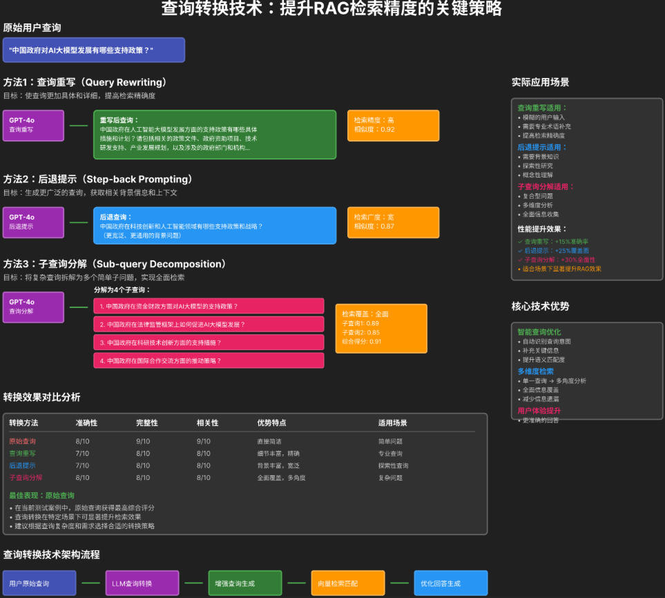

# 查询转换

## 一、三种核心查询转换方法（图中重点）

### 1. 查询重写（Query Rewriting）

- **目标**：把模糊、简短的原始查询，改写成更具体、更详细的查询，提升检索精度。
- **示例**：
  - 原始：“中国政府对AI大模型发展有哪些支持政策？”
  - 重写后：“中国政府在人工智能大模型发展方面的支持政策有哪些具体措施和计划？请包括相关的政策文件、政府规划项目、技术研发支持、产业发展规划，以及涉及的政府部门和机构...”
- **效果**：检索精度高（相似度0.92），适合专业查询、需要补充细节的场景。

### 2. 后退提示（Step-back Prompting）

- **目标**：把具体问题“后退”到更宽泛、更本质的问题，获取更广泛的背景信息和上下文，提升检索广度。
- **示例**：
  - 原始：“中国政府对AI大模型发展有哪些支持政策？”
  - 后退后：“中国政府在科技创新和人工智能领域有哪些支持政策和战略？”
- **效果**：检索广度宽（相似度0.87），适合探索性研究、需要背景知识的场景。

### 3. 子查询分解（Sub-query Decomposition）

- **目标**：把复杂、多维度的原始查询，拆解为多个简单的子问题，分别检索后再综合答案，实现全面检索。
- **示例**：
  - 原始：“中国政府对AI大模型发展有哪些支持政策？”
  - 分解为4个子查询：
    1. 中国政府在资金财政方面对AI大模型的支持政策？
    2. 中国政府在法律监管框架上如何促进AI大模型发展？
    3. 中国政府在科研技术创新方面的支持措施？
    4. 中国政府在国际合作交流方面的推动策略？
- **效果**：检索覆盖全面（综合得分0.91），适合复杂问题、多维度分析的场景。

