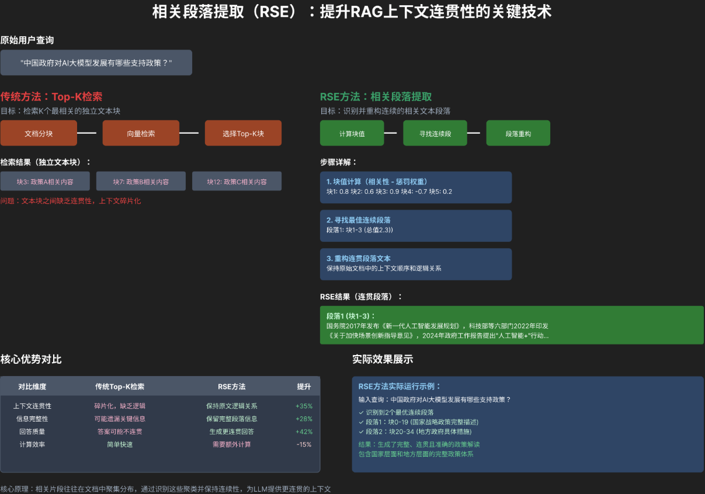
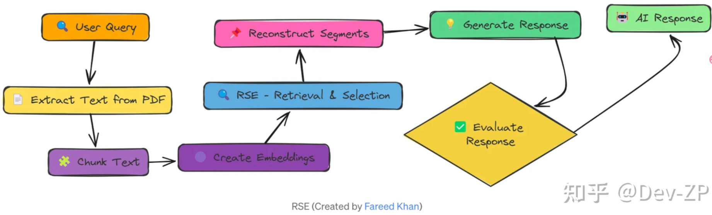

# 相关段落提取



## 为什么需要这项技术

在传统RAG中，我们通常是先检索到若干文档块（Chunks），再把这些块直接丢给大模型生成答案。但这种方式存在几个关键问题，而RSE正是为了解决这些问题而诞生的：

1.  **避免信息过载与噪声干扰**
    - 检索返回的Chunk往往包含大量与问题**不直接相关的冗余信息**，甚至是干扰信息。
    - 直接将整个Chunk喂给模型，会稀释核心信息，导致模型“抓不住重点”，生成的答案冗长、不准确，甚至出现幻觉。

2.  **提升上下文窗口利用率**
    - 大模型的上下文窗口（Context Window）是宝贵资源。
    - RSE通过精准提取**最相关的句子或片段**，而非整个Chunk，能在有限的窗口内放入更多高质量信息，提升答案质量。

3.  **解决“断章取义”问题**
    - 传统的固定大小分块（Chunking）可能会把一个完整的语义单元切断。
    - RSE可以识别并提取出**完整的、语义连贯的相关段落**，确保模型理解的信息是完整的，而不是碎片化的。

4.  **适配复杂多跳问答**
    - 在多跳问答中，答案往往分布在文档的不同位置。
    - RSE可以从多个检索到的文档中，精准定位并提取出所有相关的证据片段，为后续的推理和答案生成提供坚实基础。

## 二、Relevant Segment Extraction（RSE）技术怎么实现？

Relevant Segment Extraction（RSE）的核心流程，就是：

* 先召回（Retrieval）：通过向量检索、混合检索等方式，从知识库中召回一批候选文档块（Chunks）。
* 后提取（Extraction）：在这些已经召回的 Chunk 内部，进一步 “精读”，从中提取出与用户问题最相关的句子或片段，而不是直接使用整个 Chunk。

用一句话总结可以说，RSE 就是在 RAG 的 “粗筛（召回）” 之后，再加一层 “精筛（提取）”，让模型拿到的不是 “整段文档”，而是 “精准的答案片段”。



### 1. 核心实现流程

1.  **输入准备**
    - **用户查询 (Query)**：用户的问题。
    - **候选文本 (Candidate Text)**：由向量检索或混合检索返回的文档块（Chunks）。

2.  **粗定位（Coarse Localization）**
    - **目标**：快速从候选文本中，定位到可能包含相关信息的大致区域。
    - **方法**：
        - **关键词/规则匹配**：快速定位包含查询关键词的句子。
        - **轻量级语义相似度计算**：使用轻量级嵌入模型（如MiniLM）计算查询与每个句子的相似度，筛选出Top-N个候选句子。

3.  **精提取（Fine-grained Extraction）**
    - **目标**：在粗定位的基础上，精确提取出完整、连贯的相关片段。
    - **方法**：
        - **基于大模型的抽取式问答 (Extractive QA)**：
            - 使用LLM（如GPT-3.5/4），将查询和候选文本作为输入，让模型直接输出“最相关的句子或段落”。
            - Prompt示例：
              ```text
              请仔细阅读以下文本，并从中提取出能够直接回答用户问题的最相关的句子或段落。
              用户问题：{query}
              文本：{candidate_text}
              提取的相关片段：
              ```
        - **基于序列标注 (Sequence Labeling)**：
            - 使用微调过的BERT类模型，对候选文本中的每个token进行标注（如“B-REL”表示相关片段的开始，“I-REL”表示相关片段的内部，“O”表示无关）。
            - 然后根据标注结果，拼接出完整的相关片段。

4.  **后处理与整合**
    - **去重**：去除重复的片段。
    - **合并**：如果多个片段语义连贯，可以将它们合并成一个更大的上下文。
    - **截断**：根据模型的上下文窗口限制，对提取的片段进行截断，确保不超出窗口大小。

### 2. 代码示例（基于LLM的抽取式RSE）

```python
from langchain_openai import ChatOpenAI
from langchain.prompts import PromptTemplate
from langchain_core.output_parsers import StrOutputParser

# 初始化LLM
llm = ChatOpenAI(model="gpt-3.5-turbo", temperature=0)

# 定义RSE的Prompt模板
rse_prompt = PromptTemplate(
    template="""
    你是一个信息提取专家。请仔细阅读以下文本，并从中提取出能够直接回答用户问题的最相关、最核心的句子或段落。
    只输出提取的文本，不要添加任何解释或总结。

    用户问题：{query}
    候选文本：{candidate_text}

    提取的相关片段：
    """,
    input_variables=["query", "candidate_text"]
)

# 构建RSE链
rse_chain = rse_prompt | llm | StrOutputParser()

# 示例：从候选文本中提取相关片段
query = "RAG系统的落地难点是什么？"
candidate_text = """
RAG（检索增强生成）是一种结合了检索和生成的AI技术。它的核心价值在于能够利用外部知识库，提升大模型生成答案的准确性和时效性。
然而，RAG系统在落地过程中也面临着诸多挑战。首先，文档分块的质量直接影响检索的精准度，如果分块不合理，会导致检索到不相关的信息。
其次，高并发场景下的检索延迟是一个重要问题，需要通过缓存、向量数据库优化等手段来解决。
最后，如何处理多模态数据（如图片、视频）的检索和融合，也是RAG系统需要攻克的难点之一。
"""

# 执行RSE
relevant_segment = rse_chain.invoke({"query": query, "candidate_text": candidate_text})
print("提取的相关片段：\n", relevant_segment)
```

**输出示例**：

```text
提取的相关片段：
 然而，RAG系统在落地过程中也面临着诸多挑战。首先，文档分块的质量直接影响检索的精准度，如果分块不合理，会导致检索到不相关的信息。
其次，高并发场景下的检索延迟是一个重要问题，需要通过缓存、向量数据库优化等手段来解决。
最后，如何处理多模态数据（如图片、视频）的检索和融合，也是RAG系统需要攻克的难点之一。
```

**Relevant Segment Extraction (RSE)** 是RAG系统中提升信息利用效率和答案质量的关键技术。它通过精准地从检索到的文档中提取出**最核心、最相关的信息片段**，解决了传统RAG中信息过载、噪声干扰和上下文窗口利用率低的问题，让大模型能够“聚焦重点”，生成更精准、更可靠的答案。
