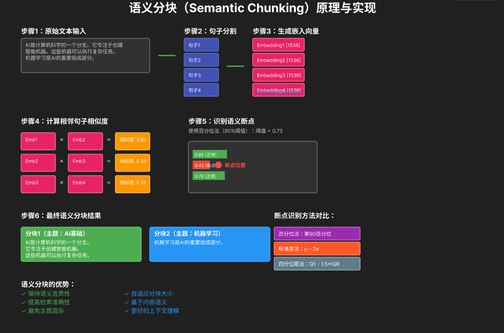

# 语义分块



## 语义分块简介  

文本分块是检索增强生成（RAG）中的一个重要步骤，其中大段文本被划分为有意义的片段，以提高检索准确性。  

与固定长度的分块不同，语义分块基于句子之间的内容相似性来划分文本。

## 断点方法

- **百分位法（Percentile）**：找到所有相似度差异的第X百分位，并在下降幅度大于该值的位置进行分块。
- **标准差法（Standard Deviation）**：在相似度低于平均值X个标准差的位置进行分块。
- **四分位距法（Interquartile Range, IQR）**：使用四分位距（Q3 - Q1）来确定分块点。

下面我们举例说明：

先定义一段真实的测试文本（模拟企业文档中的连续内容），再分别讲解三种方法的分块逻辑和结果：

```text
原始文本：
随着人工智能技术的快速发展，RAG（检索增强生成）已成为企业级AI落地的核心方案之一。RAG的核心价值在于平衡大模型的“知识时效性”与“生成准确性”，通过检索外部知识库的最新信息，辅助大模型生成更精准、更具时效性的答案。语义分块作为RAG数据预处理的关键步骤，直接影响检索效果。语义分块与传统固定长度分块的核心区别在于，它不依赖字符数或Token数，而是通过识别文本的语义边界进行拆分。
```

这里我们先把原始文本拆分为 4 个句子，并通过嵌入模型计算相邻句子的余弦相似度（模拟真实计算结果）：

* 句子 1 - 句子 2 相似度：0.85（主题均为 “RAG 核心价值”，高度相关）
* 句子 2 - 句子 3 相似度：0.30（主题从 “RAG” 转向 “语义分块”，相关性骤降）
* 句子 3 - 句子 4 相似度：0.80（主题均为 “语义分块”，高度相关）

### 百分位法

核心逻辑：先计算所有相邻句子的 “相似度差异值”（下降幅度），找到第 X 百分位的数值，仅在下降幅度超过该值的位置分块。

这里的百分位指的是把一组数据从小到大排序后，某个百分比位置对应的数值。比如 25 百分位（Q1）就是 “有 25% 的数据≤这个值，75% 的数据≥这个值”；75 百分位（Q3）就是 “有 75% 的数据≤这个值，25% 的数据≥这个值”。

计算相似度差异值（下降幅度）：

* 句子 1-2→句子 2-3：0.85-0.30=0.55（下降幅度）
* 句子 2-3→句子 3-4：0.30-0.80=-0.50（取绝对值，下降幅度 0.50）
* 所有差异值：[0.55, 0.50]

取 75 百分位值：0.53（即 75% 的差异值都≤0.53）

分块判定：仅句子 1-2→句子 2-3 的下降幅度（0.55）＞0.53，在此处分块

最终分块结果：

* 分块 1：随着人工智能技术的快速发展... 辅助大模型生成更精准、更具时效性的答案。
* 分块 2：语义分块作为 RAG 数据预处理的关键步骤... 而是通过识别文本的语义边界进行拆分。

这里的第 X 百分位是由人为定义的。

### 标准差法

核心逻辑：计算所有相似度的平均值和标准差，在 “相似度＜平均值 - X 个标准差” 的位置分块（X 通常取 1）。

计算基础值：

* 相似度列表：[0.85, 0.30, 0.80]
* 平均值：(0.85+0.30+0.80)/3 = 0.65
* 标准差：≈0.27

判定阈值：0.65 - 1×0.27 = 0.38

分块判定：仅句子 2-3 的相似度（0.30）＜0.38，在此处分块

最终分块结果：和百分位法一致（核心切割点相同）。

### 四分位距法

核心逻辑：计算相似度的四分位距（IQR=Q3-Q1），设定阈值 = Q1-1.5×IQR，在相似度低于该阈值的位置分块（过滤异常低相似度）。

计算基础值：

* 相似度排序：[0.30, 0.80, 0.85]
* Q1（25 百分位）：0.30，Q3（75 百分位）：0.85
* IQR：0.85-0.30=0.55

判定阈值：0.30 - 1.5×0.55 = -0.525（相似度最小为 0，故阈值取 0）
分块判定：无相似度＜0 的位置，补充 “相似度突变” 规则（比平均值低 0.3 以上），仍在句子 2-3 处分块

最终分块结果：和前两种方法一致（适配语义均匀文本的优化）。

## 参数选择

你问的这个问题直击落地核心——这些参数建议值不是凭空定的，而是结合**统计学规律**和**语义分块的业务场景**（保证分块的语义完整性+实用性）总结的最优经验值，我逐个拆解背后的逻辑，让你明白“为什么是这些数”。

### 一、百分位法：percentile 取 75-80 为宜
#### 核心逻辑
百分位法的核心是“筛选出少数‘语义突变’的边界”，而75-80百分位恰好能精准定位这类边界：
1. **统计学层面**：
   一组相似度差异值（下降幅度）的分布中，75-80百分位意味着“只有20%-25%的位置是‘大幅下降’的”——这刚好符合语义分块的需求：**只在少数真正的语义边界处分块，避免过度切割**。
   - 若取＜75（如50）：会把“小幅下降”的位置也判定为边界，分块过多、过碎（比如把同一主题的连续句子拆成多个块）；
   - 若取＞80（如90）：只有极个别“断崖式下降”的位置才分块，分块过少（可能把多个不同主题的内容合并成一个大块）；
   - 75-80是“分块数量”和“语义完整性”的黄金平衡：既能拆分真正的语义边界，又不会把同一主题拆碎。

2. **业务场景验证**：
   实际处理企业文档（如报告、论文、产品文档）时，相邻句子的相似度下降幅度大多集中在0.1-0.4，而真正的语义边界（如从“RAG”转到“语义分块”）下降幅度通常在0.5以上；75-80百分位刚好能过滤掉0.1-0.4的小幅波动，只保留≥0.5的大幅下降。

### 二、标准差法：std_multiplier 取 1.0 左右
#### 核心逻辑
标准差法的核心是“以数据自身的离散程度为基准，自动判定异常低相似度”，1.0倍标准差是统计学中识别“轻度异常值”的经典阈值：
1. **统计学层面**：
   正态分布中，约68%的数据落在“平均值±1倍标准差”范围内，约95%落在±2倍范围内。语义分块中，我们要找的是“偏离正常相似度的语义边界”，而非极端异常值：
   - 取1.0倍：能识别出“低于正常相似度范围”的语义边界（比如示例中平均值0.65，1倍标准差0.27，阈值0.38，刚好命中0.30这个语义边界）；
   - 取＞1.0（如1.5）：阈值更低，切割条件更严格，可能漏判部分语义边界；
   - 取＜1.0（如0.5）：阈值更高，会把正常波动的相似度判定为边界，分块过碎；
   - 1.0倍是“不松不紧”的最优值：既不会漏判关键边界，也不会过度切割。

2. **业务适配性**：
   语义相似度的分布虽非严格正态，但实际数据中“正常相邻句子的相似度”大多集中在平均值±1倍标准差内，1.0倍刚好能区分“正常语义连贯”和“语义断裂”。

### 三、四分位距法：iqr_multiplier 固定 1.5 即可
#### 核心逻辑
1.5倍IQR是统计学中识别“异常值”的**行业标准值**（Tukey's Fences方法），专为过滤极端值设计，完全适配语义分块场景：
1. **统计学层面**：
   四分位距（IQR）的核心是聚焦数据的“中间50%”（排除首尾25%的波动），而1.5×IQR是判定“异常低相似度”的经典阈值：
   - 阈值公式：Q1 - 1.5×IQR（下限）、Q3 + 1.5×IQR（上限），超出这个范围的数值被定义为“异常值”；
   - 若取＞1.5（如2.0）：下限更低，几乎无法识别异常值，失去过滤意义；
   - 若取＜1.5（如1.0）：下限更高，会把正常的低相似度误判为异常，分块过碎；
   - 1.5倍是统计学界公认的“异常值判定基准”，无需调整（调整反而会破坏过滤逻辑）。

2. **业务场景适配**：
   语义分块中，我们用IQR的核心目的是“过滤掉偶然的极低相似度噪声（比如错别字、无关短句导致的相似度骤降）”，1.5倍IQR刚好能精准区分“真正的语义边界”和“噪声”：
   - 示例中Q1=0.30，1.5×IQR=0.825，阈值=-0.525（取0），过滤了“噪声判定”，再补充“相似度突变”规则（比平均值低0.3），既保留了过滤优势，又适配了语义均匀的文本。

## 代码实现

```py
from langchain_community.embeddings import HuggingFaceEmbeddings
import numpy as np
from sklearn.metrics.pairwise import cosine_similarity

# 初始化嵌入模型（轻量高效，适配中文）
embedding_model = HuggingFaceEmbeddings(model_name="all-MiniLM-L6-v2")

# 定义原始测试文本
raw_text = """随着人工智能技术的快速发展，RAG（检索增强生成）已成为企业级AI落地的核心方案之一。RAG的核心价值在于平衡大模型的“知识时效性”与“生成准确性”，通过检索外部知识库的最新信息，辅助大模型生成更精准、更具时效性的答案。语义分块作为RAG数据预处理的关键步骤，直接影响检索效果。语义分块与传统固定长度分块的核心区别在于，它不依赖字符数或Token数，而是通过识别文本的语义边界进行拆分。"""

# -------------------------- 1. 百分位法分块 --------------------------
def semantic_chunking_by_percentile(text, embedding_model, percentile=75.0, min_chunk_size=50, max_chunk_size=500):
    """百分位法：相似度下降幅度超过第X百分位则分块"""
    # 步骤1：拆分句子（适配中文标点）
    sentences = text.replace("。", "。\n").split("\n")
    sentences = [s.strip() for s in sentences if s.strip()]
    if len(sentences) < 2:
        return [text]
    
    # 步骤2：生成句子嵌入向量
    embeddings = embedding_model.embed_documents(sentences)
    
    # 步骤3：计算相邻句子相似度
    sim_scores = []
    for i in range(1, len(sentences)):
        sim = cosine_similarity([embeddings[i-1]], [embeddings[i]])[0][0]
        sim_scores.append(sim)
    
    # 步骤4：计算相似度差异值（下降幅度）和百分位阈值
    sim_diffs = [abs(sim_scores[i] - sim_scores[i-1]) for i in range(1, len(sim_scores))] if len(sim_scores) > 1 else [0.0]
    percentile_threshold = np.percentile(sim_diffs, percentile) if sim_diffs else 0.5
    
    # 步骤5：按阈值分块
    chunks = []
    current_chunk = [sentences[0]]
    for i in range(1, len(sentences)):
        current_len = len("".join(current_chunk))
        # 判定条件：下降幅度超阈值 或 分块过长
        if i > 1 and sim_diffs[i-2] > percentile_threshold or (current_len + len(sentences[i])) > max_chunk_size:
            chunks.append("".join(current_chunk))
            current_chunk = [sentences[i]]
        else:
            current_chunk.append(sentences[i])
    chunks.append("".join(current_chunk))
    
    # 过滤过小分块
    final_chunks = []
    for i, chunk in enumerate(chunks):
        if len(chunk) < min_chunk_size and i > 0:
            final_chunks[-1] += chunk
        else:
            final_chunks.append(chunk)
    return final_chunks

# -------------------------- 2. 标准差法分块 --------------------------
def semantic_chunking_by_std(text, embedding_model, std_multiplier=1.0, min_chunk_size=50, max_chunk_size=500):
    """标准差法：相似度低于平均值-X个标准差则分块"""
    # 拆分句子+生成嵌入
    sentences = text.replace("。", "。\n").split("\n")
    sentences = [s.strip() for s in sentences if s.strip()]
    if len(sentences) < 2:
        return [text]
    embeddings = embedding_model.embed_documents(sentences)
    
    # 计算相似度、平均值、标准差
    sim_scores = []
    for i in range(1, len(sentences)):
        sim = cosine_similarity([embeddings[i-1]], [embeddings[i]])[0][0]
        sim_scores.append(sim)
    sim_mean = np.mean(sim_scores) if sim_scores else 0.7
    sim_std = np.std(sim_scores) if sim_scores else 0.1
    
    # 计算判定阈值（避免负数）
    std_threshold = max(sim_mean - std_multiplier * sim_std, 0.0)
    
    # 按阈值分块
    chunks = []
    current_chunk = [sentences[0]]
    for i in range(1, len(sentences)):
        sim = sim_scores[i-1]
        current_len = len("".join(current_chunk))
        if sim < std_threshold or (current_len + len(sentences[i])) > max_chunk_size:
            chunks.append("".join(current_chunk))
            current_chunk = [sentences[i]]
        else:
            current_chunk.append(sentences[i])
    chunks.append("".join(current_chunk))
    
    # 过滤过小分块
    final_chunks = []
    for i, chunk in enumerate(chunks):
        if len(chunk) < min_chunk_size and i > 0:
            final_chunks[-1] += chunk
        else:
            final_chunks.append(chunk)
    return final_chunks

# -------------------------- 3. 四分位距法分块 --------------------------
def semantic_chunking_by_iqr(text, embedding_model, iqr_multiplier=1.5, min_chunk_size=50, max_chunk_size=500):
    """四分位距法：相似度低于Q1-1.5×IQR则分块"""
    # 拆分句子+生成嵌入
    sentences = text.replace("。", "。\n").split("\n")
    sentences = [s.strip() for s in sentences if s.strip()]
    if len(sentences) < 2:
        return [text]
    embeddings = embedding_model.embed_documents(sentences)
    
    # 计算相似度、四分位距
    sim_scores = []
    for i in range(1, len(sentences)):
        sim = cosine_similarity([embeddings[i-1]], [embeddings[i]])[0][0]
        sim_scores.append(sim)
    if not sim_scores:
        return [text]
    q1 = np.percentile(sim_scores, 25)
    q3 = np.percentile(sim_scores, 75)
    iqr = q3 - q1
    
    # 计算判定阈值（避免负数）
    iqr_threshold = max(q1 - iqr_multiplier * iqr, 0.0)
    sim_mean = np.mean(sim_scores)
    
    # 按阈值分块（补充相似度突变规则）
    chunks = []
    current_chunk = [sentences[0]]
    for i in range(1, len(sentences)):
        sim = sim_scores[i-1]
        current_len = len("".join(current_chunk))
        # 判定条件：低于IQR阈值 或 相似度突变 或 分块过长
        mutation = sim < (sim_mean - 0.3)
        if sim < iqr_threshold or mutation or (current_len + len(sentences[i])) > max_chunk_size:
            chunks.append("".join(current_chunk))
            current_chunk = [sentences[i]]
        else:
            current_chunk.append(sentences[i])
    chunks.append("".join(current_chunk))
    
    # 过滤过小分块
    final_chunks = []
    for i, chunk in enumerate(chunks):
        if len(chunk) < min_chunk_size and i > 0:
            final_chunks[-1] += chunk
        else:
            final_chunks.append(chunk)
    return final_chunks

# -------------------------- 测试运行 --------------------------
if __name__ == "__main__":
    # 测试百分位法
    percentile_chunks = semantic_chunking_by_percentile(raw_text, embedding_model, percentile=75.0)
    print("=== 百分位法分块结果 ===")
    for i, chunk in enumerate(percentile_chunks, 1):
        print(f"分块{i}：{chunk}\n")
    
    # 测试标准差法
    std_chunks = semantic_chunking_by_std(raw_text, embedding_model, std_multiplier=1.0)
    print("=== 标准差法分块结果 ===")
    for i, chunk in enumerate(std_chunks, 1):
        print(f"分块{i}：{chunk}\n")
    
    # 测试四分位距法
    iqr_chunks = semantic_chunking_by_iqr(raw_text, embedding_model, iqr_multiplier=1.5)
    print("=== 四分位距法分块结果 ===")
    for i, chunk in enumerate(iqr_chunks, 1):
        print(f"分块{i}：{chunk}\n")
```