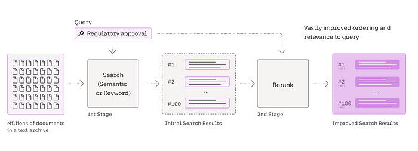

# 重排序


## 为什么需要重排序

基础检索通常依赖于关键词或向量相似度搜索，虽然是良好的起点，但在实际应用中往往难以满足需求。向量搜索并不理解查询的意图，它只关注统计相似性。因此，检索结果常常：

* 过于宽泛
* 稍有偏离主题
* 存在冗余
* 缺乏关键细节

Reranker通过以下方式弥补初步检索的不足：

提供更相关的信息：过滤掉不太相关的数据，确保LLM获得最聚焦、最有用的上下文。

减少数据噪声：通过重新评估和精炼初步检索到的文档，显著减少传递给LLM的无关信息。

提升数据效率：更精炼的上下文提升了LLM的表现，模型不再被无关细节拖累。

优化输入：Reranker将初步“排序结果”精炼为“重排序结果”，为LLM生成阶段提供更优质的输入。

Reranker的核心工作很简单：对初步检索结果再次排序——但这一次更智能。它试图回答：“这些文档中，哪些真正有助于解答用户问题？”结果是：传递给LLM的片段更少但更优，输出质量显著提升。



## 示例效果

>当用户问 "What is 'Explainable AI' and why is it considered important?"

传统RAG：只返回最相关的一个chunk

上下文增强RAG（context_size=1）：返回3个chunk

Context 1: （前一个chunk）包含AI伦理背景
Context 2: （召回的chunk）直接解释Explainable AI
Context 3: （后一个chunk）进一步说明信任建立

## 应该选择哪种Reranker？

### BM25（Best Match 25）

BM25是TF-IDF（词频-逆文档频率）的升级版，在关键词或token层面计算相似度。

词频（Term Frequency）——某词在单个文档中出现的次数。BM25认为多次出现是“更强的提示”，但在多次重复后会递减加分。

逆文档频率（Inverse Document Frequency）——该词在所有文档中出现的稀有程度。常见词（如“the”）得分极低，罕见词得分高。

BM25非常适合小型、术语密集型语料库或对成本敏感的场景。

```py
from langchain.retrievers import BM25Retriever
retriever = BM25Retriever.from_documents(docs)
result = retriever.invoke(query)
```

### Cross-Encoder Reranker（交叉编码器重排序器）

Cross-encoder reranker（交叉编码器重排序器）是一类强大的开源模型，通常基于BERT等Transformer架构。其工作方式是将查询与文档片段一同输入同一个模型，生成一个相似度分数（通常为0到1），表示查询与文档片段的相关性。

在典型检索流程中的作用如下：

* 初步检索（Bi-encoder）：首先，bi-encoder（双编码器，使用稠密嵌入）快速选出与查询最相关的前K个文档片段。
* 交叉编码器：随后，cross-encoder对这K个查询-文档片段对进行逐一评估。通过在统一上下文中考虑查询与文档片段，交叉编码器能够以更高精度重新打分和排序。

交叉编码器的优势在于相关性判断更为准确，但代价是需要更多GPU算力，并比单用bi-encoder多消耗数十毫秒。

```py
from langchain.retrievers import ContextualCompressionRetriever
from langchain.retrievers.document_compressors import CrossEncoderReranker
from langchain_community.cross_encoders import HuggingFaceCrossEncoder
​
retriever = FAISS.from_documents(texts, embeddingsModel).as_retriever(
    search_kwargs={"k": 20}
)
model = HuggingFaceCrossEncoder(model_name="BAAI/bge-reranker-base")
compressor = CrossEncoderReranker(model=model, top_n=3)
compression_retriever = ContextualCompressionRetriever(
    base_compressor=compressor, base_retriever=retriever
)
​
compressed_docs = compression_retriever.invoke(query)
Cohere Rerank API
Cohere等公司提供专门的API重排序服务，模型针对该任务专门训练。通过Cohere的rerank模型，可以对向量数据库或其他检索器的结果重新排序，确保最相关的文档优先传递给LLM。

from langchain.retrievers.contextual_compression import ContextualCompressionRetriever
from langchain_cohere import CohereRerank
from langchain_community.llms import Cohere
​
os.environ["COHERE_API_KEY"]  = "COHERE_API_KEY"]
llm = Cohere(temperature=0)
retriever = FAISS.from_documents(
    texts, CohereEmbeddings(model="embed-english-v3.0")
).as_retriever(search_kwargs={"k": 20})
compressor = CohereRerank(model="rerank-english-v3.0")
compression_retriever = ContextualCompressionRetriever(
    base_compressor=compressor, base_retriever=retriever
)
​
compressed_docs = compression_retriever.invoke(query)
```

### FlashRank Reranker

FlashRank是专为高效文档重排序设计的Python库。其核心优势在于提供最前沿的重排序能力，同时依赖极少（最小模型无需PyTorch/Transformers），推理速度极快，非常适合CPU环境及对成本敏感、低延迟的应用。支持以下排序模型：

* 点式（Pointwise）重排序器：每次考虑一个查询和一个文档，判断其相关性。
* 对式（Pairwise）重排序器：每次考虑查询和两个文档，判断哪一个更相关。
* 列表式（Listwise）LLM重排序器：一次性考虑整个文档列表（或大部分），在查询上下文下寻找最优排序。

```py
from langchain.retrievers import ContextualCompressionRetriever
from langchain_community.document_compressors import FlashrankRerank
from langchain_openai import ChatOpenAI
from flashrank import Ranker
llm = ChatOpenAI(temperature=0)
​
compressor = FlashrankRerank(model="ms-marco-MiniLM-L-12-v2")
​
compression_retriever = ContextualCompressionRetriever(
    base_compressor=compressor, base_retriever=retriever
)
​
compressed_docs = compression_retriever.invoke(query)
```

### RankLLM Reranker

RankLLM是一个开源Python包，利用大语言模型（LLM, Large Language Model）进行文档重排序。RankLLM针对检索与排序任务进行了优化，支持开源LLM及RankGPT、RankGemini等专有重排序器，涵盖点式、对式、列表式等主流重排序范式。

RankLLM的独特之处在于“prompt-decoder”重排序，即利用LLM的生成能力，通过精心设计的提示词（prompt）生成排序列表或相关性分数。

```py
import torch
from langchain.retrievers.contextual_compression import ContextualCompressionRetriever
from langchain_community.document_compressors.rankllm_rerank import RankLLMRerank
​
torch.cuda.empty_cache()
​
compressor = RankLLMRerank(top_n=3, model="rank_zephyr")
compression_retriever = ContextualCompressionRetriever(
    base_compressor=compressor, base_retriever=retriever
)
​
del compressor
compressed_docs = compression_retriever.invoke(query)
```