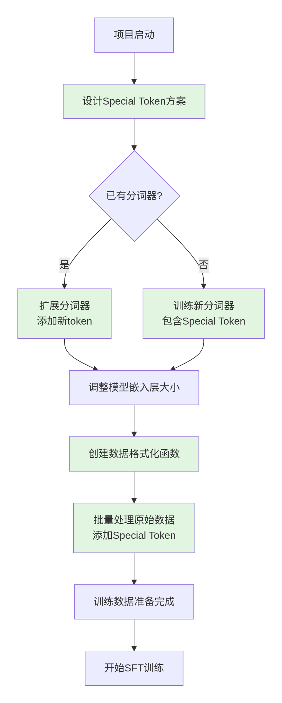
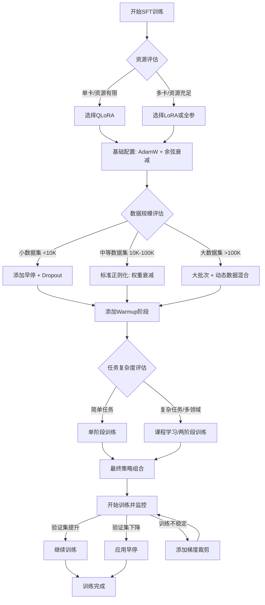

# SFT

## 什么是SFT？

监督微调​ 是将通用基础模型转化为专用AI助手的关键技术环节。它通过指令-回答配对数据，教会预训练模型如何理解并执行人类指令，使其从“知识库”转变为“对话伙伴”。

## 数据准备

在动手处理任何数据之前，首先要明确：

模型定位：要训练什么样的助手？（通用型、编程专家、客服机器人？）

```text
【理念指导】 → 【原始数据收集】 → 【格式构造】 → 【数据集完成】
   ↓               ↓              ↓            ↓
多样性优先       依据理念       用Special Token  可用于训练
质量至上        收集原始数据    格式化构造
数量支撑
```

### 选择原数据

在对训练的数据进行选择时需要遵循“多样性优先，质量至上，数量支撑”的核心原则。SFT的核心目标不是向模型灌输更多的事实知识（这是预训练阶段的任务），而是教会模型如何理解和遵循各种各样的人类指令，即学习一种通用的“指令-回答”的元能力（Meta-skill）。多样性在这里起到了决定性的作用。

1. 塑造泛化能力 (Generalization)：模型需要具备“举一反三”的能力，能够处理它在SFT训练中从未见过的全新指令。如果训练数据只包含几种特定类型的任务（比如100万条问天气的数据），模型可能会在问天气上表现完美，但当你让它写一首诗或解释一个代码片段时，它就会束手无策。一个高度多样化的数据集，涵盖问答、摘要、创作、代码、翻译、逻辑推理、角色扮演等多种任务，才能教会模型识别指令背后的通用模式，而不是仅仅记住特定任务的模板。
2. 避免“捷径式学习”和过拟合 (Shortcut Learning & Overfitting)：如果数据量很大但多样性很差，模型很容易学到一些“捷径”。例如，它可能发现所有以“请总结以下段落：”开头的指令，都应该生成一个三句话的回答。这并非真正的理解，而是一种浅层的模式匹配。当用户换一种说法，比如“能帮我概括一下这段话的核心思想吗？”，模型就可能失败。多样化的指令形式（不同的问法、不同的约束条件）可以迫使模型去真正理解“总结”这一任务的本质。
3. 覆盖广泛的技能（Skill Coverage）：现代大模型被期望成为一个“全能助手”。这种全能性直接来源于SFT数据所覆盖的技能范围。数据集中的任务越多样，模型最终能够掌握的技能就越广泛。这就像一个学徒，如果他只跟着一位木匠学习，他最多成为一个优秀的木匠；但如果他有机会向木匠、铁匠、画家、程序员等不同领域的专家学习，他才能成为一个多才多艺的通才。
4. 提升鲁棒性 (Robustness)：多样性不仅体现在任务类型上，也体现在同一任务的不同表述方式上。对于同一个意图，用户可能有千百种问法。一个多样化的数据集会包含这些不同的表述，从而让模型对用户的输入不那么“敏感”，能够更稳定地理解用户的真实意图。

但是，这并不意味着数量不重要。数量在多样性的基础上，扮演着“巩固”和“深化”的角色。

1. 达到学习的“临界点”：任何学习都需要足够的样本。虽然多样性是关键，但如果每个任务类型只有一个样本，模型也无法有效学习。因此，需要有足够数量的多样化数据，才能让模型在每个技能上都达到一个基础的熟练度。
2. 巩固和稳定学习效果：在多样性得到保证的前提下，增加数据量可以帮助模型更好地巩固学到的技能，使其表现更稳定，减少“随机犯错”的概率。
3. 特定领域增强：如果你希望模型在某个特定领域（如医疗咨询、法律文书）表现得特别出色，那么你就需要在通用多样化数据的基础上，增加大量该垂直领域的高质量、多样化数据。在这里，数量和多样性是相辅相成的。
多样性决定了模型能力的“广度”和“上限”，而数量则在多样性足够的基础上，决定了模型能力的“深度”和“稳定性”。 在资源有限的情况下，优先投资于提升数据的多样性，远比盲目地增加同质化数据的数量回报更高。

类比一下：

- 预训练 (Pre-training) 就像让一个学生读完整个图书馆。他的目标是积累海量的知识（数量是关键）。
- SFT (Supervised Fine-Tuning) 就像让这位博览群书的学生去参加一系列由顶尖专家主持的研讨会。
  - 高多样性、中等数量：学生参加了数学、物理、历史、艺术、编程等100场完全不同主题的研讨会。他将学会如何运用知识，解决不同领域的问题，成为一个思维敏捷、能力全面的通才。
  - 低多样性、超高数量：学生参加了100万场关于“1+1=2”这个主题的研讨会。他会对“1+1=2”的理解达到极致，但你问他“1+2等于几”，他可能就答不出来了。他并没有学会“数学推理”这个元能力。

### 清洗原数据

在构造训练数据时首先要对原数据进行清洗：

```py
def clean_raw_data(raw_text):
    """清洗原始文本"""
    import re
    
    # 1. 移除多余空白
    text = re.sub(r'\s+', ' ', raw_text).strip()
    
    # 2. 移除特殊字符但保留必要标点
    text = re.sub(r'[^\w\s\u4e00-\u9fff,.!?;:，。！？；：-]', '', text)
    
    # 3. 标准化引号
    text = text.replace('“', '"').replace('”', '"')
    text = text.replace('‘', "'").replace('’', "'")
    
    # 4. 截断过长文本（可选）
    if len(text) > 1000:
        text = text[:1000] + "..."
    
    return text
```

清洗标准：

* 移除个人隐私信息（姓名、电话、地址等）
* 修正明显的语法错误和错别字
* 过滤掉有害、偏见、不安全的内容
* 统一格式（如日期、数字的写法）

### 设计对话模板与Special Token



Special Tokenz可以实现模型与人类指令对齐、进行有效对话的关键机制。

```text
原始对话（人类可读）：
用户：你好，能介绍一下机器学习吗？
助手：机器学习是人工智能的一个分支...

↓ 转换为 ↓

训练格式（模型可学）：
<|system|>你是一个有帮助的AI助手<|end|>
<|user|>你好，能介绍一下机器学习吗？<|end|>
<|assistant|>机器学习是人工智能的一个分支...<|end|>
```

- 构建对话与指令结构：在SFT中，模型需要学习理解并遵循特定的指令格式。特殊符号被用来清晰地界定指令的不同部分。例如，在对话数据中，特殊符号可以明确区分用户的提问、模型的回答以及系统层面的指令。通过这种结构化的输入，模型能够更好地学习到不同角色之间的交互模式。
- 赋予模型角色认知能力：通过使用像<|user|>和<|assistant|>这样的特殊符号，可以训练模型识别对话中的不同发言者。 这使得模型能够根据其被赋予的“助手”角色来生成恰当的、符合预期的回复，而不是简单地模仿用户的说话风格或重复问题。
- 提升指令遵循（Instruction Following）能力：SFT的核心目标之一是提升模型的指令遵循能力。特殊符号是实现这一目标的关键工具。通过将指令和特定任务的输入用特殊符号包裹起来，可以训练模型将这些符号作为执行特定任务的信号。例如，一个用于翻译任务的样本可能会被格式化为：[INST] 将以下英文翻译成中文：Hello, world! [/INST] [ASSISTANT] 你好，世界！ 这里的[INST]和[/INST]就是引导模型进行指令翻译的特殊符号。
- 引入和验证新知识：特殊符号还可以被用来“构造知识”。例如，可以创建一个模板如“<special_token_1>喜欢<special_token_2>”，这种结构是在预训练阶段不存在的。通过在SFT阶段引入这类数据，可以有效地向模型注入新的知识，并剔除预训练先验知识的影响，同时也可以用来验证SFT的训练效果，例如判断模型是否过拟合。
- 区分不同任务类型：在进行多任务微调时，特殊符号可以用来标识不同的任务类型。例如，可以使用<task_translation>和<task_summarization>来分别标记翻译任务和摘要任务的数据。这有助于模型在内部学习到不同任务的特定模式，并根据提示符中的特殊符号激活相应的能力。

在实际操作中，为SFT添加和使用特殊符号通常涉及以下步骤：
1. 扩展词汇表：首先需要在模型的分词器（Tokenizer）中添加新的特殊符号。这通常通过add_tokens或add_special_tokens等函数来实现。
2. 调整模型嵌入层：由于词汇表的大小发生了变化，需要相应地调整模型嵌入层（Token Embedding）的大小，为新的特殊符号分配对应的嵌入向量
3. 格式化训练数据：根据设计的对话模板或指令格式，使用添加的特殊符号来处理和格式化SFT的训练数据集。
总而言之，通过精心设计和使用Special Token，可以有效地引导大型语言模型学习特定的行为模式，使其更好地理解和执行人类的指令，从而在各种下游任务中取得更优异的表现。

```py
# 方案1：OpenAI风格（ChatGPT/GLM）
def format_openai_style(user_input, assistant_output, system_prompt=None):
    template = ""
    if system_prompt:
        template += f"<|im_start|>system\n{system_prompt}<|im_end|>\n"
    template += f"<|im_start|>user\n{user_input}<|im_end|>\n"
    template += f"<|im_start|>assistant\n{assistant_output}<|im_end|>"
    return template

# 方案2：Llama 2风格
def format_llama_style(user_input, assistant_output, system_prompt=None):
    if system_prompt:
        return f"[INST] <<SYS>>\n{system_prompt}\n<</SYS>>\n\n{user_input} [/INST] {assistant_output}"
    else:
        return f"[INST] {user_input} [/INST] {assistant_output}"

# 方案3：通用风格（推荐初学者）
def format_general_style(user_input, assistant_output, system_prompt=None):
    parts = []
    if system_prompt:
        parts.append(f"<|system|>\n{system_prompt}\n<|end|>")
    parts.append(f"<|user|>\n{user_input}\n<|end|>")
    parts.append(f"<|assistant|>\n{assistant_output}\n<|end|>")
    return "\n".join(parts)

# 定义使用的Special Token
SPECIAL_TOKENS = {
    "bos": "<s>",  # 开始标记
    "eos": "</s>",  # 结束标记
    "system": "<|system|>",
    "user": "<|user|>",
    "assistant": "<|assistant|>",
    "end": "<|end|>"
}
```

### 批量格式化处理

```py
import pandas as pd
from tqdm import tqdm

def batch_format_data(raw_data, template_func, output_file="formatted_data.jsonl"):
    """
    批量格式化原始数据
    
    Args:
        raw_data: 原始数据列表
        template_func: 格式化函数
        output_file: 输出文件路径
    """
    formatted_samples = []
    
    for item in tqdm(raw_data, desc="Formatting data"):
        try:
            # 提取用户输入和助手回复
            if isinstance(item, dict):
                if "user" in item and "assistant" in item:
                    # 单轮对话格式
                    user_input = clean_raw_data(item["user"])
                    assistant_output = clean_raw_data(item["assistant"])
                elif "turns" in item:
                    # 多轮对话格式
                    user_input, assistant_output = process_multi_turn(item["turns"])
                else:
                    continue
            else:
                continue
            
            # 添加系统提示（可根据任务类型定制）
            system_prompt = get_system_prompt_by_task(user_input)
            
            # 应用格式化模板
            formatted_text = template_func(
                user_input=user_input,
                assistant_output=assistant_output,
                system_prompt=system_prompt
            )
            
            # 添加开始和结束标记
            formatted_text = f"{SPECIAL_TOKENS['bos']}{formatted_text}{SPECIAL_TOKENS['eos']}"
            
            # 保存格式化后的样本
            formatted_samples.append({
                "id": item.get("id", len(formatted_samples)),
                "original_user": user_input,
                "original_assistant": assistant_output,
                "formatted_text": formatted_text,
                "length": len(formatted_text),
                "task_type": classify_task_type(user_input)
            })
            
        except Exception as e:
            print(f"Error processing item {item.get('id', 'unknown')}: {e}")
            continue
    
    # 保存到文件
    df = pd.DataFrame(formatted_samples)
    df.to_json(output_file, orient="records", lines=True, force_ascii=False)
    
    print(f"\n✅ 数据格式化完成！")
    print(f"   总计样本: {len(formatted_samples)}")
    print(f"   保存到: {output_file}")
    
    return formatted_samples

def get_system_prompt_by_task(user_input):
    """根据任务类型返回合适的系统提示"""
    # 任务分类
    if any(keyword in user_input.lower() for keyword in ["代码", "编程", "python", "java"]):
        return "你是一个专业的编程助手，擅长编写和解释代码。"
    elif any(keyword in user_input.lower() for keyword in ["数学", "计算", "方程", "公式"]):
        return "你是一个数学专家，擅长解决数学问题和解释数学概念。"
    elif any(keyword in user_input.lower() for keyword in ["翻译", "英文", "中文"]):
        return "你是一个专业的翻译助手，擅长中英文互译。"
    else:
        return "你是一个有帮助的AI助手，回答应该准确、有用、安全。"
```

### 扩展分词器

基础模型的分词器不认识新添加的Special Token（如<|user|>），需要将它们加入词汇表。

扩展步骤：

1. 加载基础分词器：从基础模型（如LLaMA、Qwen）加载原始分词器。
2. 添加新Token：将设计的Special Token添加到分词器的特殊标记列表中。
3. 设置填充标记：确保分词器有填充标记（通常用结束标记作为填充标记）。
4. 保存新分词器：保存扩展后的分词器供后续训练使用。

```py
from transformers import AutoTokenizer
import json

def extend_tokenizer_for_sft(base_model_name, special_tokens, save_path="./sft_tokenizer"):
    """
    为SFT扩展分词器
    
    Args:
        base_model_name: 基础模型名称，如 "meta-llama/Llama-2-7b-hf"
        special_tokens: 特殊标记字典
        save_path: 保存路径
    """
    
    # 1. 加载基础分词器
    print(f"加载基础分词器: {base_model_name}")
    tokenizer = AutoTokenizer.from_pretrained(base_model_name)
    
    # 2. 添加新的特殊标记
    additional_tokens = []
    for name, token in special_tokens.items():
        if token not in tokenizer.get_vocab():
            additional_tokens.append(token)
    
    if additional_tokens:
        print(f"添加 {len(additional_tokens)} 个新标记: {additional_tokens}")
        tokenizer.add_special_tokens({
            "additional_special_tokens": additional_tokens
        })
    else:
        print("所有特殊标记已存在于词汇表中")
    
    # 3. 设置填充标记（如果未设置）
    if tokenizer.pad_token is None:
        tokenizer.pad_token = tokenizer.eos_token
        print(f"设置填充标记为: {tokenizer.pad_token}")
    
    # 4. 保存扩展后的分词器
    tokenizer.save_pretrained(save_path)
    
    # 5. 保存特殊标记映射
    token_mapping = {
        token: tokenizer.convert_tokens_to_ids(token)
        for token in additional_tokens
    }
    with open(f"{save_path}/special_tokens_mapping.json", "w", encoding="utf-8") as f:
        json.dump(token_mapping, f, ensure_ascii=False, indent=2)
    
    print(f"\n✅ 分词器扩展完成！")
    print(f"   原始词汇表大小: {len(tokenizer) - len(additional_tokens)}")
    print(f"   新词汇表大小: {len(tokenizer)}")
    print(f"   保存到: {save_path}")
    
    return tokenizer
```

### 第六步：创建训练数据集对象

数据集划分：

* 训练集：用于模型训练的主要数据（通常占80-90%）
* 验证集：用于在训练过程中评估模型表现，调整超参数（通常占5-10%）
* 测试集：用于最终评估模型性能（通常占5-10%）

好的，我将用文字详细描述SFT数据集的合理划分策略。在监督微调中，数据划分不是简单的随机分割，而是需要精心设计以确保评估的有效性和模型泛化能力。

SFT数据集划分的核心目标

在划分数据集前，必须明确三个核心目标：

1. 准确评估泛化能力：测试集要能真实反映模型处理未见或高度相似但不同问题的能力
2. 避免数据泄露：确保训练和测试集之间没有“记忆捷径”
3. 全面覆盖能力维度：测试集要覆盖模型应具备的各种能力

**SFT数据集划分策略：**

| 策略 | 核心原理 | 操作方法 | 优点 | 缺点 | 适用场景 | 关键检查点 |
|:---|:---|:---|:---|:---|:---|:---|
| **1. 随机划分** | 简单随机抽样 | 对整个数据集随机打乱，按比例分割 | 实现简单、快速；训练/测试集分布一致 | **高数据泄露风险**；评估结果虚高；无法保证能力覆盖 | 初步实验、数据充足时的基线方法 | 检查是否有高度相似问题跨集出现 |
| **2. 基于任务/意图的分层抽样** | 确保每种任务类型在测试集中都有代表 | 1. 标注每个样本的任务类型<br>2. 对每个类型单独按比例划分<br>3. 合并各类型的测试样本 | **全面评估各项能力**；易于识别能力短板；避免任务缺失 | 需要可靠的任务分类；同类任务内仍可能有语义重复 | **通用推荐策略**；多技能模型评估；学术研究 | 确保每个任务类型在测试集中有足够样本（>20） |
| **3. 基于语义相似度的去重划分** | 避免语义重复样本影响评估真实性 | 1. 用嵌入模型向量化所有问题<br>2. 聚类高度相似的问题（如相似度>0.9）<br>3. 每簇只选一个代表进入测试集 | **评估真正的理解能力**；彻底避免记忆效应；结果可信度高 | 计算开销大；依赖嵌入模型质量；可能损失数据多样性 | 高质量小数据集；严谨的学术评估；概念理解测试 | 测试集样本间平均相似度应显著低于阈值 |
| **4. 基于数据来源的划分** | 模拟真实场景，测试分布泛化能力 | 1. 标记每个样本的数据来源<br>2. 将特定来源（如真实用户数据）**全部**划为测试集 | 测试**真实场景性能**；评估分布外泛化；避免过拟合数据生成方式 | 可能加剧领域差异；测试集分布可能与训练集差异过大 | 生产环境部署前测试；检验对真实用户数据的适应性 | 测试集应代表实际应用的数据分布 |
| **5. 基于时间序列的划分** | 用过去数据训练，未来数据测试 | 1. 为数据添加时间戳<br>2. 按时间点切割（如某日前为训练，之后为测试） | 模拟真实时间泛化；测试对新兴趋势的适应性；符合业务逻辑 | 需要时间戳数据；历史数据可能过时 | 对话系统、新闻生成、趋势敏感型任务 | 测试集时间应完全晚于训练集 |
| **6. 基于难度的分层划分** | 全面评估模型在不同难度下的表现 | 1. 人工或自动标注样本难度（简/中/难）<br>2. 从每个难度层级分层抽样 | 识别能力边界；避免测试集偏颇；反映模型鲁棒性 | 难度标注主观且耗时；标准难统一 | 能力边界分析；产品能力定位；渐进式测试 | 测试集应包含均衡的难度分布 |

**策略选择决策树**

```text
开始
  │
  ├─ 是否测试真实用户场景适应性？ 
  │     ├─ 是 → 选择【基于数据来源的划分】
  │     └─ 否 → ↓
  │
  ├─ 是否严格测试概念理解（非记忆）？
  │     ├─ 是 → 选择【基于语义相似度的划分】
  │     └─ 否 → ↓
  │
  ├─ 数据是否带有时间属性？
  │     ├─ 是 → 选择【基于时间序列的划分】
  │     └─ 否 → ↓
  │
  ├─ 是否需要评估各技能维度？
  │     ├─ 是 → 选择【基于任务的分层抽样】← **最常用**
  │     └─ 否 → ↓
  │
  └─ 是否仅需快速基线？
        ├─ 是 → 选择【随机划分】
        └─ 否 → 考虑【基于难度的分层划分】
```

**混合策略组合建议**

| 组合方式 | 实施方法 | 适用目标 |
|:---|:---|:---|
| **分层+去重** | 先按任务分层，再在各层内进行语义去重 | 严格评估，兼顾能力覆盖与概念理解 |
| **来源+分层** | 对不同来源的数据分别进行分层抽样 | 多来源数据集的全面评估 |
| **时间+难度** | 在时间划分基础上，确保各时段都有难度分布 | 长期部署系统的渐进能力测试 |

### 第七步：分词与标签设置

分词处理：

使用扩展后的分词器将格式化文本转换为Token ID序列。设置最大长度，过长的序列进行截断，对较短的序列进行填充，使批次内长度一致。

在SFT训练中，我们只计算助手回复部分的损失，用户输入和系统提示部分不计算损失。

1. 聚焦于核心学习目标：预训练的核心目标是让模型掌握语言本身，需要学习语言的基本规律。而SFT的根本目的则是教会模型“在给定Prompt的条件下，生成正确的Response”。因此，在SFT阶段再让模型去学习如何生成Prompt是多余且偏离目标的。训练的重点应该是优化模型生成回答的能力，而不是重复学习它已经知道的上下文。
2. 提高训练效率：Prompt在许多SFT数据集中可能是重复或高度相似的。如果对Prompt部分也计算损失，模型会花费大量计算资源去反复学习这些同质化的输入，这是一种计算上的浪费。通过掩码（Masking）的方式忽略Prompt的损失，可以将梯度更新完全集中在优化更有价值的Response部分，从而提高训练效率。
3. 避免能力退化和干扰：强迫模型去预测和学习Prompt的分布，可能会干扰其在预训练阶段学到的通用语言能力。SFT的价值在于“微调”而非“重塑”。我们希望模型利用其已有的语言理解能力来学习如何响应，而不是在已经很完善的输入理解能力上做无用功。

在实际操作中，这个过程通常通过损失掩码（Loss Masking）来实现。例如，在PyTorch等框架中，可以将Prompt部分对应的标签（labels）设置为一个特定的忽略索引（如-100），这样在计算交叉熵损失时，这些位置的Token就不会对最终的损失值和梯度更新产生贡献。

示例：

输入文本：<|user|>你好<|end|><|assistant|>你好！<|end|>

Token ID：[用户部分Token] [助手部分Token]

标签：[-100, -100, ...] [助手Token对应的ID]

这样模型只学习如何生成助手的回复，而不学习如何重复用户的问题。

### 检查与打包

格式检查：

* 随机抽样检查Special Token是否正确闭合
* 检查是否有嵌套或错误的标记
* 验证标签掩码设置是否正确

内容检查：

* 确保助手回答的质量（准确性、完整性、安全性）
* 检查是否存在数据泄露（测试集内容出现在训练集中）
* 验证任务类型的分布是否合理

技术检查：
* 确认分词器能正确处理所有Special Token
* 验证数据集能正常加载和迭代
* 检查内存使用是否在合理范围内

数据集打包：

将处理好的数据集保存为标准格式（如Arrow、Parquet），包含数据集的元信息和统计信息，提供数据加载的示例代码

文档记录：

* 数据来源：详细记录每个数据来源和数量
* 处理流程：记录所有的清洗、格式化步骤
* 关键决策：记录为什么选择特定的模板、Special Token等
* 质量评估：记录人工评估的结果和质量分数
* 使用说明：如何正确使用该数据集进行训练

## 微调的策略

| 策略类别 | 具体策略 | 核心原理 | 实施方法 | 适用场景 | 关键参数/注意事项 |
|:---|:---|:---|:---|:---|:---|
| **参数更新策略** | **全参数微调** | 更新所有模型参数，最大化适配能力 | 解冻全部参数，标准反向传播 | 计算资源充足，追求极致性能 | 学习率要小（通常1e-5到1e-6） |
| | **LoRA微调** | 低秩适应，只训练少量新增参数 | 在注意力层添加可训练的低秩矩阵 | **主流选择**，平衡效果与成本 | rank=8-64, alpha=16-32 |
| | **QLoRA** | 量化+LoRA，极致显存优化 | 4-bit量化基础模型，再应用LoRA | 单卡微调大模型（如34B/70B） | 使用NF4格式，双重量化 |
| | **适配器微调** | 插入小型适配器模块 | 在FFN层后添加瓶颈结构适配器 | 多任务学习，需快速切换 | 瓶颈维度通常为原维度的1/4 |
| | **前缀微调** | 优化连续提示向量 | 添加可训练的前缀token向量 | 参数效率极高，不改动模型 | 前缀长度通常10-100个token |
| **学习率策略** | **余弦衰减** | 平滑下降至最小值 | 学习率按余弦函数从初始值衰减到最小值 | 大多数SFT场景，稳定收敛 | 配合warmup使用效果更佳 |
| | **线性衰减** | 线性下降至零 | 学习率从峰值线性下降到零 | 训练步数确定时使用 | 简单有效，易于实现 |
| | **Warmup** | 渐进式增加学习率 | 训练前期逐步增加学习率到峰值 | **必备策略**，防止训练初期震荡 | warmup步数通常占总步数5-10% |
| | **周期性重启** | 跳出局部最优 | 学习率周期性重置到峰值再衰减 | 训练陷入平台期时使用 | 周期长度逐渐增加 |
| **批次与梯度策略** | **梯度累积** | 模拟大批次训练 | 多次前向传播累积梯度，再一次性更新 | 显存有限但需要大批次时 | 累积步数通常2-8步 |
| | **梯度裁剪** | 防止梯度爆炸 | 梯度范数超过阈值时进行缩放 | 训练不稳定时使用 | 阈值通常设置为1.0 |
| | **动态批次** | 根据长度动态组批 | 按序列长度而非数量组批，减少填充 | 序列长度差异大时 | 显著提升训练效率 |
| | **大批次训练** | 提升训练稳定性 | 使用尽可能大的批次大小 | 显存充足时 | 需相应调整学习率 |
| **正则化策略** | **Dropout** | 防止过拟合 | 随机丢弃部分神经元 | 小数据集或过拟合风险高时 | FFN层dropout=0.1，注意力层=0.0 |
| | **权重衰减** | 控制参数大小 | 在损失中添加L2正则化项 | 标准配置，防止权重过大 | 通常设置为0.01-0.1 |
| | **标签平滑** | 软化标签分布 | 将硬标签（0/1）转为软标签（如0.9/0.1） | 分类任务或防止过度自信 | 平滑因子通常0.05-0.1 |
| | **早停策略** | 防止过拟合 | 验证集损失不再下降时停止训练 | 小数据集或过拟合明显时 | 耐心步数通常3-10个epoch |
| **优化器策略** | **AdamW** | 自适应学习率 | 改进的Adam，正确实现权重衰减 | **当前标准优化器** | β1=0.9, β2=0.999, ε=1e-8 |
| | **Adafactor** | 内存高效优化器 | 减少优化器状态内存占用 | 训练极大模型时 | 适用于TPU训练 |
| | **Lion** | 新式优化器 | 符号函数更新，内存更省 | 替代AdamW的新选择 | 需要调参验证效果 |
| | **8-bit Adam** | 量化优化器状态 | 使用8-bit存储优化器状态 | 显存紧张时 | 兼容性需检查 |
| **数据策略** | **课程学习** | 从易到难训练 | 按难度排序数据，先训练简单样本 | 复杂推理或多步骤任务 | 需要可靠的难度标注 |
| | **动态数据混合** | 平衡数据分布 | 根据模型表现动态调整各类数据比例 | 多任务或多领域训练 | 需要监控各任务表现 |
| | **在线数据增强** | 增加数据多样性 | 训练时实时生成数据变体 | 数据有限时提升泛化 | 注意不要过度增强 |
| | **数据重采样** | 聚焦困难样本 | 根据损失值对样本重新采样 | 模型某些能力薄弱时 | 可能引入偏差需谨慎 |
| **模型策略** | **渐进解冻** | 分层解冻参数 | 先解冻上层，逐步解冻下层参数 | 防止灾难性遗忘 | 从输出层向输入层解冻 |
| | **模型平均** | 提升模型稳定性 | 平均多个训练检查点的权重 | 改善泛化，减少方差 | 通常平均最后3-5个检查点 |
| | **指数移动平均** | 平滑模型权重 | 维护模型权重的移动平均版本 | 获得更稳定的最终模型 | 衰减系数通常0.999 |
| | **知识蒸馏** | 从教师模型学习 | 使用大模型输出作为软目标训练小模型 | 模型压缩或提升小模型性能 | 温度参数控制软目标平滑度 |
| **精度策略** | **混合精度训练** | 加速训练节省显存 | 前向传播用FP16/BF16，优化器用FP32 | **现代GPU训练标准** | 使用梯度缩放防止下溢 |
| | **纯BF16训练** | 全精度训练 | 所有计算使用BF16格式 | Ampere架构后GPU支持 | 避免精度问题，性能更好 |
| | **梯度检查点** | 时间换空间 | 重新计算中间激活而非存储 | 训练极大模型时 | 增加约30%计算时间 |
| | **激活检查点** | 选择性存储 | 只存储关键层的激活 | 平衡显存与速度 | 需要仔细选择检查点层 |
| **多阶段策略** | **两阶段微调** | 先通用后领域 | 先用通用数据训练，再用领域数据微调 | 领域适配，防止灾难性遗忘 | 第二阶段学习率更小 |
| | **指令+对话两阶段** | 先学指令后学对话 | 先指令数据训练基本能力，再对话数据学习交互 | 构建对话系统 | 第一阶段着重能力，第二阶段着重风格 |
| | **SFT+RLHF两阶段** | 先模仿后优化 | SFT学习基本能力，RLHF优化人类偏好 | 生产级对话系统 | SFT是RLHF的基础 |
| **评估驱动策略** | **验证集驱动早停** | 基于评估结果停止 | 监控验证集表现而非训练损失 | 防止过拟合到训练集 | 使用多个评估指标综合判断 |
| | **自动超参调优** | 系统化搜索最优参数 | 使用贝叶斯优化等方法搜索超参数 | 资源充足时追求最优性能 | 需要定义清晰的评估指标 |
| | **多维度评估** | 全面评估模型能力 | 同时评估有用性、安全性、事实性等 | 生产级模型评估 | 需要人工评估与自动评估结合 |

---

**SFT训练策略选择决策流程**



## 评估微调效果

评估大模型微调效果，通常需要结合人工评估与自动化评估两条路径。人工评估的核心，是让专业人员或者目标用户直接去体验模型的输出效果，通过打分、对比和主观判断来衡量模型是否更贴近人类偏好。比如在法律场景中，可以邀请律师对模型的答复进行专业性和准确性评分;在金融场景中，则由分析师判断回答是否具备实用价值。人工评估的优势在于它能真实反映“模型的回答是否符合预期场景’，而不是单纯依赖指标。现在人工评估的门槛已经变低，例如开源的openwebui就内置了模型对比功能，让用户在不知情的情况下同时体验两个不同模型的回答，然后通过选择“更喜欢哪一个”来收集偏好反馈，这种盲测机制非常有效，能真实反映模型优劣。

除了人工评估外，我们往往还需要依靠数据集驱动的系统化评估，来评估模型的数学、推理、代码、Agent性能。常见做法是构建一套独立的验证数据集，在微调前后对比模型的各项指标是否发生变化。例如想要验证模型的在数学和推理方面性能，可以使用AIME、GPOA等数据集进行评估，如果想要验证模型的代码能力，可以使用SWE-Bench数据集进行评估，而如果希望验证模型指令跟随或者Function calling能力，则可以IFEval数据集。总的来说，只有把人工评估的主观体验与这些客观数据指标结合起来，我们才能真正全面可靠地判断微调是否达到效果。

### 如何定义和区分 “格式过拟合” 与 “内容过拟合”？

| 维度 | **格式过拟合** | **内容过拟合** |
|:---|:---|:---|
| **定义** | 模型对**对话结构、特殊标记、输出格式**的过度拟合 | 模型对**训练数据的具体内容、知识、表达方式**的过度拟合 |
| **表现层次** | **形式层面**（如何组织回答） | **实质层面**（回答什么内容） |
| **关注点** | 回答的**结构、模板、风格** | 回答的**事实、知识、具体信息** |
| **类比** | 学会了**写信的格式**（称呼、正文、落款） | 只会重复背诵**某封信的具体内容** |

**格式过拟合的表现**

```
✅ 健康表现：
用户：你好
助手：<|assistant|>你好！有什么可以帮助您的吗？<|end|>

❌ 过拟合表现：
用户：今天天气怎么样？
助手：<|assistant|>用户询问天气情况。根据我的知识库，天气信息需要实时查询。请问您想查询哪个城市的天气？<|end|>
（即使简单问题也使用固定模板，添加不必要的格式化语言）
```

**识别特征**：

1. **机械的结构遵循**：严格按训练数据格式输出，即使不合理
2. **不必要的标记**：在不应出现特殊标记的地方强行添加
3. **僵化的开场/结束语**：总是使用相同的问候和结束方式
4. **角色刻板**：严格保持“助手”角色，缺乏灵活性

### **内容过拟合的表现**
```
训练数据：
用户：Python中如何读取文件？
助手：使用open()函数，如：with open('file.txt', 'r') as f: content = f.read()

❌ 过拟合表现：
用户：Java中如何读取文件？
助手：使用open()函数，如：with open('file.txt', 'r') as f: content = f.read()
（将Python特定语法错误应用到Java问题）
```

**识别特征**：

1. **知识误用**：将特定上下文的知识泛化到不适用场景
2. **表达雷同**：使用与训练数据几乎相同的表述
3. **缺乏泛化**：无法处理训练数据未覆盖的变体问题
4. **记忆性输出**：直接复制训练数据中的具体例子

为什么格式过拟合不一定是坏事，甚至在某种程度上是必要的？

虽然“过拟合”通常是一个负面词汇，但格式过拟合是SFT训练中一个可以被接受甚至被追求的目标。这背后有几个核心原因：
1. 实现可控性和可靠性 (Controllability & Reliability)：
SFT的一个核心目标就是让模型的行为变得可预测和可控。我们希望模型能够严格遵守我们定义的对话模板。例如，我们希望它总是在<|assistant|>这个特殊符号之后开始生成它的回答。这种对格式的“过拟合”保证了我们可以稳定地解析模型的输出，知道哪部分是用户的输入，哪部分是模型的回答。这是构建任何基于大模型的应用（如聊天机器人）的基础。
2. 塑造角色和风格 (Persona & Style)：
我们希望模型扮演一个特定的角色——例如，一个乐于助人、客观中立、语言流畅的AI助手。这种角色本身就是一种“格式”。通过让模型在大量高质量、风格一致的数据上进行训练，我们实际上是在引导它“过拟合”到这种我们期望的助手的说话风格和行为模式上。这使得模型的输出更加统一和专业。
3. 作为一种安全护栏 (Safety Guardrails)：
严格的格式遵循可以成为一道安全屏障。例如，如果模型被训练为只能在它的指定“回合”（即[ASSISTANT]之后）内生成内容，并且不能自己生成[USER]标签，这就在一定程度上防止了模型被诱导进行“角色扮演攻击”或“越狱”，因为它被其过拟合的格式牢牢地“框”住了。
4. 区分任务的信号：
在多任务微调中，不同的格式可以作为区分不同任务的明确信号。模型通过识别特定的格式来“激活”处理特定任务的能力。例如，看到代码格式的指令，模型就知道应该调用其代码生成能力。这种对格式的敏感性是能力正确调用的前提。

总结来说：
- 内容过拟合永远是坏事。它代表了模型没有学会泛化，失去了核心的智能，这是SFT训练需要极力避免的。
- 格式过拟合则是一把双刃剑，但其利远大于弊。我们追求的是对结构化格式（如特殊符号、对话轮次）和理想风格（如助手人设）的“良性过拟合”，因为这带来了可控性、可靠性和安全性。当然，需要警惕的是对某些具体“口头禅”或“填充词”的过度拟合，这会让模型显得机械和重复。

## 工具调用SFT

问题：Agent/function_call 的 SFT 数据构造核心是什么？如何通过训练数据让模型学会调用工具的逻辑？

普通SFT的核心是教会模型“如何说”，而工具调用SFT的核心是教会模型“如何做”，即将思考过程转化为具体的、可执行的行动指令。

Agent/Function Call 的 SFT 数据构造核心是显式地、结构化地展示完整的“思考-行动-观察-总结”链路 (Thought-Action-Observation-Conclusion Chain)。
模型不能直接与外部世界交互（如查询API、访问数据库），它只能生成文本。因此，我们必须设计一种特殊的文本格式，让模型通过生成这种格式的文本来“请求”外部工具执行一个动作，然后再接收工具返回的结果（也是文本格式），并基于这个结果生成最终的回复。

一个典型的工具调用SFT数据点，其“回答”部分不再是简单的自然语言，而是包含以下几个关键组成部分：

1. 思考 (Thought / Chain-of-Thought, CoT)：
  - 目的：让模型学习“为什么”要调用工具。这是教会模型逻辑推理的关键。
  - 形式：一段自然语言的内心独白，解释模型的分析过程。例如：“用户想知道今天北京的天气。我没有实时的天气信息，所以我需要使用get_weather这个工具来查询。”
  - 重要性：没有这部分，模型只是在进行模式匹配，而不是真正的推理。它不知道在何种条件下应该调用何种工具。
2. 行动 (Action / Tool Call)：
  - 目的：让模型学会生成机器可解析的、精确的调用指令。
  - 形式：一段严格格式化的文本，通常是JSON或XML。它必须清晰地指明要调用的工具名称 (tool_name) 和所需的参数 (parameters)。
  - 示例：使用特殊的标记（如 [TOOL_CODE] 或 <function_call>）包裹。
    ```text
    <function_call>
    {"tool_name": "get_weather", "parameters": {"city": "北京", "date": "today"}}
    </function_call>
    ```
3. 观察 (Observation / Tool Output)：
  - 目的：让模型学会理解工具执行后的返回结果，包括成功的结果和失败的错误信息。
  - 形式：同样使用特殊标记（如 [TOOL_OUTPUT] 或 <function_response>）包裹，内容是API或函数执行后返回的原始文本（通常是JSON格式）。
  - 示例：
    ```text
    <function_response>
    {"temperature": "32°C", "condition": "晴朗", "wind": "微风"}
    </function_response>
    ```
4. 总结 (Conclusion / Final Answer)：
  - 目的：教会模型如何利用从工具中获取的信息，来组织成一段通顺、自然的语言，最终回答用户的原始问题。
  - 形式：标准的自然语言回答。
  - 示例：“北京今天天气晴朗，气温为32摄氏度，有微风。
  
那么，如何通过训练数据让模型学会调用工具的逻辑？

模型通过学习上述结构化的数据，从不同维度掌握调用工具的完整逻辑链：

1. 学会“何时”调用（触发逻辑）：
通过大量的正负样本对比，模型学会决策。
- 正样本：用户的问题需要外部信息才能回答（“今天天气如何？”、“现在股价多少？”、“帮我订一张机票”）。在这些样本中，模型被展示了完整的“思考-行动-观察-总结”流程。
- 负样本 (至关重要！)：用户的问题仅靠模型自身的知识就能回答（“中国的首都是哪里？”、“解释一下什么是光合作用”）。在这些样本中，模型的回答就是直接的自然语言，完全不包含工具调用的任何部分。
通过这种对比学习，模型明白了哪些问题意图对应着调用工具的必要性。
2. 学会“调用哪个”工具（选择逻辑）：
通过在数据中提供多个可选工具的描述，并展示在不同场景下选择不同工具的例子。
- 数据构造：在SFT的prompt中，通常会包含一个可用工具列表及其功能的描述。
  - 例如：[{"tool_name": "get_weather", "description": "查询实时天气"}, {"tool_name": "search_stock_price", "description": "查询股票价格"}]
- 学习过程：当用户问“查一下茅台的股价”，模型在“思考”部分会写道：“用户想查股价，我应该使用search_stock_price工具”，然后生成对应的Action。这种数据让模型学会了将用户意图与工具描述进行语义匹配。
3. 学会“如何调用”（参数填充逻辑）：
通过展示从用户问句中提取关键信息并填充到parameters字段的例子。
- 示例：对于“帮我查一下上海明天会下雨吗？”这个问题，模型在“思考”部分会分析：“用户关心的城市是‘上海’，日期是‘明天’”，然后在Action的parameters中生成{"city": "上海", "date": "tomorrow"}。这教会了模型槽位填充 (Slot Filling) 的能力。
4. 学会处理“调用后”的情况（结果利用与异常处理逻辑）：
- 成功时：模型看到[TOOL_OUTPUT]中的成功信息，并在最终的Conclusion中将其人性化地表达出来。
- 失败时：数据中必须包含工具调用失败的例子。例如，[TOOL_OUTPUT]返回{"error": "City not found"}。此时，模型的Conclusion应该被训练成：“抱歉，我没有查询到您所说的城市的天气信息，您可以换一个城市试试吗？”。这教会了模型鲁棒性和纠错能力。
- 信息不足时：如果用户说“帮我查天气”，模型需要学会反问。数据可以构造成：Thought：“用户想查天气，但没说哪个城市，我需要向用户澄清。” Conclusion：“请问您想查询哪个城市的天气呢？”。这教会了模型进行多轮对话澄清的能力。

构造工具调用SFT数据的本质，就是将一个复杂的、内在的决策过程，“翻译”成一种结构化的、可供模型学习的文本格式。通过提供大量高质量、多样化的这种“翻译”样本，模型就能逆向工程出其背后的决策逻辑，从而从一个“聊天者”蜕变为一个能解决实际问题的“行动者”(Agent)。
