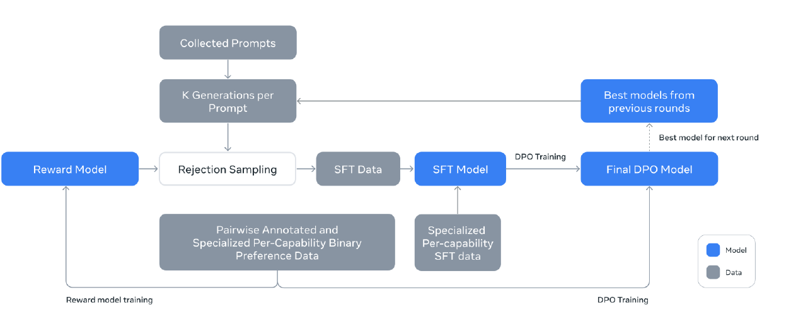
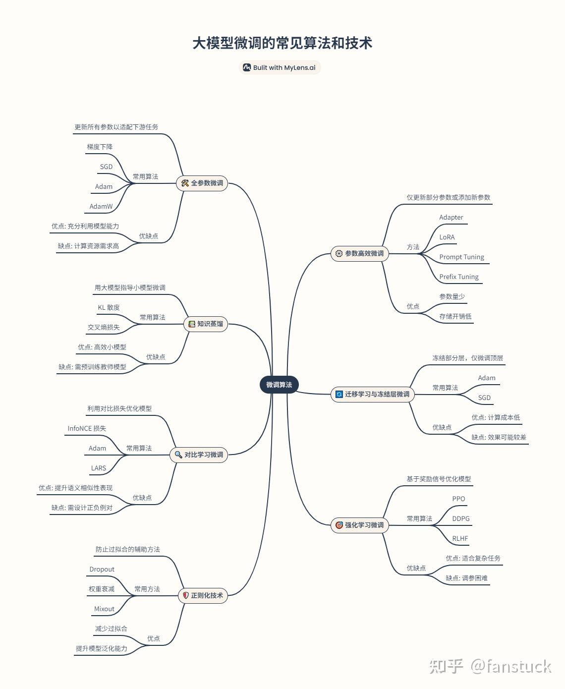

# 大模型微调

如图为一个模型诞生的过程：




整个过程可以概括为以下几个关键阶段：

**阶段一：生成初始优质数据与模型（流程上半部分）**

这是为后续的偏好学习（DPO）准备“种子”模型和高质量数据。

1.  **起点（数据收集）**：流程始于 **“Collected Prompts”**，即人工或自动收集的、用于训练和评估的文本提示。
2.  **多样性生成**：每个提示生成 **K 个结果**，这是为了在下一步中通过比较和筛选，获得多样化、高质量的响应。
3.  **结果评估与筛选**：
    *   生成的结果会经过 **“Reward Model”（奖励模型）** 打分。奖励模型是一个经过训练的、能够判断回答好坏的模型。
    *   同时，通过 **“Rejection Sampling”（拒绝采样）** 技术，根据奖励模型的分数，筛选出其中质量最高的一批结果。
4.  **创建监督微调数据**：将筛选出的优质“提示-回答”对，整理成 **“SFT Data”**。
5.  **训练初始模型**：使用这份高质量的 SFT 数据，对一个基础大语言模型进行 **“SFT”** 训练，得到一个初步优化过的 **“SFT Model”**。这个模型比原始基础模型表现更好，是后续优化的起点。

**阶段二：基于偏好的直接优化与迭代（流程下半部分）**
这是流程的核心优化循环，旨在让模型更精准地学习人类的复杂偏好。

1.  **关键数据输入**：此阶段依赖于一种特殊数据——**“Pairwise Annotated and Specialized Per-Capability Binary Preference Data”**。这是一种**成对标注的、针对特定能力（如安全性、事实性、帮助性）的二元偏好数据**，即对于同一个提示，标注员会标出哪个回答更好。这是训练奖励模型和进行DPO的核心燃料。
2.  **模型迭代**：图中显示，**来自之前轮次的“最佳模型”** 会作为新一轮训练的起点，体现了迭代优化的思想。
3.  **直接偏好优化**：核心步骤 **“DPO Training”**。传统RLHF需要先训练一个奖励模型，再用强化学习算法调整模型。而**DPO是一种更高效的替代方案，它直接利用“成对偏好数据”来训练语言模型，使其输出更符合人类偏好的结果，省去了训练和运行独立奖励模型的复杂过程。**
4.  **输出与循环**：经过DPO训练后，得到 **“Final DPO Model”**。这个模型会被评估，如果表现最佳，将成为下一轮迭代中的 **“Best model for next round”**，从而进入新一轮的优化循环，不断提升。

这张图清晰地展示了一个**从数据准备 → 初始模型训练 → 基于人类偏好的直接优化 → 多轮迭代**的完整模型优化管线。它结合了传统的监督微调（SFT）、奖励模型筛选，以及目前更受关注的直接偏好优化（DPO）技术，旨在系统性地、迭代地训练出与人类价值观和特定能力要求高度对齐的AI模型。这是一个现代大语言模型对齐（Alignment）的经典工程实践流程。

## 什么是模型微调

模型微调（Fine-tuning）是指在预训练模型的基础上，使用特定任务的数据进行进一步训练，使模型适应目标任务的过程。预训练模型在大规模通用数据上学习到了丰富的语言表示和知识，微调则是在这个"知识基础"上，针对特定应用场景进行"精装修"。

比如，你有一个通用的语言模型，但你想专门用来写金融报告或者进行客服问答，那么通过微调，这个模型就能更高效地完成这些特定任务。

微调的本质是：把“通用能力”压缩成“领域/任务专用能力”。

| 方式                 | 说明                      |
| ------------------ | ----------------------- |
| 从零训练               | 成本极高，需要海量数据             |
| Prompt Engineering | 不改模型参数，只改输入             |
| **Fine-tuning**    | **在预训练权重基础上，调整部分或全部参数** |

一个完整的LLM助手训练通常分为三步：

预训练：在万亿级token的无标注文本上训练，获得通用知识与语言能力。→ 产出：基础模型

监督微调：在数万到数十万条高质量的指令-回答对上进行训练，学会遵循指令。→ 产出：SFT模型

对齐优化：通过RLHF或DPO等技术，进一步让模型的价值观与人类对齐，使其回答更安全、更无害、更符合偏好。→ 产出：最终对话模型

微调需要的前置知识：

预训练（Pre-training）与微调（Fine-tuning）区别

* 预训练：模型初始阶段的大规模通用训练，学习广泛的知识。
* 微调：针对具体任务，利用小型的特定数据集进行二次训练。

微调数据的准备

* 数据收集和清洗：确保数据质量高、相关性强。
* 数据格式：常用的是JSON、CSV或特定的文本格式，如Prompt-Completion对。

参数与超参数的基础知识

* 参数（Parameters）：模型自身学习的权重。
* 超参数（Hyperparameters）：如学习率（Learning Rate）、批次大小（Batch Size）、Epoch数量、优化器（Optimizer）等，影响训练过程的设置参数。

评估微调效果

* 使用指标如BLEU、ROUGE、准确率（Accuracy）、F1-Score等，针对不同任务选择合适的评估标准。

## 为什么要模型微调

**1️⃣ 通用模型 ≠ 领域专家**

预训练模型学的是：通用语言、通用世界知识、通用推理模式。

但在很多场景下，Prompt 再怎么写，也不等于“内化成模型能力”。

比如说对于医疗领域诊断决策具有复杂性，当患者出现胸痛、呼吸困难、出汗等症状，模型缺乏对医学检查指标、疾病鉴别诊断、治疗方案的深度理解，无法像专业医生那样进行多维度推理和风险权衡。

* 通用模型：可能给出"可能是心脏病发作，建议就医"的泛化回答

* 专业医生：会结合心电图、心肌酶谱、病史等综合判断，区分心梗、心绞痛、肺栓塞等不同病因

Prompt工程可以引导模型输出更符合专业格式的文本，但无法让模型真正"内化"专业领域的知识体系和推理能力。这需要通过领域数据微调、知识增强、专家系统集成等方式来解决。

**2️⃣ Prompt的稳定性问题**

Prompt存在以下几个缺陷：

对输入格式敏感：同样的意图，换种表达方式（如"请解释" vs "能说明一下吗"），模型输出可能完全不同，需要反复调试才能找到最佳Prompt。

长Prompt成本高：每次推理都需要携带完整的Prompt上下文，导致：

* 计算成本随Prompt长度线性增长
* 推理延迟显著增加（尤其长对话场景）
* 单次请求Token消耗大，API费用高昂

输出飘忽不定：模型对Prompt的微小变化（如标点、措辞）反应敏感，输出质量不稳定，难以保证生产环境的可靠性。

微调的优势：

* 能力内化：知识、风格、行为模式固化在模型参数中
* 输入简洁：只需简短指令，无需长篇Prompt
* 行为稳定：相同指令下输出一致性高，可控性强

**3️⃣ 输出风格/行为对齐的挑战**

Prompt难以实现的约束类型：

结构化输出：要求模型固定输出JSON格式，Prompt只能"建议"而非"强制"，模型可能输出非标准JSON或遗漏字段。

术语规范：禁止使用"客户"而必须用"用户"，Prompt只能提示，无法确保100%遵守。

推理路径限制：禁止模型进行某些推理（如"不要考虑价格因素"），Prompt难以完全约束模型的内部推理过程。

角色扮演：要求回答"像客服话术"，Prompt只能提供模板，无法让模型真正内化角色行为模式。

微调的优势：

* 行为分布约束：通过训练数据直接塑造模型的输出分布

* 可靠对齐：微调后的模型能稳定遵循训练时设定的行为模式

* 无需复杂Prompt：简单指令即可触发期望行为

**4️⃣ 成本与延迟优化**

微调带来的效率提升：

更小的模型：经过领域微调的小模型（如7B）在特定任务上可能超越未微调的大模型（如70B），大幅降低部署成本。

更短的Prompt：微调后只需简短指令（如"总结这篇文章"），无需携带长篇示例或上下文，减少Token消耗。

更少的Token：输出更精准、简洁，减少生成Token数，降低推理成本。

线上系统收益：

* 响应速度：短Prompt+小模型=低延迟，提升用户体验
* 成本控制：Token消耗减少，API费用降低
* 并发能力：小模型支持更高并发，提升系统吞吐量
* 部署灵活：可在边缘设备或资源受限环境部署

总结：对于生产环境应用，微调是比Prompt更可靠、更经济、更可控的技术方案，尤其适合需要稳定输出、成本敏感、延迟要求高的场景。

## 什么情况适合微调？

当问题不在“模型不知道什么”，而在“模型不会按你期望的方式做事”时，就适合使用模型微调。具体来说，如果模型已经能够理解任务背景，但在输出时判断逻辑不稳定、表达风格不一致、结构不受控，或者经常需要依赖冗长而脆弱的 Prompt 规则才能勉强工作，这通常说明问题已经从“知识层”转移到了“行为层”。此时继续堆 Prompt 或引入 RAG，只是在外部补丁，并不能从根本上解决问题。

当任务本身具有明确、稳定的输入—输出模式时，微调尤其合适，例如分类、打分、标签预测、风险识别、结构化信息抽取等。这类任务的本质是学习一个相对固定的映射关系，而不是临时查资料作答。只要具备一定规模、质量可控的标注数据，就可以通过微调把业务规则和判断方式“固化”进模型参数中，从而获得更高的一致性和可预测性。

此外，在对输出一致性和线上稳定性要求很高的场景中，微调往往是更安全的选择。例如广告审核、风控解释、客服话术或合规场景，往往无法接受同类输入产生明显不同的回答。RAG 即使提供了相同的参考内容，模型仍然可能因上下文、采样或表达差异而产生波动；而微调可以直接改变输出分布，使模型在这些场景下表现得更像一个“确定性的业务系统”，而不是一个自由发挥的通用模型。

最后，当你发现 Prompt 已经演化成一套复杂、难以维护的“规则脚本”，并且需要不断修补来应对边界情况时，这本身就是一个强烈信号：当前系统在用 Prompt 模拟模型能力。只要业务目标相对稳定、需求不会频繁大幅变更，将这些规则通过微调内化到模型中，通常能显著降低系统复杂度，并提升长期可维护性。

### RAG vs 微调

微调几乎可以做 RAG 能做的大多数事情——但反过来则不然。在训练过程中，微调会将外部知识直接嵌入模型中。这使得模型能够处理小众查询、总结文档并维持上下文，而无需依赖外部检索系统。这并不意味着 RAG 没有优势——RAG 在访问来自外部数据库的最新信息方面表现出色。事实上，通过微调也可以获取新鲜数据，但为了高效起见，最好将 RAG 与微调结合使用。

RAG 是把知识“喂给模型”，微调是把行为“刻进模型”。当问题不在“模型不知道”，而在“模型不会按你希望的方式做事”，RAG 是无效的，只能通过微调解决。

| 维度          | RAG   | 微调      |
| ----------- | ----- | ------- |
| 解决问题        | 知识缺失  | 行为 / 能力 |
| 是否改参数       | ❌     | ✅       |
| 输出稳定性       | 一般    | 高       |
| 对 Prompt 依赖 | 高     | 低       |
| 是否可测试       | 难     | 相对容易    |
| 适合快速迭代      | ✅     | ❌       |
| 成本          | 低     | 中       |
| 延迟          | 高（检索） | 低       |

```text
【业务问题 / 模型失败现象】
            │
            ▼
   模型回答不理想的原因是什么？
            │
   ┌────────┴─────────┐
   │                  │
   ▼                  ▼
模型「不知道事实」？   模型「知道但做不好」？
（知识缺失）           （判断 / 行为问题）
   │                  │
   ▼                  ▼
  使用 RAG        是否输出不稳定 / 逻辑不一致？
（检索增强）            │
   │                  ├───────────────┐
   │                  │               │
   ▼                  ▼               ▼
是否只需补充文档？  输出结构 / 风格   需要多步推理
（制度、说明）      强约束？           或复杂流程？
   │                  │               │
   │                  ▼               ▼
   │               使用微调          使用 Agent
   │           （SFT / LoRA / DPO）   （Planner + Tool）
   │                  │               │
   │                  ▼               ▼
   │        行为是否已稳定？     Agent 的子能力是否
   │                  │          仍不稳定？
   │                  │               │
   │                  ▼               ▼
   │            直接上线         子能力用微调固化
   │                              （Agent + 微调）
   │
   ▼
RAG + Prompt 即可
```

* RAG 解决“模型不知道”，
* 微调解决“模型不稳定”，
* Agent 解决“问题本身太复杂”。

真正成熟的系统，往往是三者协同，而不是三选一。

## 微调的技术有哪些

