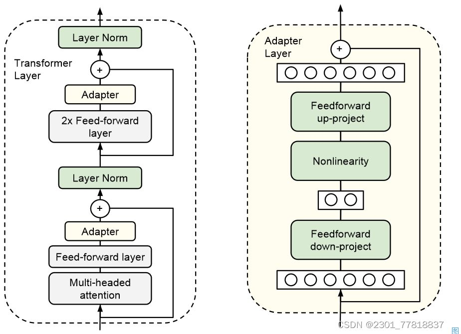
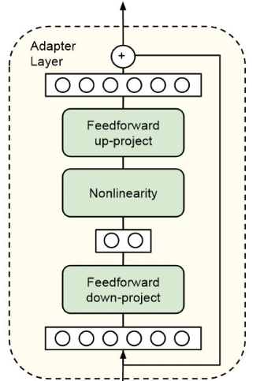

# 适配器

适配器（Adapter）是一种参数高效微调（Parameter-Efficient Fine-Tuning, PEFT）技术，用于在保持预训练模型大部分参数不变的情况下，使模型适应特定的下游任务。

## 适配器微调的基本概念

适配器微调（Adapter Tuning）是一种轻量级的微调技术，最早在2019年由Houlsby等人提出。其核心思想是在预训练模型的每一层（或某些层）之间插入小型神经网络模块，即"适配器"。这些适配器是可训练的，而原始模型的参数则保持冻结不变。

## 适配器微调的整体流程



### 选定插入位置

如图所示适配器模块通常有两种主要插入方式：

1. **插入在FFN（前馈网络）之后**：`Transformer Layer → FFN → Adapter → Add & Norm → 下一层`
2. **插入在注意力层之后**：`Attention → Adapter → Add & Norm → FFN`

Attention / FFN 是“语义变换最强”的地方。（为什么这么说？）

### Adapter的结构

适配器通常由两个全连接层组成，中间夹有一个非线性激活函数（如ReLU或GELU）



```text
h
 ↓
Down-Projection (d → r)
 ↓
Non-linearity (ReLU / GELU)
 ↓
Up-Projection (r → d)
 ↓
+ Residual (加回 h)
```

数学形式：

$$\text{Adapter}(h) = h + W_{up} \cdot \sigma(W_{down} \cdot h)$$

其中：

* ( d )：模型隐藏维度（比如 4096）
* ( r )：瓶颈维度（比如 8 / 16 / 64）
* **r ≪ d**

在这个数学公式中包含了四个步骤。

#### Down-Projection

$$ W_{down} : \mathbb{R}^d \to \mathbb{R}^r $$

这里降维的数学过程是

以具体数值为例（d=4096, r=64）：

* 输入：某个Transformer层的输出特征向量 h ∈ R^4096（4096维）
* 降维矩阵：可训练的权重矩阵 W_down ∈ R^(64×4096)（64行，4096列）
* 降维计算：h_low = W_down · h（矩阵乘法）
* 输出：低维特征 h_low ∈ R^64（64维）

这个矩阵乘法的几何意义：

* W_down的每一行（64个行向量）定义了64个"投影方向"
* 每个行向量与h做内积，得到h在该方向上的投影值
* 最终输出h_low的每个维度，就是h在这64个方向上的投影强度

这样的变换有三重含义。

1️⃣ 强约束表达空间（Low-rank 核心）

如果不降维：

$$W \in \mathbb{R}^{d \times d}$$

那实际上就是在做 **全量微调** 了。

预训练模型的特征空间虽然维度很高（如4096维），但针对特定下游任务，真正起决定性作用的特征方向可能只有几十到几百个。其他维度要么是冗余信息，要么是噪声，甚至可能干扰当前任务。Down-Project层通过 W_down矩阵，本质上是在学习一个任务特定的特征选择器，将高维特征投影到与任务最相关的低维子空间。

$$W_{up} W_{down} \Rightarrow \text{rank} \le r$$

👉 **Adapter 的所有“改变能力”被限制在一个 r 维子空间里**

2️⃣ 强制特征压缩（Feature selection）

设原始特征 h ∈ R^d，经过 W_down ∈ R^(r×d)投影后得到 h_low = W_down·h。这个矩阵乘法可以理解为：

W_down的每一行（r个行向量）定义了r个"特征方向"，每个行向量与h做内积，计算h在该方向上的投影强度。训练过程中，W_down会学习调整这些行向量的方向，使其对齐到对当前任务最有判别力的特征方向。

这里可以理解成：

> “从 4096 个语义方向里，只允许挑出 r 个最有用的方向出来说话。”

这一步本质上是：

* 对隐藏表示做**任务相关投影**
* 类似 PCA / bottleneck autoencoder

3️⃣ 极大减少参数 & 计算

参数量： $d \times r \quad \text{而不是} \quad d \times d$ 这样的微调相比起全参数微调更加轻量级，这是 Adapter 能规模化的工程基础。

**这里为什么需要重新使用一个新的可学习的矩阵重新组合基础特征，而不是在基础模型原有的特征方向中挑选？**

基础模型的每个神经元（特征维度）已经编码了特定的语义信息（如语法、情感、实体等）。Down-Project层不是简单地"关闭"某些神经元，而是学习一个线性组合：将4096个原始特征通过 W_down的权重进行加权求和，形成r个新的、任务优化的特征。这比简单的特征选择更灵活。

#### 非线性激活： $\sigma$

在非线性激活层会使用激活函数对 Down-Projection 处理后的结果进行处理。

```text
z → σ(z)
```

这里为什么需要非线性激活层。

如果没有非线性激活层，整个Adapter模块（Down-Project → 线性变换 → Up-Project）将退化为一个纯线性变换：Δh = W_up · (W_down · h) = (W_up·W_down) · h。这意味着Adapter只能学习线性映射，表达能力极其有限，无法捕捉任务所需的复杂非线性关系。

加入ReLU/GELU后，模型具备了非线性逼近能力，理论上可以近似任意复杂的函数，能够学习更精细的特征调整。

同时激活函数还具有实现特征筛选与稀疏化的功能。

以ReLU为例，其函数 f(x) = max(0, x)会将负值置零，正值保留。在低维瓶颈空间（r=64）中，这相当于：

* 特征选择：只激活对当前任务有用的特征维度
* 稀疏化表示：使输出特征向量中大部分元素为0，形成稀疏表示
* 增强判别性：突出重要特征，抑制噪声或冗余信息

如果去掉非线性激活层，Adapter将变成：

```text
h_low = W_down · h  (线性降维)
Δh = W_up · h_low  (线性升维)
最终输出：h' = h + W_up·W_down·h = (I + W_up·W_down)·h
```

这相当于在原始特征上施加了一个线性扰动矩阵。虽然也能调整特征，但存在严重问题：

* 表达能力受限：只能学习线性变换，无法适应复杂的非线性任务需求
* 参数冗余：W_up·W_down的秩最多为r（64），而原始特征空间维度d=4096，这意味着大部分特征方向无法被有效调整
* 效果不佳：实验表明，没有非线性层的Adapter性能显著下降

#### Up-Projection

```text
σ(z) → Δh
```

Up-Projection 的实质是一个**线性变换**，通过一个可学习的权重矩阵 $W_{\text{up}} \in \mathbb{R}^{d \times r}$ 实现：

$$Delta h = W_{\text{up}} \cdot h_{\text{low}}$$

- **输入**：低维特征向量 $h_{\text{low}} \in \mathbb{R}^r$（例如 $r = 64$），它是由 Down-Projection 层降维并经过非线性激活后得到的任务相关特征。
- **权重矩阵**：$W_{\text{up}}$ 的维度是 $d \times r$，其中 $d$ 是原始模型的隐藏层维度（例如 $d = 4096$）。
- **输出**：高维调整向量 $\Delta h \in \mathbb{R}^d$，其维度与原始模型的隐藏层输出一致。

**恢复维度的原理**：

- 矩阵乘法 $W_{\text{up}} \cdot h_{\text{low}}$ 的本质是，将低维向量 $h_{\text{low}}$ 的每个元素，与 $W_{\text{up}}$ 矩阵的每一行（一个 $r$ 维向量）做内积，生成高维向量 $\Delta h$ 的一个维度。
- 这相当于用 $W_{\text{up}}$ 的 $d$ 个行向量定义了 $d$ 个“重建方向”，将 $r$ 维信号“扩散”到 $d$ 维空间。

这一层的核心作用是：

**将低维瓶颈空间（r维）中学到的任务相关信号，精准地“翻译”回模型原有的高维语义空间（d维）。**


- $W_{\text{up}}$ **的权重是在训练过程中学习得到的**。它的每一个元素决定了低维特征 $h_{\text{low}}$ 的每个分量对原始高维空间每个维度的影响强度。
- 最终，Adapter 的输出是通过**残差连接**将调整量 $\Delta h$ 加到原始 Transformer 层的输出 $h$ 上实现的：$h' = h + \Delta h$。
- 这种加性调整的方式，相当于在模型固有的知识表示上，**叠加了一个针对当前微调任务优化过的“增量信号”或“偏置”**。它不会覆盖原始模型的知识（因为原始参数被冻结），而是对其进行微调。

#### Residual Add：`h + Δh`

残差连接 `h + Δh` 是Adapter微调中的关键设计，它通过一种**稳定且高效**的方式，让预训练模型在不丢失原有能力的前提下，快速适应新任务。

残差连接的核心作用：

1.  **保证训练稳定性与恒等初始化**
    残差连接的核心优势在于**稳定性**。Adapter模块中的上投影层（`W_up`）权重通常被初始化为接近零。在训练开始时，Adapter的输出 `Δh ≈ 0`，因此 `h' = h + Δh ≈ h`。这意味着Adapter模块初始时近似于一个**恒等映射**，不会破坏预训练模型原有的强大能力，为训练提供了一个非常**稳定且平滑的起点**。如果Adapter没有学到有用的信息，模型也能“安全”地退化为原始状态，避免了性能的灾难性下降。

2.  **实现低损耗的定向特征扰动**
    Adapter模块学习到的 `Δh` 是一个**增量**或**偏置**。残差相加的操作，相当于对原始特征表示 `h` 进行一种**温和的、定向的“扰动”或“微调”**。
    *   **定向性**：`Δh` 的方向和大小是由下游任务的损失函数梯度引导的。模型通过学习，使得这个增量能够将特征向量 `h` 朝着**有利于解决当前任务的方向**进行微调。
    *   **低损耗**：这种操作是**加性**的，而非**替换性**的。它保留了原始特征 `h` 的全部信息，只是在之上叠加了一个小的调整量。这最大限度地保留了大模型在预训练阶段学到的通用知识和语言能力，有效防止了**灾难性遗忘**。

3.  **促进迭代式优化与信息流动**
    从深度学习理论来看，残差连接鼓励一种**迭代式优化**。可以将每一层中加入Adapter视为对特征表示的一次微小 refinemen。高层特征可以看作是经过多次“微调”后的结果，这更符合梯度下降的优化逻辑，使优化过程更加顺畅。同时，残差连接也确保了梯度在反向传播时能够直接回传，缓解了可能出现的梯度消失问题，让Adapter这个新增的小模块能够被有效训练。

简单来说，`h + Δh` 的残差连接设计，其精妙之处在于它用一个非常巧妙的数学形式，实现了 **稳定性（恒等初始化）、高效性（定向微调）和有效性（保留原知识）** 的三重目标。它使得Adapter能够以极低的参数代价，成为一个高性能的“任务插件”，引导大模型高效适应新任务。

### 冻结原模型参数

在PyTorch等基于动态计算图的框架中，参数冻结的底层实现依赖于两个核心机制：

requires_grad属性：

* 这是最直接的开关。每个参数（一个 torch.Tensor）都有一个布尔类型的 requires_grad属性。
当 requires_grad=True时，框架在前向传播过程中会追踪并记录所有针对该参数的操作，构建出动态计算图，为反向传播计算梯度做准备。

* 当 requires_grad=False时，框架在执行前向传播时会将该参数视为一个常量，不会记录任何与其相关的操作历史。因此，在反向传播时，到该参数路径上的梯度计算会自然停止，其值也不会被更新。

动态计算图的构建与排除：

* 动态计算图是在前向传播过程中实时构建的。每次前向传播，PyTorch都会根据当前输入和模型状态临时构建一个计算图。PEFT在模型初始化时修改了模块构成。requires_grad=False的参数会被排除在梯度计算依赖的计算图之外。这意味着反向传播的梯度流不会经过这些参数，从而实现了“冻结”。

### 训练过程

在训练时，PEFT库会通过“模块替换”的方式，修改模型的计算图结构，向其中注入新的可训练路径。这个过程并非在计算图构建完成后进行修改，而是在模型初始化阶段，通过动态地替换原始模块来实现的。

模型初始化时的“手术”：

当调用 get_peft_model(model, config)时，PEFT库会对原始模型进行遍历（例如，通过 named_modules()），找到您在 target_modules中指定的层（如 q_proj, v_proj）。此时，它并非直接修改静态计算图，而是进行模块替换​ ：

* PEFT会创建一个新的、自定义的 Linear层（例如 LoraLinear），这个新层内部封装（wrap）​ 了原始的线性层。

* 然后，PEFT将原始模型中对应的 nn.Linear模块替换为这个新创建的 LoraLinear模块。

前向传播中的动态计算路径：

替换完成后，模型的计算图结构在代码层面已经改变。当输入数据经过模型时：

* 数据会流入新的 LoraLinear层。
* 该层内部，执行计算：output = W_original * x + B * A * x。
* 这里的 W_original被设置为 requires_grad=False，因此其计算路径在反向传播时不会有梯度流过，相当于被“冻结”。
* 只有旁路路径上的低秩矩阵 A和 B是可训练的，它们构成了计算图中新增的、唯一有梯度的分支 。

经过对计算图的节点进行替换之后训练流程和普通 fine-tuning 一样：还是前向传播（包含 Adapter）、计算 loss、反向传播，但是梯度只更新 Adapter 权重。

这里是因为在预训练阶段模型已经学会了最基本的知识。对于这部分知识我们并不需要进行调整。

微调时训练得到的产物主要是 W_down 和 W_up 这两个核心的权重矩阵。

### 推理 & 部署

在部署时有两种方式：

| 特性 | 方式一：权重合并（Weight Merging） | 方式二：动态加载（Dynamic Loading） |
| :--- | :--- | :--- |
| **核心操作** | 将训练好的 `W_down` 和 `W_up` 合并回原模型：`W_merged = W_original + W_up · W_down`  | 保持原模型 `W_original` 冻结，在推理框架中动态加载并激活Adapter模块 。 |
| **部署形态** | 得到一个独立的、与原始模型结构完全一致的**新模型文件**。 | 需要**基础模型文件**和**独立的Adapter权重文件**（如 `.bin` 或 `.safetensors`）。 |
| **推理过程** | **无需停止**。合并后的模型就是一个普通模型，推理流程与原始模型完全相同，无任何额外计算 。 | **无需停止/重启**。现代框架（如PEFT库）支持热切换，通过调用特定API（如 `set_adapter()`）即可在内存中动态加载或切换不同的Adapter，推理服务可保持运行 。 |
| **优势** | ✅ **零推理延迟**：无任何额外计算开销。<br>✅ **部署简单**：和部署单个模型一样。 | ✅ **极致节省存储**：一个基础模型可搭配无数个轻量级Adapter（每个仅几MB到几十MB）。<br>✅ **灵活多任务**：可实时切换不同任务的Adapter，非常适合多租户、多技能服务场景 。 |
| **劣势** | ❌ **存储成本高**：每个任务都需保存完整的合并后模型副本（可能高达数十GB）。 | ❌ **轻微延迟**：相比合并方案，有额外的矩阵加法计算，会引入轻微延迟 。<br>❌ **架构依赖**：推理框架需支持Adapter等PEFT方法。 |

这里的动态加载也是依赖于计算图的动态修改来实现的，在处理每个推理请求时，根据请求所指定的 Adapter，实时地将对应的低秩矩阵（A 和 B）“注入”或“叠加”​ 到基础模型原有的计算路径上。

## 适配器为什么能「起到微调效果」？

我们从三个层面解释 👇

### 表达能力角度（Low-rank functional update）

Adapter 做的事情不是「学新模型」，而是：

> **对原函数做低秩扰动**

如果原模型是：

$$y = f(x)$$

插 Adapter 后：

$$y = f(x) + \Delta f(x)$$

而：

$$\Delta f(x) \approx W_{up} \cdot \sigma(W_{down} \cdot h)$$

这是一个：低秩、非线性、局部生效的矩阵，**对于下游任务来说已经足够表达偏移**。

### 2️⃣ 表示空间视角（Feature Steering）

可以把 Adapter 理解为：

> **在隐藏空间里“拽一下向量方向”**

原模型已经学会了很多基础知识例如：语法、世界知识、通用语义结构

而 Adapter 的作用则是：放大某些维度，抑制某些模式，改变 token 的“解释方式”

比如：

* 对话模型 → 更礼貌
* 广告模型 → 更强调转化信号
* 医疗模型 → 更保守、专业

### 3️⃣ 优化稳定性角度（Why it trains well）

Adapter 微调有几个天然优势：

* 参数少 → 梯度稳定
* 不破坏原模型分布
* 不容易 catastrophic forgetting

可以理解为：

> **在“已经收敛的函数附近”做微调，而不是重新塑形**