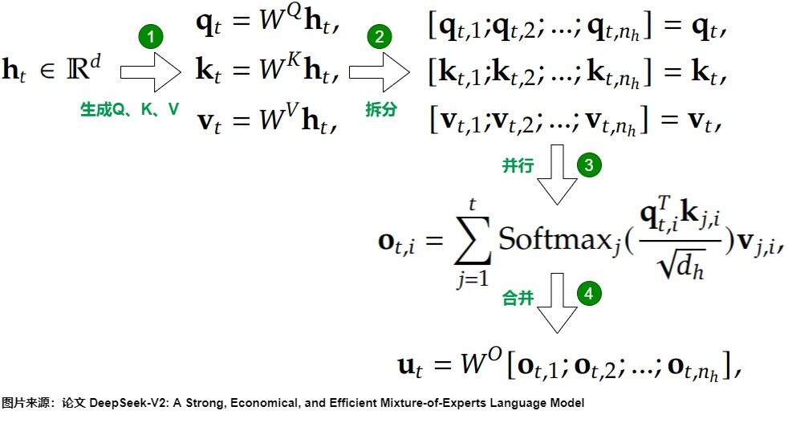
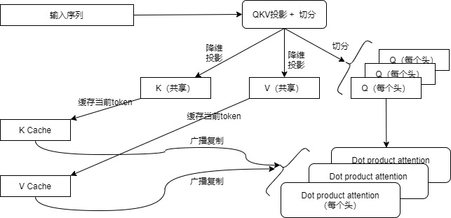
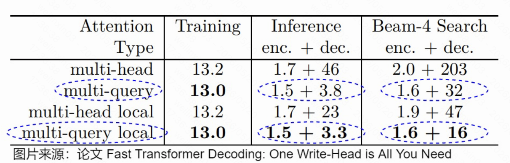
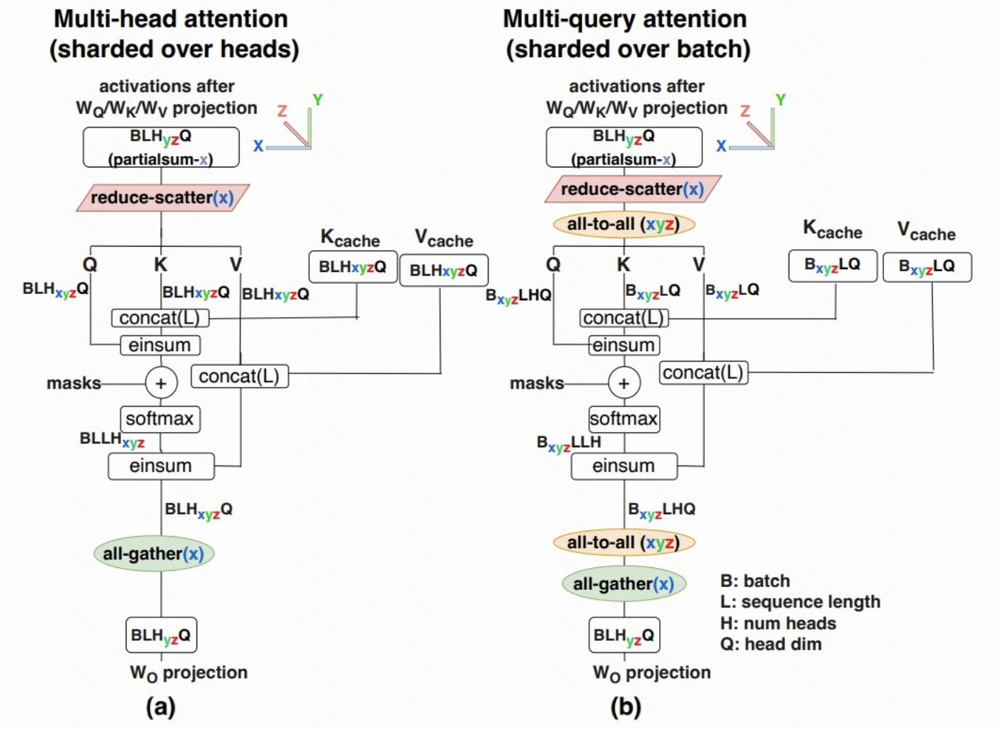
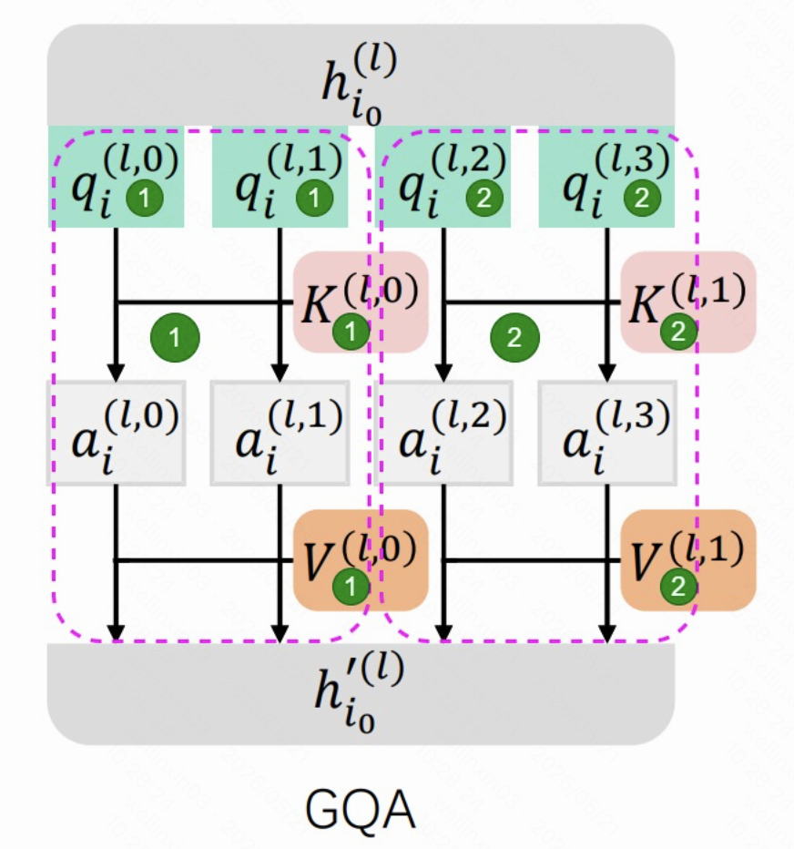
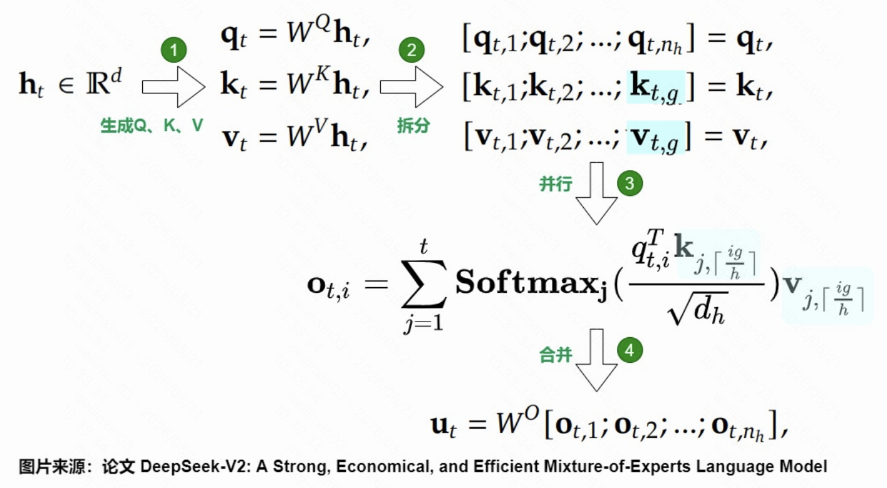

# MQA_GQA


## MHA存在的问题

MHA（Multi-Head Attention，多头注意力）是 Transformer 中最常见的注意力结构。它会把隐藏层维度拆成多个 head，每个 head 都有自己独立的 $W_Q$、$W_K$、$W_V$，分别计算 Query、Key、Value，再在各自的子空间中做注意力计算。多个 head 的输出最后会被拼接起来，并通过 $W_{Out}$ 投影回原来的 hidden size。




这样做的好处是，不同 head 可以学习不同类型的关系，例如语法关系、语义关系、长距离依赖等；但问题也很明显：每个 head 都要保存自己的 K/V，推理时 KV Cache 会随着 head 数、序列长度和 batch size 线性增长，带来更高的显存占用和访存开销。因此在长序列推理场景下，MHA 的主要瓶颈往往不只是计算量，而是 K/V 数据的读取和搬运成本。

这里要理解为什么 MHA 的主要瓶颈不是计算量，而是 K/V 数据的读取和搬运成本首先得了解算数强度这个概念。

在计算机硬件（GPU/TPU）中，数据的搬运速度（内存带宽）往往远慢于计算速度（算力）。

```text
算术强度 = 计算量 / 访存量
计算量：需要做多少次乘加运算（FLOPs）。
访存量：需要从显存中读取多少字节的数据。
```
这里根据算术强度的大小可以判断出任务类型：

- 计算密集型：算术强度高。意味着读取一次数据，可以进行很多次计算。此时瓶颈在于计算单元算得够不够快。
- 内存密集型：算术强度低（如文中提到的“不到 1”）。意味着每做一个简单的计算，就要去显存搬运大量数据。此时瓶颈在于数据搬运太慢，计算单元经常“饿肚子”等待数据。

以下这张图中的计算为例：


先简要说明这个图展示了从输入（Encoder Input）到输出（Attention Output）的数据流向：

-   输入层（左侧）
    -   `Encoder Input`：输入数据，维度为 $d \times l$（$d$是隐藏层维度，$l$是序列长度）。
    -   线性变换（红色虚线框）：输入向量分别乘以三个权重矩阵 $W_Q$、$W_K$、$W_V$。
        -   这就是计算 Query (Q)、Key (K)、Value (V) 的过程。
        -   图中的 $\otimes$ 符号代表矩阵乘法。

-   注意力计算层（绿色背景框）
    -   这是最核心的部分。Q、K、V 被计算出来后，进入注意力机制的计算。
    -   $Q \times K^T$：Query 和转置后的 Key 相乘，得到注意力分数矩阵（维度 $l \times l$）。
    -   Softmax：对分数进行归一化，得到概率分布。
    -   加权求和：Softmax 的结果再乘以 Value (V)。
    -   这部分（绿色虚线圈出）是典型的“激活乘激活”操作。

-   输出层（底部蓝色虚线框）
    -   Concatenate：将多个头的结果拼接起来。
    -   $W_{Out}$：通过一个线性层（权重矩阵 $W_{Out}$）进行投影。
    -   Norm + Add：残差连接和层归一化。
    -   最终得到 `Attention Output`。


可以把图中的三类计算理解为两种不同的数据复用方式。

红色区域和蓝色区域本质上都是线性层矩阵乘法。红色区域对应 $Q/K/V$ 投影，蓝色区域对应 Attention 输出后的 $W_{Out}$ 投影。

红色部分：

$$Q = XW_Q,\quad K = XW_K,\quad V = XW_V$$

蓝色部分：

$$O = AttentionOutput \cdot W_{out}$$


它们的共同特点是：权重矩阵是模型参数，不同请求、不同 token 在同一次 forward 中可以共享同一份权重（多个 token 共享同一个 W_Q/W_K/W_V/W_out）。

当 Batch Size 为 1，并且每次只处理一个 token 时，这些线性层更接近矩阵乘向量，GPU 需要从显存读取较大的权重矩阵，但只服务于一个输入 token，权重复用率较低，因此也容易受内存带宽限制。

当 Batch Size 增大，或者一次 forward 中同时处理的 token 数增多时，线性层可以从矩阵乘向量变成更规整的矩阵乘矩阵。此时同一个 $W_Q$、$W_K$、$W_V$ 或 $W_{Out}$ 会被 batch 内多个 token 反复使用。也就是说，权重读取一次，可以参与更多乘加运算，所以算术强度会随 batch 内 token 数增加而提高，GPU 更容易从 memory-bound 转向 compute-bound。

因此，红色和蓝色区域“计算强度更高”的关键不只是因为它们是矩阵乘法，而是因为它们的权重矩阵可以在 batch 内被充分复用。

在 decode 阶段，如果：

* Batch Size = 1
* 每次只生成 1 个 token

那么线性层输入其实只有 一个 token 的 hidden state 向量。

假设 hidden size： d = 4

那么当前 token 的 hidden state 可以写成一个列向量：

$x =
\begin{bmatrix}
1 \\
2 \\
3 \\
4
\end{bmatrix}$

形状是： $4 \times 1$

线性层权重矩阵，比如 W_Q，形状是： $W_Q \in \mathbb{R}^{4 \times 4}$

例如：

$$W_Q =
\begin{bmatrix}
1 & 0 & 2 & 1 \\
0 & 1 & 1 & 0 \\
2 & 1 & 0 & 1 \\
1 & 1 & 1 & 1
\end{bmatrix}$$

那么计算 Query：q = W_Q x

就是：

$$\begin{bmatrix}
1 & 0 & 2 & 1 \\
0 & 1 & 1 & 0 \\
2 & 1 & 0 & 1 \\
1 & 1 & 1 & 1
\end{bmatrix}
\begin{bmatrix}
1 \\
2 \\
3 \\
4
\end{bmatrix}
=
\begin{bmatrix}
11 \\
5 \\
8 \\
10
\end{bmatrix}$$

这里就是典型的： $4 \times 4 \quad \text{矩阵}$ 乘以： $4 \times 1 \quad 
\text{向量}$

如果 Batch Size 大于 1，例如 batch 里同时有 3 个 token：

$$X =
\begin{bmatrix}
1 & 5 & 9 \\
2 & 6 & 10 \\
3 & 7 & 11 \\
4 & 8 & 12
\end{bmatrix}$$

形状是： $4 \times 3$

这里每一列表示一个 token 的 hidden state：

第 1 列：token A
第 2 列：token B
第 3 列：token C

这时计算：Q = W_Q X

就是：$4 \times 4$ 乘以 $4 \times 3$ 得到 $4 \times 3$

这就是更标准的 矩阵乘矩阵，也就是 GEMM。

关键区别在这里，当 $Batch Size = 1$  ， $W_Q \times x$ ，也就是： $d \times d \quad \times \quad d \times 1$ 此时只有一个 token 使用这个权重矩阵。所以权重 W_Q 从显存搬进来后，只服务一个向量，复用率低。

而当 $Batch Size = 3$ 时 $W_Q \times X$ 也就是： $d \times d \quad \times \quad d \times 3$ 同一个权重矩阵 W_Q 同时服务 3 个 token。权重被复用了 3 次，算术强度更高。

此时如果 batch 里有 128 个 token，那就是：这时候同一份权重矩阵被 128 个 token 共享使用，GPU 更容易打满。

蓝色部分计算 Attention 输出后的内容也是同理。因为之后的计算也是一个固定的权重。

绿色区域对应真正的 Attention 计算，包括 $QK^T$ 、Softmax 以及 Attention Score 对 $V$ 的加权求和。

它和红色、蓝色区域最大的不同在于：绿色区域主要处理的是激活数据与激活数据。在自回归 decode 阶段，需要读取每个请求各自的历史 KV Cache。

与线性层不同每个请求里的 Token 在计算时都使用同样形状的 WQ WK WV，在Attention 计算时不同请求之间的 KV Cache 通常不能共享。

请求 A 只能读取请求 A 自己的历史 K/V，请求 B 也只能读取请求 B 自己的历史 K/V。即使使用 Continuous Batching，把多个请求放到同一个 batch 中，绿色区域也更像是在同时处理多份彼此独立的 KV Cache，而不是让多个请求共享同一个大权重矩阵。

```text
请求 A 读 A 的 KV Cache

请求 B 读 B 的 KV Cache

请求 C 读 C 的 KV Cache
```

在 decode 阶段，每个请求通常每步只生成一个新 token。这个新 token 的 Query 很小，但它需要和历史上下文中的所有 Key 做相似度计算，并继续读取对应的 Value 完成加权求和。如果上下文长度为 $L$，那么每生成一个 token，就需要读取大约 $L$ 长度的 K/V Cache。序列越长，需要搬运的 KV 数据越多。

并且在标准 MHA 中，多个 attention head 之间的 K/V 也不共享。假设有 $h$ 个 head，那么每个 head 都有自己独立的历史 K/V Cache。也就是说，decode 时不仅要读取当前请求自己的历史 K/V，还要分别读取这个请求中每个 head 对应的 K/V。因此需要搬运的数据量会随 head 数一起增长，大致可以理解为：

$$
KV\ 读取量 \propto 2 \times h \times L \times d_{head}
$$

其中 $2$ 表示 K 和 V，$h$ 表示 head 数，$L$ 表示历史序列长度，$d_{head}$ 表示每个 head 的维度。所以 batch 变大虽然可以改善并行度和 kernel 调度效率，但并不能像红色、蓝色线性层那样显著提高绿色 Attention 区域的数据复用率。绿色区域的访存量会随上下文长度和 head 数增长，而其中大量时间可能花在从显存中读取 KV Cache 上。当 KV Cache 很大时，存储搬运时间可能超过真正的计算时间，GPU 计算单元会等待数据到达，这就是长上下文 decode 阶段 Attention 容易成为 memory-bound 瓶颈的原因。


需要注意的是，这个结论主要针对自回归推理的 decode 阶段。在 prefill 阶段，模型一次性处理整段 prompt，Attention 需要计算长度为 $L$ 的 token 之间的两两关系，计算复杂度接近 $O(L^2 d)$，此时绿色区域的计算量也会非常大。因此，不能简单地说绿色区域始终计算量小；更准确的说法是：在 decode 阶段，绿色区域往往因为频繁读取每个请求私有的 KV Cache，而表现出明显的内存带宽瓶颈。

可以总结为：红色和蓝色区域依赖共享权重矩阵，batch 内 token 越多，权重复用越充分，算术强度越高；绿色区域依赖每个请求自己的历史 KV Cache，数据难以跨请求复用。并且在标准 MHA 中，各个 head 的 K/V 也不共享，所以长上下文、多 head 下需要搬运更多 K/V 数据，因此更容易受显存带宽限制。

因此，后续优化的方向就可以从这个瓶颈自然推出来：既然 decode 阶段的主要开销来自反复读取大量历史 K/V，那么优化目标就不是单纯减少 Q 的计算，而是尽量减少 **需要保存和读取的 K/V 数量**。

具体来说，改进方向主要有两类：

- **减少 K/V 的 head 数**：MHA 中每个 Query Head 都有独立 K/V，访存量随 head 数增长；如果让多个 Query Head 共享同一组 K/V，就可以减少 KV Cache 的规模和读取量。MQA 就是最激进的做法：所有 Query Head 共享一组 K/V。

- **在表达能力和访存开销之间折中**：完全共享 K/V 虽然省显存、速度快，但可能削弱不同 head 的表示差异。因此也可以不让所有 head 都共享一组 K/V，而是让一组 Query Head 共享一组 K/V，这就是 GQA 的思路。它介于 MHA 和 MQA 之间，既减少 KV Cache，又保留一部分多头表达能力。

所以，从 MHA 的问题出发，MQA/GQA 这类结构的核心思路就是：**保留多头 Query 的查询能力，同时减少 Key/Value 的冗余存储和搬运**。

## MQA

### 概念

MQA（Multi-Query Attention，多查询注意力）是对 MHA 的一种推理友好型改进。它的核心思想是：**Query 仍然保留多头，但 Key 和 Value 只保留一组，让所有 Query Head 共享同一份 K/V**。

在标准 MHA 中，如果有 $h$ 个 attention head，那么通常会有 $h$ 组 $Q$、$K$、$V$：

```text
MHA:
Q1  K1  V1
Q2  K2  V2
Q3  K3  V3
...
Qh  Kh  Vh
```

也就是说，每个 head 都有自己独立的 Key 和 Value。这样表达能力更强，但在推理 decode 阶段，每一层、每一个历史 token 都要为每个 head 保存一份 K/V。KV Cache 的规模会随着 head 数线性增长：

$$
KV\ Cache \propto 2 \times h \times L \times d_{head}
$$

其中 $2$ 表示 K 和 V，$h$ 表示 head 数，$L$ 表示序列长度，$d_{head}$ 表示每个 head 的维度。

MQA 的改进点就是把多组 K/V 压缩成一组共享 K/V：

```text
MQA:
Q1  \
Q2   \
Q3    ->  shared K, shared V
...  /
Qh  /
```

此时 Query 仍然是多头的，所以模型依然可以从多个 Query 子空间中发起不同的注意力查询；但所有 Query Head 在计算注意力时，使用的是同一份 Key 和 Value。这样 KV Cache 的规模就从原来的 $h$ 份 K/V 变成了 $1$ 份 K/V：

$$
KV\ Cache \propto 2 \times 1 \times L \times d_{head}
$$

因此，MQA 对 MHA 的主要改进体现在推理阶段：

- **显存占用更小**：KV Cache 不再为每个 head 保存独立 K/V，而是所有 head 共享一组 K/V。
- **访存压力更低**：decode 每生成一个 token 时，需要从显存读取的历史 K/V 大幅减少。
- **推理吞吐更高**：长上下文或大 batch 场景下，Attention 更容易受 KV Cache 读取限制，MQA 可以缓解这个 memory-bound 瓶颈。

总体流程如下：



对于 MQA 来说，所有 Query Head 共享同一组 Key 和 Value。这里的“共享”可以从两个阶段理解：**生成 K/V 时只生成一份，计算 Attention 时让多个 Q head 复用这一份 K/V**。

假设 MHA 中有 8 个 attention head，每个 head 的维度是 $d_{head}$。标准 MHA 会把 Q、K、V 都投影成 8 个 head：

```text
Q: [B, 8, T, d_head]
K: [B, 8, L, d_head]
V: [B, 8, L, d_head]
```

其中 $B$ 是 batch size，$T$ 是当前要计算的 token 数，decode 阶段通常是 1，$L$ 是历史上下文长度。

而 MQA 会保留 8 个 Query Head，但 K/V 只生成 1 个 head：

```text
Q: [B, 8, T, d_head]
K: [B, 1, L, d_head]
V: [B, 1, L, d_head]
```

这一步通常通过改变 $W_K$ 和 $W_V$ 的输出维度实现。MHA 的 $W_K$、$W_V$ 会输出 $8 \times d_{head}$ 维，然后 reshape 成 8 个 KV head；MQA 的 $W_K$、$W_V$ 只输出 $1 \times d_{head}$ 维，所以 reshape 后只有 1 个 KV head。对应地，KV Cache 中也只保存这一份 K/V。

接下来做 attention 时，每个 Query Head 都需要和 K 做点积：

$$
Attention(Q_i, K, V) = softmax(\frac{Q_iK^T}{\sqrt{d_{head}}})V
$$

其中 $Q_i$ 表示第 $i$ 个 Query Head。因为 K/V 的 head 维度是 1，而 Q 的 head 维度是 8，所以在实现中会通过 broadcasting、expand、repeat_kv，或者在 attention kernel 内部用 `num_kv_heads = 1` 的方式，让 8 个 Query Head 都读取同一份 K/V：

```text
Q1 -> shared K, shared V
Q2 -> shared K, shared V
Q3 -> shared K, shared V
...
Q8 -> shared K, shared V
```

从数学上看，就像是把同一份 K/V “复制”给 8 个 Query Head 使用；但高效实现里通常不会真的在显存中复制 8 份 KV Cache，而是让多个 Q head 在计算时逻辑上共享同一块 K/V 数据。这样才能真正减少 KV Cache 的存储和读取量。

更底层一点看，这种共享通常有两种实现方式。

第一种是在普通张量计算里利用 **broadcast / expand**。例如 K 原本的形状是：

```text
K: [B, 1, L, d_head]
```

如果 attention 计算接口希望 Q 和 K 的 head 维度一致，可以把 K 在 head 维度上 expand 成：

```text
K_expand: [B, 8, L, d_head]
```

但这里的 expand 通常只是改 tensor 的 view/stride，并不会真的分配 8 倍显存。它的含义是：head 维度上不同位置都指向同一块底层 K 数据。

可以粗略理解为：

```text
K_expand[:, 0, :, :] -> K[:, 0, :, :]
K_expand[:, 1, :, :] -> K[:, 0, :, :]
K_expand[:, 2, :, :] -> K[:, 0, :, :]
...
K_expand[:, 7, :, :] -> K[:, 0, :, :]
```

也就是说，逻辑上看起来有 8 个 K head，但物理存储只有 1 个 K head。V 也是同理。

第二种是在更高效的 attention kernel 里，根本不显式 expand，而是在 kernel 内部通过索引映射完成共享。对于 MHA，每个 Query Head 会读取同编号的 KV Head：

```text
MHA:
q_head 0 -> kv_head 0
q_head 1 -> kv_head 1
q_head 2 -> kv_head 2
...
q_head 7 -> kv_head 7
```

而对于 MQA，因为 `num_kv_heads = 1`，所以所有 Query Head 都映射到第 0 个 KV Head：

```text
MQA:
q_head 0 -> kv_head 0
q_head 1 -> kv_head 0
q_head 2 -> kv_head 0
...
q_head 7 -> kv_head 0
```

伪代码可以写成：

```python
num_q_heads = 8
num_kv_heads = 1
group_size = num_q_heads // num_kv_heads

for q_head in range(num_q_heads):
    kv_head = q_head // group_size  # MQA 中永远等于 0
    q = Q[:, q_head, :, :]
    k = K_cache[:, kv_head, :, :]
    v = V_cache[:, kv_head, :, :]
    out[:, q_head, :, :] = attention(q, k, v)
```

如果是 GQA，假设 8 个 Query Head 共享 2 个 KV Head，那么 `num_kv_heads = 2`，映射关系就会变成每 4 个 Query Head 共享一组 K/V：

```text
GQA:
q_head 0,1,2,3 -> kv_head 0
q_head 4,5,6,7 -> kv_head 1
```

所以从底层实现看，MQA 并不是“先复制 KV，再让多个 head 使用”，而是通过 tensor view 或 kernel 内部的 head 映射，让多个 Query Head 读取同一个 KV Head 的缓存地址。这样 KV Cache 的真实存储量和读取量才会从 MHA 的 8 份下降到 MQA 的 1 份。

### 资源占用情况

#### 内存

从资源占用角度看，MQA 最直接的收益是 **KV Cache 显存占用下降**。



在标准 MHA 中，每个 attention head 都有自己独立的 K 和 V。假设 head 数是 $h$，每个 head 的维度是 $d_{head}$，历史序列长度是 $L$，那么单层中每个请求需要缓存的 K/V 大致是：

$$
MHA\ KV\ Cache \propto 2 \times h \times L \times d_{head}
$$

其中 $2$ 表示 K 和 V 两份缓存。也就是说，MHA 每一层都要为 $h$ 个 head 分别保存一份 K 向量和一份 V 向量。

而 MQA 中所有 Query Head 共享同一组 K/V，因此每层只需要保存 1 份 K 和 1 份 V：

$$
MQA\ KV\ Cache \propto 2 \times 1 \times L \times d_{head}
$$

所以在 KV Cache 这一项上，MQA 的显存占用大约会下降到 MHA 的： $\frac{1}{h}$

如果 MHA 有 32 个 head，那么原来每层、每个 token 需要保存 32 组 K/V；换成 MQA 后，只需要保存 1 组 K/V。这个变化对于长上下文推理非常关键，因为上下文越长，KV Cache 占用越大，显存压力也越明显。

除了显存占用下降，MQA 还会带来推理速度提升。截图中的实验表格来自论文 **Fast Transformer Decoding: One Write-Head is All You Need**，它比较了 multi-head 和 multi-query 在训练、普通推理以及 beam search 推理中的耗时。表格里的数值可以理解为平均生成每个 token 所需的毫秒数。

从结果可以看到几个现象：

- **训练速度几乎不变**：multi-head 和 multi-query 的训练耗时非常接近。这是因为训练阶段通常一次性处理完整序列，主要计算仍然是大矩阵乘法，MQA 对整体训练计算量的影响没有 decode 阶段那么明显。
- **推理 decoder 速度显著提升**：普通推理中，multi-head 的 decoder 部分耗时明显高于 multi-query。原因是 decode 阶段每次只生成一个新 token，新 token 的 Q 很小，但需要反复读取历史 K/V Cache。MQA 减少了需要读取的 K/V 数量，所以 decoder 侧收益很大。
- **Beam Search 下收益更明显**：beam search 会同时维护多个候选序列，相当于进一步放大了 KV Cache 的存储和读取压力。因此 MQA 减少 K/V 后，在 beam search 场景下加速更加明显。

需要注意的是，MQA 并不是让 attention 的数学计算完全消失。它仍然要计算 Query 和 Key 的相似度，也仍然要对 Value 做加权求和。真正减少的是 **K/V 的存储量和读取量**。在 decode 阶段，这部分恰好是主要瓶颈，所以速度提升会很明显。

换句话说，MQA 的收益主要来自两点：

- **KV Cache 空间下降**：head 数减少后，需要存到 GPU 显存中的 K/V 张量变少，可以支持更长上下文或更大的 batch。
- **显存读取时间下降**：每一步 decode 读取的历史 K/V 数据更少，GPU 计算单元等待数据搬运的时间减少，attention 从 memory-bound 瓶颈中缓解出来。

因此，虽然 MQA 从结构上只是把多组 K/V 改成一组共享 K/V，但它击中的正是自回归推理中最敏感的部分：**长上下文下 KV Cache 的显存占用和读取带宽**。

#### 表征能力

MQA 的代价主要体现在表征能力上。标准 MHA 中，每个 head 都有自己独立的 $Q$、$K$、$V$ 投影，因此不同 head 不仅可以用不同的 Query 去“提问”，也可以拥有不同的 Key/Value 表示空间：

```text
MHA:
Q1 -> K1, V1
Q2 -> K2, V2
Q3 -> K3, V3
...
Qh -> Kh, Vh
```

这意味着不同 head 可以分别学习不同类型的注意力模式，例如语法关系、指代关系、局部上下文关系、长距离依赖等。

而 MQA 中只有一组共享的 K/V：

```text
MQA:
Q1 -> shared K, shared V
Q2 -> shared K, shared V
Q3 -> shared K, shared V
...
Qh -> shared K, shared V
```

所以不同 head 之间的差异主要只能依靠不同的 Query 来完成。换句话说，模型仍然可以从多个 Query Head 发起不同的查询，但所有查询看到的是同一套 Key/Value 表示。这样会减少 K/V 侧的表示多样性，限制注意力层能表达的模式，因此 MQA 虽然能很好地支持推理加速，但效果通常可能比标准 MHA 略差。

另外，MQA 还会减少注意力层中的参数量。因为 $W_K$、$W_V$ 不再输出 $h$ 组 K/V，而是只输出 1 组 K/V。为了弥补共享 K/V 带来的模型容量下降，一些模型会相应增大 FFN/GLU 的规模，让模型总参数量尽量保持不变。这样做的思路是：虽然注意力层的 K/V 表示能力变弱了，但可以通过更大的前馈网络补回一部分非线性表达能力，从而缓解效果损失。

还需要注意的是，MQA/GQA 改变的不只是 KV Cache 的存储方式，而是整个注意力层的结构。因此模型通常需要在训练阶段就采用 MQA 或 GQA，让参数从一开始就适应“多个 Query Head 共享 K/V”的计算方式。

如果一个模型已经按照标准 MHA 训练好了，推理时不能简单地把多个 K/V Head 强行合并成一组 K/V。这样会改变每个 head 原本学到的注意力行为，导致模型输出质量明显下降。更合理的做法是：

- 从头训练时就使用 MQA/GQA 结构。
- 或者在已有 MHA 模型基础上转换结构后，再通过继续训练或微调让模型适应新的注意力形式。

有研究表明，使用约 5% 的原始训练数据进行继续训练，就可以在一定程度上恢复转换到 MQA/GQA 后的模型效果。

#### 通信

MQA 在单卡推理时通常收益很直接：KV Cache 更小，每一步 decode 需要读取的 K/V 更少。但在多卡张量并行场景下，情况会复杂一些，因为 MQA 的共享 K/V 会改变原本比较自然的 head 维度切分方式。

在标准 MHA 中，head 数比较多，因此可以很自然地把不同 attention head 分到不同 GPU 上。例如有 8 个 head、4 张 GPU，可以按 head 切分：

```text
GPU0: head 0,1 的 Q/K/V
GPU1: head 2,3 的 Q/K/V
GPU2: head 4,5 的 Q/K/V
GPU3: head 6,7 的 Q/K/V
```

这种情况下，每张 GPU 只需要负责自己那部分 head 的 Q/K/V 计算，并保存对应 head 的 KV Cache。也就是说，MHA 的 KV Cache 可以跟着 head 一起被切分到不同 GPU 上，各卡之间不需要频繁共享同一份 K/V。

但是 MQA 中只有 1 组共享 K/V：

```text
Q heads: 多个
K/V heads: 1 个
```

这会带来一个并行问题：不同 GPU 上虽然可以分别负责一部分 Query Head，但这些 Query Head 都需要访问同一组共享 K/V。也就是说，K/V 不再像 MHA 那样容易按 head 均匀切到多张 GPU 上。

为了解决这个问题，底层实现通常有两种选择：

- **每张 GPU 都保存一份共享 K/V 的副本**：这样每张卡都可以直接用本地 K/V 计算自己负责的 Query Head，计算路径简单，但同一份 KV Cache 会在多张 GPU 上重复存储。单卡上的 KV Cache 仍然比 MHA 少，但总显存节省会被多卡副本抵消一部分。

- **K/V 只保存在部分 GPU 上，其他 GPU 通过通信获取**：这样可以减少重复存储，但每一步 decode 都可能需要跨卡传输 K/V 或 attention 中间结果，引入额外通信开销，例如 all-to-all、all-gather、reduce-scatter 等。



因此，MQA 的多卡代价可以理解为：它减少了 K/V head 数，降低了单卡访存和 KV Cache 规模；但因为 K/V 被过度共享，多个 GPU 上的 Query Head 都需要访问同一份 K/V，这会让并行切分变得不如 MHA 自然，可能带来额外通信或重复存储。

可以总结为：

- **单卡推理**：MQA 基本是纯收益，KV Cache 更小，读取更少。
- **多卡推理**：MQA 仍然减少 K/V 本身，但共享 K/V 可能需要跨卡复制、广播或 all-to-all 通信，通信成本会吃掉一部分收益。
- **最终是否划算**：取决于模型规模、并行策略、batch size、上下文长度以及 GPU 间通信带宽。长上下文场景下，MQA 减少 KV Cache 的价值通常仍然很高，但多卡通信开销需要单独考虑。

所以，MQA 的通信问题本质上是：**K/V head 太少，导致它不像 MHA 那样可以自然按 head 分片；为了让分布在多张 GPU 上的 Query Head 都访问共享 K/V，就需要在重复存储和跨卡通信之间做权衡**。

## GQA

### 概念

从前面的分析可以看到，MHA 和 MQA 分别站在两个极端：

```text
MHA: 每个 Query Head 都有自己独立的 K/V
MQA: 所有 Query Head 共享同一组 K/V
```

MHA 的优点是表征能力强。因为每个 head 都有独立的 $Q$、$K$、$V$，不同 head 可以学习不同的注意力模式。但它的问题也很明显：KV Cache 会随着 head 数增长，decode 阶段需要读取大量历史 K/V，长上下文推理时容易受到显存容量和显存带宽限制。

MQA 则把问题推向另一个方向：它让所有 Query Head 共享同一组 K/V，大幅减少 KV Cache 和访存量，因此推理速度更快、显存占用更小。但 MQA 的共享过于激进，所有 head 只能依赖不同的 Query 来制造注意力差异，K/V 侧的表示多样性明显减少，所以模型效果可能比 MHA 略差。另外在多卡张量并行时，只有 1 组 K/V 也不容易按 head 切分，可能带来额外通信或重复存储。

因此，GQA（Grouped-Query Attention，分组查询注意力）出现的目的就是在 MHA 和 MQA 之间做折中：

```text
MHA: num_q_heads = num_kv_heads
GQA: num_q_heads > num_kv_heads > 1
MQA: num_kv_heads = 1
```

也就是说，GQA 不再让每个 Query Head 都独占一组 K/V，也不让所有 Query Head 都共享同一组 K/V，而是让一组 Query Head 共享一组 K/V。

例如有 8 个 Query Head，MHA 会有 8 组 K/V：

```text
MHA:
Q0 -> K0, V0
Q1 -> K1, V1
Q2 -> K2, V2
Q3 -> K3, V3
Q4 -> K4, V4
Q5 -> K5, V5
Q6 -> K6, V6
Q7 -> K7, V7
```

MQA 只有 1 组 K/V：

```text
MQA:
Q0,Q1,Q2,Q3,Q4,Q5,Q6,Q7 -> K0, V0
```

而 GQA 可以保留 2 组或 4 组 K/V。比如保留 2 组 K/V 时：

```text
GQA:
Q0,Q1,Q2,Q3 -> K0, V0
Q4,Q5,Q6,Q7 -> K1, V1
```



q_t: 有 n_h 个 Query Head
k_t: 只有 g 个 KV Head
v_t: 只有 g 个 KV Head



这样做的好处是：

- **相比 MHA，GQA 减少了 KV Cache**：K/V head 数从 8 个减少到 2 个，decode 阶段需要保存和读取的 K/V 也随之减少。
- **相比 MQA，GQA 保留了更多 K/V 多样性**：不是所有 Query Head 都看同一组 K/V，而是不同组仍然有自己的 K/V 表示，因此表征能力通常比 MQA 更好。
- **相比 MQA，GQA 更适合多卡并行**：因为它不止 1 个 KV head，可以更自然地把不同 KV group 分到不同 GPU 上，通信和副本压力通常比 MQA 更容易控制。

所以，GQA 的核心价值是：**用少量 KV Head 保留一部分 MHA 的表达能力，同时接近 MQA 的推理效率**。它不是简单地把 MHA 剪掉几个 head，而是把多个 Query Head 分成若干组，让每组共享一套 K/V，从而在效果、显存、访存和多卡通信之间取得更平衡的结果。

### 实现

目前主流推理框架和注意力算子基本都已经支持 MQA/GQA，比如 FlashAttention-2 中就支持 `num_heads != num_kv_heads` 的情况。它的关键实现点是：**不真的复制 K/V Head，而是在 kernel 内部通过索引映射，让多个 Query Head 读取同一个 KV Head**。

先看张量形状。假设 Query Head 数是 `num_heads = 8`，KV Head 数是 `num_kv_heads = 2`，那么 GQA 中 Q、K、V 的形状可以写成：

```text
Q: [B, L, 8, d_head]
K: [B, L, 2, d_head]
V: [B, L, 2, d_head]
```

如果是普通 MHA，那么 `num_heads = num_kv_heads = 8`，第几个 Q head 就读取第几个 K/V head：

```text
MHA:
q_head 0 -> kv_head 0
q_head 1 -> kv_head 1
q_head 2 -> kv_head 2
...
q_head 7 -> kv_head 7
```

但 GQA 中 KV Head 更少，所以需要建立 Query Head 到 KV Head 的映射关系。对于 `num_heads = 8`、`num_kv_heads = 2` 的情况，每 4 个 Query Head 共享 1 个 KV Head：

```text
GQA:
q_head 0,1,2,3 -> kv_head 0
q_head 4,5,6,7 -> kv_head 1
```

这个映射可以用下面的方式计算：

```python
group_size = num_heads // num_kv_heads
kv_head = q_head // group_size
```

所以：

```text
q_head = 0,1,2,3 时，kv_head = 0
q_head = 4,5,6,7 时，kv_head = 1
```

### 普通实现：repeat_kv / expand

一种直观实现方式是先把 K/V 在 head 维度上“扩展”到和 Q 一样多：

```text
K:        [B, L, 2, d_head]
V:        [B, L, 2, d_head]

repeat 后:
K_repeat: [B, L, 8, d_head]
V_repeat: [B, L, 8, d_head]
```

逻辑上相当于：

```text
K0 -> K0,K0,K0,K0
K1 -> K1,K1,K1,K1
```

然后就可以像普通 MHA 一样计算 attention。

但是这种方式要注意：如果真的把 K/V 复制成 8 份，就会抵消 GQA 减少 KV Cache 的意义。因此更好的实现是使用 `expand` 或者类似的 view，让逻辑形状看起来变大，但底层存储仍然只有原来的 2 份 K/V。更进一步，高性能 attention kernel 通常连显式 expand 都不做。

这里在底层的实现与前面 MQA 类似。

### FlashAttention 类实现：索引映射

FlashAttention 这类底层 kernel 更常用的方式是 **indexing**。也就是把 Q head 编号和 KV head 编号的映射关系传进 kernel，kernel 在计算时根据 `q_head` 算出应该读取哪个 `kv_head`，然后直接从 K/V 的真实内存地址读取数据。

伪代码可以理解成：

```python
for batch_id in range(B):
    for q_head in range(num_heads):
        kv_head = q_head // group_size

        q = Q[batch_id, :, q_head, :]
        k = K_cache[batch_id, :, kv_head, :]
        v = V_cache[batch_id, :, kv_head, :]

        out[batch_id, :, q_head, :] = attention(q, k, v)
```

这里的关键是：

```text
K_cache 真实形状仍然是 [B, L, num_kv_heads, d_head]
V_cache 真实形状仍然是 [B, L, num_kv_heads, d_head]
```

kernel 只是让多个 `q_head` 指向同一个 `kv_head`，并没有把 K/V 在显存中复制成 `num_heads` 份。这样才能同时做到：

- Q 仍然保持多头输出。
- K/V Cache 只保存较少的 KV Head。
- Attention 计算时多个 Q Head 可以共享同一个 KV Head。

也就是说，GQA 的底层实现不是：

```text
先复制 K/V -> 再计算 attention
```

而是：

```text
保存少量 K/V -> 计算时通过 head 索引映射读取对应 K/V
```

### 反向传播中的梯度合并

如果是在训练阶段，还需要处理反向传播。因为多个 Query Head 在前向过程中共享了同一个 KV Head，所以反向传播时，这些 Query Head 对同一个 K/V 的梯度需要累加起来。

例如：

```text
q_head 0,1,2,3 -> kv_head 0
```

那么反向传播时，`kv_head 0` 的梯度来自 4 个 Query Head：

```text
dK0 = dK_from_q0 + dK_from_q1 + dK_from_q2 + dK_from_q3
dV0 = dV_from_q0 + dV_from_q1 + dV_from_q2 + dV_from_q3
```

这就是 FlashAttention-2 论文中提到的：前向时通过隐式索引避免复制 K/V；反向时需要把那些“逻辑上被复制”的 K/V Head 对应的梯度加总回来。

因此，从底层实现原理看，GQA/MQA 的关键不是把 KV Head 真的复制给所有 Query Head，而是利用 **head 索引映射 + 共享 K/V 存储 + 梯度累加** 来实现逻辑上的共享。这样既保留了多 Query Head 的计算形式，又真正减少了 KV Cache 的存储和读取开销。
