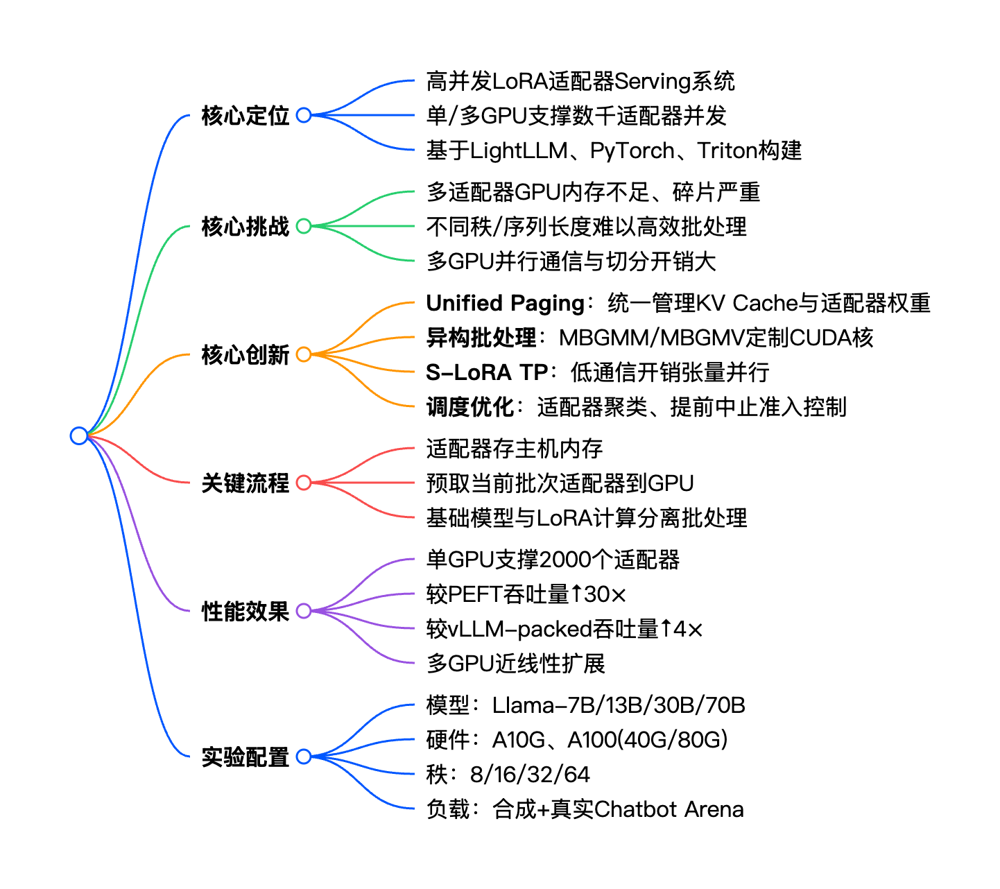
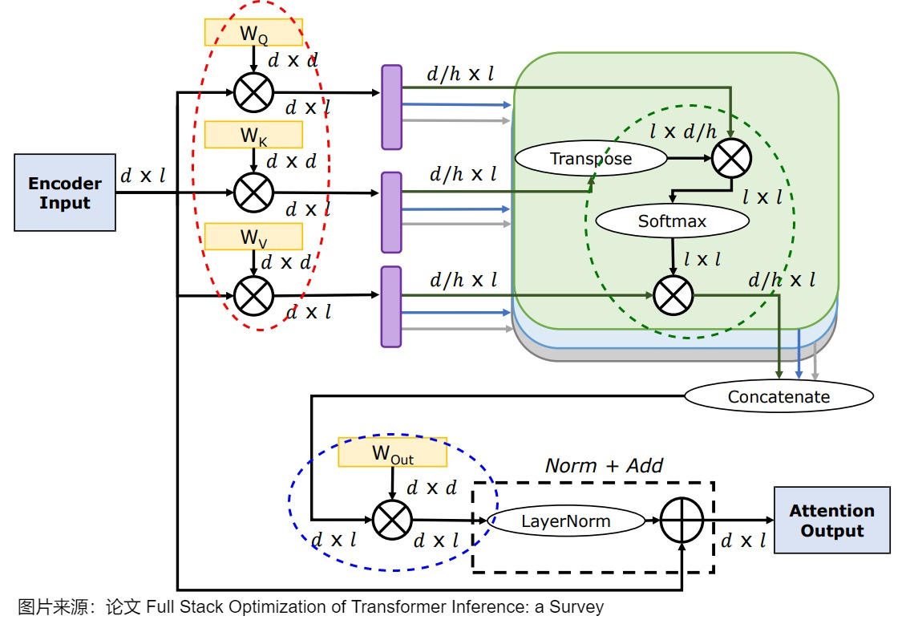
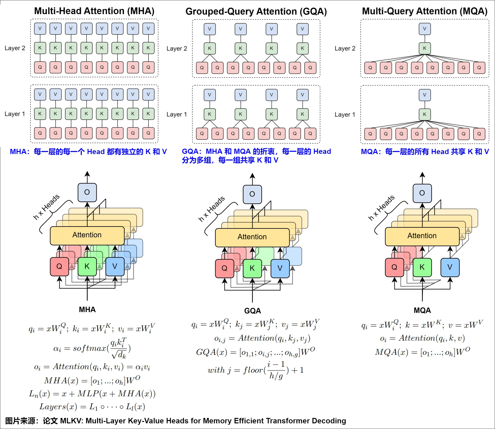

# S-LoRA

S-LoRA 是面向大模型 LoRA 适配器的高并发 Serving 系统，核心通过Unified Paging 统一内存池、异构批处理定制 CUDA 核、S-LoRA TP 张量并行策略三大技术，将全部适配器存于主机内存、仅加载当前批次所需到 GPU，大幅降低内存碎片与 I/O 开销，可在单 / 多 GPU 上同时服务数千个 LoRA 适配器，相比 HuggingFace PEFT 与 vLLM-packed，吞吐量最高提升30 倍与4 倍，适配 Llama-7B/13B/30B/70B 等主流大模型。

## 背景与动机

### LoRA 的价值

LoRA 的优势是在训练时可以冻结基座模型，仅训练低秩矩阵 A/B 即可，这一做法让参数量可减少10000 倍，效果接近全量微调。

LoRA 的原理：

$$h = W_{\text{new}} \cdot x = Wx + \frac{\alpha}{r} \cdot A \cdot B$$

这不仅在模型训练阶段大大的节省了显存的消耗，同时也为一份基座模型带来了适配于多种场景的变化方向。

但是随着微调需求的增多，在模型推理侧出现了一些问题。

### 传统 Serving 缺陷

#### LoRA 适配器加载策略的缺陷

传统的推理中对于LoRA这一部分的处理有两种策略。

1. 合并适配器

    在这个方案中会把 LoRA 权重直接融合进基座模型，变成一个新完整模型。这个方法在微调需求量小的时候尚且可以应付，但是伴随着各类细分场景的增加，只靠权重融合对于GPU 显存的压力是巨大的。在只有一个 LoRA 时保留一组基模的权重即可。但是如果有一千份一万份呢，7B 模型一份就要 13GB，10 份直接 130GB。

    如果继续采取这个策略，在有大量适配器需要运行的场景下 GPU 显存会瞬间爆掉

2. 逐批切换适配器

在这个方案中只保留一份基座，同时在显存中保留一个LoRA适配器。其余还没用到的适配器则保存在内存等地方里

> 跑一批 A 适配器 → 卸掉 A → 装上 B → 跑一批 B → 卸掉 B…

这样做解决了前面多份模型权重占用显存过大的问题，但是同时也带来了新的问题：

首先 LoRA 适配器的切换要耗时，且同一时间只能跑一个适配器不能把不同适配器的请求放一起批处理，GPU 利用率极低，吞吐量暴跌。

其次 LoRA 秩不一样（r=8、16、32、64），请求序列长度不一样，在不停的加载卸载当中会导致显存出现碎片化，没法连续分配，出现明明有空余，但就是报 OOM 的现象。

#### TP并行时矩阵切分的缺陷

原本Megatron TP 只设计给基座大矩阵切分，根本没考虑 LoRA 这种小低秩矩阵怎么切；

传统框架没有统一规范的 LoRA 行列切分规则，不知道跟着基座 W1/W2 （W1、W2 就是 Transformer 里 FFN 的两层线性权重，先升维再降维）怎么对齐切。

为什么LoRA不支持切分：

1. 时间错位：Megatron 张量并行 2019 年提出，LoRA2021 年才诞生，原生 TP 架构设计时还没有 LoRA。
2. 设计初衷局限：原生 TP 只为大模型全量权重分布式训练设计，未考虑后续外挂增量适配器分支。
3. 早期使用场景简单：初期 LoRA 多用于单卡微调、推理时合并入基座，无需多卡 TP 切分，没有衍生需求。
4. 后加旁路结构：LoRA 是在原生 Transformer 之外新增的增量分支，原生框架没有预留对应的行列切分规范，导致传统 TP 无法天然适配 LoRA。

## S-LoRA 如何解决

* 显存不够 → 适配器放内存，GPU 只加载当前要用的
* 碎片严重 → Unified Paging 统一分页管理
* 异构难批 → 定制 CUDA 核支持不同秩 / 长度一起算
* 多卡难并行 → S-LoRA TP 低开销张量并行

### 计算批处理：异构批处理

分离基座模型计算xW与 LoRA 计算xAB，基座共享批处理。
定制 CUDA 核：
Prefill：MBGMM（多秩批量聚集矩阵乘）
Decode：MBGMV（多秩批量聚集矩阵向量乘）
支持非连续内存、不同秩 / 序列长度，无需 Padding。

分离批量计算。基础模型的批量计算由 GEMM 实现。LoRA 适配器的批量计算由支持批量处理各种序列长度和适配器秩的自定义 CUDA 内核实现

### 多 GPU 并行：S-LoRA TP

对齐 Megatron-LM 张量并行切分策略。
LoRA 通信仅作用于小尺寸中间张量，与基座通信融合，额外开销可忽略。
通信量公式：5(N−1)Br/N，因r≪h，成本极低。

### 调度策略

在前面我们提到了可以一次性把这个批次中所需要的LoRA适配器全部加载进去，但是这里也存在一些问题
适配器聚类：优先批处理同适配器请求，提升利用率。
准入控制（Early Abort）：预估 SLO，优先服务最新请求，保障用户满意度。

### 内存管理：Unified Paging

把 KV Cache 与 LoRA 适配器权重放入统一内存池，按页管理。

页面大小对齐隐层维度 H，适配不同秩 r 与序列长度 S，大幅降低碎片。
全量适配器存在主机内存，仅预取当前批次所需到 GPU，容量受限于主机内存。

