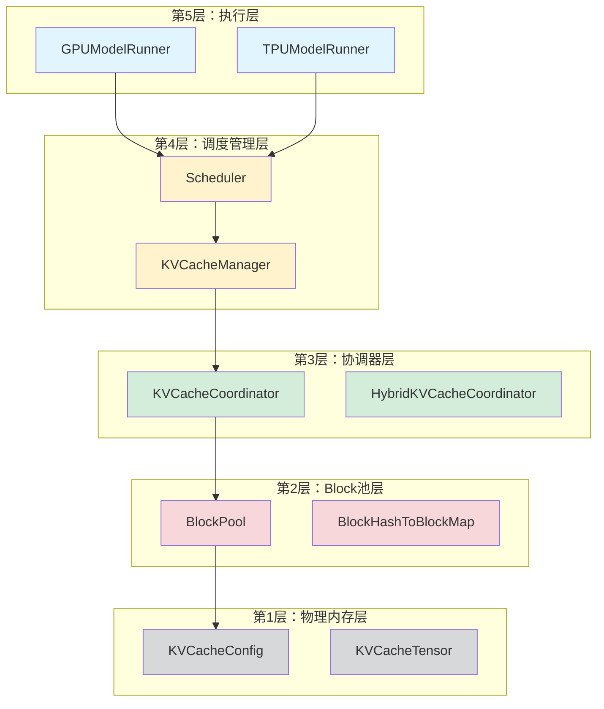
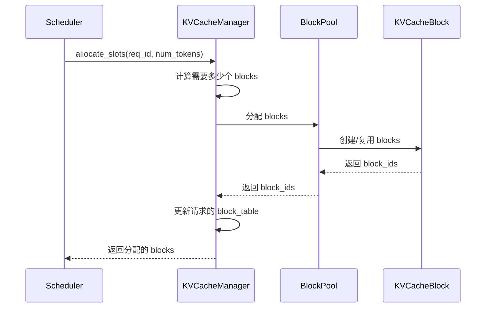
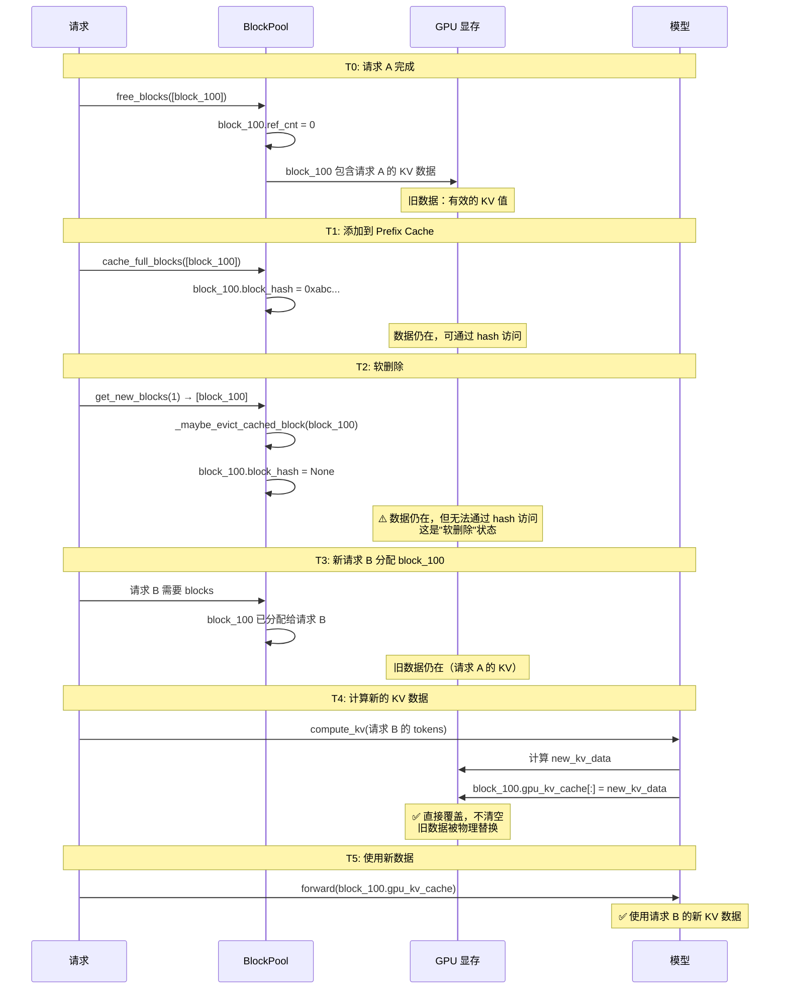
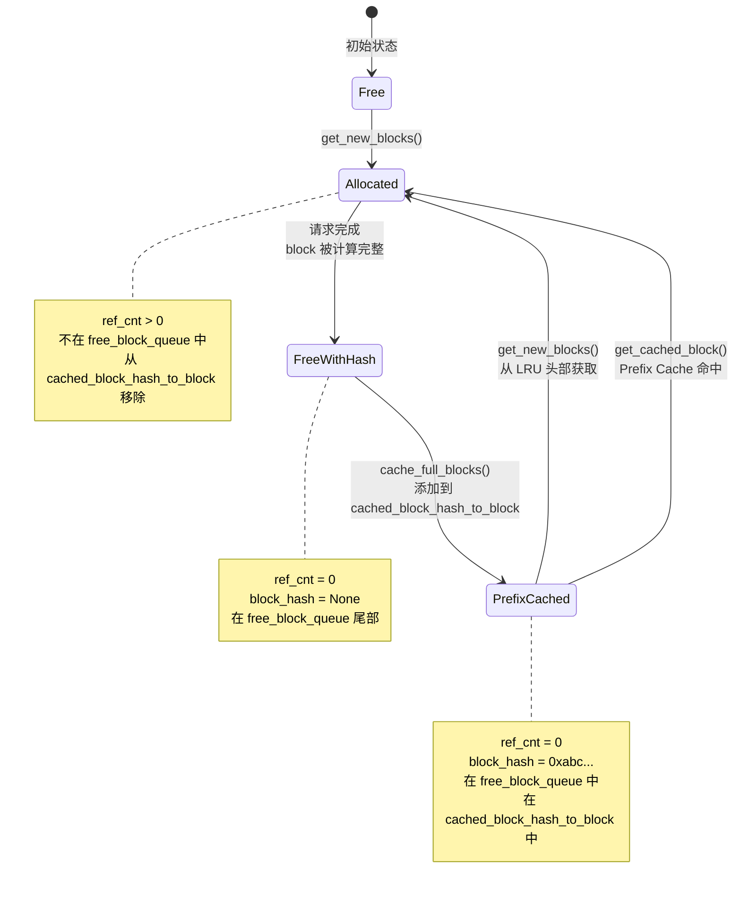
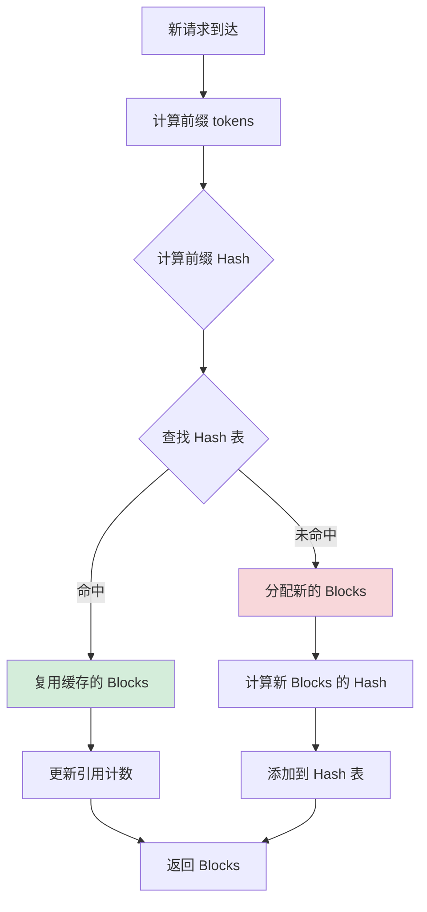
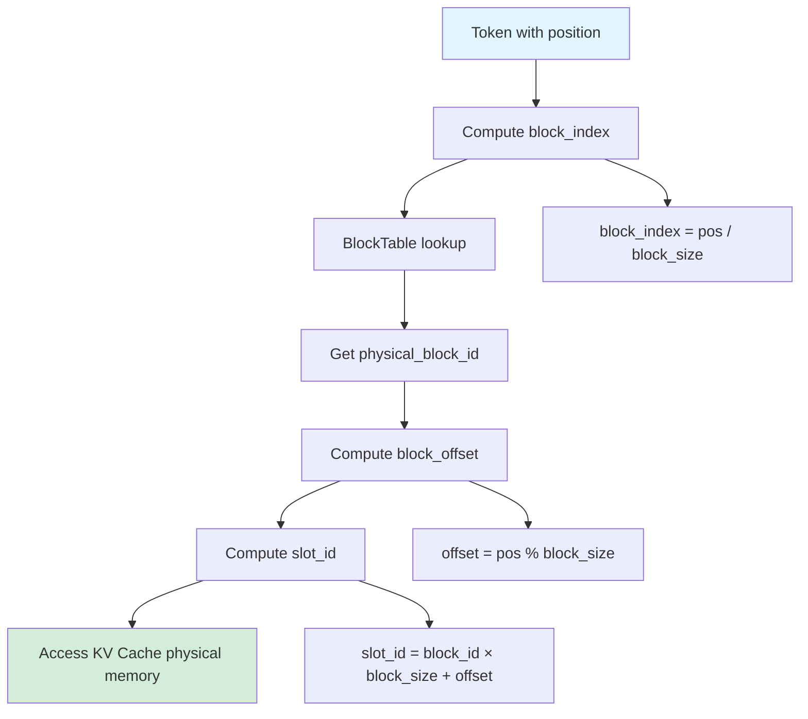
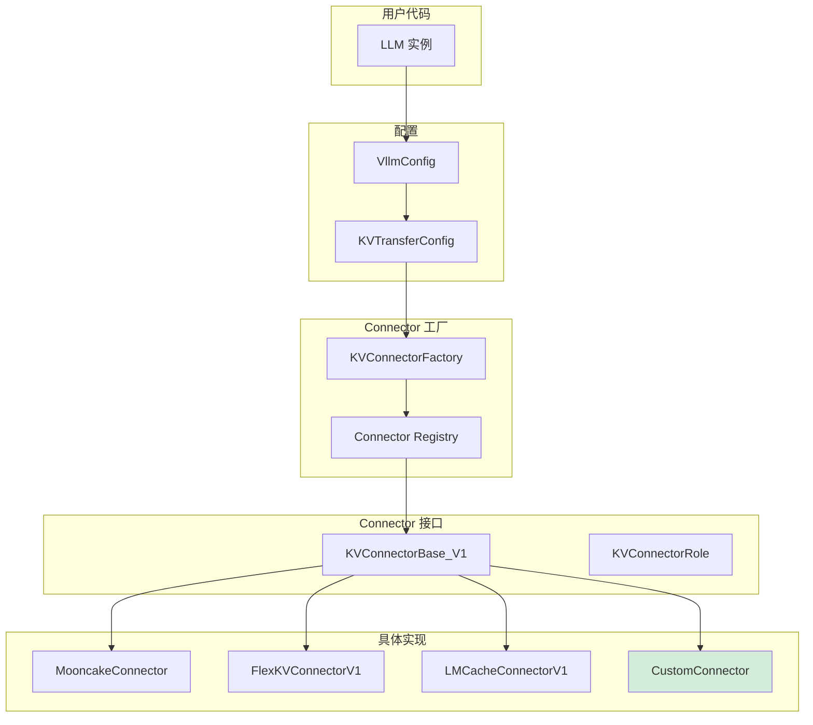

# vLLM KV Cache 基础实现详解

## 目录

1. [概述](#1-概述)
2. [核心概念](#2-核心概念)
3. [分层架构](#3-分层架构)
4. [Block 分配与回收](#4-block-分配与回收)
5. [前缀缓存实现](#5-前缀缓存实现)
6. [物理内存布局](#6-物理内存布局)
7. [访问路径](#7-访问路径)
8. [优化策略](#8-优化策略)
9. [代码示例](#9-代码示例)
10. [总结](#10-总结)

---

## 1. 概述

### 1.1 什么是 KV Cache

在自回归语言模型（如 GPT、Llama）的推理过程中，模型需要根据前面的 token 来预测下一个 token。为了避免重复计算，vLLM 使用 KV Cache 来缓存每个注意力层的 Key（K）和 Value（V）矩阵。

**核心思想**：
- 在生成第 t 个 token 时，复用前 t-1 个 token 的 K 和 V
- 只需要计算第 t 个 token 的 K 和 V
- 将第 t 个 token 的 K 和 V 添加到 cache 中

### 1.2 为什么需要 KV Cache

**性能对比**：

假设我们有一个包含 1000 个 token 的序列，模型有 32 层：

| 方法 | 计算量 | 内存占用 |
|------|--------|----------|
| 不使用 KV Cache | O(1000²) 每步 | 低 |
| 使用 KV Cache | O(1000) 每步 | 高 |

**权衡**：
- **计算时间**：KV Cache 将计算复杂度从 O(n²) 降低到 O(n)
- **内存占用**：需要存储所有历史 token 的 K 和 V
- **vLLM 的优势**：通过 PagedAttention 高效管理 KV Cache 内存

### 1.3 vLLM KV Cache 的设计目标

vLLM 的 KV Cache 实现旨在解决以下问题：

1. **内存碎片化**：传统方法预分配固定大小的 cache，导致内存浪费
2. **批处理效率**：静态批处理无法充分利用 GPU
3. **前缀复用**：相同 prompt 的请求无法共享 KV Cache
4. **多租户支持**：Multi-LoRA 场景下的资源管理

**vLLM 的解决方案**：
- **PagedAttention**：借鉴操作系统的虚拟内存，按页分配 KV Cache
- **Continuous Batching**：动态组批，提高 GPU 利用率
- **Prefix Cache**：基于 Hash 的前缀复用机制
- **Multi-LoRA**：Punica Multi-Tenant LoRA 支持

---

## 2. 核心概念

### 2.1 Block（物理块）

Block 是 vLLM 中 KV Cache 内存分配的基本单位，类似于操作系统中的"页"。

**Block 的定义**：
```python
@dataclass
class KVCacheBlock:
    block_id: int              # 物理块 ID
    ref_cnt: int = 0           # 引用计数
    _block_hash: BlockHash | None = None  # Block 内容的 Hash
```

**关键属性**：
- `block_size`：每个 Block 包含的 token 数量（通常是 16）
- `page_size_bytes`：每个 Block 占用的字节数
- `ref_cnt`：引用计数，表示有多少请求正在使用这个 Block

**示例**：
假设 `block_size = 16`，一个 100 token 的序列需要：
- `num_blocks = ceil(100 / 16) = 7` 个 Blocks
- 前 6 个 Block 是满的（各 16 tokens），最后一个 Block 有 4 个 tokens

### 2.2 mapping_slot（逻辑槽位）

Slot 是每个 token 的逻辑存储位置。

**Slot ID 的计算**：
```python
slot_id = physical_block_id * block_size + offset_in_block
```

**示例**：
- `physical_block_id = 101`
- `block_size = 16`
- `offset_in_block = 4`（第 5 个 token）
- `slot_id = 101 * 16 + 4 = 1620`

### 2.3 BlockTable（映射表）

BlockTable 维护每个请求的逻辑 Block ID 到物理 Block ID 的映射。

**BlockTable 的结构**：
```python
class BlockTable:
    def __init__(self, max_num_reqs: int, max_num_blocks_per_req: int):
        # 形状: [max_num_reqs, max_num_blocks_per_req]
        self.block_table = torch.zeros(...)
        # 每个请求实际使用的 block 数量
        self.num_blocks_per_row = np.zeros(max_num_reqs, dtype=np.int32)
```

**映射示例**：
```python
# 请求 0 的 BlockTable
request_0_block_table = [100, 101, 102, 103]

# 含义：
# 逻辑 Block 0 → 物理 Block 100
# 逻辑 Block 1 → 物理 Block 101
# 逻辑 Block 2 → 物理 Block 102
# 逻辑 Block 3 → 物理 Block 103
```

### 2.4 Prefix Cache（前缀缓存）

Prefix Cache 允许不同请求共享相同前缀的 KV Cache。

**核心机制**：
1. 对每个 Block 的内容计算 SHA-256 Hash
2. 相同 Hash 的 Block 被认为是相同的，可以复用
3. 维护一个 Hash → PhysicalBlock 的映射表

**示例**：
```
请求 A: "The capital of France is" (7 tokens)
请求 B: "The capital of France is Paris" (9 tokens)

如果请求 A 先完成，其 KV Cache 被缓存：
- Block 0: "The capital of" (hash: 0xabc...)
- Block 1: "France is" (hash: 0xdef...)

当请求 B 到来时：
- 检测到前缀 "The capital of France is" 与请求 A 匹配
- 直接复用请求 A 的 Block 0 和 Block 1
- 只需要为 "Paris" 分配新的 Block
```

---

### 2.5 Token IDs

Token IDs 是文本经过 tokenizer 转换为整数序列，如 [15496, 995]

在process_inputs阶段完成文本到Token IDs的转换：

```py
# 位置：vllm/v1/engine/input_processor.py:244-247
processed_inputs = self.input_preprocessor.preprocess(
    prompt,  # 用户输入的文本
    tokenization_kwargs=tokenization_kwargs,
)
```

Tokenization的具体实现:

```py
# 位置：vllm/renderers/base.py:386-389
def _tokenize_prompt(self, prompt: TextPrompt, params: TokenizeParams):
    tokenizer = self.get_tokenizer()
    prompt_token_ids = tokenizer.encode(
        prompt["prompt"],  # "Hello world"
        **params.get_encode_kwargs(),
    )
    return TokensPrompt(prompt_token_ids=prompt_token_ids, **prompt)
```
**Token化不是向量化！！！**

重要区分：

* Token IDs: 整数序列 [15496, 995]，在process_inputs中计算
* Embeddings: 向量序列 [[0.23, -0.45, ...], ...]，在模型执行时计算

为什么需要Token IDs？

原因1：模块化设计

* Tokenizer 负责语言处理
* Embedding layer 负责语义表示

原因2：复用性

* 相同的Token IDs可以对应不同的Embedding（如多语言模型）
* 预计算的Embeddings可以跳过Tokenization步骤

原因3：效率

* Token IDs占用内存小（整数）
* Embeddings占用内存大（浮点数向量）
* 缓存和传输Token IDs更高效


## 3. 分层架构

vLLM 的 KV Cache 实现采用分层设计，共分为 5 层：



### 3.1 第1层：物理内存层

**职责**：管理物理 KV Cache 张量的分配和释放。

**核心类**：
- `KVCacheConfig`：KV Cache 配置，包括块大小、数据类型等
- `KVCacheTensor`：实际的 KV Cache 张量

**关键代码**：
```python
@dataclass
class KVCacheConfig:
    kv_cache_tensors: list[KVCacheTensor]  # KV Cache 张量列表
    num_gpu_blocks: int                     # GPU block 数量
    block_size: int                         # Block 大小
```

### 3.2 第2层：Block池层

**职责**：管理物理 Block 的分配、回收和缓存。

**核心类**：
- `BlockPool`：Block 池管理器
- `KVCacheBlock`：单个 Block 的元数据

**关键代码**：
```python
class BlockPool:
    def __init__(self, num_blocks: int):
        self.blocks = [KVCacheBlock(i) for i in range(num_blocks)]
        self.free_block_queue = SimpleQueue()
        self.hash_to_block: dict[BlockHash, KVCacheBlock] = {}
```

**主要功能**：
- `allocate_block()`：分配一个新的 Block
- `free_block()`：释放一个 Block
- `get_block_by_hash()`：通过 Hash 查找 Block

### 3.3 第3层：协调器层

**职责**：协调不同类型的 KV Cache（如 Attention 层和 MoE 层）。

**核心类**：
- `KVCacheCoordinator`：单类型 KV Cache 协调器
- `HybridKVCacheCoordinator`：混合类型 KV Cache 协调器

**关键代码**：
```python
class KVCacheCoordinator:
    def __init__(self, kv_cache_specs: dict[str, KVCacheSpec]):
        self.kv_cache_managers = {
            name: KVCacheManager(spec)
            for name, spec in kv_cache_specs.items()
        }
```

### 3.4 第4层：调度管理层

**职责**：在调度过程中管理请求的 KV Cache 分配和释放。

**核心类**：
- `Scheduler`：主调度器
- `KVCacheManager`：KV Cache 管理器

**关键代码**：
```python
class KVCacheManager:
    def allocate_slots(self, req_id: str, num_tokens: int) -> list[int]:
        """为请求分配新的 KV Cache slots"""

    def free_blocks(self, req_id: str):
        """释放请求的所有 KV Cache blocks"""

    def get_computed_blocks(self, req_id: str) -> list[int]:
        """获取请求已计算的 KV Cache blocks"""
```

### 3.5 第5层：执行层

**职责**：在实际模型推理中使用 KV Cache。

**核心类**：
- `GPUModelRunner`：GPU 模型执行器
- `TPUModelRunner`：TPU 模型执行器

**关键代码**：
```python
class GPUModelRunner:
    def execute_model(self, scheduler_output: SchedulerOutput):
        """执行模型前向传播"""
        # 1. 准备输入
        input_batch = self._prepare_inputs(scheduler_output)

        # 2. 计算 slot_mapping
        self.block_table.compute_slot_mapping(...)

        # 3. 执行模型
        model_output = self.model(..., self.slot_mapping, ...)

        return model_output
```

---

## 4. Block 分配与回收


### 4.1 分配流程

当新请求到达或需要为现有请求分配新的 KV Cache 时，vLLM 会按以下流程分配 Block：



**详细步骤**：

1. **计算需要的 Block 数量**：
   ```python
   num_blocks = cdiv(num_tokens, block_size)
   ```

2. **尝试从 Prefix Cache 复用**：
   ```python
   computed_blocks = kv_cache_manager.get_computed_blocks(req_id)
   ```

3. **分配新的 Blocks**：
   ```python
   new_blocks = block_pool.allocate_block(num_blocks - len(computed_blocks))
   ```

4. **更新 BlockTable**：
   ```python
   block_table.append_row(new_blocks, req_idx)
   ```

### 4.2 引用计数机制

每个 Block 都有一个引用计数（`ref_cnt`），表示有多少请求正在使用它。

**引用计数的更新**：

```python
class KVCacheBlock:
    def increment_ref_cnt(self):
        self.ref_cnt += 1

    def decrement_ref_cnt(self):
        self.ref_cnt -= 1
        if self.ref_cnt == 0:
            # 可以被回收
            return True
        return False
```

**场景示例**：
```
初始状态：Block 100 的 ref_cnt = 0

请求 A 到达：需要 Block 100
  - Block 100.ref_cnt = 1

请求 B 到达：复用 Block 100（相同前缀）
  - Block 100.ref_cnt = 2

请求 A 完成：
  - Block 100.ref_cnt = 1
  - 不释放，因为请求 B 仍在使用

请求 B 完成：
  - Block 100.ref_cnt = 0
  - 可以释放或添加到 Prefix Cache
```

### 4.3 释放与回收

当请求完成时，vLLM 会释放其占用的 Blocks。

**释放流程**：

```python
def free_request_blocks(req_id: str):
    """释放请求的所有 blocks"""

    # 1. 获取请求的所有 blocks
    block_ids = req_to_blocks[req_id]

    # 2. 对每个 block 减少引用计数
    for block_id in block_ids:
        block = block_pool.get_block(block_id)
        if block.decrement_ref_cnt():
            # ref_cnt == 0，可以回收
            block_pool.free_block(block)

    # 3. 清理请求的元数据
    del req_to_blocks[req_id]
```

当 Block 的引用计数变为 0 时，会被移动到 LRU 上，但是此时并不会将该 Block 对应的显存上的内容给删除。

这里的工作机制是这样的：

当一个 Block 的引用计数变为 0 时，会被移动到 LRU 上，当要分配新块时，会在这个 LRU 上选择一个最久未被命中的块对应的 prefix cache 进行删除而不是直接对 block 对应的显存内容进行删除。如果在还未被删除前，block 再次被命中，那么就会将这个 block 块从 LRU 上面取下来重新被请求复用。



这里为什么要选择软删除呢？

1. 性能：避免不必要的内存清零
2. 效率：直接覆盖比先清空再写入快
3. 安全：通过引用计数和映射机制保证安全
4. 简洁：不需要复杂的清空逻辑


｜操作｜软删除｜显式删除｜差异｜
｜---｜---｜---｜---｜
｜时间｜~纳秒｜~微秒｜1000x 差异｜
｜带宽｜0 bytes｜131 KB/block｜浪费 GPU 带宽｜
｜必要性｜不需要｜不必要｜新数据会覆盖｜


### 4.4 block 的驱逐策略

当 KV Cache 满时，vLLM 使用 LRU（Least Recently Used）策略驱逐缓存。

**LRU 的实现**：

```python
class BlockPool:
    def __init__(self):
        self.free_block_queue = SimpleQueue()
        self.hash_to_block: dict[BlockHash, KVCacheBlock] = {}

    def evict_lru_blocks(self, num_blocks: int) -> list[int]:
        """驱逐 LRU blocks"""
        evicted_blocks = []

        # 按 last_accessed_time 排序
        all_blocks = sorted(
            self.hash_to_block.values(),
            key=lambda b: b.last_accessed_time
        )

        # 选择最久未使用的 blocks
        for block in all_blocks[:num_blocks]:
            if block.ref_cnt == 0:
                evicted_blocks.append(block.block_id)
                del self.hash_to_block[block.block_hash]

        return evicted_blocks
```

**驱逐策略**：

1. **优先驱逐 ref_cnt = 0 的 Block**：没有请求使用
2. **按 last_accessed_time 排序**：优先驱逐最久未访问的
3. **避免驱逐 Prefix Cache**：Prefix Cache 有更高的优先级

**注意⚠️**

这里kvcache的驱逐淘汰需要与上面kvcache的释放删除做区分。这里是两个维度的概念的事情。

```text
淘汰：

# 发生时机：分配新 block 时
_maybe_evict_cached_block(block)

# 影响：
# ❌ 删除 hash 映射（无法通过 hash 找到）
# ✅ 物理显存仍在
# ✅ KV 数据内容仍在
# ❌ 不传输到 CPU

卸载：

# 发生时机：GPU 显存不足时
offloading_manager.prepare_store(keys)

# 影响：
# ✅ 传输 KV 数据到 CPU
# ✅ GPU 显存可以重用
# ❌ 不影响 hash 映射（独立的操作）
# ✅ CPU backup 作为第三层缓存
```

---

## 5. 前缀缓存实现



### 5.1 Block Hash 计算

vLLM 使用 SHA-256 算法计算每个 Block 内容的 Hash。

**Hash 计算过程**：

```python
def compute_block_hash(
    token_ids: list[int],
    req_id: str,
    group_id: int,
) -> BlockHash:
    """计算 Block 的 Hash"""

    # 1. 准备 Hash 输入
    hash_input = {
        "token_ids": token_ids,
        "req_id": req_id,
        "group_id": group_id,
    }

    # 2. 序列化
    hash_str = json.dumps(hash_input, sort_keys=True)

    # 3. 计算 SHA-256
    hash_bytes = hashlib.sha256(hash_str.encode()).digest()

    # 4. 转换为 BlockHash
    return BlockHash(
        hash=hash_bytes[:16],  # 取前 16 字节
        group_id=group_id,
    )
```

**Hash 的组成**：
- `token_ids`：Block 中的 token IDs
- `req_id`：请求 ID（用于区分相同内容但不同请求）
- `group_id`：KV Cache group ID（用于混合模型）

这里的采取了链式哈希的计算方式，天生就含有

### 5.2 缓存查找

当新请求到达时，vLLM 会查找 Prefix Cache 中是否有可复用的 Blocks。

**查找流程**：



**代码实现**：

```python
def get_computed_blocks(
    self,
    req_id: str,
    token_ids: list[int],
) -> list[int]:
    """获取可复用的 computed blocks"""

    computed_blocks = []
    remaining_tokens = token_ids.copy()

    while len(remaining_tokens) >= self.block_size:
        # 取下一个 block 的 tokens
        block_tokens = remaining_tokens[:self.block_size]

        # 计算 hash
        block_hash = compute_block_hash(
            block_tokens,
            req_id,
            self.group_id,
        )

        # 查找 hash 表
        if block_hash in self.hash_to_block:
            # 命中，复用 block
            block = self.hash_to_block[block_hash]
            computed_blocks.append(block.block_id)
            block.increment_ref_cnt()
            remaining_tokens = remaining_tokens[self.block_size:]
        else:
            # 未命中，停止查找
            break

    return computed_blocks
```

### 5.3 缓存更新

当请求的 KV Cache 计算完成后，vLLM 会更新 Prefix Cache。

**更新流程**：

```python
def update_prefix_cache(
    self,
    req_id: str,
    token_ids: list[int],
    block_ids: list[int],
):
    """更新 Prefix Cache"""

    for i, block_id in enumerate(block_ids):
        start = i * self.block_size
        end = start + self.block_size
        block_tokens = token_ids[start:end]

        # 计算 hash
        block_hash = compute_block_hash(
            block_tokens,
            req_id,
            self.group_id,
        )

        # 添加到 hash 表
        if block_hash not in self.hash_to_block:
            block = self.block_pool.get_block(block_id)
            block.block_hash = block_hash
            self.hash_to_block[block_hash] = block
```

### 5.4 命中策略

不同注意力类型有不同的前缀缓存命中策略。

**MHA（Multi-Head Attention）**：
```python
# 完全注意力：所有 token 都参与注意力计算
attention_mask = full_attention_mask  # 所有位置都是 1
# 可以命中任意位置的前缀缓存
```

**GQA（Grouped Query Attention）**：
```python
# 分组查询注意力：KV heads 数量少于 Q heads
num_kv_heads = 8
num_q_heads = 32
# 每个 KV head 被 4 个 Q heads 共享
# 前缀缓存命中时需要考虑 head 分组
```

**MLA（Multi-head Latent Attention）**：
```python
# 潜在注意力：使用压缩的 KV 表示
kv_lora_rank = 512  # 压缩后的维度
# 前缀缓存的命中需要考虑压缩后的表示
```

**Sliding Window（滑动窗口）**：
```python
# 滑动窗口注意力：只关注最近的 tokens
window_size = 4096
# 前缀缓存只在窗口内有效
# 超出窗口的前缀不能命中
```

---

## 6. 物理内存布局

### 6.1 Paged KV Cache

vLLM 使用 Paged KV Cache 来组织物理内存。

**内存布局**：

```python
# KV Cache 张量的形状
kv_cache_shape = (
    num_blocks,           # Block 数量
    block_size,           # 每个 Block 的 token 数量
    num_kv_heads,         # KV head 数量
    head_size,            # 每个 head 的维度
)

# 示例：Llama-2-7b
kv_cache_shape = (
    1000,      # 1000 个 blocks
    16,        # 每个 block 16 个 tokens
    32,        # 32 个 KV heads
    128,       # 每个 head 128 维
)
# 总大小：1000 × 16 × 32 × 128 × 2 bytes (fp16) = 131 MB
```

**Page（页）的概念**：

```python
@dataclass
class KVCacheTensor:
    tensor: torch.Tensor        # 实际的 KV Cache 张量
    size: int                   # 总大小（字节）
    page_size: int              # 页大小（字节）
    num_pages: int              # 页数

    @property
    def shared_by(self) -> list[str]:
        """共享此 tensor 的层名称列表"""
        return []
```

### 6.2 内存对齐与分页

vLLM 使用内存对齐和分页来优化访问效率。

**内存对齐**：

```python
# 计算 page_size
def compute_page_size(
    num_kv_heads: int,
    head_size: int,
    block_size: int,
    dtype: torch.dtype,
) -> int:
    """计算页大小"""

    # 每个元素的字节数
    element_size = torch.finfo(dtype).bits // 8

    # 每个 block 的大小
    bytes_per_block = (
        num_kv_heads * head_size * block_size * element_size * 2  # K 和 V
    )

    # 对齐到 256 字节
    page_size = ((bytes_per_block + 255) // 256) * 256

    return page_size
```

**分页策略**：

```python
# 分配 KV Cache
def allocate_kv_cache(
    num_blocks: int,
    page_size: int,
    device: torch.device,
) -> torch.Tensor:
    """分配 KV Cache"""

    # 计算总大小
    total_size = num_blocks * page_size

    # 分配连续内存
    kv_cache = torch.empty(
        total_size,
        dtype=torch.int8,  # 按字节分配
        device=device,
    )

    # 转换为实际的数据类型
    kv_cache = kv_cache.view(dtype).view(kv_cache_shape)

    return kv_cache
```

### 6.3 跨层优化

vLLM 支持跨层 KV Cache 优化，减少内存占用。

**跨层共享**：

```python
def allocate_uniform_kv_caches(
    kv_cache_config: KVCacheConfig,
    attn_groups: list[list[AttentionGroup]],
    cache_dtype: CacheDType,
    device: torch.device,
) -> tuple[dict[str, torch.Tensor], torch.Tensor]:
    """分配跨层共享的 KV Cache"""

    # 检查是否所有层都有相同的 layout
    if len(attn_groups) == 1 and len(attn_groups[0]) == 1:
        attn_group = attn_groups[0][0]
        kv_cache_spec = attn_group.kv_cache_spec

        if isinstance(kv_cache_spec, AttentionSpec):
            # 计算跨层 KV Cache 的形状
            num_layers = len(kv_cache_config.kv_cache_tensors)
            kv_cache_shape = (
                num_layers,
                num_blocks,
                block_size,
                num_kv_heads,
                head_size,
            )

            # 分配跨层 KV Cache
            cross_layers_kv_cache = torch.zeros(
                kv_cache_shape,
                dtype=cache_dtype,
                device=device,
            )

            # 为每层创建视图
            kv_caches = {}
            for i, kv_cache_tensor in enumerate(kv_cache_config.kv_cache_tensors):
                tensor = cross_layers_kv_cache[i]
                for layer_name in kv_cache_tensor.shared_by:
                    kv_caches[layer_name] = tensor

            return kv_caches, cross_layers_kv_cache
```

**优势**：
- 减少内存占用：所有层共享同一个张量
- 提高缓存命中率：跨层的数据局部性更好
- 支持 KV Transfer：可以一次性传输所有层的 KV Cache

---

## 7. 访问路径

在 vLLM 中，当一个 token 需要访问其 KV cache 时，需要经过多层映射才能找到物理内存中的实际位置。这个访问路径可以分为以下几个步骤：

### 7.1 Token → Slot 映射

每个 token 在序列中都有一个逻辑位置（position），需要将其映射到具体的 Slot ID。

**映射公式**：
```python
# 从 block_table.py 的 _compute_slot_mapping_kernel
virtual_block_size = block_size * TOTAL_CP_WORLD_SIZE
block_indices = pos // virtual_block_size
block_numbers = block_table[req_idx][block_indices]
virtual_block_offsets = pos - block_indices * virtual_block_size
slot_ids = block_numbers * block_size + local_block_offsets
```

**关键参数**：
- `block_size`：每个 Block 包含的 token 数量
- `TOTAL_CP_WORLD_SIZE`：计算并行度的总大小
- `TOTAL_CP_RANK`：当前计算节点的 rank
- `CP_KV_CACHE_INTERLEAVE_SIZE`：KV cache 交织大小

### 7.2 BlockTable 查找

BlockTable 是一个二维数组，形状为 `[max_num_reqs, max_num_blocks_per_req]`，存储了每个请求的逻辑 Block ID 到物理 Block ID 的映射。

**查找过程**：
```python
# 伪代码
def get_physical_block_id(req_idx, token_pos):
    # 1. 计算逻辑 block index
    logical_block_idx = token_pos // block_size

    # 2. 从 block_table 获取物理 block ID
    physical_block_id = block_table[req_idx][logical_block_idx]

    # 3. 计算 block 内的偏移
    block_offset = token_pos % block_size

    return physical_block_id, block_offset
```

### 7.3 完整访问路径

下图展示了从 token 到物理 KV cache 的完整访问路径：



**示例**：
假设：
- `block_size = 16`
- 某请求的 BlockTable = `[100, 101, 102]`（物理块 ID）
- token position = 20

计算过程：
1. `block_index = 20 // 16 = 1`
2. `physical_block_id = BlockTable[1] = 101`
3. `block_offset = 20 % 16 = 4`
4. `slot_id = 101 × 16 + 4 = 1620`

因此，position 20 的 token 的 KV 数据存储在 slot_id = 1620 的位置。

### 7.4 计算并行（CP）下的访问

在计算并行（Context Parallelism）场景下，KV cache 会在多个计算节点之间分片。

**虚拟块大小**：
```python
virtual_block_size = block_size * TOTAL_CP_WORLD_SIZE
```

**交织策略**：
```python
# 判断 token 是否属于当前计算节点
is_local = (virtual_block_offsets // CP_KV_CACHE_INTERLEAVE_SIZE) % TOTAL_CP_WORLD_SIZE == TOTAL_CP_RANK
```

只有属于当前节点的 token 才会被访问，其他 token 会被标记为 `PAD_SLOT_ID`。

---

## 8. 优化策略

vLLM 在 KV Cache 实现中采用了多种优化策略，以提高内存利用率和计算效率。

### 8.1 混合模型支持

vLLM 支持混合模型（如 Mixture of Experts），不同类型的层可以有不同的 KV cache 配置。

**MultiGroupBlockTable**：
```python
class MultiGroupBlockTable:
    """管理多个 KV cache groups 的 BlockTables"""

    def __init__(self, block_sizes: list[int], kernel_block_sizes: list[int]):
        # 为每个 group 创建独立的 BlockTable
        self.block_tables = [
            BlockTable(block_size, kernel_block_size, ...)
            for block_size, kernel_block_size in zip(block_sizes, kernel_block_sizes)
        ]
```

**优势**：
- 不同类型的层（如 Attention 层和 MoE 专家层）可以使用不同的 block size
- 优化内存分配，避免浪费

### 8.2 Hybrid Blocks 优化

当内存分配的 block size 与计算 kernel 的 block size 不一致时，vLLM 使用 hybrid blocks 机制。

**映射示例**：
```python
# 假设：
# - KV manager block size: 32 tokens
# - Kernel block size: 16 tokens
# - blocks_per_kv_block = 32 / 16 = 2

kv_manager_block_ids = [0, 1, 2]
# 映射结果：
kernel_block_ids = [0, 1, 2, 3, 4, 5]
# 映射关系：
# Block 0 → [0, 1]
# Block 1 → [2, 3]
# Block 2 → [4, 5]
```

**优势**：
- 允许内存分配和 kernel 计算使用不同的粒度
- 减少内存碎片，提高利用率

### 8.3 CUDA Graph 优化

CUDA Graph 可以减少 kernel 启动开销，但要求张量形状固定。vLLM 通过以下方式支持 CUDA Graph：

**固定大小缓冲区**：
```python
# 预分配固定大小的缓冲区
self.slot_mapping = torch.zeros(max_num_batched_tokens, dtype=torch.int64)

# 使用 PAD_SLOT_ID 填充未使用的位置
for i in range(num_tokens, max_num_tokens, BLOCK_SIZE):
    slot_mapping_ptr[i] = PAD_SLOT_ID
```

**优势**：
- 减少 CPU-GPU 同步开销
- 提高 batch 处理效率

### 8.4 Multi-LoRA 支持

vLLM 支持在同一个 batch 中为不同的 token 使用不同的 LoRA 适配器。

**实现机制**：
```python
@dataclass
class CachedRequestState:
    lora_request: LoRARequest | None = None

class InputBatch:
    request_lora_mapping: np.ndarray  # 每个请求的 LoRA ID
    lora_id_to_request_ids: dict  # LoRA ID 到请求的映射
```

**Punica Multi-Tenant LoRA**：
- 批处理中每个 token 可使用不同 LoRA
- 通过 SGMV（Single-GEMM Multi-Vector）内核实现
- 避免为每个 LoRA 单独批处理

### 8.5 Micro-batching 优化

vLLM 使用 micro-batching 来减少 padding 开销。

**实现**：
- 动态组合请求，减少无效计算
- 根据请求的实际长度调整 batch 大小
- 支持异步调度，提高吞吐量

### 8.6 Cascade Attention

对于有共同 prefix 的请求，vLLM 使用 Cascade Attention 优化。

**策略**：
- 共同 prefix 的 KV cache 只计算一次
- 不同分支的 KV cache 分别计算
- 减少重复计算，提高效率

### 8.7 LRU 驱逐策略

当 KV cache 满时，使用 LRU（Least Recently Used）策略驱逐缓存。

**实现**：
- 追踪每个 Block 的访问时间
- 优先驱逐最久未使用的 Block
- 保持引用计数，避免误删仍在使用的 Block

---

## 9. 代码示例

### 9.1 基本使用

以下是一个使用 vLLM 进行推理的基本示例：

```python
from vllm import LLM, SamplingParams

# 初始化模型
llm = LLM(
    model="meta-llama/Llama-2-7b-hf",
    gpu_memory_utilization=0.9,  # GPU 内存利用率
    max_model_len=2048,          # 最大序列长度
    block_size=16,               # KV cache block size
)

# 设置采样参数
sampling_params = SamplingParams(
    temperature=0.8,
    top_p=0.95,
    max_tokens=100,
)

# 批量推理
prompts = [
    "Hello, my name is",
    "The future of AI is",
]
outputs = llm.generate(prompts, sampling_params)

# 输出结果
for output in outputs:
    print(f"Prompt: {output.prompt}")
    print(f"Generated: {output.outputs[0].text}\n")
```

### 9.2 自定义 KV Cache 配置

```python
from vllm import LLM
from vllm.config import CacheConfig

# 自定义 KV cache 配置
cache_config = CacheConfig(
    block_size=16,              # Block size（tokens per block）
    gpu_memory_utilization=0.9, # GPU 内存利用率
    swap_space=4,               # CPU swap 空间（GB）
    cache_dtype="auto",         # KV cache 数据类型
)

llm = LLM(
    model="meta-llama/Llama-2-7b-hf",
    cache_config=cache_config,
)
```

### 9.3 启用前缀缓存

前缀缓存（Prefix Cache）可以自动复用相同 prompt 的 KV cache：

```python
from vllm import LLM
from vllm.v1.core.prefix_cache_manager import PrefixCacheManager

# 创建 Prefix Cache Manager
prefix_manager = PrefixCacheManager(
    block_size=16,
    max_num_blocks=10000,
)

# 前缀缓存会在推理时自动使用
llm = LLM(
    model="meta-llama/Llama-2-7b-hf",
    enable_prefix_caching=True,  # 启用前缀缓存
)
```

### 9.4 Multi-LoRA 推理

```python
from vllm import LLM
from vllm.lora.request import LoRARequest

# 初始化模型并启用 LoRA
llm = LLM(
    model="meta-llama/Llama-2-7b-hf",
    enable_lora=True,
    max_loras=8,              # 最大 LoRA 数量
    max_lora_rank=16,         # 最大 LoRA rank
)

# 添加 LoRA 适配器
lora_request1 = LoRARequest(
    lora_name="adapter1",
    lora_int_id=1,
    lora_path="./path/to/adapter1",
)
lora_request2 = LoRARequest(
    lora_name="adapter2",
    lora_int_id=2,
    lora_path="./path/to/adapter2",
)

llm.add_lora(lora_request1)
llm.add_lora(lora_request2)

# 使用不同的 LoRA 进行推理
outputs1 = llm.generate(["Hello"], lora_request=lora_request1)
outputs2 = llm.generate(["Hello"], lora_request=lora_request2)
```

### 9.5 自定义 KV Cache 接口

如果需要自定义 KV Cache 实现，可以继承 KVCacheSpec：

```python
from vllm.v1.kv_cache_interface import KVCacheSpec, AttentionSpec
from dataclasses import dataclass

@dataclass
class CustomKVCacheSpec(KVCacheSpec):
    """自定义 KV Cache 规范"""
    custom_param: int

    def get_cache_shape(self, num_blocks: int):
        """计算 KV cache 张量的形状"""
        return (num_blocks, self.block_size, self.custom_param)

# 在模型中使用
def get_kv_cache_spec(self) -> dict[str, KVCacheSpec]:
    return {
        "layer0": CustomKVCacheSpec(
            num_kv_heads=32,
            head_size=128,
            block_size=16,
            page_size_bytes=4096,
            custom_param=64,
        )
    }
```

---

## 10. 外部 kvcache 组件接入

### 10.1 什么是外部 KV Cache 组件

外部 KV Cache 组件允许 vLLM 将 KV cache 数据存储到非 GPU 显存的存储介质，例如：

* CPU 内存（native offloading）
* LMCache（专门的 KV cache 系统）
* 分布式存储（如 Redis、Memcached）
* 磁盘存储（NVMe SSD）

### 10.2 实现组件


### 10.3 接入步骤

```py
# my_connector/my_connector.py

from vllm.distributed.kv_transfer.kv_connector.v1.base import (
    KVConnectorBase_V1,
    KVConnectorRole,
)
from vllm.config import VllmConfig
from vllm.v1.kv_cache_interface import KVCacheConfig

class MyKVConnector(KVConnectorBase_V1):
    """自定义 KV Connector"""
    
    def __init__(self, vllm_config, role, kv_cache_config):
        # 1. 保存配置
        self.vllm_config = vllm_config
        self.role = role
        self.kv_cache_config = kv_cache_config
        
        # 2. 解析 KV Transfer 配置
        kv_transfer_config = vllm_config.kv_transfer_config
        self.engine_id = kv_transfer_config.engine_id
        self.kv_role = kv_transfer_config.kv_role
        
        # 3. 初始化外部存储/传输系统
        self._init_external_system()
        
        # 4. 初始化通信
        self._init_communication()
    
    def _init_external_system(self):
        """初始化外部系统（如 Redis、FlexKV 等）"""
        extra_config = self.vllm_config.kv_transfer_config.kv_connector_extra_config
        
        # 示例：连接 Redis
        if extra_config.get("storage_type") == "redis":
            import redis
            self.redis_client = redis.Redis(
                host=extra_config.get("redis_host", "localhost"),
                port=extra_config.get("redis_port", 6379),
            )
        
        # 示例：连接 FlexKV
        elif extra_config.get("storage_type") == "flexkv":
            from flexkv import FlexKVStorage
            self.flexkv_storage = FlexKVStorage(
                endpoint=extra_config.get("flexkv_endpoint"),
            )
    
    def _init_communication(self):
        """初始化通信（ZMQ、gRPC 等）"""
        import zmq
        
        # 创建 ZMQ socket
        self.context = zmq.Context()
        self.socket = self.context.socket(zmq.PUSH)
        self.socket.bind(f"tcp://*:{self.vllm_config.kv_transfer_config.kv_port}")
    
    def start_load_kv(self):
        pass
    
    def wait_load_kv(self):
        pass
    
    def start_save_kv(self):
        pass
    
    def wait_save_kv(self):
        pass

```

注册：

```py   
# 在 vllm/distributed/kv_transfer/kv_connector/factory.py 中添加

KVConnectorFactory.register_connector(
    "MyConnector",  # Connector 名称
    "my_connector.my_connector",  # 模块路径
    "MyKVConnector",  # 类名
)
```

配置使用：

```py
from vllm import LLM

# 使用自定义 Connector
llm = LLM(
    model="meta-llama/Llama-2-7b-hf",
    
    # 基础配置
    kv_connector="MyConnector",
    kv_role="kv_both",
    kv_rank=0,
    kv_parallel_size=2,
    
    # 自定义配置
    kv_connector_extra_config={
        "storage_type": "redis",  # 存储类型
        "redis_host": "localhost",
        "redis_port": 6379,
        "max_size_gb": 100,
    },
)
```
