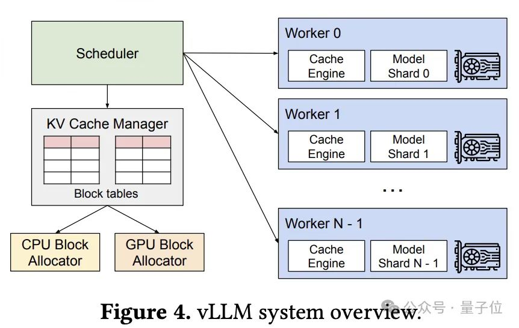

# vLLM

vLLM（Very Large Language Model）是一个高性能的大语言模型推理框架，其核心架构包含多个关键组件，这些组件协同工作以实现高效的推理服务。

## vLLM的组件

**Scheduler：**

职责：系统的大脑。它接收外部的多个推理请求，决定哪个请求的哪个“token”可以进入下一个计算步骤。

工作方式：它维护着请求队列，并检查KV Cache Manager中的“空位”（空闲的Block），动态地将等待的请求调度到可用的Worker上执行，实现Continuous Batching。

**KV Cache Manager & Block Tables：**

职责：这是 PagedAttention 机制的核心管理器。它维护着一张全局的“房产登记表”（Block Tables）。

工作方式：

每个请求的KV Cache不再是一整块连续内存，而是被切分成多个固定大小的块。
Block Tables记录了每个请求的KV Cache具体由哪些块组成，以及这些块的物理位置和状态（如：在GPU上、在CPU上、还是空闲的）。

管理器通过查询这张表，来为新的Token分配空间，或在需要时执行“内存交换”。

**CPU/GPU Block Allocator：**

职责：KV Cache的“物理空间分配器”。

工作方式：

GPU Block Allocator负责在GPU显存中分配和释放高速的KV Cache块。

CPU Block Allocator负责在CPU主内存中分配空间。当GPU显存不足时，不活跃的KV Cache块会被换出到CPU内存，需要时再换入，这是内存溢出处理的关键。

**Worker：**

职责：实际执行模型计算的“车间”。每个Worker通常对应一个GPU。
内部结构：

Model Shard：​ 这是模型的分片。在张量并行模式下，一个大型模型被水平切分到多个GPU上。
Model Shard 0就是模型的第一部分，以此类推。所有Worker的Model Shard加起来才构成一个完整的模型。

Cache Engine：​ 这是每个Worker本地的缓存执行引擎。它接收来自Scheduler的指令和来自KV Cache Manager的块信息，负责在实际计算时，从正确的物理块中读取或写入当前请求的KV Cache。

### 关键技术组件

1. PagedAttention（分页注意力）

   这是vLLM的核心创新技术，借鉴操作系统的虚拟内存分页机制，将KV缓存切分为固定大小的块（默认16个token）进行管理，显著提升显存利用率。

2. Continuous Batching（连续批处理）

   调度器能够持续接收新请求，将其与正在执行的请求动态合并为同一批次，确保GPU始终保持高负载，避免空闲时间。

3. 调度器（Scheduler）

   维护waiting、running和swapped三个队列，通过精细的Token级资源预算与抢占机制，实现高并发下的高效调度。

### 分布式架构组件

vLLM支持多种并行策略，通过以下组件实现：

* 张量并行（Tensor Parallelism, TP）：将模型层分片至同节点多GPU

* 流水线并行（Pipeline Parallelism, PP）：跨节点分层处理长序列

* 数据并行（Data Parallelism, DP）：在多个GPU上复制模型，并行处理不同请求

* 专家并行（Expert Parallelism, EP）：针对MoE模型，将专家网络分布到不同GPU

### API服务层

vLLM提供OpenAI兼容的API接口，包括：

* OpenAI兼容服务器：提供RESTful API端点

* Python SDK：直接通过Python代码调用推理服务

* 流式输出支持：支持实时流式返回生成结果

## 加载模型与预分配显存

VLLM（vLLM）加载模型的过程主要分为**模型初始化、权重加载、推理引擎准备**三个阶段，以下是详细流程：

### 加载步骤

1. 模型初始化阶段
- **解析模型配置**：读取模型目录下的`config.json`文件，确定模型架构（如LLaMA、GPT、OPT等）、词汇表大小、隐藏层维度等参数
- **创建模型实例**：根据配置动态创建对应的Transformer模型类实例，初始化所有层（Embedding、Attention、FFN等）的空权重张量
- **设备分配**：将模型结构映射到指定设备（GPU/CPU），设置计算精度（FP16/BF16/FP32）

2. 权重加载阶段
- **权重文件识别**：扫描模型目录，识别权重文件格式（通常为`.safetensors`或PyTorch的`.bin`文件）
- **并行加载优化**：vLLM采用异步I/O和内存映射技术，支持多文件并行加载，减少磁盘I/O等待时间
- **权重映射与转换**：将磁盘上的权重张量按层名匹配到模型结构中，同时进行必要的格式转换（如分片权重合并、量化权重反量化）
- **权重验证**：检查加载的权重与模型结构是否匹配，确保维度一致

3. 推理引擎准备阶段
- **KV Cache初始化**：为Attention层的Key-Value缓存分配内存空间，这是vLLM高性能推理的关键优化
- **PagedAttention配置**：设置分页式注意力机制的内存管理参数（块大小、内存池等）
- **算子优化**：根据硬件环境（CUDA版本、GPU架构）选择最优的Kernel实现
- **预热操作**：执行一次前向传播以触发JIT编译和CUDA Graph捕获

### vLLM特有的优化机制

| 优化项 | 技术原理 | 作用 |
|--------|---------|------|
| **PagedAttention** | 将KV Cache分页管理，类似虚拟内存 | 减少内存碎片，支持更长的序列长度 |
| **Continuous Batching** | 动态合并多个请求的批次 | 提高GPU利用率，降低延迟 |
| **异步加载** | 多线程并行读取权重文件 | 加速模型加载速度 |
| **内存映射** | 使用mmap直接映射文件到内存 | 减少内存占用，支持大模型加载 |