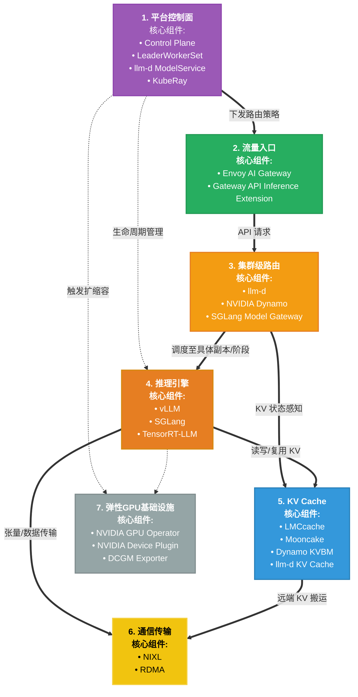

# 推理架构全景图

## 架构总览

本文档展示了完整的AI推理系统架构，包含7个核心层次，从平台控制到基础设施。

## Mermaid 架构图

## 架构说明

用户请求的完整路径是：
平台控制台 → 流量入口 → 集群级路由 → 推理引擎 → （KV Cache/通信层） → 弹性GPU基础设施

控制流（平台管理）的路径是：
平台控制台 → 管理 / 调度所有模块（推理引擎、GPU 设施等）

### 一、平台控制台：整个系统的“大脑”

最上层的紫色模块，是整个推理平台的**控制面核心**，负责所有顶层决策和生命周期管理，核心工作有三件事：
1.  给流量入口下发路由策略，定义请求的分发规则；
2.  管理所有推理集群的生命周期，比如部署、升级、故障自愈；
3.  根据负载变化，自动触发集群扩缩容，匹配算力需求。

它的核心组件包括：
- `Control Plane`：全局控制中枢，统一管理策略、调度和扩缩容决策；
- `LeaderWorkerSet`：K8s上的高可用有状态工作负载管理工具，保证推理服务稳定运行；
- `llm-d ModelService`：模型服务抽象层，封装模型部署、版本管理和实例调度逻辑；
- `KubeRay`：Ray集群K8s Operator，负责管理分布式推理集群的全生命周期。

### 二、流量入口：用户请求的“第一道大门”

第二层的绿色模块，是用户请求的**统一接入网关**，所有外部API请求都会先到这里：
- 核心组件是`Envoy AI Gateway`和`Gateway API Inference Extension`，专为AI场景优化；

- 它负责请求的接入、鉴权、限流，同时接收平台控制台下发的路由策略，对请求做初步的分发处理，然后转发到下一层的集群级路由。

### 三、集群级路由：请求的“精准调度员”

第三层的橙色模块，是请求进入推理集群后的**二级调度层**，决定请求最终要交给哪个推理副本、哪个阶段处理：

- 核心组件包括`llm-d`调度器、`NVIDIA Dynamo`和`SGLang Model Gateway`，专为GPU集群和大模型场景优化；
- 它有一个关键能力——**KV状态感知**：能实时掌握每个推理实例的KV缓存状态，优先把请求发给已有缓存的实例，大幅提升缓存命中率，减少重复计算；
- 最终，它会把请求精准调度到具体的推理引擎副本上。

### 四、推理引擎：模型计算的“主战场”

第四层的橙色模块，是真正运行大模型的**核心计算层**，负责处理token生成和推理计算：

- 这里集成了三大主流推理引擎：`vLLM`、`SGLang`和`TensorRT-LLM`，分别覆盖高吞吐、动态批处理、极致性能优化等不同场景；
- 推理过程中，引擎会直接和KV Cache层交互，读写或复用上下文缓存，同时通过通信层和底层GPU算力交互，完成张量数据的传输和计算。

### 五、KV Cache：推理性能的“加速器”

第五层的蓝色模块，是大模型推理的**性能关键层**，用来缓存上下文的Key/Value向量，避免每次请求都重复计算：

- 核心组件包括`LMCcache`、`Mooncake`、`Dynamo KVBM`和`llm-d KV Cache`，支持跨实例、跨节点的分布式缓存共享；
- 它的关键能力是**远端KV搬运**：可以通过高速通信，把其他节点上的缓存拉取过来复用，大幅降低延迟，提升整体推理效率。

### 六、通信传输：数据交互的“高速通道”

第六层的黄色模块，是分布式推理的**数据传输保障层**，负责节点间、节点与GPU间的高速数据交互：
- 核心组件是`NIXL`和`RDMA`，前者是NVIDIA专为AI优化的高性能通信库，后者是远程直接内存访问技术；
- 它们能绕过CPU直接读写远端内存，实现低延迟、高带宽的数据传输，支撑跨节点的模型并行、流水线并行，以及KV Cache的远端搬运。

### 七、弹性GPU基础设施：算力的“底座”

最底层的灰色模块，是整个架构的**硬件资源管理层**，为上层提供稳定、弹性的GPU算力：

- 核心组件包括`NVIDIA GPU Operator`、`NVIDIA Device Plugin`和`DCGM Exporter`；
- `GPU Operator`负责K8s集群中GPU驱动、CUDA环境的统一管理；`Device Plugin`让K8s能识别和调度GPU资源；`DCGM Exporter`则负责采集GPU的利用率、温度、显存等监控指标；
- 它支持根据上层的扩缩容指令，弹性调度GPU算力，同时实现故障节点的自动替换，保障服务稳定。

