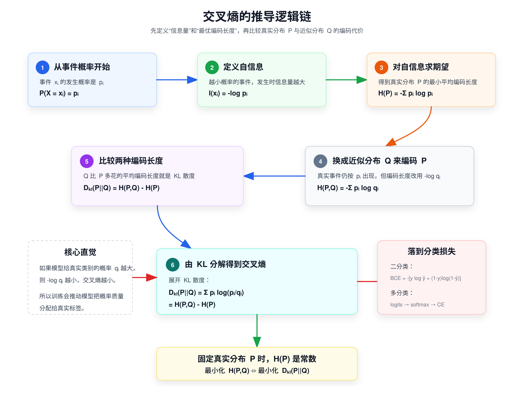

# 交叉熵

交叉熵的推导核心围绕**信息论的基本概念（自信息、熵）**展开，先从最基础的自信息定义推导出香农熵（随机变量的不确定性度量），再通过**联合熵、条件熵**的关系引出相对熵（KL 散度，衡量两个分布的差异），最终从 KL 散度分解中得到交叉熵公式，同时交叉熵在机器学习（分类任务）中的形式是其离散型的简化应用。

## 前置基础：信息论核心定义

推导前需明确 3 个最基础的概念，这是交叉熵的源头，均针对**离散型随机变量**（连续型可通过积分推广，核心逻辑一致）。

设离散型随机变量 $X$ 的取值空间为 $X=\{x_1,x_2,...,x_n\}$，其概率分布为 $P(X=x_i)=p_i$，且满足 $\sum_{i=1}^n p_i=1$；另有一个用于近似 $P$ 的概率分布 $Q(X=x_i)=q_i$，同样满足 $\sum_{i=1}^n q_i=1$。

### 1. 自信息（Self-Information）

一个事件 $X=x_i$ 发生所携带的**信息量**，称为自信息，记为 $I(x_i)$。

- 核心规律：事件发生的概率 $p_i$ 越小，信息量越大；概率为 1 的确定事件，信息量为 0。
- 公式定义：$I(x_i) = -\log p_i$（对数底通常取 2，单位为比特；取自然对数 $e$，单位为奈特，机器学习中多取 $e$，不影响推导逻辑）。

这里可以这样理解，太阳从东升西落，发生的概率为 1，属于是大家的一个常识也就说明所有人都知道，去讲一件大家都已经知道公认的事，那么这件事的信息量就为 0。但是如果是老师今天没布置作业，这是一件概率很小的事，只有学委知道，那么在学委通知大家后大家才知道。这件事就含有很大的信息量。

### 2. 香农熵（Shannon Entropy）

香农熵的定义是：随机变量所有可能事件的自信息，按概率加权平均。将这句话拆分为两部分就可以得到：

* 熵 = 自信息的「数学期望」
* 而数学期望 = 按概率加权平均

对任意一个离散型函数 $f(x_i)$ 数学期望的定义（离散型）：

$$H(P) = \mathbb{E}_P[I(x)] = -\sum_{i=1}^n p_i \cdot f(x_i)$$

* $p_i$：第 $i$ 个事件发生的概率。
* $f(x_i)$：这个事件带来的值。
* 撑起来再求和等于加权平均。

将上文中的 $I(x_i) = -\log p_i$ 带入到这里的 $f(x_i)$。就得到了香农熵的公式：

$$H(P) = \mathbb{E}_P[I(x)] = -\sum_{i=1}^n p_i \log p_i$$

- 其中 $\mathbb{E}_P[\cdot]$ 表示基于真实分布 $P$ 的数学期望。
- 物理意义：香农熵是描述真实分布 $P$ 的**最小编码长度**（无损压缩的极限）。

### 3. 联合熵与条件熵

- 联合熵：两个随机变量 $X,Y$ 的联合不确定性，$H(P(X,Y)) = -\sum_{i,j} p(x_i,y_j) \log p(x_i,y_j)$。
- 条件熵：已知 $X$ 的分布后，$Y$ 的剩余不确定性，**核心公式（熵的链式法则）**：

$$H(P(Y|X)) = H(P(X,Y)) - H(P(X))$$

物理意义：描述在已知 $X$ 的情况下，编码 $Y$ 所需的**平均额外编码长度**。

## 核心桥梁：相对熵（KL 散度）

交叉熵并非独立定义，而是从**相对熵（Kullback-Leibler Divergence，KL 散度）**的分解中得到，KL 散度的作用是**衡量两个概率分布 $P$（真实分布）和 $Q$（近似分布）之间的差异**，记为 $D_{KL}(P||Q)$。

### 1. KL 散度的定义

基于真实分布 $P$，用近似分布 $Q$ 来编码随机变量 $X$ 时，**额外增加的平均编码长度**，公式为：

$$D_{KL}(P||Q) = \mathbb{E}_P\left[\log \frac{P(X)}{Q(X)}\right] = \sum_{i=1}^n p_i \log \frac{p_i}{q_i}$$

- 关键性质：KL 散度**非负**（吉布斯不等式），即 $D_{KL}(P||Q) \geq 0$，当且仅当 $P=Q$ 时取等号；且**不对称**，$D_{KL}(P||Q) \neq D_{KL}(Q||P)$，因此不是严格的距离度量。

### 2. KL 散度的分解

将 KL 散度的对数项拆分为减法形式，展开推导：

$$
\begin{align*}
D_{KL}(P||Q) &= \sum_{i=1}^n p_i \log \frac{p_i}{q_i} =\sum_{i=1}^n p_i \log p_i - \sum_{i=1}^n p_i \log q_i \\
&= -\sum_{i=1}^n p_i \log q_i - \left(-\sum_{i=1}^n p_i \log p_i\right)
\end{align*}
$$

根据：

$$D_{KL}(P||Q) = H(P,Q) - H(P)$$

* 香农熵 $H(P)$：代表了用最优编码（即真实分布 P 本身）来表示随机变量时，所需的最小平均编码长度。这是一个理论下限。
* 交叉熵 $H(P,Q)$：代表了用次优编码（即近似分布 Q）来表示同一个随机变量时，所需的实际平均编码长度。
* KL 散度 $D_{KL}(P||Q)$：就等于这两个长度的差值，即“额外的编码开销”。它衡量了因为用 Q 代替 P 而付出的代价。

从 KL 散度的分解式中，直接得到**交叉熵**的定义，记为 $H(P,Q)$：

1. 离散型交叉熵

   $$\boldsymbol{H(P,Q) = -\sum_{i=1}^n p_i \log q_i}$$

2. 连续型交叉熵：

   若 $P(X),Q(X)$ 为连续型随机变量的概率密度函数，交叉熵通过积分推广：

   $$\boldsymbol{H(P,Q) = -\int_{-\infty}^{+\infty} p(x) \log q(x) dx}$$

3. 交叉熵与 KL 散度、香农熵的关系：

   由 KL 散度的分解式变形可得核心关系：

   $$\boldsymbol{H(P,Q) = D_{KL}(P||Q) + H(P)}$$

   - **物理意义**：用近似分布 $Q$ 编码真实分布 $P$ 的**总平均编码长度** = 额外编码长度（KL 散度） + 真实分布的最小编码长度（香农熵）。
   - **关键推论**：对于固定的真实分布 $P$，$H(P)$ 是常数，因此**最小化 KL 散度 $D_{KL}(P||Q)$ 等价于最小化交叉熵 $H(P,Q)$**，这是机器学习中用交叉熵作为损失函数的核心理论依据。

## 二分类问题（0/1）分类

在二分类问题中，交叉熵损失可以表示为：

$$L_{BCE}=y\log(\hat y)+(1-y)\log(1-\hat y)$$

* 真实标签：通常取值为 0 或 1。
* 预测值：是模型输出的类别 1 的概率。

## 多分类问题

对于多分类问题（类别数 > 2），通常会先通过 Softmax 将模型输出的 logits 转化为概率分布，然后再计算交叉熵损失：

$$L_{CE} =  \sum\limits_{i=1}^ny_i \log\hat{ \frac{e^{z_i}}{ \sum\limits_{j=1}^ne^{z_j}}}$$

* $z_i$：是第 i 类的 logits 值，表示网络输出的第 i 类的得分。
* $y_i$：是真实标签。

在 PyTorch 中，`nn.CrossEntropyLoss` 是一个用于多分类问题的交叉熵损失函数。它结合了 softmax 操作和交叉熵损失计算，通常用于训练分类任务。这个损失函数期望输入的 `y_pred` 是模型的原始输出（即未经过 softmax 转换的 logits），而 `y_true` 是类标签的形式。

## 为什么分类问题需要使用交叉熵?

对于线性回归模型，我们定义的代价函数是所有模型误差的平方和理论上来说，我们也可以对逻辑回归模型沿用这个定义，但是问题在于，当我们将概率分布的值带入到均方误差的公式中时会得到一个非凸函数。如左图，存在许多局部最优的点。这将影响梯度下降算法寻找全局最小值。

