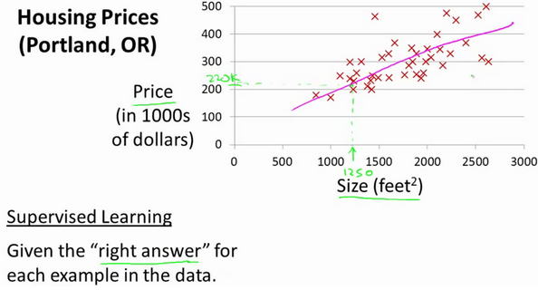
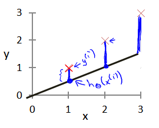

# 损失函数

损失函数，也称为代价函数或误差函数，是机器学习模型中用于衡量模型预测值与真实值之间差异的函数。

这里举个简单的例子：已知一个数据集，包含某个城市的住房价格。每个样本包括房屋尺寸、售价。在这里我们通过训练来构建一个简单的线性回归模型。

在训练的过程中，我们会将模型的预测值与训练集中的真实值进行对比。

这里会发现在 x 值相同的情况下真实值（红色）与预测值（蓝色）存在一定的偏差。这一段偏差就是训练中产生的损失。为了描述每一组真实值与预测值之间的损失情况，于是引入了损失函数的概念。

## 常见损失函数

- [均方误差（MSE）](./均方误差-MSE.md)
- [交叉熵](./交叉熵.md)
