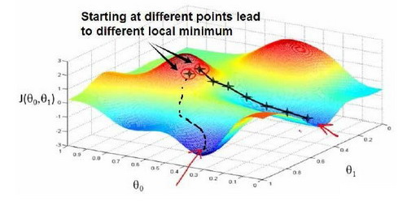
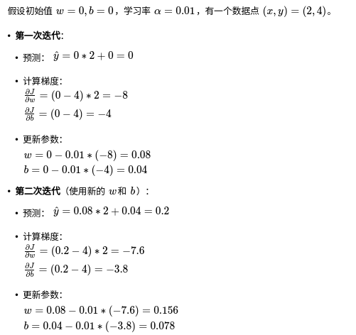
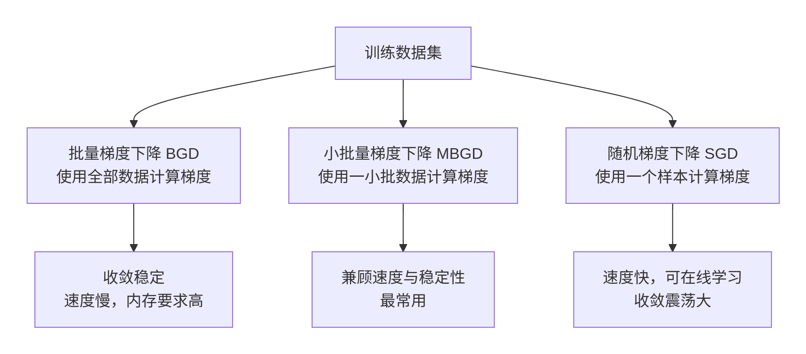
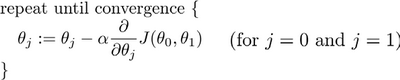
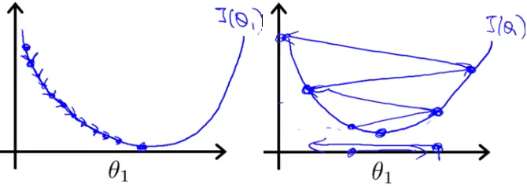

# 梯度下降法

## 基本思想

梯度下降是一种用来求函数最小值的算法，我们将使用梯度下降算法来求损失函数的最小值。

开始时随机选择一个参数的组合 $(\theta_0, \theta_1, ..., \theta_n)$，计算代价函数；然后寻找下一个能让代价函数值下降最多的参数组合。持续这么做直到找到一个局部最小值（Local minimum），因为我们并没有尝试完所有的参数组合，所以不能确定我们得到的局部最小值是否便是全局最小值（Global minimum），选择不同的初始参数组合，可能会找到不同的局部最小值。

这里可以想象一下你正站立在山的一点上（上图中的红色起始点），并且希望用最短的时间下山。在梯度下降算法中，要做的就是旋转 360 度，看看周围，并问自己要在某个方向上，用小碎步尽快下山。这些小碎步需要朝什么方向？如果我们站在山坡上的这一点，看一下周围，你会发现最佳的下山方向，按照自己的判断迈出一步；重复上面的步骤，从新的位置，环顾四周，并决定从什么方向将会最快下山，然后又迈进了一小步，并依此类推，直到你接近局部最低点的位置。

## 计算过程

假设我们有一个简单的线性回归模型 $y=wx+b$，并使用均方误差（MSE）作为损失函数。

模型：$\hat{y} = wx + b$

损失函数（MSE）：

$$J(w, b) = \frac{1}{2m} \sum_{i=1}^{m} (\hat{y}^{(i)} - y^{(i)})^2$$

1. 计算梯度

   我们需要求出损失函数关于参数 $w$ 和 $b$ 的偏导数。

   $$\frac{\partial J}{\partial w} = \frac{1}{m} \sum_{i=1}^{m} (\hat{y}^{(i)} - y^{(i)}) \cdot x^{(i)}$$

   $$\frac{\partial J}{\partial b} = \frac{1}{m} \sum_{i=1}^{m} (\hat{y}^{(i)} - y^{(i)})$$

2. 参数更新

   $$w = w - \alpha \cdot \frac{\partial J}{\partial w}$$

3. 计算示例

可以看到，经过两次迭代，预测值从 0 增加到了 0.2，正在向真实值 4 靠近。通过成千上万次迭代，$w$ 和 $b$ 会逐渐收敛到最优值。

## 梯度下降算法

梯度下降拥有三种主要的变体算法。分别为批量梯度下降、随机梯度下降、小批量梯度下降。

批量梯度下降：

批量梯度下降（batch gradient descent）算法可以抽象为公式：

其中 $\alpha$ 是学习率（Learning rate），它决定了沿着能让代价函数下降程度最大的方向向下迈出的步子有多大；在批量梯度下降中，每一次都同时让所有的参数减去学习速率乘以代价函数的导数。

### $\alpha$ 的取值有怎样的影响？

如果 $\alpha$ 太小，即学习速率太小，结果是红点一点点挪动，努力去接近最低点，需要很多步才能到达最低点。同样会需要很多步才能到达全局最低点。（如下图-左图）

如果 $\alpha$ 太大，梯度下降法可能会越过最低点，甚至可能无法收敛，下一次迭代又移动了一大步，一次次越过最低点，直到你发现实际上离最低点越来越远，所以如果 $\alpha$ 太大，它会导致无法收敛，甚至发散。

