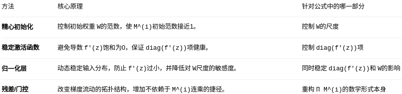

# 梯度爆炸与梯度消失

## 1. 问题背景

考虑一个简单的 L 层全连接神经网络（前馈网络）。

前向传播过程为：

$$
\mathbf{h}^{(l)} = f\left( \mathbf{z}^{(l)} \right), \quad
\mathbf{z}^{(l)} = W^{(l)} \mathbf{h}^{(l-1)} + \mathbf{b}^{(l)}
$$

其中：

- $l = 1, 2, \dots, L$ 为层索引。
- $f$ 是激活函数（如 sigmoid、tanh、ReLU 等）。
- $\mathbf{h}^{(0)} = \mathbf{x}$ 是输入。

设损失函数为 $J(\theta)$，对任意参数 $W^{(l)}$ 的梯度为：

$$
\frac{\partial J}{\partial W^{(l)}} = \frac{\partial J}{\partial \mathbf{h}^{(L)}}
\cdot \frac{\partial \mathbf{h}^{(L)}}{\partial \mathbf{h}^{(L-1)}}
\cdots \frac{\partial \mathbf{h}^{(l+1)}}{\partial \mathbf{h}^{(l)}}
\cdot \frac{\partial \mathbf{h}^{(l)}}{\partial W^{(l)}}
$$

关键部分在于从第 $L$ 层到第 $l$ 层的梯度传播项：

$$
\frac{\partial \mathbf{h}^{(L)}}{\partial \mathbf{h}^{(l)}} = \prod_{i=l}^{L-1} \frac{\partial \mathbf{h}^{(i+1)}}{\partial \mathbf{h}^{(i)}}
$$

## 2. 分析 $\frac{\partial \mathbf{h}^{(i+1)}}{\partial \mathbf{h}^{(i)}}$

我们有一个 $L$ 层的神经网络。对于第 $i$ 层和第 $i+1$ 层：

$$
\mathbf{z}^{(i+1)} = W^{(i+1)} \mathbf{h}^{(i)} + \mathbf{b}^{(i+1)}
$$

$$
\mathbf{h}^{(i+1)} = f(\mathbf{z}^{(i+1)})
$$

我们有一个 $L$ 层的神经网络。对于第 $i$ 层和第 $i+1$ 层：

- $\mathbf{h}^{(i)}$：第 $i$ 层的**隐藏状态**（输出），是第 $i$ 层的激活值。
- $\mathbf{z}^{(i+1)}$：第 $i+1$ 层的**加权输入**（激活函数的输入）。
- $W^{(i+1)}, \mathbf{b}^{(i+1)}$：连接第 $i$ 层到第 $i+1$ 层的**权重矩阵**和**偏置向量**。
- $f$：激活函数（如 Sigmoid、Tanh、ReLU），逐元素应用。

雅各比矩阵是函数的一阶偏导数以一定方式排列成的矩阵。雅各比矩阵表示了输入的每个变量稍微变一点，输出的每个结果会怎么跟着变。

因为这一步的目标是理解第 $i+1$ 层的输出如何随第 $i$ 层的输出变化。所以这里这一步可以表示为一个雅各比矩阵。

根据前向传播公式，$\mathbf{h}^{(i+1)}$ 是 $\mathbf{z}^{(i+1)}$ 的函数，而 $\mathbf{z}^{(i+1)}$ 又是 $\mathbf{h}^{(i)}$ 的函数。因此，我们可以应用**多变量链式法则**：

$$
\frac{\partial \mathbf{h}^{(i+1)}}{\partial \mathbf{h}^{(i)}} = \frac{\partial \mathbf{h}^{(i+1)}}{\partial \mathbf{z}^{(i+1)}} \cdot \frac{\partial \mathbf{z}^{(i+1)}}{\partial \mathbf{h}^{(i)}}
$$

**计算第一项：$\frac{\partial \mathbf{h}^{(i+1)}}{\partial \mathbf{z}^{(i+1)}}$**

- $\mathbf{h}^{(i+1)} = f(\mathbf{z}^{(i+1)})$，且 $f$ 是逐元素函数。
- 这个雅可比矩阵描述的是输出向量 $\mathbf{h}^{(i+1)}$ 的每个元素对输入向量 $\mathbf{z}^{(i+1)}$ 的每个元素的偏导数。

由于 $f$ 是逐元素操作的，$\mathbf{h}^{(i+1)}$ 的第 $i$ 个元素 $h_i^{(i+1)}$ **只依赖于** $\mathbf{z}^{(i+1)}$ 的第 $i$ 个元素 $z_i^{(i+1)}$，而不依赖于 $z_j^{(i+1)} (j \neq i)$。

因此，这个雅可比矩阵是一个**对角矩阵**：

$$
\frac{\partial \mathbf{h}^{(i+1)}}{\partial \mathbf{z}^{(i+1)}} = \bigl(
\begin{matrix}
\frac{\partial h_1^{(i+1)}}{\partial z_1^{(i+1)}} & 0 & \cdots & 0 \\
0 & \frac{\partial h_2^{(i+1)}}{\partial z_2^{(i+1)}} & \cdots & 0 \\
\vdots & \vdots & \ddots & \vdots \\
0 & 0 & \cdots & \frac{\partial h_m^{(i+1)}}{\partial z_m^{(i+1)}}
\end{matrix}
\bigr)
$$

每个对角线元素就是激活函数在其输入处的导数：

$$
\frac{\partial h_i^{(i+1)}}{\partial z_i^{(i+1)}} = f'(z_i^{(i+1)})
$$

所以，

$$
\frac{\partial \mathbf{h}^{(i+1)}}{\partial \mathbf{z}^{(i+1)}} = \text{diag}\left[ f'(\mathbf{z}^{(i+1)}) \right]
$$

这里 $\text{diag}[\mathbf{v}]$ 表示一个以向量 $\mathbf{v}$ 的元素为对角线元素的对角矩阵。

**计算第二项：$\frac{\partial \mathbf{z}^{(i+1)}}{\partial \mathbf{h}^{(i)}}$**

- $\mathbf{z}^{(i+1)} = W^{(i+1)} \mathbf{h}^{(i)} + \mathbf{b}^{(i+1)}$。
- 这是一个线性变换。向量对向量的偏导数就是其变换矩阵。
- 根据多元微积分，对于线性函数 $\mathbf{z} = W \mathbf{h} + \mathbf{b}$，有 $\frac{\partial \mathbf{z}}{\partial \mathbf{h}} = W^T$。但在神经网络的标准记法中（分母布局），我们通常直接写作：

$$
\frac{\partial \mathbf{z}^{(i+1)}}{\partial \mathbf{h}^{(i)}} = W^{(i+1)}
$$

将上面两步的结果代入链式法则公式：

$$
\frac{\partial \mathbf{h}^{(i+1)}}{\partial \mathbf{h}^{(i)}} = \underbrace{\text{diag}\left[ f'(\mathbf{z}^{(i+1)}) \right]}_{\text{对角矩阵}} \cdot \underbrace{W^{(i+1)}}_{\text{权重矩阵}}
$$

**最终结果**：相邻两层隐藏状态之间的梯度是一个**对角矩阵**（由激活函数的导数构成）与**权重矩阵** $W^{(i+1)}$ 的乘积。

## 3. 梯度连乘的形式

因此：

$$
\frac{\partial J}{\partial \mathbf{h}^{(l)}} = \frac{\partial J}{\partial \mathbf{h}^{(L)}} \cdot \prod_{i=l}^{L-1} \left[ \text{diag}(f'(\mathbf{z}^{(i+1)})) \cdot W^{(i+1)} \right]
$$

记 $M^{(i)} = \text{diag}(f'(\mathbf{z}^{(i)})) \cdot W^{(i)}$（注意这里索引要匹配，实际上上面是 $i+1$ 层对应 $W^{(i+1)}$ 和 $f'(\mathbf{z}^{(i+1)})$），那么：

$$
\frac{\partial J}{\partial \mathbf{h}^{(l)}} = \frac{\partial J}{\partial \mathbf{h}^{(L)}} \cdot M^{(L)} \cdot M^{(L-1)} \cdots M^{(l+1)}
$$

## 4. 梯度消失/爆炸的数学原因

矩阵乘积的模（范数）满足：

$$
\| \prod_{i} M^{(i)} \| \le \prod_{i} \| M^{(i)} \|
$$

* $\| \prod_{i} M^{(i)} \|$ 先连乘再取模。
* $\prod_{i} \| M^{(i)} \|$ 先取模，再由模来连乘。

如果每个 $\| M^{(i)} \|$ 都小于 1，那么乘积会指数级减小，导致**梯度消失**。

如果每个 $\| M^{(i)} \|$ 都大于 1，那么乘积会指数级增大，导致**梯度爆炸**。

### 4.1 激活函数导数的影响

常见激活函数导数范围：

- **Sigmoid**：$f'(z) = f(z)(1-f(z)) \in (0, 0.25]$，最大值 0.25。
- **tanh**：$f'(z) = 1 - \tanh^2(z) \in (0, 1]$，最大值 1。
- **ReLU**：$f'(z) = 0 \text{ 或 } 1$。

对于 sigmoid，$\|\text{diag}(f')\| \le 0.25$，如果权重矩阵 $W$ 的范数不太大（比如使用 Xavier 初始化后每层谱范数约 1），那么 $\|M\| \approx 0.25$，连乘 $L$ 层后梯度尺度约为 $(0.25)^{L-l}$，对于大 $L$ 几乎为 0。

对于 tanh，导数最大 1，但如果大部分神经元饱和（$|z|$ 很大），导数接近 0，同样会导致梯度消失。

### 4.2 权重矩阵的影响

即使激活函数导数理想（如恒等函数，即线性网络），梯度为：

$$
\frac{\partial J}{\partial \mathbf{h}^{(l)}} = \frac{\partial J}{\partial \mathbf{h}^{(L)}} \cdot W^{(L)} W^{(L-1)} \cdots W^{(l+1)}
$$

假设 $W$ 是标量 $w$ 的情形（单神经元线性网络），则梯度包含因子 $w^{L-l}$。

- 若 $|w| < 1$，指数减小，梯度消失。
- 若 $|w| > 1$，指数增大，梯度爆炸。

推广到矩阵：取决于权重矩阵的**谱范数**（最大奇异值）$\sigma_{\max}$：

- 若每层 $\sigma_{\max}(W^{(i)}) < 1$，梯度消失。
- 若每层 $\sigma_{\max}(W^{(i)}) > 1$，梯度爆炸。

## 总结原因

**梯度消失原因**：

1. **激活函数饱和**：sigmoid、tanh 在绝对值大的输入处导数接近 0。
2. **权重矩阵谱范数 < 1**：连乘后梯度模长指数下降。
3. **网络深度/时间步数大**：连乘项多，放大上述效应。

**梯度爆炸原因**：

1. **权重矩阵谱范数 > 1**：连乘后梯度模长指数增长。
2. **深度大**：即使略大于 1，深度大时也会爆炸。

## 避免的手段

