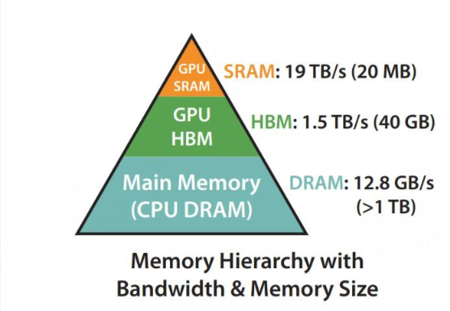
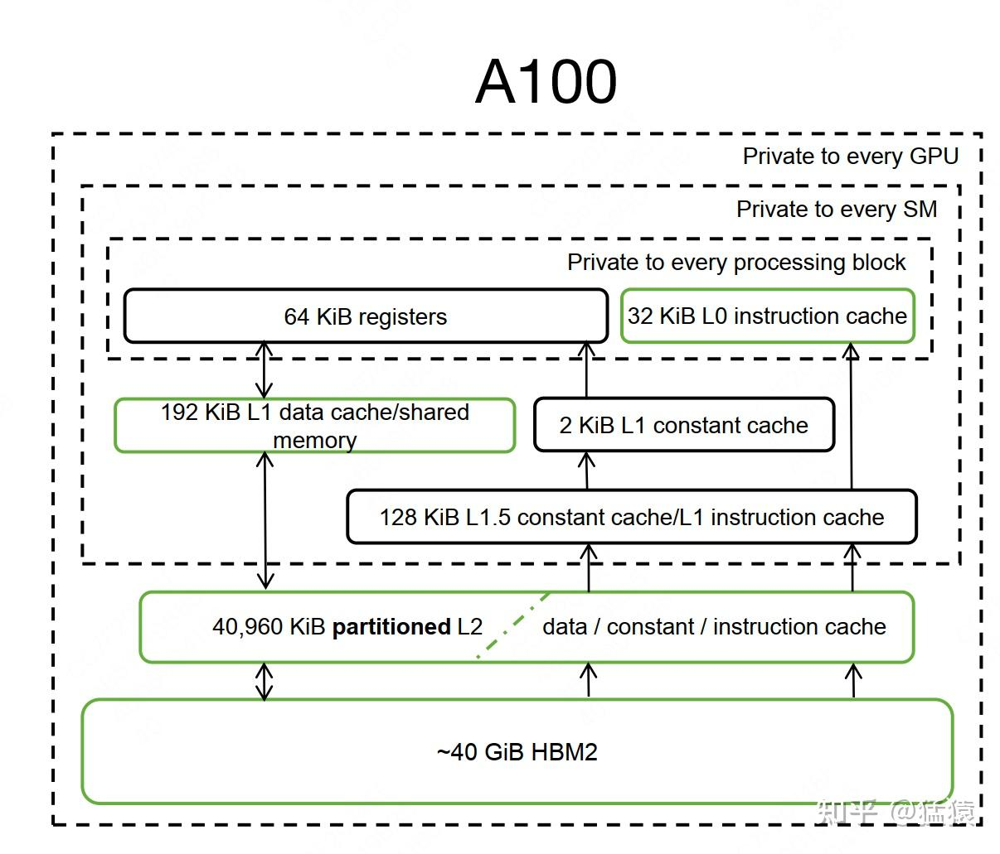
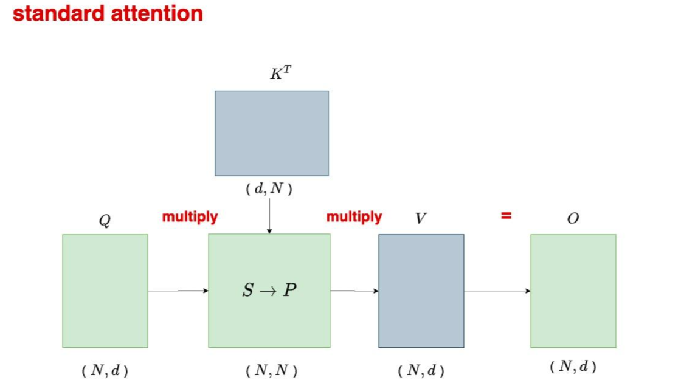
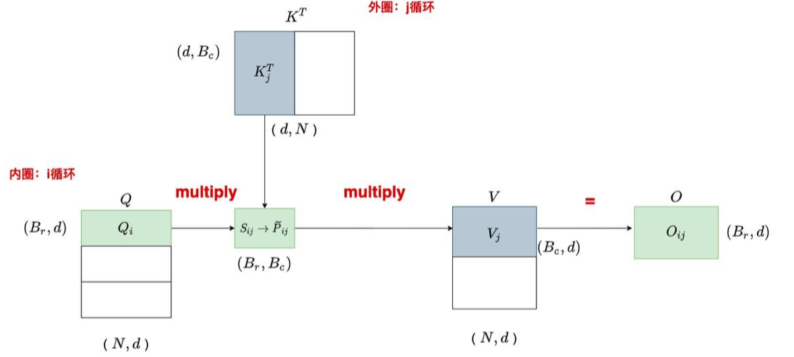
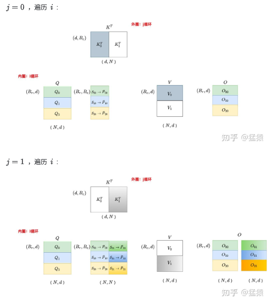

# FlashAttention

## 为什么需要 FlashAttention

对于Transformer类的模型，假设其输入序列长度为 $N$ ，那么其计算复杂度和消耗的存储空间都为 $O(N^2)$ 。也就是说，随着输入序列的变长，将给计算和存储带来极大的压力。因此我们需要一种方法解决 Transformer类的模型的 $O(N^2)$ 问题。

### Transformer的速度瓶颈

在Flash Attention之前，也出现过一些加速Transformer计算的方法，这些方法的着眼点是“减少计算量FLOPs”，例如用一个稀疏attention做近似计算。但是Flash attention就不一样了，它并没有减少总的计算量，因为它发现：计算慢的卡点不在运算能力，而是在读写速度上。所以它通过降低对显存（HBM）的访问次数来加快整体运算速度，这种方法又被称为O-Awareness。

Flash Attention 的核心思想就是通过分块计算（tiling）和核函数融合（kernel fusion）来降低对显存的访问。

## 硬件基础

#### GPU的存储层级



上图是Flash attention论文所绘制的硬件不同的存储类型、存储大小和带宽。一般来说，GPU上的存储分类，可以按照是否在芯片上分为片上内存(on chip)和片下内存(off chip)。

片上内存：主要用于缓存（cache）及少量特殊存储单元（例如texture），其特点是“存储空间小，但带宽大”。对应到上图中，SRAM就属于片上内存，它的存储空间只有20MB，但是带宽可以达到19TB/s。

片下内存：主要用于全局存储（global memory），即我们常说的显存，其特点是“存储空间大，但带宽小”，对应到上图中，HBM就属于片下内存（也就是显存），它的存储空间有40GB（A100 40GB），但带宽相比于SRAM就小得多，只有1.5TB/s。

当硬件开始计算时，会先从显存（HBM）中把数据加载到片上（SRAM），在片上进行计算，然后将计算结果再写回显存中

#### GPU的计算流程



L1缓存/shared memory：每个SM都有自己的L1缓存，用于存储SM内的数据，被SM内所有的cuda cores共享。SM间不能互相访问彼此的L1。NV Volta架构后，L1和shared memory合并（Volta架构前只有Kepler做过合并），目的是为了进一步降低延迟。合并过后，用户能写代码直接控制的依然是shared memory，同时可控制从L1中分配多少存储给shared memory。Flash attention中SRAM指的就是L1 cache/shared memory。

L2缓存：所有SM共享L2缓存。L2缓存不直接由用户代码控制。L1/L2缓存的带宽都要比显存的带宽要大，也就是读写速度更快，但是它们的存储量更小。

GPU的计算流程：将数据从显存（HBM）加载至on-chip的SRAM中，然后由SM读取并进行计算。计算结果再通过SRAM返回给显存。

显存的带宽相比SRAM要低很多，因此我们需要提升SRAM命中率，尽量减少对于显存的访问。

#### kernel融合

Kernel融合是将多个连续执行的GPU计算内核合并成一个单一内核的技术。在GPU编程中，每个"内核"对应一个在GPU上并行执行的函数。传统做法是每个数学操作（如矩阵乘法、激活函数、归一化等）都启动一个独立的内核。Kernel融合的核心思想是：将多个连续操作合并到一个内核中执行，避免中间结果写回慢速的全局内存。

原始流程：

Kernel1启动 → 计算 → 结果写HBM → Kernel2启动 → 读取HBM → 计算 → ...

融合后：

融合Kernel启动 → 计算 → 中间结果在寄存器/SRAM传递 → 计算 → ...

关键：避免中间结果写回慢速的全局内存（HBM）

## Flash Attention的工作流程

这里假设有一个 Attention 行，固定一个 Q

* 只看 **单个 Query 向量 q**
* Key 有 4 个：k₁ k₂ k₃ k₄
* Value 有 4 个：v₁ v₂ v₃ v₄

$$x = qK^T = [2, 1, 3, 0]$$

### 原本的计算流程

$$\text{softmax}\Big(\frac{Q K^T}{\sqrt{d_k}}\Big)V$$



在原本的计算流程中首先是：

$$Q K^T$$

在计算出Q乘K的转置后找全局最大值：

$$m = \max(x) = 3$$

然后：

$$
\exp(x - m) = [e^{-1}, e^{-2}, e^{0}, e^{-3}]
\approx [0.3679, 0.1353, 1.0, 0.0498]
$$

分母：

$$
s = 0.3679 + 0.1353 + 1.0 + 0.0498 = 1.553
$$

概率分布：

$$
p = [0.237, 0.087, 0.644, 0.032]
$$

一次性算输出：

$$o = \sum_i p_i v_i$$

这就是**传统 Attention：一次性得到完整概率分布 p**

### 分块后的计算流程





我们把 Key / Value **分成两个 block**：

```
Block A: k1, k2   → scores = [2, 1]
Block B: k3, k4   → scores = [3, 0]
```

对于 $QK^T$ 这一步运算，分块前后并无区别，每块各自计算自己的就好。

分块后主要需要注意的是softmax的过程。

#### Block A 计算

获取A的局部最大值

```
scores_A = [2, 1]
m_A = 2
```

局部 exp-sum

$$
\exp(scores_A - m_A) = [e^0, e^{-1}] = [1, 0.3679]
$$

$$
s_A = 1 + 0.3679 = 1.3679
$$

局部加权输出：

$$
o_A = 1·v_1 + 0.3679·v_2
$$

当前状态（规约状态）

```
m = 2
s = 1.3679
o = o_A
```

#### Block B 计算（关键的“规约”步骤）

局部最大值：

```
scores_B = [3, 0]
m_B = 3
```

“分块比大小”

```
m_new = max(m, m_B) = max(2, 3) = 3
```

对齐旧结果

旧的结果是基于 `m = 2` 的，现在要统一到 `m_new = 3`

$$
scale_{old} = e^{m - m_{new}} = e^{-1} = 0.3679
$$

这里主要是应用了指数的平移性，即：

$$
e^{x - m_{new}} =  e^{x - m_{old}+(m_{old} - m_{new})} = e^{x - m_{old}} · e^{m_{old} - m_{new}}
$$

### 4️⃣ 更新 sum

局部 B 的 exp-sum：

$$
\exp(scores_B - m_B) = [1, e^{-3}] = [1, 0.0498]
$$

$$
s_B = 1 + 0.0498 = 1.0498
$$

合并：

$$
s = s_A·e^{2-3} + s_B
$$

$$
s = 1.3679·0.3679 + 1.0498
\approx 0.503 + 1.0498
= 1.553
$$

👉 **和一次性算的分母完全一样**

更新输出

$$
o = o_A·e^{2-3} + (1·v_3 + 0.0498·v_4)
$$

最终在所有分块都扫面完成后进行统一的归一化操作。

$$
o = \frac{o}{s}
$$

伪代码：

```txt
加载 Q_block → shared memory

初始化:
  m = -∞        (行最大值)
  s = 0         (softmax 分母)
  out = 0       (输出向量)

for 每个 K/V block:
    加载 K_block, V_block → shared memory

    scores = Q_block · K_block^T     (tensor core)
    block_max = max(scores, axis=col)

    m_new = max(m, block_max)
    scale_old = exp(m - m_new)
    scale_new = exp(scores - m_new)

    s = s * scale_old + sum(scale_new)
    out = out * scale_old + sum(scale_new * V_block)

    m = m_new

out = out / s
写回 HBM

```

### 反向传播的计算的过程

#### 对softmax求导

给定一行 logits，即 $QK^T$ 这一步的运算结果：

$$
\mathbf{s} = (s_1, s_2, \dots, s_n)
$$

softmax 定义为：

$$
p_i = \text{softmax}(s)*i = \frac{e^{s_i}}{\sum*{k=1}^n e^{s_k}}
$$

记：

$$
Z = \sum_{k=1}^n e^{s_k}
$$

我们要求：

$$
\frac{\partial p_i}{\partial s_j}
$$

**情况 1：( i = j )**

$$
p_i = \frac{e^{s_i}}{Z}
$$

对 ( s_i ) 求导：

$$
\frac{\partial p_i}{\partial s_i}
= \frac{e^{s_i} Z - e^{s_i} e^{s_i}}{Z^2}
= \frac{e^{s_i}}{Z} \left(1 - \frac{e^{s_i}}{Z}\right)
$$

即：

$$
\boxed{
\frac{\partial p_i}{\partial s_i}
= p_i (1 - p_i)
}
$$

**情况 2： $( i \neq j )$**

$$
\frac{\partial p_i}{\partial s_j}
= \frac{0 \cdot Z - e^{s_i} e^{s_j}}{Z^2}
= - \frac{e^{s_i}}{Z} \frac{e^{s_j}}{Z}
$$

即：

$$
\boxed{
\frac{\partial p_i}{\partial s_j}
= - p_i p_j
}
$$


$$
dp_i = \frac{\partial L}{\partial p_i}
$$

此时要对 $s_i$ 求导

$$
\frac{\partial L}{\partial s_j} = \frac{\partial L} {\partial p_i} \cdot  \frac{\partial p_i}{\partial s_i} = \sum_i dp_i \frac{\partial p_i}{\partial s_j}
$$

代入带入softmax的导数得

$$
\frac{\partial L}{\partial s_j} = \sum_i p_i dp_i (\delta_{ij} - p_j)
$$

化简得：

$$
\frac{\partial L}{\partial s_j}
= d_j p_j - p_j \sum_i p_i dp_i
$$

记：

$$
\alpha = \sum_i p_i dp_i
$$

得

$$
\boxed{
\frac{\partial L}{\partial s_j} = p_j (d_j - \alpha)
}
$$

#### 举例说明过程

Scores（Q·Kᵀ 的结果，假设已算好）：

```text
S = [1, 2, 3, 4]
```

V：

```text
V = [10, 20, 30, 40]
```

在向前传播时记录下

全局 max：

```text
m = max(S) = 4
```

exp & sum：

```text
exp(S - m) = [e^-3, e^-2, e^-1, 1]
           ≈ [0.050, 0.135, 0.368, 1.000]

l = 1.553
```

Softmax 概率：

```text
P ≈ [0.032, 0.087, 0.237, 0.644]
```

输出

```text
O = Σ P_i V_i
  ≈ 0.032*10 + 0.087*20 + 0.237*30 + 0.644*40
  ≈ 32.7
```

假设来自上一层的输入为：

```text
dO = 1.0
```

**第一遍扫描（分块做 dV + α）**

KV block size = 2：

```text
Block A: indices [0, 1]
Block B: indices [2, 3]
```

🔹 Block A（i = 0,1）

重算 scores

```text
scores = [1, 2]
```

用正向的全局 m、l 恢复 P

```text
P = exp(scores - m) / l
  ≈ [0.032, 0.087]
```

计算 dV

$$
dV_i = P_i \cdot dO
$$

```text
dV[0] = 0.032
dV[1] = 0.087
```

计算 dP

$$
dP_i = dO \cdot V_i
$$

```text
dP[0] = 10
dP[1] = 20
```

累加 α

$$
\alpha += \sum P_i dP_i
$$

```text
α += 0.032*10 + 0.087*20
   ≈ 2.06
```

🔹 Block B（i = 2,3）

重算 scores + P

```text
scores = [3, 4]
P ≈ [0.237, 0.644]
```

dV:

```text
dV[2] = 0.237
dV[3] = 0.644
```

dP:

```text
dP[2] = 30
dP[3] = 40
```

α 累加

```text
α += 0.237*30 + 0.644*40
   ≈ 32.9
```

第一遍结束

```text
α ≈ 34.96
```

> ⚠️ 注意
>
> * P **从未存储**
> * 每个 block 用完即丢
> * 只留下：`dV` 和标量 `α`

**第二遍扫描（分块算 dS / dQ / dK）**

Softmax 反向公式

$$
dS_i = P_i (dP_i - \alpha)
$$

🔹 Block A（i = 0,1）

```text
P ≈ [0.032, 0.087]
dP = [10, 20]
```

```text
dS[0] = 0.032 * (10 - 34.96) ≈ -0.80
dS[1] = 0.087 * (20 - 34.96) ≈ -1.30
```

🔹 Block B（i = 2,3）

```text
P ≈ [0.237, 0.644]
dP = [30, 40]
```

```text
dS[2] = 0.237 * (30 - 34.96) ≈ -1.18
dS[3] = 0.644 * (40 - 34.96) ≈  3.24
```

校验一个重要性质:

```text
Σ dS ≈ 0
```

✔️ 满足 softmax 约束（平移不变性）


**在 block 内立刻算 dQ / dK（不存 dS）**

对每个 block：

$$
dQ += \sum_i dS_i K_i
$$

$$
dK_i += dS_i Q
$$

* 都是 **block GEMM**
* 用 Tensor Core
* dS **不落 HBM**

这里为什么要分两次计算？

softmax 的反向存在一个“全行耦合项” α，而 α 必须先被完整计算出来才能正确计算 ds

## 为什么FlashAttention更快

标准注意力计算的流程：

```txt
标准注意力计算：
Q × Kᵀ → 生成 N×N 矩阵 → 写入HBM
        ↓
       Softmax → 读取N×N → 写入N×N
        ↓
       × V → 读取N×N → 写入输出

内存访问次数：O(N²d) 次HBM访问
（N=序列长度，d=特征维度）

问题：GPU的HBM带宽有限，而计算单元很快
计算在等数据，形成"内存墙"
```

**1.避免了中间矩阵的存储**

在 flashattention 的计算中，并未对中间生成的矩阵进行存储，而是将传统的注意力计算方式中的三个步骤融合成一个 kernel，在该过程中下一步可以直接对上一步的结果进行运算，避免了中间矩阵的产生。减小了空间复杂度。

**2.提高了SRAM的利用率**

在 flashattention 中采取了分块的方式减小了矩阵的规模，这样就可以将矩阵直接加载到 SARM 级 GPU 的 Cache 中，提高了 Cache 的利用率，减少 HBM 访问次数。由于 SRAM 比 HBM 快 20 - 100 倍，所以对速度有了大幅度的提升。

传统注意力：

HBM访问 ≈ 3 × (读取Q,K,V) + 写入S + 读取S + 写入P + 读取P + 写入O
         ≈ 8N²d = 8×8192²×128 ≈ 68.7GB

FlashAttention：

HBM访问 ≈ (读取Q,K,V) + 写入O
         ≈ 4Nd = 4×8192×128 ≈ 4.2MB

**3.反向传播时节省的内存**

在进行反向传播时，传统的注意力机制会保存完整的 P 矩阵用于进行反向传播。但是在 FlashAttention 中则只保存 m （全局的max）以及 l （最终计算出的sum总和）在反向传播中会进行重计算出 P。

虽然在 FlashAttention 中需要进行重计算，看似在计算上浪费了一些时间。实际上则大大减少了存储空间的占用。

用计算换内存：重计算成本<<内存访问成本
