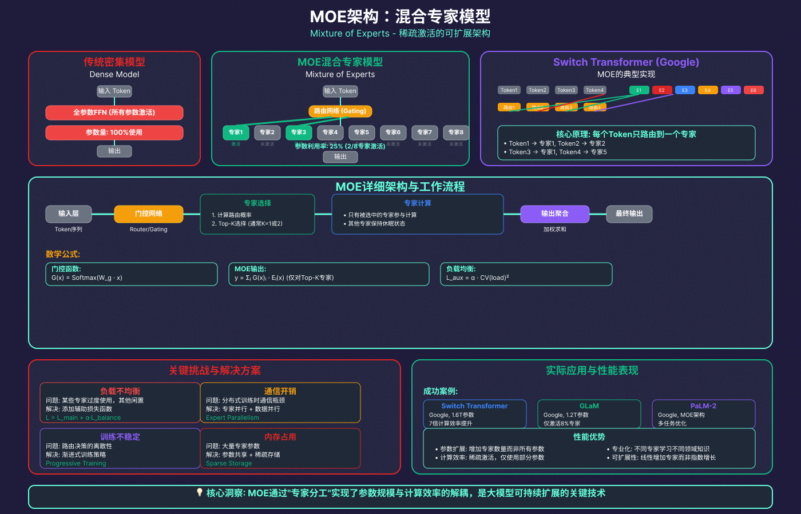
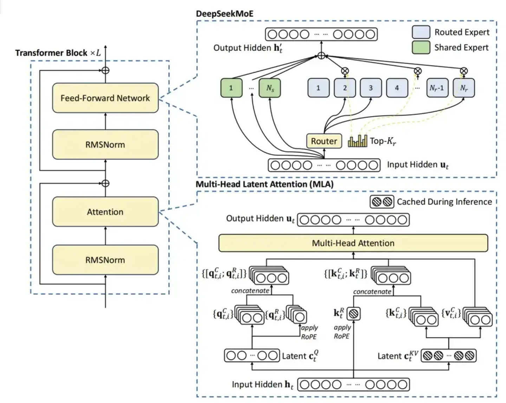
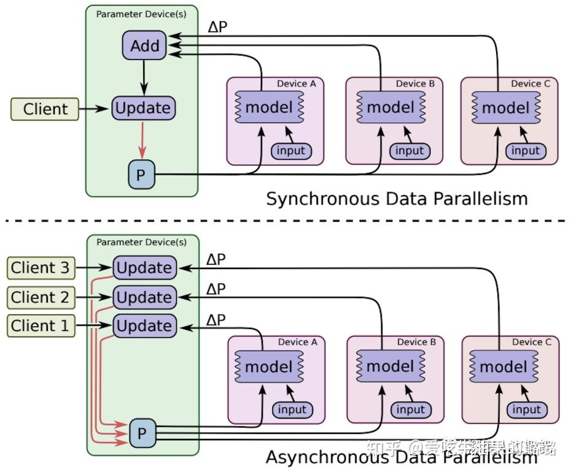

# MOE



## 传统模型的局限性

传统神经网络在处理大规模复杂任务时面临多重根本性局限。

首先，在计算效率方面，其全连接架构导致每次前向传播都必须激活所有参数，造成严重的“计算浪费”，无论输入内容如何，所有神经元都需参与计算，这使得计算复杂度随参数规模呈二次增长，内存带宽成为硬性瓶颈。

在可扩展性上，随着参数量从十亿级向万亿级迈进，传统模型的计算资源和训练成本呈指数级增长，训练稳定性也急剧下降，梯度同步和内存管理技术挑战巨大。

从模型能力角度看，这种“全能型”架构试图用单一模型学习所有领域知识，导致不同任务间存在负迁移效应，专业化性能受限，且持续学习时易发生灾难性遗忘。

实际部署中，庞大参数量带来高昂的推理延迟和能耗成本，难以满足实时应用需求，边缘部署几乎不可能。

这些问题的核心症结在于传统方法将参数规模与计算效率强耦合——增加参数必然增加计算，无法实现“大规模参数、高效率计算”的理想状态。

## MOE模型结构

MoE的思想出发点是：如果有一个包括了多个领域知识的复杂问题，应该使用什么样的方法来解决呢？

最直接的办法就是把各个领域的专家集合到一起来攻克这个任务，比如事先要把不同的任务先分离出来，这样才便于分发给不同领域的专家，让他们各自独立处理，最后再汇总结论。

混合专家模型正是基于这样的理念，它由多个专业化的子模型（即“专家”）组合而成，每一个“专家”都在其擅长的领域内做出贡献。而决定哪个“专家”参与解答特定问题的，是一个称为“门控网络”的机制。

混合专家模型主要由两个关键部分组成:

稀疏 MoE 层: 这些层代替了传统 Transformer 模型中的前馈网络 (FFN) 层。MoE 层包含若干“专家”(例如 8 个)，每个专家本身是一个独立的神经网络。在实际应用中，这些专家通常是前馈网络 (FFN)，或更复杂的网络结构，从而形成层级式的 MoE 结构。

门控网络或路由: 这个部分用于决定哪些词元(token) 被分发到哪个专家。例如，在下图中，“More”这个令牌可能被发送到第二个专家，而“Parameters”这个词元被发送到第一个专家。有时候，一个词元甚至可以分发给多个专家。词元的路由方式是 MoE 使用中的一个关键点，因为路由器由学习的参数组成，并且与网络的其他部分一同进行预训练。



简单来说，在混合专家模型 中，我们将传统 Transformer 模型中的每个前馈网络 (FFN) 层替换为 MoE 层，其中 MoE 层由两个核心部分组成: 一个门控网络和若干数量的专家。

### 专家网络（Expert Networks）

专家网络是指MoE模型中的多个子网络（即“专家”）。每个专家通常是功能相同结构类似的神经网络模块（例如Transformer中前馈网络部分），但在训练过程中可各自学习不同的专长。在经典MoE中，这些专家共同构成模型的一层或若干层，仅有一部分专家会针对每个输入样本被激活。通过这种方式，模型参数规模可以非常庞大，但每次推理或训练仅计算一小部分参数，从而保持计算成本近似恒定。这种架构提高了模型容量（参数数目巨大带来的表示能力）与计算效率的折中：例如Switch Transformer模型具有高达1.6万亿参数，但其训练计算量与一个100亿参数的稠密模型相当。

小型MLP：这是最常用的设置。每个专家是一个相对简单的前馈神经网络。整个MoE系统的庞大参数量来自于大量这样的专家，而非单个巨型模型。计算高效，适合做特征转换。

复杂LLM：这代表了一种更宏观、更强大的设计。每个“专家”本身可以是一个完整的语言模型。这种架构常用于模型融合或终身学习，让不同的专家LLM精通不同任务或领域，门控负责调用。

### 门控路由机制（Gating Mechanisms）

门控网络（gating network或路由器）是MoE的关键组件，决定了每个输入应该由哪一个或哪几个专家来处理。
门控网络通常是一个简单的前馈层，它根据输入特征计算针对每个专家的打分（logits），再通过一定函数将打分转换为概率或权重分布，用以选择专家。

按照路由决策的不同方式，可分为软路由和硬路由两种：

软路由（soft gating）会根据门控网络输出的概率加权融合多个专家的结果（极端情况下可融合同层所有专家的输出，代价是计算开销巨大）

而硬路由（hard gating）则只选择得分最高的几个专家，丢弃其他专家的输出，从而使每次仅激活少数专家参与计算。硬路由通常通过非零梯度近似或辅助损失进行训练，代表性实例是Switch Transformer中每个token仅选取单一专家（相当于_top-1_路由），这种硬选取大幅减少了计算与通信成本。

软硬路由各有优劣：软路由更平滑但计算开销大，硬路由更高效但需要应对离散选择带来的训练不稳定等问题。

#### Top-K 激活（Top-K Routing）

Top-K路由是硬路由的一种实现方式，即针对每个输入（如一个token或样本），按照门控得分选择出排名前K的专家来计算。经典的稀疏MoE模型中常用_top-2_或_top-1_策略：例如“top-2”表示每个token同时由得分最高的2个专家处理，然后将它们的输出按照对应权重相加作为该层输出；

而Google提出的Switch Transformer将这一策略推到极致，每次仅选取top-1专家（即每token只由单个专家处理），并将此称为“硬路由”。采用更小的K值可以显著减少计算和跨设备通信：Switch Transformer的实验表明，在T5模型中将每层FFN替换为128个专家并使用K=1路由时，预训练速度提升了约4倍，同时成功扩展模型参数至万亿量级。当然，减小K值可能略微影响模型收敛性能，因此实际应用中会权衡K取值：许多MoE模型选择K=1以最大化效率，也有一些采用K=2以获得更高精度。

#### 负载均衡（Load Balancing）

负载均衡指确保不同专家被选中的频率均衡，以防止个别专家过度使用而其他专家几乎闲置。若门控网络总是偏好少数几个专家，这些专家将更充分训练并进一步主导输出，形成正反馈，而其余专家因长期缺乏训练机会而表现欠佳，最终可能变成“死专家”。为缓解这一问题，MoE模型通常引入辅助损失和噪声扰动等机制。经典方法包括：Shazeer等人提出的Noisy Top-K路由在专家得分中注入随机高斯噪声，以增加探索，多样化专家选择。

同时增加两个正则项，一是负载均衡损失（load balancing loss）对过度依赖单一专家的情况进行惩罚，二是专家多样性损失奖励更均匀使用所有专家。Google GShard（2020）论文进一步提出了随机路由和专家容量限制两种策略：具体而言，在_top-2_路由中除得分最高的专家按常规选取外，第二个专家并非严格选择次高得分，而是按概率从剩余专家中抽样，这使次优专家也有机会参与。

同时为每个专家设定容量上限，限制每批次分配给单个专家的token数量，若最优专家已达上限，则该token不再选用该专家（被视为“溢出”并跳过此层。这些手段在实践中有效减轻了专家负载的不均衡问题，常与辅助损失配合使用。

混合专家模型（MoE）中用于解决负载均衡问题的关键数学公式。这两个公式共同构成了MoE训练中的重要性损失函数，专门用于防止某些专家被过度使用而其他专家被闲置的问题。

#### 实现

这个机制的目标是为每个输入Token（x）计算一个稀疏的概率分布G(x)，用于选择K个最合适的专家。

带有噪声的Top-K稀疏门控路由机制的实现流程：

原始分数 H(x) → Top-K筛选 → Softmax归一化 → 最终路由概率 G(x)

**计算单个输入的专家匹配度 H(x)：**

$$H(x)_i = (x·W_g)_i + StandardNormal()·Softplus((x·W_noise)_i)$$

第一部分：

基础匹配分数： $(x·W_g)_i$

* x：输入Token的向量表示
* W_g：可学习的门控权重矩阵

这一步用于计算Token与第i个专家的匹配程度，这是路由的主要学习部分

第二部分：

自适应噪声： $StandardNormal()·Softplus((x·W_noise)_i)$

* StandardNormal()：标准正态分布随机噪声，每次计算都重新采样
* Softplus(...)：Softplus函数，确保输出为正数（Softplus(z) = log(1+exp(z))）
* W_noise：可学习的噪声权重矩阵
* (x·W_noise)_i：学习第i个专家对噪声的敏感度

**为什么需要噪声？**

1. 训练稳定性：噪声帮助模型在训练初期探索不同路由路径，避免陷入局部最优，某些专家永远不被使用，随着训练进行，噪声影响逐渐减小，路由趋于稳定。

2. 如果没有噪声，可能出现的极端情况

    ```text
    专家0得分：3.2
    专家1得分：2.9
    专家2得分：0.1
    专家3得分：0.2
    ...
    Top-2总是选择专家0和1，其他专家永远闲置
    ```

   加入噪声后，偶尔会让低分专家获得机会，促进负载均衡。

3. 稀疏性与效率：只激活k个专家（通常k=1或2），从Softmax的-∞得到精确的0概率，实现真正的稀疏计算，而非近似。

**稀疏化筛选 KeepTopK：**

```c
KeepTopK(v, k)_i = {
    v_i    如果v_i是v中最大的k个元素之一
    -∞     否则
}
```

数学意义：对向量v执行Top-K操作，保留最大的k个元素值不变，将其余元素设为负无穷(-∞)。

经Softmax后，-∞变为0概率

实际效果：

```text
输入向量： [2.1, 0.5, 3.2, 1.8, -0.3]  (假设k=2)
KeepTopK后：[ -∞,  -∞, 3.2,  -∞, 1.8]  (保留3.2和1.8)
Softmax后：[0.0, 0.0, 0.88, 0.0, 0.12]  (只有两个非零概率)
```

**生成路由概率 G(x)：**

$$G(x) = Softmax(KeepTopK(H(x), k))$$

* $H(x)$ ：专家选择的原始分数向量
* $KeepTopK(H(x), k)$ ：只保留前k个最高分数，其余设为-∞
* $Softmax(...)$ ：将筛选后的分数转换为概率分布
* $G(x)$ ：最终的路由概率，只有k个非零元素

关键特性：输出G(x)是稀疏的，只有k个专家有非零概率，这正是MOE稀疏激活的核心。

**批次级统计 Importance(X)**

Importance(X)计算一个批次的问题中，每个专家被分派到的“工作量”。

如果某些专家总是被分到活（过度使用），而某些专家永远闲着（利用不足），这就是负载不均衡，会导致资源浪费。

$$operatorname{Importance}(X) = \sum_{x \in X} G(x)$$

输入：批次X中所有token的路由概率{G(x) | x∈X}

功能：评估专家在批次中的使用情况

**负载均衡损失**

L_importance这个损失函数会惩罚这种不均衡的情况，迫使首席顾问在分配问题时尽量“雨露均沾”，确保所有专家都能得到训练并被充分利用。这就是“因材施教”中“教”的一部分——不仅要教专家，还要教门控如何公平、高效地分配任务。

$$L_{\text{importance}}(X) = w_{\text{importance}} \cdot \operatorname{CV}(\operatorname{Importance}(X))^{2}$$

* CV = 标准差/均值，衡量不均衡程度
* 平方操作放大不平衡的惩罚
* w_importance：调节惩罚强度的超参数
* 目标：使所有专家的Importance值尽可能接近

工作流程：

前向传播调用链：

```text
对于每个输入x：
    scores = H(x)                # 计算原始分数
    sparse_scores = KeepTopK(scores, k)  # 稀疏化
    routing_probs = Softmax(sparse_scores)  # 得到G(x)
    
对于整个批次X：
    total_importance = Σ G(x)     # 得到Importance(X)
    load_balance_loss = CV(total_importance)²  # 得到L_importance
```

反向传播：

```text
梯度流动：
∂L_total/∂参数 = ∂L_task/∂参数 + ∂L_importance/∂参数
                ↓
          ∂L_importance/∂Importance
                ↓
          ∂Importance/∂G(x)
                ↓
          ∂G(x)/∂H(x)
                ↓
          ∂H(x)/∂Wg, ∂H(x)/∂Wnoise
```

### 为什么需要稀疏激活

**1. 突破计算效率的物理极限**

**问题**：密集模型的"内存墙"瓶颈

```text
假设构建万亿参数模型：
- 密集模型：每次推理需加载全部1T参数
- 内存需求：约4TB显存（假设FP32）
- 计算需求：数万亿次浮点运算
- 现实：没有任何GPU能满足此需求
```

**稀疏激活解决方案**：

```text
MoE模型（1T参数，稀疏度2/1000）：
- 每次推理激活：1T × (2/1000) = 2B参数
- 内存需求：约8GB显存（可部署在A100等卡上）
- 计算需求：20亿次浮点运算
- 现实：完全可行！
```

通过稀疏激活，**参数规模与计算效率解耦**，使万亿参数模型成为可能。

**2. 实现参数规模的超线性扩展**

**传统密集模型扩展困境**：

```text
参数量增长：N → 2N → 4N
计算量增长：≈N² → 4N² → 16N²
经济效益：边际递减，成本急剧上升
```

**MoE稀疏激活的优势**：

```text
专家数量增长：N → 2N → 4N
计算量增长：线性增长（因每个输入固定激活k个专家）
模型能力增长：超线性（更多专业化专家）
```

**3.促进专家专业化与知识分工**

**生物学类比**：人类大脑的"稀疏激活"

- 不同任务激活不同脑区
- 视觉任务→视觉皮层，语言任务→语言中枢
- 不会全脑同时高强度激活

**MoE中的对应机制**：

```text
输入"量子物理问题" → 激活物理专家、数学专家
输入"法律合同" → 激活法律专家、语言专家
输入"医疗诊断" → 激活医学专家、统计专家

每个专家专注特定领域，形成深度专业化：
- 专家1：精通数学符号和公式
- 专家2：精通法律术语和逻辑
- 专家3：精通医学术语和诊断
...
稀疏激活确保每个输入获得"最相关专家"的处理
```

**4. 优化训练动态与避免灾难性遗忘**

**密集模型的问题**：
- 新知识会覆盖旧知识
- 多任务学习时任务相互干扰
- 模型越大，训练稳定性越差

**稀疏激活的解决方案**：

```text
训练样本A（物理问题）→ 主要更新物理专家
训练样本B（法律问题）→ 主要更新法律专家
训练样本C（医学问题）→ 主要更新医学专家

优势：
1. 专业知识隔离：不同领域知识存储在不同专家
2. 减少干扰：更新一个专家不影响其他专家
3. 持续学习：可动态添加新领域专家
```

## 混合专家模型面临的问题

1. 训练复杂性：混合专家模型的训练相对复杂，尤其是涉及到门控网络的参数调整。为了正确地学习专家的权重和整体模型的参数，可能需要更多的训练时间。

2. 超参数调整：选择适当的超参数，特别是与门控网络相关的参数，以达到最佳性能，是一个复杂的任务。这可能需要通过交叉验证等技术进行仔细调整。

3. 专家模型设计：专家模型的设计对模型的性能影响显著。选择适当的专家模型结构，确保其在特定任务上有足够的表现力，是一个挑战。

4. 稀疏性失真：在某些情况下，为了实现稀疏性，门控网络可能会过度地激活或不激活某些专家，导致模型性能下降。需要谨慎设计稀疏性调整策略，以平衡效率和性能。

5. 动态性问题：在处理动态或快速变化的数据分布时，门控网络可能需要更加灵活的调整，以适应输入数据的变化。这需要额外的处理和设计。

6. 对数据噪声的敏感性：混合专家模型对于数据中的噪声相对敏感，可能在一些情况下表现不如其他更简单的模型。



