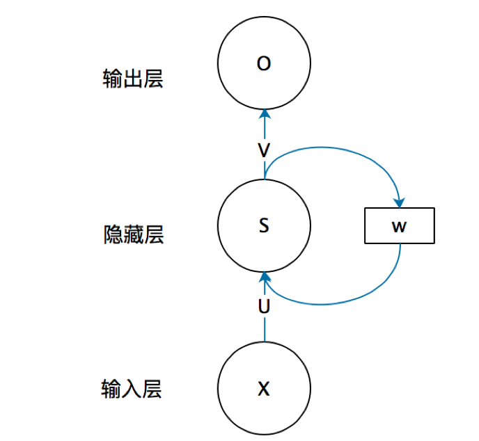
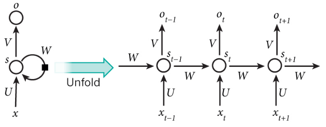
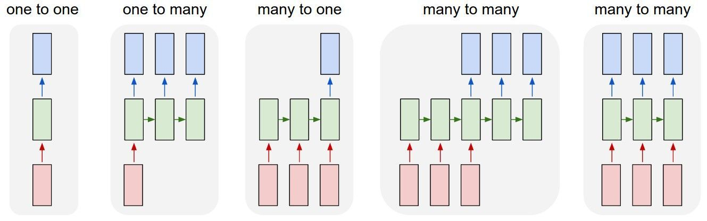

# RNN

## 为什么需要RNN

在普通的全连接神经网络中前一个输入和后一个输入是完全没有关系的。但是，某些任务需要能够更好的处理序列的信息，即前面的输入和后面的输入是有关系的。例如在对于语言的处理中，主谓宾定状补之间具有强烈的序列关系。

以nlp的一个最简单词性标注任务来说，将我 吃 苹果 三个单词标注词性为 我/nn 吃/v 苹果/nn。

那么这个任务的输入就是：

我 吃 苹果 （已经分词好的句子）

这个任务的输出是：

我/nn 吃/v 苹果/nn(词性标注好的句子)

对于这个任务来说，我们当然可以直接用普通的神经网络来做，给网络的训练数据格式了就是我-> 我/nn 这样的多个单独的单词->词性标注好的单词。

但是很明显，一个句子中，前一个单词其实对于当前单词的词性预测是有很大影响的，比如预测苹果的时候，由于前面的吃是一个动词，那么很显然苹果作为名词的概率就会远大于动词的概率，因为动词后面接名词很常见，而动词后面接动词很少见。

与传统的前馈神经网络不同，RNN的核心在于循环连接。这意味着网络能够将先前步骤的信息传递到当前步骤的处理中，从而对序列数据（如句子、时间序列）的顺序依赖性进行建模。

可以将其理解为一个带有“内部状态”的神经网络，这个状态会随着处理序列的每个元素而更新。

## 原理

RNN是一个“闭环”系统，当前的决策会影响到未来的决策。这种结构使其能够处理前后有关联的序列数据。

* **输入 $x$**：在任意时刻，它接收一个外部输入（比如一句话中的一个单词）。
* **输出 $o$**：它产生一个输出。
* **循环连接 (箭头指向自身的弧线)**：这是最关键的部分！它表示这个单元不仅处理当前输入，还会接收**自己在上一个时刻的状态**作为额外的输入。这个“状态”就是它的记忆。

### 在时间上展开

将循环结构沿着时间轴展开，变成了一个链式网络。

让我们分解在时间步 $t$ 发生的事情（其他时间步同理）：

#### **关键组件：**

* $x_{t}$：在时间步 $t$ 的**输入向量**。例如，在自然语言处理中，它可以是句子中第 $t$ 个单词的词向量。
* $s_{t}$：在时间步 $t$ 的**隐藏状态**。这就是RNN的“记忆”。它包含了到当前时间步为止，网络所“见过”的所有历史信息（即 $x_0, x_1, ..., x_t$ ）的摘要。
* $o_{t}$：在时间步 $t$ 的**输出**。它通常基于当前的隐藏状态 $s_t$ 计算得出。

#### **计算过程（信息流）：**

1. **更新记忆（计算新的隐藏状态 $s_t$ ）**：
    这是RNN最核心的一步。新的记忆 $s_t$ 由**当前输入 $x_t$** 和**上一时刻的记忆 $s_{t-1}$** 共同决定。
    $$
    s_t = \text{activation}(U \cdot x_t + W \cdot s_{t-1} + b)
    $$
    * $U$：连接**输入** $x_t$ 到隐藏层的权重矩阵。
    * $W$：连接**上一时刻隐藏状态** $s_{t-1}$ 到当前隐藏层的权重矩阵。
    * $b$：偏置项。
    * `activation`：通常是一个非线性激活函数，如 `tanh` 或 `ReLU`。

    权重矩阵 $U$ 和 $W$ 在所有时间步是**共享的**！这意味着无论处理序列的哪个部分，RNN都使用同一套规则来整合新信息和旧记忆。这极大地减少了模型的参数量，也是RNN能处理任意长度序列的关键。

2. **生成输出（计算 $o_t$ ）**：
    在获得新的记忆 $s_t$ 后，RNN会基于它生成该时间步的输出。

    $$
    o_t = \text{output\_function}(V \cdot s_t + c)
    $$

    * $V$：连接**隐藏状态** $s_t$ 到**输出层**的权重矩阵。
    * $c$：输出层的偏置项。
    * `output_function`：取决于任务。例如，如果是预测下一个单词（分类任务），通常是 `softmax` 函数。

### 反向传播

#### 1. 普通前馈神经网络（DNN/MLP）：**“深度”上的链式法则**

* **结构特点**：数据一层一层地向前传递，层与层之间是严格的层级关系，**没有循环或时间上的依赖**。
* **反向传播**：计算损失函数对某个权重（比如第1层的权重 $W_1$）的梯度时，应用的是**深度方向**的链式法则。梯度信号从输出层**垂直地**反向传播到第1层。

**公式示意（简化）**：
假设一个3层网络：`输入 -> 第1层 -> 第2层 -> 输出`

$$
\frac{\partial L}{\partial W_1} = \frac{\partial L}{\partial \text{输出}} \cdot \frac{\partial \text{输出}}{\partial \text{第2层}} \cdot \frac{\partial \text{第2层}}{\partial \text{第1层}} \cdot \frac{\partial \text{第1层}}{\partial W_1}
$$

**核心**：这是一个**单一的、但可能很长的链式乘法**。梯度需要穿过网络的深度。

#### 2. 循环神经网络（RNN）：**“时间”上的链式法则 + 路径求和**

* **结构特点**：网络在**时间序列**上展开，**同一组权重 $W_{hh}$ 在每个时间步都被重复使用**。当前状态依赖于之前的状态，形成了时间上的依赖链。
* **反向传播（BPTT）**：计算损失函数对共享权重 $W_{hh}$ 的梯度时，情况变得复杂。

**复杂点一：路径求和**
由于 $W_{hh}$ 在 t=1, t=2, t=3 都被使用了，所以最终损失 $L$ 对 $W_{hh}$ 的梯度，**来自于每一条可能路径的贡献之和**。

**复杂点二：时间上的链式法则**
对于其中一条路径（比如从 $t=3$ 的损失 $L_3$ 回溯到 $t=1$ 的 $W_{hh}$），梯度需要沿着**时间轴**反向传播。这形成了一个时间上的链式乘法。

**通用公式**：
对于任意时间步 $t$ 的损失 $L_t$，其对 $W_{hh}$ 的梯度为：

$$
\frac{\partial L_t}{\partial W_{hh}} = \sum_{k=1}^{t} \frac{\partial L_t}{\partial \hat{y}_t} \frac{\partial \hat{y}_t}{\partial h_t} \left( \prod_{j=k+1}^{t} \frac{\partial h_j}{\partial h_{j-1}} \right) \frac{\partial h_k}{\partial W_{hh}}
$$

这个公式中的连乘项 $\prod_{j=k+1}^{t} \frac{\partial h_j}{\partial h_{j-1}}$ 是导致**梯度消失/爆炸**的罪魁祸首。

假设一个3个时间步的序列，总损失 $L = L_1 + L_2 + L_3$。
计算 $\frac{\partial L}{\partial W_{hh}}$ 时，它等于：

$$
\frac{\partial L}{\partial W_{hh}} = \frac{\partial L_1}{\partial W_{hh}} + \frac{\partial L_2}{\partial W_{hh}} + \frac{\partial L_3}{\partial W_{hh}}
$$

我们展开其中最复杂的一项 $\frac{\partial L_3}{\partial W_{hh}}$（它体现了长期依赖）：

$$
\frac{\partial L_3}{\partial W_{hh}} = \underbrace{\frac{\partial L_3}{\partial \hat{y}_3} \frac{\partial \hat{y}_3}{\partial h_3} \frac{\partial h_3}{\partial W_{hh}}}_{\text{Path 1: 只追溯到t=3}} + \underbrace{\frac{\partial L_3}{\partial \hat{y}_3} \frac{\partial \hat{y}_3}{\partial h_3} \frac{\partial h_3}{\partial h_2} \frac{\partial h_2}{\partial W_{hh}}}_{\text{Path 2: 追溯到t=2}} + \underbrace{\frac{\partial L_3}{\partial \hat{y}_3} \frac{\partial \hat{y}_3}{\partial h_3} \frac{\partial h_3}{\partial h_2} \frac{\partial h_2}{\partial h_1} \frac{\partial h_1}{\partial W_{hh}}}_{\text{Path 3: 追溯到t=1}}
$$

追溯的时间越靠前，连乘的项就越多，梯度就越容易指数级衰减到零。

## RNN的多种模型

### 1. One to One（一对一）

**图示**：一个输入（粉色方块） → 一个输出（浅蓝色方块）。

**解释**：这是最简单的结构，也是传统前馈神经网络的模式。**每个输入独立地对应一个输出**，输入之间没有顺序或依赖关系。

**典型应用**：

* **图像分类**：输入一张图片（一个数据样本），输出一个分类标签（例如，“猫”或“狗”）。
* **房价预测**：输入一个房子的特征（面积、位置等），输出一个预测价格。

### 2. One to Many（一对多）

**图示**：一个输入（粉色方块） → 一系列输出（浅蓝色方块）。

**解释**：**给定一个单一的输入，模型需要生成一个完整的序列作为输出**。通常，生成的第一个输出会作为下一个时间步的输入的一部分，如此循环，直到生成序列结束标志。

**典型应用**：

* **图像描述生成**：输入一张图片，模型生成一句描述它的文字（如“一只猫坐在沙发上”）。
* **音乐生成**：输入一个起始音符或一种音乐风格，模型生成一段完整的旋律。

### 3. Many to One（多对一）

**图示**：一系列输入（粉色方块） → 一个输出（浅蓝色方块）。

**解释**：**模型读取整个输入序列后，在最后一个时间步输出一个单一的预测结果**。模型的目标是整合整个序列的信息来做出决策。

**典型应用**：

* **情感分析**：输入一段影评或推文，输出其情感是“正面”还是“负面”。
* **文本分类**：输入一篇文章，输出其主题分类（如“体育”、“科技”）。
* **股价预测**：输入过去N天的股价数据，预测下一天是涨还是跌。

### 4. Many to Many（第二种：编码器-解码器）

**图示**：一个输入序列（粉色方块）先被一个网络（绿色方块，编码器）处理，其最终状态被传递给另一个网络（绿色方块，解码器），再由解码器生成一个输出序列（浅蓝色方块）。

**解释**：这是最强大、最通用的结构，也称为**序列到序列模型**。它分为两个阶段：

1. **编码**：一个RNN（编码器）读取整个输入序列，并将其压缩成一个**上下文向量**（通常就是编码器最后的隐藏状态）。这个向量包含了输入序列的完整语义信息。
2. **解码**：另一个RNN（解码器）以上下文向量为初始状态，开始逐步生成输出序列。

**典型应用**：

* **机器翻译**：输入一个中文句子，输出其对应的英文句子。输入和输出的长度和词汇通常不同。
* **语音识别**：输入一段音频信号序列，输出对应的文字序列。
* **文本摘要**：输入一篇长文章，输出一个简短的摘要。

### 5. Many to Many（第一种：等长输出）

**图示**：输入序列（粉色方块）和输出序列（浅蓝色方块）**长度相等**，并且每个输出在时间上与每个输入对齐。

**解释**：这种结构要求**为输入序列中的每一个元素都产生一个对应的输出**。输入和输出序列的长度是相同的。

**典型应用**：

* **词性标注**：输入一个句子（单词序列），为每个单词输出其词性（名词、动词等）。
* **视频帧级别分类**：输入一段视频的每一帧，为每一帧输出一个活动标签。

### 总结与关系

| 结构类型 | 核心思想 | 经典应用 |
| :--- | :--- | :--- |
| **One to One** | 单一输入，单一输出，无序列性 | 图像分类、房价预测 |
| **One to Many** | 单一输入，激发一个序列 | 图像描述、音乐生成 |
| **Many to One** | 整合序列信息，做出单一判断 | 情感分析、文本分类 |
| **Many to Many (等长)** | 为序列中每个元素打标签 | 词性标注、命名实体识别 |
| **Many to Many (编码器-解码器)** | 将一种序列转换为另一种序列 | 机器翻译、语音识别、文本摘要 |

## 局限性

虽然基础RNN设计巧妙，但它存在著名的**梯度消失/爆炸**问题，导致其难以学习非常长期的依赖关系。这也催生了更强大的变体，如**LSTM（长短期记忆网络）** 和**GRU（门控循环单元）**，它们通过更复杂的“门控”机制来更好地控制记忆的保留和遗忘。

### 为什么会出现梯度消失

梯度消失现象：累乘会导致激活函数导数的累乘，如果取 tanh 或 sigmoid 函数作为激活函数的话，那么必然是一堆小数在做乘法，结果就是越乘越小。随着时间序列的不断深入，小数的累乘就会导致梯度越来越小直到接近于 0，这就是“梯度消失“现象。

同时梯度消失还会导致RNN的短期记忆问题，即越晚的输入影响越大，越早的输入影响越小。

如何解决？

1. 选取更好的激活函数，如 Relu 激活函数。ReLU 函数的左侧导数为 0，右侧导数恒为 1，这就避免了“梯度消失“的发生。但恒为 1 的导数容易导致“梯度爆炸“，但设定合适的阈值可以解决这个问题。

2. 加入 BN 层，其优点：加速收敛.控制过拟合，可以少用或不用 Dropout 和正则。降低网络对初始化权重不敏感，且能允许使用较大的学习率等。

3. 改变传播结构，LSTM 结构可以有效解决这个问题。