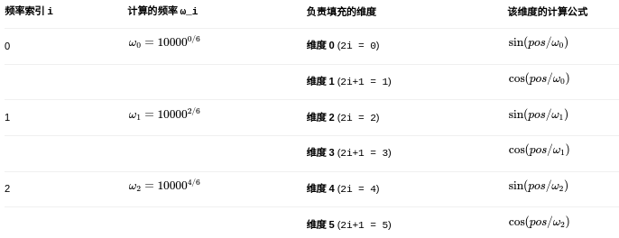
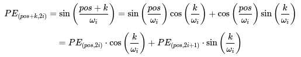
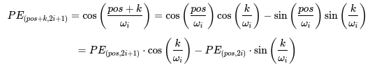
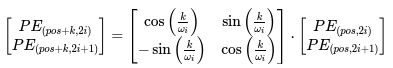
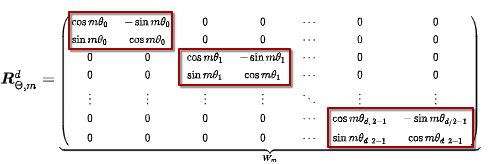
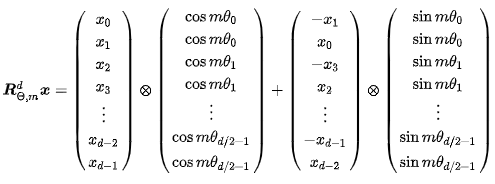

# 位置编码

## 为什么需要位置编码？

Transformer模型的核心​​自注意力机制（Self-Attention）本身是置换不变的​​。这意味着它将输入序列视为一个“词袋”，​​无法感知每个词的位置顺序​​。

例如，对于序列 [我, 爱, 你]和 [你, 爱, 我]，自注意力机制在不添加任何额外信息的情况下，会认为这两个序列是等价的。这显然是错误的。

​位置编码（Position Encoding）就是为了向模型注入序列的顺序信息而存在的。​​ 它告诉模型：“这个词是序列中的第几个词”。
相对位置编码与绝对位置编码

## 正余弦位置编码

对于偶数维度有：

$$
PE_{(pos, 2i)} = \sin\left(\frac{pos}{10000^{2i/d_{\text{model}}}}\right)
$$

对于奇数维度有：

$$
PE_{(pos, 2i+1)} = \cos\left(\frac{pos}{10000^{2i/d_{\text{model}}}}\right)
$$

根据三角函数的和角公式

* pos：单词在序列中的绝对位置（例如，句子中的第一个词 pos=0，第二个词 pos=1，依此类推）。
* d_model：单个词向量的维度（也是位置编码的维度），在原始论文中为512。
* i：用于遍历维度的索引。因为正弦和余弦函数是交替使用的，所以 i的取值范围是 0到 d_model/2 - 1。这意味着公式实际上生成了 d_model维的向量。

计算过程如下：

为什么选择正余弦？

**核心原因：为模型注入相对位置信息与外推能力**

这是最根本、最巧妙的原因。正弦/余弦函数的周期性及其数学性质，使编码不仅能表示  绝对位置，还能天然地编码相对位置关系。

相对位置的线性表示：对于任意固定的偏移量 k，PE(pos + k)可以表示为 PE(pos)的一个线性函数（通过一个旋转矩阵）。

数学推理：

根据三角函数的和角公式  ：

$$
\sin(\alpha + \beta) = \sin\alpha\cos\beta + \cos\alpha\sin\beta
$$

$$
\cos(\alpha + \beta) = \cos\alpha\cos\beta - \sin\alpha\sin\beta\
$$

令 $\beta = \frac{k}{\omega_i}$ 我们可以得到：

对于偶数维度（2i）：

对于奇数维度（2i+1）：

上面的推导表明， PE(pos + k)向量中的每一个元素，都可以表示为 PE(pos)向量中两个对应元素的线性组合  。我们可以将其写为矩阵形式。对于每一对奇偶维度 (2i, 2i+1)，存在一个线性变换矩阵

我们可以将其写为矩阵形式。对于每一对奇偶维度 (2i, 2i+1)，存在一个线性变换矩阵

对模型的好处：

**唯一性和确定性：每个位置都有独一无二的编码**

正弦/余弦函数是周期性的，但通过精心选择一系列不同的频率（通过分母项 10000^{2i/d_model}实现），可以确保在一个非常长的序列范围内，  每个位置都对应一个独一无二的编码向量。

**对序列长度的无偏性**  

可学习的位置编码会受到训练数据中序列长度分布的影响。例如，如果训练数据中长序列很少，模型对长位置编码的学习就会很差。

正弦/余弦编码是 预先定义的数学规律 ，它对所有位置一视同仁，不存在对训练数据中某种长度序列的偏好，更加客观和无偏。

**计算高效与无需额外参数**

* 无需训练：位置编码在模型开始训练前就已固定计算好，  不引入任何需要训练的参数  。这简化了训练过程。
* 计算简单  ：虽然公式看起来复杂，但计算正弦/余弦函数对现代计算硬件（CPU/GPU）来说是极其快速和高效的操作。

## RoPE位置编码​

### 正余弦位置编码的缺陷

正弦函数的性质使得：

$$\sin(a + b) = \sin a \cos b + \cos a \sin b$$

所以：

$$PE(pos + k) = R(k) \cdot PE(pos)$$

其中 ( R(k) ) 是一个旋转矩阵（由 $cos(k/...)$ 和 $sin(k/...)$ 组成）。

从数学上讲：

“绝对位置编码”中已经**隐含**了相对位置的信息（通过旋转关系）。

但是问题在于：**模型本身不会自动去“解码”这种关系**

虽然：

$$PE(pos+k) = R(k) \cdot PE(pos)$$

但是标准注意力计算：

$$
Q_i = x_i W_Q + PE(i) \
K_j = x_j W_K + PE(j)
$$

$$
\text{Attention}(i,j) = Q_i^T K_j
$$

中的位置编码是**通过加法混入输入向量**的，
即：

> 模型得到的是 “语义 + 位置” 混合向量，
> 但并没有显式的几何操作去“感知偏移量 k”。

所以，模型要靠训练数据 **“学会”如何从正弦编码中恢复相对位置信息**，这既不直观也不稳定。在长序列外推时表现会显著退化。

而 RoPE 所做的则是将这样隐式的关系从幕后拉到台前。

### RoPE的实现

在RoPE中位置编码与token embedding的组合不再是通过直接相加的形式呈现，而是改为了在 token embedding 的基础上，按照 token 的位置信息进行旋转。

RoPE 的核心思想：

1. 将 embedding 划分成若干 2D 维度对（每对维度看作一个二维向量）。
2. 对每个二维向量施加 **旋转矩阵**，旋转角度与 token 的位置相关。
3. 在计算自注意力时，这种旋转使得 Q·K^T 可以自然产生相对位置信息。

#### 向量旋转的直觉

在二维空间中，一个旋转操作可以用复数表示： $z'= z \cdot e^{i\theta}$

RoPE 把 embedding 的相邻维度看作一对二维坐标（cos/sin 分量），每个位置都对应一个**旋转角度** θ，与位置成正比。

$$text{RoPE}(Q_i) = Q_i \odot e^{i\theta \cdot i}, \quad \text{RoPE}(K_j) = K_j \odot e^{-i\theta \cdot j}$$

欧拉公式：

$$e^{i\theta \cdot i} = \cos(i\theta) + i\sin(i\theta)$$
$$e^{-i\theta \cdot j} = \cos(j\theta) - i\sin(j\theta)$$

#### 计算过程

对于每个 token embedding $x \in \mathbb{R}^{d}$，假设 token embedding 维度 ( d = 8 )

那就有 4 组二维坐标: $(x_0, x_1)$, $(x_2, x_3)$, $(x_4, x_5)$, $(x_6, x_7)$

对于第 (i) 组（即 $(x_{2i}, x_{2i+1})$）：

$$\begin{bmatrix}
x'*{2i} \\
x'*{2i+1}
\end{bmatrix}
=\begin{bmatrix}
\cos p\theta_i & -\sin p\theta_i \\
\sin p\theta_i & \cos p\theta_i
\end{bmatrix}
\begin{bmatrix}
x_{2i} \\
x_{2i+1}
\end{bmatrix}
$$

* $p\theta_i = \text{position} / 10000^{2i/d}$，对于位置 $p$，旋转角为 $p\cdot \theta_i$
* `position` 是 token 的绝对位置
* d 是 embedding 维度可以理解为 $d = \text{token embedding 的维度} = \text{Transformer 每个 token 的 hidden size}$

最终得到 ：

$$
\text{RoPE}(x_p) =
\begin{bmatrix}
x_{p,2i} \cos(p \theta_i) - x_{p,2i+1} \sin(p \theta_i) \\
x_{p,2i} \sin(p \theta_i) + x_{p,2i+1} \cos(p \theta_i)
\end{bmatrix}
$$

这样就得到了 **旋转后的 embedding** (x')，再参与自注意力计算。在QKV的计算中，就会天然的出现这种关系。

#### 相对位置关系的自然出现

注意力计算：

$$Q_i^T K_j$$

在加入 RoPE 后变成：

$$(\text{RoPE}(Q_i))^T (\text{RoPE}(K_j))$$

代入上面的旋转形式后，会出现 **角度差项**：

$$Q_i^T K_j \propto \cos((i - j)\theta)$$

在自注意力机制中，$Q^T$ 与K计算的结果中也包含了相对位置信息。

### 从二维推广到多维

#### 分块旋转

假设 embedding 维度为 (d)，
那么我们可以把它分成 (d/2) 个二维子空间：

$$x = [x_0, x_1, x_2, x_3, \dots, x_{d-2}, x_{d-1}]$$

RoPE 对每一对子空间 $(x_{2i}, x_{2i+1})$ 都进行独立旋转后在进行拼接。

如图中每两个维度为一组，则有如下旋转矩阵：

但是由于的稀疏性，直接使用矩阵乘法实现起来会很浪费算力，因此使用以下方式来实现。

