# 卷积神经网络

卷积神经网络是深度学习的架构，专为处理​​网格状数据​​（如图像、视频、语音）而设计。

## 为什么需要卷积神经网络

### 图像原理

图像在计算机中是一堆按顺序排列的数字，数值为0到255。0表示最暗，255表示最亮。 如下图：

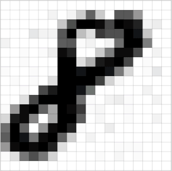

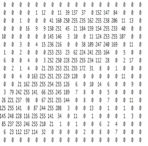

对于一张现代的彩色图像，会使用红黄蓝以不同的比例相加来产生不同颜色的光。在RAG颜色模型中，会将单个矩阵扩展成一组有序排列的三个矩阵，也可以用三维张量来理解。每个矩阵代表一个颜色，矩阵中的每一个数组代表一个颜色的比例。将这样三个矩阵叠加就能展示出不同的颜色。

其中每一个矩阵又叫做这个图片的一个channel，使用宽、高、深来描述。

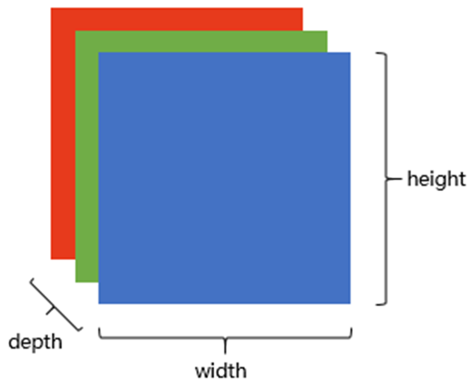

### 全连接神经网络的缺陷

在传统的神经网络中，若要识别下面红框中的图像，在全连接神经网络中会将全部的点摊开去进行计算，这样无法感知到他们的形状和位置。因此也无法分别他们都是哪一类物体。

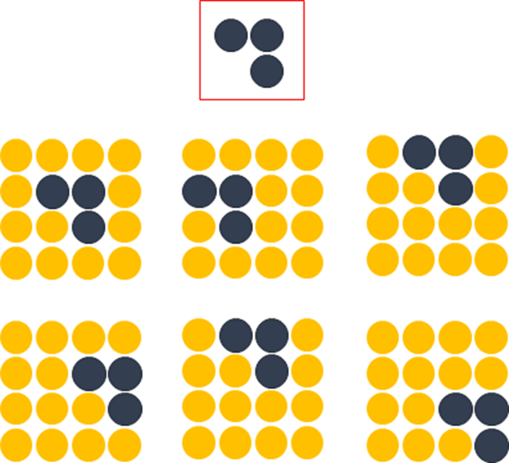 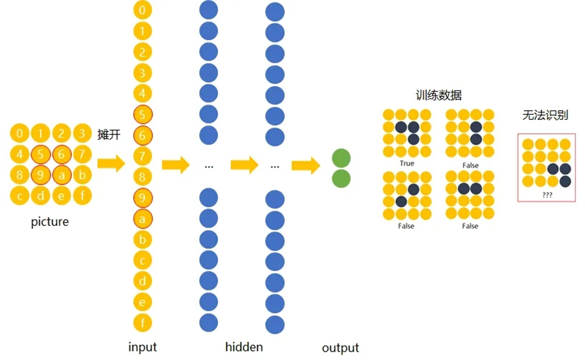

我们希望一个物体不管在画面左侧还是右侧，都会被识别为同一物体，这一特点就是不变性。为了实现平移不变性，卷积神经网络（CNN）等深度学习模型在卷积层中使用了卷积操作，这个操作可以捕捉到图像中的局部特征而不受其位置的影响。

还有根据我们上文中所提到的成像原理，在一张图片中会包含大量的像素点，过多的参数也会导致训练难度的增加，容易出现过拟合的现象。

因此我们需要新的算法来避免这些问题。

## 卷积神经网络的特点

与常规神经网络不同，卷积神经网络的各层中的神经元是3维排列的：宽度、高度和深度。

对于输入层来说，宽度和高度指的是输入图像的宽度和高度，深度代表输入图像的通道数，例如，对于RGB图像有R、G、B三个通道，深度为3；而对于灰度图像只有一个通道，深度为1。

对于中间层来说，宽度和高度指的是特征图(feature map)的宽和高，通常由卷积运算和池化操作的相关参数决定；深度指的是特征图的通道数，通常由卷积核的个数决定。

全连接神经网络中的主要运算为矩阵相乘，而卷积神经网络中主要为卷积计算。

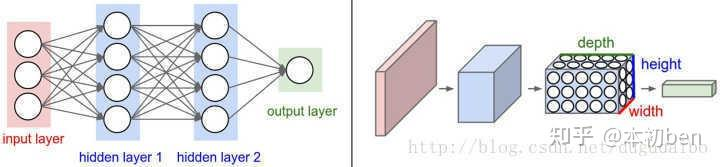

## 卷积运算

卷积运算是一种​​高效的局部特征提取方式​​。通过​​滑动窗口​​和​​参数共享​​的机制，它能够从输入数据中有效地提取出有意义的空间层次特征，同时保持​​平移不变性​​并​​极大地减少参数数量​​。

### 数学定义

在数学中，两个函数  f  和  g  的卷积是一种积分变换，定义为：

$$(f * g)(t) = \int_{-\infty}^{\infty} f(\tau) g(t - \tau) \, d\tau$$

这个积分可以理解为:

1. 翻转：将函数$g(\tau)$ 翻转为$g(-\tau)$
2. 平移：将翻转后的函数平移  t  个单位，得到$g(t - \tau)$
3. 相乘：计算 $f(\tau)$ 与 $g(t - \tau)$ 的乘积
4. 积分：对乘积结果进行积分，得到卷积在 t 处的值

在离散情况下（如图像处理），卷积定义为：

$$(f * g)[n] = \sum_{m = -\infty}^{\infty} f[m] g[n - m]$$

在二维离散卷积（图像处理）中，公式为：

$$(I * K)(i, j) = \sum_{m} \sum_{n} I(i - m, j - n) K(m, n)$$

但更常用的形式是互相关，这实际上是深度学习中的"卷积"：

$$(I * K)(i, j) = \sum_{m} \sum_{n} I(i + m, j + n) K(m, n)$$

满足以下数学性质：

|性质| 数学表达| 意义
|---|---|---|
|线性 | $(a f + b g) h = a(f  h) + b(g * h)$ |满足叠加原理
|交换律|fg = gf|卷积核与输入可交换
|结合律 | $ (f  g)  h = f  (g  h)$ |多个卷积可组合
|平移不变 | $ f(x - a)  g(x) = (f  g)(x - a)$ |平移输入，输出也平移

卷积运算从数学上看是一种滑动窗口的加权求和操作，具有以下关键特点：

1. 线性操作：输出是输入的线性组合
2. 局部连接：每个输出只与局部输入相关
3. 权重共享：相同的卷积核在整个输入上滑动使用
4. 平移等变：输入平移，输出相应平移


这些数学特性使得卷积非常适合处理图像等网格化数据，能够有效捕捉局部特征同时大幅减少参数数量。

### 卷积运算的矩阵表示

设输入矩阵  I  为 3×3，卷积核  K  为 2×2：

$$I = \begin{bmatrix}
i_{11} & i_{12} & i_{13} \\
i_{21} & i_{22} & i_{23} \\
i_{31} & i_{32} & i_{33}
\end{bmatrix}, \quad
K = \begin{bmatrix}
k_{11} & k_{12} \\
k_{21} & k_{22}
\end{bmatrix}$$

卷积计算过程（步长=1，无填充）：

输出矩阵  O  的每个元素计算如下：

$$O_{11} = i_{11}k_{11} + i_{12}k_{12} + i_{21}k_{21} + i_{22}k_{22}$$
$$O_{12} = i_{12}k_{11} + i_{13}k_{12} + i_{22}k_{21} + i_{23}k_{22}$$
$$O_{21} = i_{21}k_{11} + i_{22}k_{12} + i_{31}k_{21} + i_{32}k_{22}$$
$$O_{22} = i_{22}k_{11} + i_{23}k_{12} + i_{32}k_{21} + i_{33}k_{22}$$

最终输出：

$$O = \begin{bmatrix}
O_{11} & O_{12} \\
O_{21} & O_{22}
\end{bmatrix}$$

### 通用计算公式

对于任意尺寸的输入和卷积核，输出尺寸公式为：

无填充情况：

$$\text{输出高度} = \left\lfloor \frac{H_{\text{in}} - H_{\text{kernel}}}{\text{stride}} \right\rfloor + 1$$
$$\text{输出宽度} = \left\lfloor \frac{W_{\text{in}} - W_{\text{kernel}}}{\text{stride}} \right\rfloor + 1$$

有填充情况（填充p圈）：

$$\text{输出高度} = \left\lfloor \frac{H_{\text{in}} + 2p - H_{\text{kernel}}}{\text{stride}} \right\rfloor + 1$$
$$\text{输出宽度} = \left\lfloor \frac{W_{\text{in}} + 2p - W_{\text{kernel}}}{\text{stride}} \right\rfloor + 1$$

其中：

* $H_{\text{in}}, W_{\text{in}}$ ：输入高度和宽度
* $H_{\text{kernel}}, W_{\text{kernel}}$ ：卷积核高度和宽度
* stride：步长
* p：填充圈数
* $\left\lfloor \cdot \right\rfloor$ ：向下取整

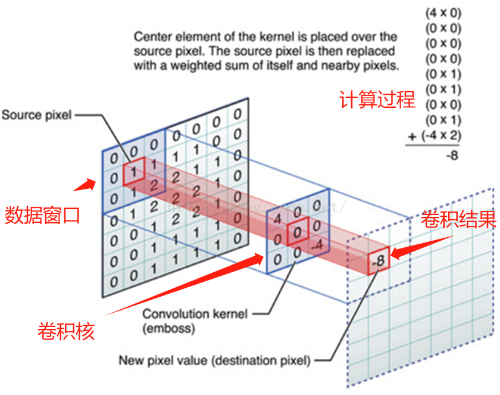

### 多通道卷积的数学表达

对于多通道输入（如RGB图像），卷积运算扩展为：

设输入I为 $C_{\text{in}} \times H \times W$，卷积核 K 为 $C_{\text{in}} \times H_k \times W_k$，输出为 1 $\times H_{\text{out}} \times W_{\text{out}}$ ：

$$O(i, j) = \sum_{c=1}^{C_{\text{in}}} \sum_{m=1}^{H_k} \sum_{n=1}^{W_k} I(c, i\cdot s + m, j\cdot s + n) \cdot K(c, m, n) + b$$

其中：
* s ：步长
* b ：偏置项

如果要得到多个特征图（ $C_{\text{out}}$  个），就需要  $C_{\text{out}}$ 个不同的卷积核：

$$O(k, i, j) = \sum_{c=1}^{C_{\text{in}}} \sum_{m=1}^{H_k} \sum_{n=1}^{W_k} I(c, i\cdot s + m, j\cdot s + n) \cdot K(k, c, m, n) + b(k)$$

**具体数值示例**

输入矩阵：

$$I = \begin{bmatrix}
1 & 2 & 3 & 4 \\
5 & 6 & 7 & 8 \\
9 & 10 & 11 & 12 \\
13 & 14 & 15 & 16
\end{bmatrix}$$

卷积核：

$$K = \begin{bmatrix}
1 & 0 \\
-1 & 2
\end{bmatrix}$$

计算过程（步长=1，无填充）：

左上角位置 $(0,0)$：

$$1\times1 + 2\times0 + 5\times(-1) + 6\times2 = 1 + 0 - 5 + 12 = 8$$

位置 $(0,1)$：

$$2\times1 + 3\times0 + 6\times(-1) + 7\times2 = 2 + 0 - 6 + 14 = 10$$

位置 $(1,0)$：

$$5\times1 + 6\times0 + 9\times(-1) + 10\times2 = 5 + 0 - 9 + 20 = 16$$

位置 $(1,1)$：

$$6\times1 + 7\times0 + 10\times(-1) + 11\times2 = 6 + 0 - 10 + 22 = 18$$

最终输出：

$$O = \begin{bmatrix}
8 & 10 \\
16 & 18
\end{bmatrix}$$

在卷积神经网络中，对于输入的图像，需要多个不同的卷积核对其进行卷积，来提取这张图像不同的特征（多核卷积）

同时也需要多个卷积层进行卷积，来提取深层次的特征（深度卷积）。

**CNN学习的是公式中的哪些部分？**

卷积核的权重 K：这些数值在训练开始时是​​随机初始化​​的，通过反向传播算法不断调整，最终收敛到能够检测特定特征的数值。

偏置项​​ $b(k)$：每个卷积核对应一个偏置项，也是通过训练学习的。主要用来调整激活函数的阈值，增加模型的灵活性。

### 卷积的种类

#### 深度卷积

标准卷积中每个卷积核都需要与feature map的所有通道进行计算。而深度卷积则是给每一个通道都分配了一个卷积核。

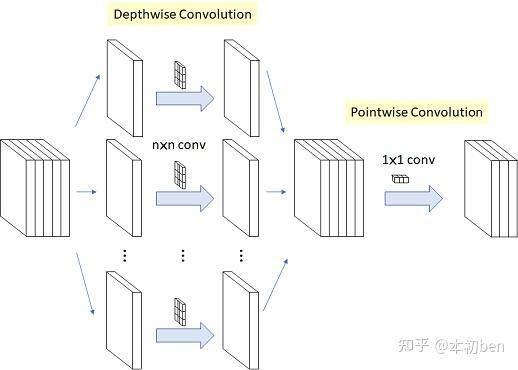

这样做的好处是减少了参数的数量同时也会使得计算量降低。

同时分解了的卷积过程​​，先学空间特征，再学通道特征，符合特征学习的自然层次

#### 空洞卷积

空洞卷积也叫扩张卷积或者膨胀卷积，是针对图像语义分割问题中下采样会降低图像分辨率、丢失信息而提出的一种卷积思路。

空洞卷积有两种理解，一是可以理解为将卷积核扩展，如图下图卷积核为3×3，但是这里将卷积核变为5×5，即在卷积核每行每列中间加0。

二是理解为在特征图上每隔1行或一列取数与3×3卷积核进行卷积。通过间隔取值扩大感受野，让原本3x3的卷积核，在相同参数量和计算量下拥有更大的感受野。

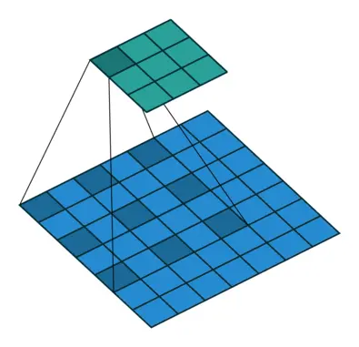

#### 转置卷积

正向传播时乘以卷积核的转置矩阵，反向传播时乘以卷积核矩阵，由卷积输出结果近似重构输入数据

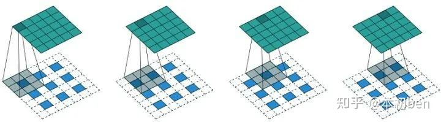

#### 可变卷积

以上的卷积计算都是固定的，每次输入不同的图像数据，卷积计算的位置都是完全固定不变，即使是空洞卷积/转置卷积，0填充的位置也都是事先确定的。而可变形卷积是指卷积核上对每一个元素额外增加了一个h和w方向上偏移的参数，然后根据这个偏移在feature map上动态取点来进行卷积计算，这样卷积核就能在训练过程中扩展到很大的范围。而显而易见的是可变性卷积虽然比其他卷积方式更加灵活，可以根据每张输入图片感知不同位置的信息，类似于注意力，从而达到更好的效果。

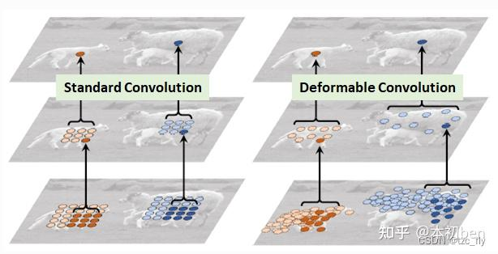

在上面这张图里面，左边传统的卷积显然没有提取到完整绵羊的特征，而右边的可变形卷积则提取到了完整的不规则绵羊的特征。

### 权值共享

在卷积运算中采用权值共享可以有效减少需要求解的参数。权值共享是基于这样的一个合理的假设：如果一个特征在计算某个空间位置 (x1,y1)(x1,y1) 的时候有用，那么它在计算另一个不同位置 (x2,y2)(x2,y2) 的时候也有用。通俗地来讲，在一个卷积核在和一个n通道的特征图（为方便理解，这里可以暂时理解为3通道的RGB输入图像）进行卷积运算时，可以看作是用这个卷积核作为一个滑块去“扫”这个特征图，卷积核里面的数就叫权重，这个特征图每个位置是被同样的卷积核“扫”的，所以权重是一样的，也就是共享。

## 卷积神经网络的尺寸

### 网络宽度

在 CNN（Convolutional Neural Network）中：

宽度（width）指的是在某一层中并行存在的特征通道数（feature maps / channels）。

也可以理解为：

一层能同时学习到多少种不同的特征模式。

---

举个直观例子：

假设输入是一张彩色图片：

* 尺寸：`32 × 32 × 3`
* 这里的 `3` 就是通道数（RGB 三个通道）
* 这就是输入层的“宽度”= 3

再看第一层卷积层：

```
Conv1: 32个卷积核 (kernel size = 3x3)
```

输出特征图就会是：

```
32 × 32 × 32
```

此时：

* 每个卷积核学到一种不同的“特征检测模式”（比如水平边缘、垂直边缘、圆形结构等）
* 所以该层的 **宽度 = 32**

### 网络深度

深度（Depth） = 模型中可学习的层（learnable layers） 的数量。

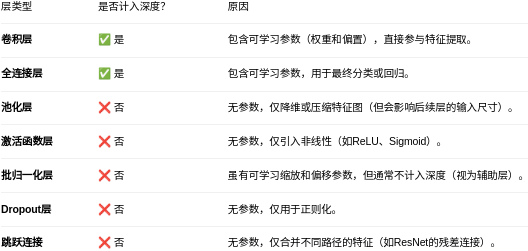

深度太深的优点与缺点：

1. 深度带来的好处​​
   * 更强的表达能力​​：更深的网络可以学习更复杂、更抽象的特征层次。
       * 浅层：边缘、颜色。
       * 中层：纹理、部件。
       * 深层：物体、场景。
    * ​性能提升​​：在ImageNet等复杂数据集上，更深的网络通常准确率更高。
2. 深度过大的危害（深度 > 某个临界值）​​当网络深得过分时，会出现反效果：

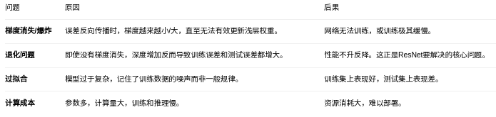

如何解决深度过大问题？

​​架构创新​​：

* ResNet的跳跃连接​​：让梯度可以直接“跳过”一些层，缓解梯度消失。
* ​批量归一化​​：稳定每一层的输入分布，加速训练并缓解梯度问题。

​​正则化技术​​：
* Dropout​​：随机关闭神经元，防止过拟合。
* 权重衰减​​：惩罚大的权重值。

​​神经架构搜索（NAS）​​：

* ​自动寻找最优深度​​：让算法自动搜索和评估不同深度（模块数）的架构，找到在特定任务和数据集上的最佳平衡点。这就是为什么这段话说NAS中“模块深度”的概念更频繁。

## 卷积神经网络的组成

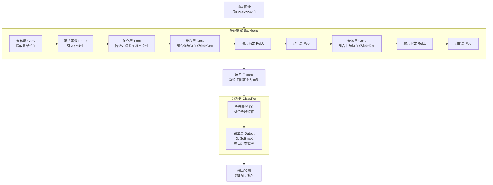

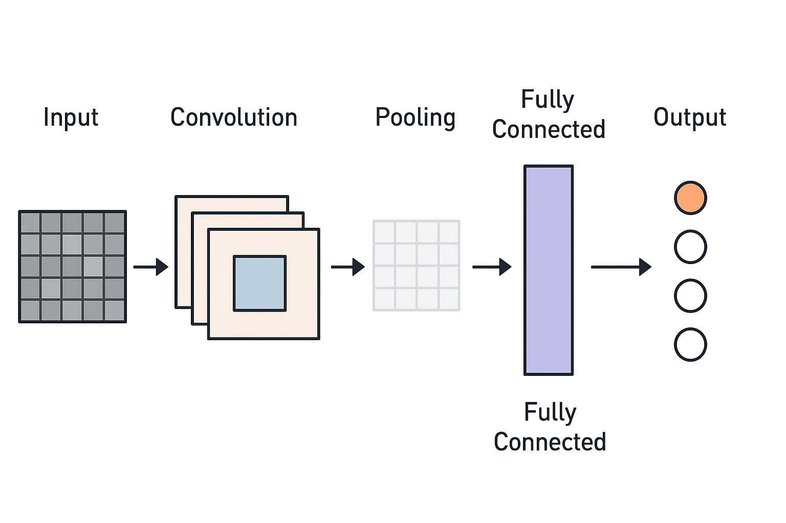

### 卷积层 (Convolutional Layer)

使用一组卷积核（滤波器）在输入数据上滑动，以识别局部特征。

这是CNN最核心、最独特的组成部分，负责提取输入数据中的局部特征。

​​功能​​：通过​​滤波器（卷积核）​​ 在输入上滑动，进行局部特征检测。

​​关键机制​​：

* ​局部连接​​：每个神经元只连接输入的一小块区域（感受野），符合图像局部性原理。
* 权重共享​​：同一个滤波器在整个输入上共享参数，极大减少参数量。
* 输出​​：​​特征图​​，每个特征图对应一种特定特征的响应（如边缘、纹理）。

```
输入窗口：    卷积核权重：    计算过程：
[1, 2]        [0.1, 0.2]     1×0.1 + 2×0.2 + 3×0.3 + 4×0.4
[3, 4]        [0.3, 0.4]     = 0.1 + 0.4 + 0.9 + 1.6 = 3.0
```

### Batch Normalization（BN）层

BN层通常添加在每个神经网络层和激活层之间，对神经网络层输出的数据分布进行统一和调整，变成均值为0方差为1的标准正态分布,使输出位于激活层的非饱和区，达到加快收敛的效果。

#### BN 层在 CNN 中的位置

在卷积神经网络中，BN 层通常出现在以下两种常见位置：

**经典位置（原论文推荐）**

> **Conv → BN → ReLU**

也就是：

1. 先进行卷积计算
2. 对卷积输出进行批归一化（BN）
3. 再经过激活函数（如 ReLU）

这也是目前主流实现（ResNet、VGG、EfficientNet 等）采用的顺序。

另一种变体（较少使用）

> **BN → Conv → ReLU**
> 或者
> **Conv → ReLU → BN**

这两种一般只在特殊研究或归一化实验中使用。

但标准做法仍然是：

> ✅ **卷积 → BN → 激活**

#### 为什么 BN 层放在卷积层后、激活前？

BN 层的作用是：

> 将每一层的输入标准化为「均值接近0、方差接近1」。

如果我们放在卷积层之后、激活函数之前，那么：

* 能防止卷积输出在进入激活函数前过大或过小；
* 避免 ReLU 饱和（全0输出）；
* 稳定梯度的分布，防止梯度爆炸或消失。

举个例子：

假设卷积层输出是：

$$y = W * x + b$$

BN 层对其标准化：

$$\hat{y} = \frac{y - \mu_B}{\sqrt{\sigma_B^2 + \epsilon}}$$

再通过可学习参数调整：

$$y_{BN} = \gamma \hat{y} + \beta$$

最后经过 ReLU 激活：

$$z = ReLU(y_{BN})$$

这样每一层的输入都保持在稳定分布区间内，梯度传播就平稳得多。

#### 为什么 CNN 特别适合用 BN

**1️.卷积层的输出天然有批次结构（Batch）**

CNN 的输入往往是一批图片（batch of images），每个卷积核在不同图片、不同空间位置的输出都可以看成一个样本。

因此：

* BN 可以在一个 batch 内，统计大量样本的均值和方差；

* 统计量稳定、鲁棒性强。这对 CNN 非常自然、效果极好。

**2.BN 保持了空间结构不变**

在卷积层中，BN对每个通道独立地进行归一化：

* 所有空间位置（H×W）共用同一组$μ,σ$，不破坏空间相关性。

* 而像 LayerNorm 是对每个样本的所有特征点归一化，会破坏 CNN 的空间特性。

BN 与卷积的「通道独立性」完美契合。

#### BN 的局限

小 batch 时不稳定：统计量不准确；

推理阶段（inference）要使用滑动平均统计量；

在序列模型（RNN、Transformer）中效果差。

### 激活函数

卷积层后立即使用激活函数，使网络能够学习复杂的非线性模式。对卷积输出进行非线性变换，增加模型表达能力。

​​ReLU​​：最常用，计算简单，缓解梯度消失。f(x) = max(0, x)

​​Sigmoid/Tanh​​：常用于输出层，将值压缩到特定范围。

### 池化层 (Pooling Layer)

对卷积层输出的特征图进行下采样，以减小特征图的空间维度，降低计算量和模型对平移、形变的敏感度。

普通池化操作常见的有最大池化(Max Pooling)和平均池化(Mean Pooling)。 其中，最常用的是最大池化，最常见的形式是使用尺寸2x2的滤波器，以步长为2来对每个深度切片进行降采样，将其中75%的激活信息都丢掉。对更大感受野进行池化需要的池化尺寸也更大，而且往往对网络有破坏性。平均池化历史上比较常用，但是现在已经很少使用了。因为实践证明，最大池化的效果比平均池化要好。尺寸为2×2、步长为2的最大池化核平均池化的示例如下图所示：


### 全连接层 (Fully Connected Layer)

全连接层（FC Layer）就是根据卷积层提取到的特征组合，学习“哪些特征模式代表某个类别”。

前面的 卷积层 + 池化层 已经把图片的内容提取成了一组“特征数值”，例如：

| 特征 | 含义（举例）  | 数值  |
| -- | ------- | --- |
| f₁ | 有没有边缘   | 0.9 |
| f₂ | 有没有圆形   | 0.7 |
| f₃ | 有没有耳朵尖角 | 0.8 |
| f₄ | 有没有胡须纹理 | 0.6 |

这些特征本身不告诉你是什么物体，它们只是“视觉描述”。

全连接层要做的就是：根据这些特征的组合模式，判断出最终类别。

比如：

| 类别   | 判断依据（FC层权重学到的）        |
| ---- | --------------------- |
| 🐱 猫 | f₂高 + f₃高 + f₄中等      |
| 🐶 狗 | f₁高 + f₂低 + f₃低 + f₄高 |
| 🐦 鸟 | f₁低 + f₂中 + f₃低       |

#### 数学原理

全连接层计算公式：

$$y = W x + b$$

* $x$：前一层的特征（flatten 展平后的特征向量）
* $W$：权重矩阵，控制每个特征在不同类别中的“重要性”
* $b$：偏置
* $y$：每个类别的“得分”

训练时，通过反向传播不断调整 (W) 和 (b)，让模型“学会”：

* 哪些特征组合代表“猫”
* 哪些特征组合代表“狗”
* 哪些特征组合代表“鸟”

最后经过 **Softmax**：

$$p_i = \frac{e^{y_i}}{\sum_j e^{y_j}}$$

得到每个类别的概率。

## 卷积神经网络中的其他技术

### 上采样与下采样

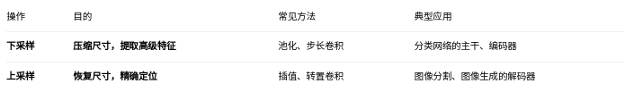

#### 上采样
​​
上采样，也称为​​上采样​​，其核心目标是​​增大特征图的尺寸（宽和高）​​，恢复空间细节。

​​为什么要上采样？​​

​​恢复空间分辨率​​：为了完成像​​图像分割​​（每个像素都需要分类）、​​图像生成​​（输出全尺寸图像）等任务，必须将压缩后的特征图恢复到原始输入尺寸。

​​精确定位​​：下采样会丢失位置信息，上采样可以帮助模型重建目标的精确轮廓和位置。

​如何实现上采样？​​

​​插值法​​：简单且常用，没有可学习参数。
* ​最近邻插值​​：直接复制最邻近像素的值。速度快，但边缘可能锯齿状。
* ​双线性插值​​：使用相邻4个像素的加权平均值。效果更平滑。nn.Upsample(scale_factor=2, mode='bilinear')

​​转置卷积​​：也称为反卷积。这是一种可学习的上采样方法，通过训练来学习如何最好地放大特征图。nn.ConvTranspose2d(...)

​​上采样+卷积​​：先使用插值法放大尺寸，再接一个普通卷积层进行细化。这是U-Net等架构中的常见做法。

#### 下采样

下采样，也称为​​降采样​​，其核心目标是​​缩小特征图的尺寸（宽和高）​​。

​​为什么要下采样？​​

1. ​​增大感受野​​：让更深层的神经元能够“看到”原始图像中更大范围的区域，从而理解更复杂的模式和全局上下文。
2. 减少计算量​​：特征图尺寸变小，后续层的计算复杂度和内存消耗大幅降低。
3. 防止过拟合​​：减少参数数量，使模型更关注显著特征，增强泛化能力。
4. 提取抽象特征​​：逐步忽略细节和位置信息，学习更高级、更语义化的特征。

如何实现下采样？​​

​​池化层​​：最经典的方法。

* 最大池化​​：取窗口内的最大值。nn.MaxPool2d(kernel_size=2, stride=2)是最常用的，直接将尺寸减半。
* ​平均池化​​：取窗口内的平均值。

步长卷积​​：使用步长大于1的卷积层。nn.Conv2d(..., stride=2)在卷积的同时实现下采样，是现代网络更常用的方式。

### Dropout

Dropout是指在深度学习网络的训练过程中，对于神经网络单元，按照一定的概率将其暂时从网络中丢弃。注意是暂时，对于随机梯度下降来说，由于是随机丢弃，故而每一个mini-batch都在训练不同的网络。当进行测试和推理时，Dropout将不起作用。

#### 为什么需要 Dropout

在训练神经网络时：

* 模型参数太多（比如全连接层几百万参数）
* 训练数据有限

  → 网络容易“记住训练样本”，而不是“学习规律”

  → 表现为：训练集准确率高，验证集/测试集准确率低

这就叫 **过拟合（Overfitting）**。

#### Dropout 的核心思想

> 在每一次训练迭代中，**随机“丢弃”一部分神经元（让它们临时不工作）**。

比如：

* 原本某一层有 100 个神经元；
* Dropout 比例是 0.5；
* 那么在每次前向传播时，会随机让约 50 个神经元输出设为 0，不参与计算。

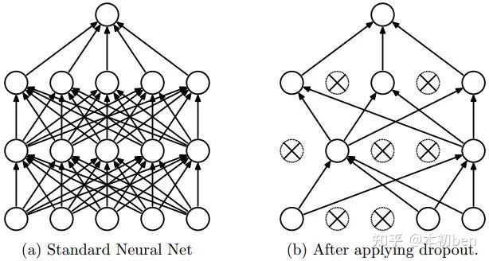

##### 训练阶段 (Training)

公式：

$$\tilde{x} = x \odot m$$

含义：

* $x：输入向量（可以是某一层的输入或者前一层输出）。
* $m \sim \text{Bernoulli}(p)$：掩码向量（mask），每个元素独立服从伯努利分布。
  * 伯努利分布意味着每个元素有概率 (p) 保留（取 1），概率 (1-p) 丢弃（取 0）。
* $\odot$：按元素相乘（Hadamard 乘积）。
* $\tilde{x}$：经过 Dropout 后的输入。

换句话说，训练时 **随机丢弃一部分神经元的输出**，避免网络过拟合。

然后再计算：

$$y = f(W \tilde{x})$$

* $W$：权重矩阵
* $f$：激活函数
* $\tilde{x}$：已经做过 Dropout 的输入
* $y$：当前层的输出

##### 推理阶段 (Inference / Testing)

公式：

$$y_\text{test} = f(W(px))$$

* 推理时不再随机丢弃神经元，而是用 **保留概率 (p) 缩放** 输入：

  * 因为训练时平均每个神经元只有 (p) 的概率被保留，所以推理时要乘上 (p) 来保持期望一致。
* 这样就可以直接使用整个网络而不丢弃任何神经元，同时保证输出的尺度（期望值）和训练时一致。

### 注意力机制

“注意力（Attention）” 在卷积神经网络（CNN）中是一种 让模型自动学习「关注重点区域」的机制。它的本质是：让网络学会“分配权重”，告诉模型哪些空间位置或通道更重要。

注意力模块（如 SE、CBAM、ECA）的位置是：“卷积之后，对特征图重新加权，再送入下一层”

也就是说它：

* 不改变卷积层本身；
* 作用在卷积层的输出特征图上；
* 通常只有一些轻量的操作（池化、1×1卷积、逐元素乘等）。

#### 为什么 CNN 需要注意力

CNN 的卷积核是 **局部、共享、固定的**：

* 局部性：每个卷积核只能看到局部区域。
* 权重共享：同一个卷积核扫描整个图像。
* 缺点：无法动态判断“哪一块区域”或“哪个通道”更重要。

于是引入 **Attention（注意力机制）** ——让 CNN 在特征图上**动态地分配权重**，从而 **“重点关注”** 有用的部分，抑制无关部分。

#### 注意力的几种类型

在 CNN 中常见的注意力主要分为三类：

##### 通道注意力（Channel Attention）

关注 “**哪些特征通道重要**”。

每个卷积层会生成很多通道（feature maps），但并不是每个通道都同样有用。

**做法：**

假设卷积层输出特征图为：
$$X \in \mathbb{R}^{C \times H \times W}$$
其中：

* $C$：通道数
* $H, W$：空间尺寸

**计算步骤（以 **SENet** 为例）**

**1. Squeeze（全局池化）**

对每个通道做全局平均池化，得到一个长度为 (C) 的向量：

$$z_c = \frac{1}{H \times W} \sum_{i=1}^{H}\sum_{j=1}^{W} X_{c,i,j}$$

这一步提取了“每个通道的整体响应”。

**2. Excitation（生成权重）**
把通道描述向量$z$送入一个小型全连接网络：
$$s = \sigma(W_2 \delta(W_1 z))$$

* $W_1, W_2$：两个小全连接层（通常先降维再升维）
* $\delta$：ReLU
* $\sigma$：Sigmoid

得到通道权重 $s \in [0,1]^C$。

**3. Reweight（加权）**

用这些权重重新缩放原特征图：

$$\tilde{X}_c = s_c \cdot X_c$$

也就是每个通道都乘上自己的注意力权重。

$$\text{输出} = F_{scale}(X) = X \odot \sigma(W_2 \delta(W_1 GAP(X)))$$

##### 空间注意力（Spatial Attention）

关注 “**输入特征图的哪些空间位置重要**”。

**做法：**

输入仍是：
$$X \in \mathbb{R}^{C \times H \times W}$$

**计算步骤（以 **CBAM** 为例）**

**1. 通道聚合**
在通道维度上做平均池化和最大池化：

$$M_{avg} = \frac{1}{C} \sum_{c=1}^{C} X_c, \quad
M_{max} = \max_{c}(X_c)$$

得到两个 $H \times W$ 的特征图。

**2. 拼接并卷积**

将两者拼接：

$$M = [M_{avg}; M_{max}]$$

再通过一个 (7 \times 7) 的卷积层（保持空间尺寸）：

$$A_{spatial} = \sigma(\text{Conv}_{7\times7}(M))$$

**3. 空间加权**
对原特征图的每个位置乘以对应的空间注意力值：

$$\tilde{X}*{c,i,j} = A*{spatial}(i,j) \cdot X_{c,i,j}$$

##### 通道 + 空间联合注意力（Hybrid Attention）

同时考虑通道与空间两个维度的关注。

典型设计：

* 先做通道注意力，再做空间注意力（例如 CBAM）；
* 或者并行结合（例如 BAM、ECA-Net）。

#### 它是怎么“像人一样注意”的？

想象你在看一张图：

* 你不会均匀看整张图；
* 你的注意力会集中在“猫的脸”上，而忽略背景。

CNN 加了注意力后，也能做到类似的事情：

* 通道注意力：决定“哪些特征更有用”（如“毛发纹理”、“眼睛形状”）
* 空间注意力：决定“图像哪个区域更重要”（如“猫的头部”）
