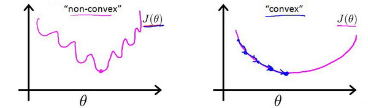

# 数学基础

## 最小二乘法（回归问题）

## 最大似然估计（分类问题）

## 损失函数

损失函数  ，也称为  代价函数  或  误差函数  ，是机器学习模型中用于  衡量模型预测值与真实值之间差异  的函数。
这里举个简单的例子：已知一个数据集，包含某个城市的住房价格。每个样本包括房屋尺寸、售价。在这里我们通过训练来构建一个简单的线性回归模型。

在训练的过程中，我们会将模型的预测值与训练集中的真实值进行对比。

这里会发现在x值相同的情况下真实值（红色）与预测值（蓝色）存在一定的偏差。这一段偏差就是训练中产生的损失。为了描述每一组真实值与预测值之间的损失情况，于是引入了损失函数的概念。

### 均方误差（MSE）

#### 均方误差的公式

均方误差，简称 MSE ，全称是 Mean Squared Error 。它的定义非常直观：

它计算的是模型预测值与真实值之间差异的平方的均值。

核心思想：通过“平方”来放大较大的误差，使得模型会对那些“错得离谱”的预测点更加敏感，从而努力去修正它们。均方误差一般用于回归问题。

$$MSE = \frac{1}{n} \sum_{i=1}^{n} (y_i - \hat{y}_i)^2$$

* n：表示样本的总数量。
* i：第i个样本
* $y_i$：第i个样本的真实值
* $\hat{y_i}$：第i个样本的预测值
* $(y_i- \hat{y_i})^2$：就是第 i个样本的预测误差（残差）。
* $\sum\limits_{i=1}^n$ ：表示对所有样本的误差平方进行求和。
* $\frac{1}{n}$：最后除以样本数，求取平均值，因此叫“均方”误差。

优点与缺点

优点：

1. 提供清晰的梯度  ：MSE函数是  光滑可导  的（凸函数），在任何点都可以轻松计算梯度（导数）。这对于梯度下降算法至关重要，因为它为优化指明了方向。
2. 惩罚大误差  ：由于使用了平方项，较大的误差会被赋予更高的权重。这意味着模型会“极力避免”出现非常大的预测错误，使预测结果更加稳定。

缺点：

1. 对异常值非常敏感  ：这是MSE最显著的缺点。如果数据中存在一个极端异常值，它的误差平方会非常大，从而主导整个损失函数，导致模型为了拟合这个异常点而牺牲对其他正常数据的拟合效果。
2. 例子 ：在上面的房价预测中，如果房子A的真实价格是100万，但因为数据错误被记录成了  1000万，那么它的误差平方会变得巨大，MSE值会暴增，模型训练会被这个错误数据点“带偏”。
3. 量纲问题 ：MSE的单位是原始数据单位的平方。例如，如果房价单位是“万元”，那么MSE的单位就是“万元²”，这有时不便于直接解释。

### 交叉熵

交叉熵的推导核心围绕**信息论的基本概念（自信息、熵）** 展开，先从最基础的自信息定义推导出香农熵（随机变量的不确定性度量），再通过**联合熵、条件熵**的关系引出相对熵（KL散度，衡量两个分布的差异），最终从KL散度分解中得到交叉熵公式，同时交叉熵在机器学习（分类任务）中的形式是其离散型的简化应用

#### 前置基础：信息论核心定义

推导前需明确3个最基础的概念，这是交叉熵的源头，均针对**离散型随机变量**（连续型可通过积分推广，核心逻辑一致）。

设离散型随机变量 $X$ 的取值空间为 $X=\{x_1,x_2,...,x_n\}$ ，其概率分布为 $P(X=x_i)=p_i$ ，且满足 $\sum_{i=1}^n p_i=1$ ；另有一个用于近似 $P$ 的概率分布 $Q(X=x_i)=q_i$ ，同样满足 $\sum_{i=1}^n q_i=1$ 。

##### 1. 自信息（Self-Information）

一个事件$X=x_i$发生所携带的**信息量**，称为自信息，记为 $I(x_i)$ 。

- 核心规律：事件发生的概率$p_i$越小，信息量越大；概率为1的确定事件，信息量为0。
- 公式定义：$I(x_i) = -\log p_i$（对数底通常取2，单位为比特；取自然对数$e$，单位为奈特，机器学习中多取$e$，不影响推导逻辑）。

这里可以这样理解，太阳从东升西落，发生的概率为1，属于是大家的一个常识也就说明所有人都知道，去讲一件大家都已经知道公认的事，那么这件事的信息量就为 0 。但是如果是老师今天没布置作业，这是一件概率很小的事，只有学委知道，那么在学委通知大家后大家才知道。这件事就含有很大的信息量。

##### 2. 香农熵（Shannon Entropy）

香农熵的定义是：随机变量所有可能事件的自信息，按概率加权平均。将这句话拆分为两部分就可以得到：

* 熵 = 自信息的「数学期望」
* 而数学期望 = 按概率加权平均

对任意一个离散型函数 $f(x_i)$ 数学期望的定义（离散型）：

$$H(P) = \mathbb{E}_P[I(x)] = -\sum_{i=1}^n p_i \cdot f(x_i)$$

* $p_i$ ：第 $i$ 个事件发生的概率
* $f(x_i)$ ：这个事件带来的值
* 撑起来再求和等于加权平均

将上文中的 $I(x_i) = -\log p_i$ 带入到这里的 $f(x_i)$ 。就得到了香农熵的公式

$$H(P) = \mathbb{E}_P[I(x)] = -\sum_{i=1}^n p_i \log p_i$$

- 其中 $\mathbb{E}_P[\cdot]$ 表示基于真实分布 $P$ 的数学期望。
- 物理意义：香农熵是描述真实分布 $P$ 的**最小编码长度**（无损压缩的极限）。

##### 3. 联合熵与条件熵

- 联合熵：两个随机变量 $X,Y$ 的联合不确定性，$H(P(X,Y)) = -\sum_{i,j} p(x_i,y_j) \log p(x_i,y_j)$ 。
- 条件熵：已知 $X$ 的分布后，$Y$ 的剩余不确定性，**核心公式（熵的链式法则）**：
  $$H(P(Y|X)) = H(P(X,Y)) - H(P(X))$$
  物理意义：描述在已知$X$的情况下，编码$Y$所需的**平均额外编码长度**。

#### 二、核心桥梁：相对熵（KL散度）

交叉熵并非独立定义，而是从**相对熵（Kullback-Leibler Divergence，KL散度）** 的分解中得到，KL散度的作用是**衡量两个概率分布$P$（真实分布）和$Q$（近似分布）之间的差异**，记为$D_{KL}(P||Q)$。

##### 1. KL散度的定义

基于真实分布$P$，用近似分布$Q$来编码随机变量$X$时，**额外增加的平均编码长度**，公式为：

$$D_{KL}(P||Q) = \mathbb{E}_P\left[\log \frac{P(X)}{Q(X)}\right] = \sum_{i=1}^n p_i \log \frac{p_i}{q_i}$$

- 关键性质：KL散度**非负**（吉布斯不等式），即$D_{KL}(P||Q) \geq 0$，当且仅当$P=Q$时取等号；且**不对称**，$D_{KL}(P||Q) \neq D_{KL}(Q||P)$，因此不是严格的距离度量。

##### 2. KL散度的分解

将KL散度的对数项拆分为减法形式，展开推导：
$$
\begin{align*}
D_{KL}(P||Q) &= \sum_{i=1}^n p_i \log \frac{p_i}{q_i} =\sum_{i=1}^n p_i \log p_i - \sum_{i=1}^n p_i \log q_i \\
&= -\sum_{i=1}^n p_i \log q_i - \left(-\sum_{i=1}^n p_i \log p_i\right)
\end{align*}
$$
观察上式，后一项正是**真实分布$P$的香农熵$H(P)$**，前一项则被定义为**交叉熵$H(P,Q)$**。

$$H(P) = \mathbb{E}_{x \sim P} I(x) = -\sum_{i} P(x_i)\log(q_i)$$

从KL散度的分解式中，直接得到**交叉熵**的定义，记为$H(P,Q)$：

1. 离散型交叉熵
$$\boldsymbol{H(P,Q) = -\sum_{i=1}^n p_i \log q_i}$$

2. 连续型交叉熵：

   若$P(X),Q(X)$为连续型随机变量的概率密度函数，交叉熵通过积分推广：
   $$\boldsymbol{H(P,Q) = -\int_{-\infty}^{+\infty} p(x) \log q(x) dx}$$

3. 交叉熵与KL散度、香农熵的关系、

   由KL散度的分解式变形可得核心关系：

   $$\boldsymbol{H(P,Q) = D_{KL}(P||Q) + H(P)}$$

   - **物理意义**：用近似分布$Q$编码真实分布$P$的**总平均编码长度** = 额外编码长度（KL散度） + 真实分布的最小编码长度（香农熵）。
   - **关键推论**：对于固定的真实分布$P$，$H(P)$是常数，因此**最小化KL散度$D_{KL}(P||Q)$等价于最小化交叉熵$H(P,Q)$**——这是机器学习中用交叉熵作为损失函数的核心理论依据。

#### 二分类问题（0/1）分类

在二分类问题中，交叉熵损失可以表示为：

$$L_{BCE}=y\log(\hat y)+(1-y)\log(1-\hat y)$$

* 真实标签：通常取值为 0 或 1。
* 预测值：是模型输出的类别 1 的概率。

#### 多分类问题

对于多分类问题（类别数 > 2），通常会先通过Softmax将模型输出的 logits 转化为概率分布，然后再计算交叉熵损失：

$$L_{CE} =  \sum\limits_{i=1}^ny_i \log\hat{ \frac{e^{z_i}}{ \sum\limits_{j=1}^ne^{z_j}}}$$

* $z_i$：是第i类的 logits 值，表示网络输出的第i类的得分。
* $y_i$：是真实标签。

在PyTorch中，nn.CrossEntropyLoss 是一个用于多分类问题的交叉熵损失函数。它结合了 softmax 操作和交叉熵损失计算，通常用于训练分类任务。这个损失函数期望输入的 y_pred 是模型的原始输出（即未经过 softmax 转换的 logits），而 y_true 是类标签的形式。

#### 为什么分类问题需要使用交叉熵?

对于线性回归模型，我们定义的代价函数是所有模型误差的平方和理论上来说，我们也可以对逻辑回归模型沿用这个定义，但是问题在于，当我们将概率分布的值带入到均方误差的公式中时会得到一个非凸函数。如左图，存在许多局部最优的点。这将影响梯度下降算法寻找全局最小值。

## 梯度下降法

### 基本思想

梯度下降是一种用来求函数最小值的算法，我们将使用梯度下降算法来求损失函数的最小值。

开始时随机选择一个参数的组合 (θ0, θ1, ..., θn) ，计算代价函数；然后寻找下一个能让代价函数值下降最多的参数组合。持续这么做直到找到一个局部最小值（Local minimum），因为我们并没有尝试完所有的参数组合，所以不能确定我们得到的局部最小值是否便是全局最小值（Globzhonal minimum），选择不同的初始参数组合，可能会找到不同的局部最小值。

这里可以想象一下你正站立在山的一点上（上图中的红色起始点），并且希望用最短的时间下山。在梯度下降算法中，要做的就是旋转360度，看看周围，并问自己要在某个方向上，用小碎步尽快下山。这些小碎步需要朝什么方向？如果我们站在山坡上的这一点，看一下周围，你会发现最佳的下山方向，按照自己的判断迈出一步；重复上面的步骤，从新的位置，环顾四周，并决定从什么方向将会最快下山，然后又迈进了一小步，并依此类推，直到你接近局部最低点的位置。

### 计算过程

假设我们有一个简单的线性回归模型 y=wx+b，并使用均方误差（MSE）作为损失函数。

模型: $\hat{y} = wx + b$

损失函数（MSE）：

$$J(w, b) = \frac{1}{2m} \sum_{i=1}^{m} (\hat{y}^{(i)} - y^{(i)})^2$$

1. 计算梯度
   我们需要求出损失函数关于参数 w和 b的偏导数。

   $$\frac{\partial J}{\partial w} = \frac{1}{m} \sum_{i=1}^{m} (\hat{y}^{(i)} - y^{(i)}) \cdot x^{(i)}$$

   $$\frac{\partial J}{\partial b} = \frac{1}{m} \sum_{i=1}^{m} (\hat{y}^{(i)} - y^{(i)})$$

2. 参数更新

   $$w = w - \alpha \cdot \frac{\partial J}{\partial w}$$

3. 计算示例

可以看到，经过两次迭代，预测值从0增加到了0.2，正在向真实值4靠近。通过成千上万次迭代，w和 b会逐渐收敛到最优值。

### 梯度下降算法

梯度下降拥有三种主要的变体算法。分别为批量梯度下降、随机梯度下降、小批量梯度下降。

批量梯度下降：

批量梯度下降（batch gradient descent）算法可以抽象为公式：

其中 α 是学习率（Learning rate），它决定了沿着能让代价函数下降程度最大的方向向下迈出的步子有多大；在批量梯度下降中，每一次都同时让所有的参数减去学习速率乘以代价函数的导数。

#### α 的取值有怎么的影响？

如果 α 太小，即学习速率太小，结果是红点一点点挪动，努力去接近最低点，需要很多步才能到达最低点。同样会需要很多步才能到达全局最低点。（如下图-左图）
如果 α 太大，梯度下降法可能会越过最低点，甚至可能无法收敛，下一次迭代又移动了一大步，一次次越过最低点，直到你发现实际上离最低点越来越远，所以如果 α 太大，它会导致无法收敛，甚至发散。

## 偏导数

### 偏导数的意义

偏导数描述的是：在多元函数中，当其他变量保持不变时，某个变量改变对函数输出的影响。
假设有一个二维函数 $f(x, y)$，表示某个量（例如温度、成本等）随着 $x$ 和 $y$ 两个变量变化的变化情况：

$$f(x, y) = x^2 + y^2$$

* 如果x改变时，y固定，那么偏导数就表示函数 f(x, y)对x变化的灵敏度。
* 如果y改变时，x 固定，那么偏导数 $\frac{\partial f}{\partial y}$ 就表示函数 $f(x, y)$ 对 $y$ 变化的灵敏度。

所以，偏导数就是描述单一变量在保持其他变量不变时对结果的贡献。

#### 几何意义

* 偏导数本质上是函数图形上某一点的切线斜率。
* 对于二维函数 $f(x, y)$ ，图像是一种曲面，偏导数则描述该曲面在某一点的“沿某个方向的斜率”。
假设 $f(x, y) = x^2 + y^2$ ，我们要计算偏导数：
  
这些偏导数表示：

沿 $x$ 方向的斜率是 $2x$，即当 $x$ 改变时， $y$ 不变，函数值如何变化。

沿 $y$ 方向的斜率是 $2y$，即当 $y$ 改变时， $x$ 不变，函数值如何变化。

在几何图像中，偏导数值就决定了在某个点的切线方向上函数值的变化率。

### 偏导数的作用

1. 优化算法：比如梯度下降（Gradient Descent）中，偏导数帮助确定最陡的下降方向，用于最小化损失函数。
2. 建模与预测：多元函数的偏导数描述了不同特征对输出的贡献，帮助我们理解各个因素的影响。
3. 多变量函数的分析：通过偏导数，我们可以知道哪个变量对输出最敏感，进而进行优化或控制。

### 多元函数的优化

假设我们有一个二维的损失函数 $L(x, y)$，我们想要找到使损失最小的 $x$ 和 $y$。

1. 计算偏导数：

   $$\frac{\partial L}{\partial x}, \quad \frac{\partial L}{\partial y}$$

2. 这些偏导数告诉我们函数在每个方向的变化率。
3. 梯度下降：
   使用计算出的偏导数来更新 $x$ 和 $y$，每次沿着负梯度方向调整参数。

   $$x_{new} = x - \eta \frac{\partial L}{\partial x}, \quad y_{new} = y - \eta \frac{\partial L}{\partial y}$$

其中 $\eta$ 是学习率。通过不断调整，函数的输出会越来越小，最终找到最小值点。

|层次|	含义|
|---|---|
|直觉	|偏导数描述在某个方向上输入变化对输出的影响。|
|几何	|偏导数是切线斜率，表示曲面某一点的局部斜率。|
|数学	|在优化和建模中，偏导数帮助我们了解如何调整输入变量，使输出达到最佳。|

## 链式法则

链式法则是微积分中的一个基本法则，它解释了如何在复合函数的情况下计算导数。链式传播（在神经网络中的反向传播）是基于链式法则的应用，主要用于通过反向传播计算梯度，从而优化模型参数。

### 链式法则（Chain Rule）简介

链式法则是用来计算复合函数导数的一个重要规则。假设你有两个函数 $f(x)$ 和 $g(x)$，那么复合函数 $h(x) = f(g(x))$ 的导数可以表示为：

$​h'(x) = f'(g(x)) · g'(x)$​

直观地说，链式法则告诉我们：复合函数的导数是每个函数的导数的积，先求内层函数的导数，再乘以外层函数的导数。为什么链式法则能用于神经网络？

神经网络本质上是一个复合函数：

* 网络中的每一层都是一个函数，它的输出依赖于前一层的输入。
* 这种层与层之间的关系形成了一个复杂的复合函数。例如：
  * 输入层到隐藏层： $z_1 = W_1 x + b_1$
  * 隐藏层到输出层： $z_2 = W_2 a_1 + b_2$
  * 激活函数 $a = f(z)$

在训练神经网络时，我们想计算损失函数 $L$ 对每个参数的梯度，进而更新这些参数。这正是链式法则的应用：每一层的梯度通过链式传播，逐层传递回去。

### 链式法则如何在反向传播中工作？

反向传播（Backpropagation）的核心是计算损失函数对每一层参数的偏导数。通过应用链式法则，我们可以逐层计算这些偏导数。

假设我们有一个简单的神经网络：

1. 输入层到隐藏层：

   $$z_1 = W_1 x + b_1, \quad a_1 = f(z_1)$$

2. 隐藏层到输出层：

   $$z_2 = W_2 a_1 + b_2, \quad \hat{y} = f(z_2)$$

   计算损失函数对输出层的偏导数：

   $$\frac{\partial L}{\partial \hat{y}}$$

   利用链式法则计算损失函数对 $z_2$ 的偏导数：

   $$\frac{\partial L}{\partial z_2} = \frac{\partial L}{\partial \hat{y}} \cdot \frac{\partial \hat{y}}{\partial z_2}$$

   这里， $\frac{\partial \hat{y}}{\partial z_2}$ 就是输出层的激活函数对 $z_2$ 的导数。

3. 继续向前传播，计算损失函数对 $a_1$ 的偏导数：

   $$\frac{\partial L}{\partial a_1} = \frac{\partial L}{\partial z_2} \cdot \frac{\partial z_2}{\partial a_1}$$

   然后，再计算损失函数对 $W_2$ 和 $b_2$ 的偏导数：

   $$\frac{\partial L}{\partial W_2} = \frac{\partial L}{\partial a_1} \cdot \frac{\partial a_1}{\partial W_2}$$

4. 继续计算每一层的梯度：
   类似地，我们可以使用链式法则计算每一层的梯度，直到输入层。每一层的梯度都会依赖于上一层的梯度，最终得到输入层参数的梯度。

   最终的梯度更新公式：

   基于链式法则，所有的梯度都可以通过这种逐层的传播来得到：

   $$W_1 \leftarrow W_1 - \eta \frac{\partial L}{\partial W_1}$$

   $$W_2 \leftarrow W_2 - \eta \frac{\partial L}{\partial W_2}$$

   其中，$\eta$ 是学习率。

### 为什么链式法则在神经网络中非常重要？

1. 神经网络是复合函数：每一层神经网络都依赖于上一层的输出，因此神经网络本质上是一个复合函数。计算损失函数对每个参数的梯度时，链式法则为我们提供了逐层传播误差的方式。
2. 逐层传递误差：通过反向传播算法，误差从输出层开始逐步传播到输入层。每一层的误差计算与上一层的误差直接相关。这就使得我们能够通过链式法则高效地计算每个权重对最终误差的贡献。
3. 局部与全局关系：每一层的梯度计算依赖于当前层的输出和前一层的梯度，因此链式法则帮助我们将局部信息（每层的导数）整合成全局梯度，最终进行全局优化。

### 总结

链式法则在神经网络中的作用是：

它允许我们在复杂的多层网络中逐层传播误差，通过每层的偏导数计算更新每个参数。这个过程是神经网络训练的核心（通过梯度下降进行优化）。

* 链式法则：计算复合函数的导数时，将各部分的导数相乘
* 反向传播：通过链式法则逐层计算损失函数对每个参数的梯度
* 优化：使用梯度（通过链式法则计算）调整模型参数，减少损失

## 梯度爆炸产生的原因

### 1. 问题背景

考虑一个简单的 L 层全连接神经网络（前馈网络）。  
前向传播过程为：

$$
\mathbf{h}^{(l)} = f\left( \mathbf{z}^{(l)} \right), \quad 
\mathbf{z}^{(l)} = W^{(l)} \mathbf{h}^{(l-1)} + \mathbf{b}^{(l)}
$$

其中：

- $l = 1, 2, \dots, L$ 为层索引，
- $f$ 是激活函数（如 sigmoid、tanh、ReLU 等），
- $\mathbf{h}^{(0)} = \mathbf{x}$ 是输入。

设损失函数为 $J(\theta)$，对任意参数 $W^{(l)}$ 的梯度为：

$$
\frac{\partial J}{\partial W^{(l)}} = \frac{\partial J}{\partial \mathbf{h}^{(L)}} 
\cdot \frac{\partial \mathbf{h}^{(L)}}{\partial \mathbf{h}^{(L-1)}} 
\cdots \frac{\partial \mathbf{h}^{(l+1)}}{\partial \mathbf{h}^{(l)}} 
\cdot \frac{\partial \mathbf{h}^{(l)}}{\partial W^{(l)}}
$$

关键部分在于从第 $L$ 层到第 $l$ 层的梯度传播项：

$$
\frac{\partial \mathbf{h}^{(L)}}{\partial \mathbf{h}^{(l)}} = \prod_{i=l}^{L-1} \frac{\partial \mathbf{h}^{(i+1)}}{\partial \mathbf{h}^{(i)}}
$$

### 2. 分析 $\frac{\partial \mathbf{h}^{(i+1)}}{\partial \mathbf{h}^{(i)}}$

我们有一个 $L$ 层的神经网络。对于第 $i$ 层和第 $i+1$ 层：

$$
\mathbf{z}^{(i+1)} = W^{(i+1)} \mathbf{h}^{(i)} + \mathbf{b}^{(i+1)}
$$

$$
\mathbf{h}^{(i+1)} = f(\mathbf{z}^{(i+1)})
$$

我们有一个 $L$ 层的神经网络。对于第 $i$ 层和第 $i+1$ 层：

- $\mathbf{h}^{(i)}$：第 $i$ 层的**隐藏状态**（输出），是第 $i$ 层的激活值。
- $\mathbf{z}^{(i+1)}$：第 $i+1$ 层的**加权输入**（激活函数的输入）。
- $W^{(i+1)}, \mathbf{b}^{(i+1)}$：连接第 $i$ 层到第 $i+1$ 层的**权重矩阵**和**偏置向量**。
- $f$：激活函数（如 Sigmoid, Tanh, ReLU）,逐元素应用。

雅各比矩阵是函数的一阶偏导数以一定方式排列成的矩阵。因为这一步的目标是理解第 i+1 层的输出如何随第 i 层的输出变化。所以这里这一步可以表示为一个雅各比矩阵。

根据前向传播公式， $\mathbf{h}^{(i+1)}$ 是 $\mathbf{z}^{(i+1)}$ 的函数，而 $\mathbf{z}^{(i+1)}$ 又是 $\mathbf{h}^{(i)}$ 的函数。因此，我们可以应用**多变量链式法则**：

$$
\frac{\partial \mathbf{h}^{(i+1)}}{\partial \mathbf{h}^{(i)}} = \frac{\partial \mathbf{h}^{(i+1)}}{\partial \mathbf{z}^{(i+1)}} \cdot \frac{\partial \mathbf{z}^{(i+1)}}{\partial \mathbf{h}^{(i)}}
$$

**计算第一项： $\frac{\partial \mathbf{h}^{(i+1)}}{\partial \mathbf{z}^{(i+1)}}$**

- $\mathbf{h}^{(i+1)} = f(\mathbf{z}^{(i+1)})$，且 $f$ 是逐元素函数。
- 这个雅可比矩阵描述的是输出向量 $\mathbf{h}^{(i+1)}$ 的每个元素对输入向量 $\mathbf{z}^{(i+1)}$ 的每个元素的偏导数。

由于 $f$ 是逐元素操作的， $\mathbf{h}^{(i+1)}$ 的第 $i$ 个元素 $h_i^{(i+1)}$ **只依赖于** $\mathbf{z}^{(i+1)}$ 的第 $i$ 个元素 $z_i^{(i+1)}$，而不依赖于 $z_j^{(i+1)} (j \neq i)$。

因此，这个雅可比矩阵是一个**对角矩阵**：

$$
\frac{\partial \mathbf{h}^{(i+1)}}{\partial \mathbf{z}^{(i+1)}} = \bigl(
\begin{matrix}
\frac{\partial h_1^{(i+1)}}{\partial z_1^{(i+1)}} & 0 & \cdots & 0 \\
0 & \frac{\partial h_2^{(i+1)}}{\partial z_2^{(i+1)}} & \cdots & 0 \\
\vdots & \vdots & \ddots & \vdots \\
0 & 0 & \cdots & \frac{\partial h_m^{(i+1)}}{\partial z_m^{(i+1)}}
\end{matrix}
\bigr)
$$

每个对角线元素就是激活函数在其输入处的导数：

$$
\frac{\partial h_i^{(i+1)}}{\partial z_i^{(i+1)}} = f'(z_i^{(i+1)})
$$

所以，

$$
\frac{\partial \mathbf{h}^{(i+1)}}{\partial \mathbf{z}^{(i+1)}} = \text{diag}\left[ f'(\mathbf{z}^{(i+1)}) \right]
$$

这里 $\text{diag}[\mathbf{v}]$ 表示一个以向量 $\mathbf{v}$ 的元素为对角线元素的对角矩阵。

**计算第二项： $\frac{\partial \mathbf{z}^{(i+1)}}{\partial \mathbf{h}^{(i)}}$**

- $\mathbf{z}^{(i+1)} = W^{(i+1)} \mathbf{h}^{(i)} + \mathbf{b}^{(i+1)}$。
- 这是一个线性变换。向量对向量的偏导数就是其变换矩阵。
- 根据多元微积分，对于线性函数 $\mathbf{z} = W \mathbf{h} + \mathbf{b}$，有 $\frac{\partial \mathbf{z}}{\partial \mathbf{h}} = W^T$。但在神经网络的标准记法中（分母布局），我们通常直接写作：

$$
\frac{\partial \mathbf{z}^{(i+1)}}{\partial \mathbf{h}^{(i)}} = W^{(i+1)}
$$

将上面两步的结果代入链式法则公式：

$$
\frac{\partial \mathbf{h}^{(i+1)}}{\partial \mathbf{h}^{(i)}} = \underbrace{\text{diag}\left[ f'(\mathbf{z}^{(i+1)}) \right]}_{\text{对角矩阵}} \cdot \underbrace{W^{(i+1)}}_{\text{权重矩阵}}
$$

**最终结果**：相邻两层隐藏状态之间的梯度是一个**对角矩阵**（由激活函数的导数构成）与**权重矩阵** $W^{(i+1)}$ 的乘积。

## 3. 梯度连乘的形式

因此：

$$
\frac{\partial J}{\partial \mathbf{h}^{(l)}} = \frac{\partial J}{\partial \mathbf{h}^{(L)}} \cdot \prod_{i=l}^{L-1} \left[ \text{diag}(f'(\mathbf{z}^{(i+1)})) \cdot W^{(i+1)} \right]
$$

记 $M^{(i)} = \text{diag}(f'(\mathbf{z}^{(i)})) \cdot W^{(i)}$（注意这里索引要匹配，实际上上面是 $i+1$ 层对应 $W^{(i+1)}$ 和 $f'(\mathbf{z}^{(i+1)})$），那么：

$$
\frac{\partial J}{\partial \mathbf{h}^{(l)}} = \frac{\partial J}{\partial \mathbf{h}^{(L)}} \cdot M^{(L)} \cdot M^{(L-1)} \cdots M^{(l+1)}
$$

### 4. 梯度消失/爆炸的数学原因

矩阵乘积的模（范数）满足：

$$
\| \prod_{i} M^{(i)} \| \le \prod_{i} \| M^{(i)} \|
$$

* $\| \prod_{i} M^{(i)} \|$ 先连乘再取模
* $\prod_{i} \| M^{(i)} \|$ 先取模，再由模来连乘

如果每个 $\| M^{(i)} \|$ 都小于 1，那么乘积会指数级减小 → **梯度消失**。  
如果每个 $\| M^{(i)} \|$ 都大于 1，那么乘积会指数级增大 → **梯度爆炸**。

#### 4.1 激活函数导数的影响

常见激活函数导数范围：

- **Sigmoid**: $f'(z) = f(z)(1-f(z)) \in (0, 0.25]$，最大值 0.25。
- **tanh**: $f'(z) = 1 - \tanh^2(z) \in (0, 1]$，最大值 1。
- **ReLU**: $f'(z) = 0 \text{ 或 } 1$。

对于 sigmoid，$\|\text{diag}(f')\| \le 0.25$，如果权重矩阵 $W$ 的范数不太大（比如使用 Xavier 初始化后每层谱范数约 1），那么 $\|M\| \approx 0.25$，连乘 $L$ 层后梯度尺度约为 $(0.25)^{L-l}$，对于大 $L$ 几乎为 0。

对于 tanh，导数最大 1，但如果大部分神经元饱和（|z| 很大），导数接近 0，同样会导致梯度消失。

#### 4.2 权重矩阵的影响

即使激活函数导数理想（如恒等函数，即线性网络），梯度为：

$$
\frac{\partial J}{\partial \mathbf{h}^{(l)}} = \frac{\partial J}{\partial \mathbf{h}^{(L)}} \cdot W^{(L)} W^{(L-1)} \cdots W^{(l+1)}
$$

假设 $W$ 是标量 $w$ 的情形（单神经元线性网络），则梯度包含因子 $w^{L-l}$。

- 若 $|w| < 1$，指数减小 → 消失。  
- 若 $|w| > 1$，指数增大 → 爆炸。

推广到矩阵：取决于权重矩阵的**谱范数**（最大奇异值） $\sigma_{\max}$：

- 若每层 $\sigma_{\max}(W^{(i)}) < 1$，梯度消失。  
- 若每层 $\sigma_{\max}(W^{(i)}) > 1$，梯度爆炸。

### 总结原因

**梯度消失原因**：

1. **激活函数饱和**：sigmoid、tanh 在绝对值大的输入处导数接近 0。
2. **权重矩阵谱范数 < 1**：连乘后梯度模长指数下降。
3. **网络深度/时间步数大**：连乘项多，放大上述效应。

**梯度爆炸原因**：

1. **权重矩阵谱范数 > 1**：连乘后梯度模长指数增长。
2. **深度大**：即使略大于 1，深度大时也会爆炸。

### 避免的手段

