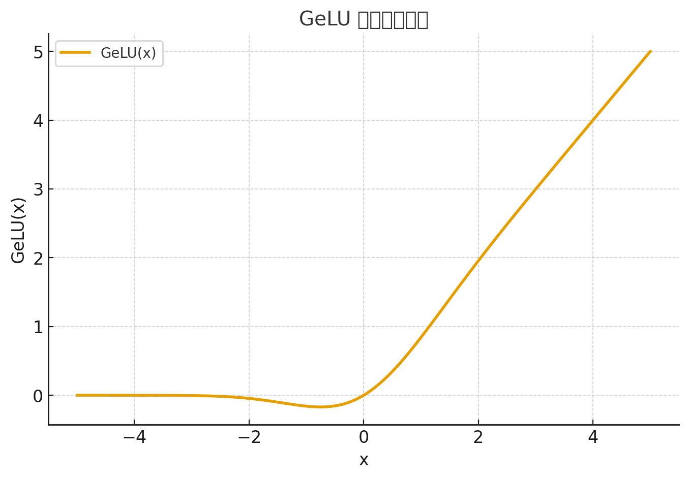
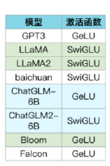

# 激活函数

## ReLU

ReLU 设计灵感来自于神经信号的传播。在神经信号传播时，刺激低于阈值时不激活，超过阈值时产生动作电位。ReLU 门控的设置也是如此。

**ReLU 函数定义如下：**

$$\text{ReLU}(x) = \max(0, x)$$

也就是说：

* 当 $x > 0$ 时，输出就是 $x$
* 当 $x \leq 0$ 时，输出为 $0$

ReLU 就像一个“单向阀门”——只允许正信号通过，负信号被截断为 0。

### 数学特性

| 性质                  | 说明                               |
| ------------------- | -------------------------------- |
| **非线性**             | 尽管看似简单，但在负区间截断使网络具备非线性表示能力。      |
| **稀疏激活 (Sparsity)** | 大量负输入会被置为 0，让网络部分神经元“休眠”，减少计算负担。 |
| **梯度传播简单**          | 对正区间导数为 1，对负区间导数为 0。             |

其导数为：

$$
\text{ReLU}'(x) =
\begin{cases}
1, & x > 0 \
0, & x \le 0
\end{cases}
$$

### 为什么有效

1. **线性区段**：正区间梯度为常数，反向传播时不会出现梯度消失问题（相比 Sigmoid / Tanh）。
2. **稀疏性**：部分神经元输出恒为 0，使网络更具判别性，防止过拟合。
3. **高效计算**：只需 `max(0, x)` 操作，几乎没有计算开销。

### 存在的问题

| 问题                    | 说明                       | 改进版本              |
| --------------------- | ------------------------ | ----------------- |
| **死亡ReLU（Dead ReLU）** | 若输入长期为负，神经元输出永远为 0，不再更新。 | Leaky ReLU, PReLU |
| **输出非零均值**            | 输出期望 > 0，可能导致梯度偏移。       | 使用 BatchNorm 调整分布 |

## GELU



GELU 的定义公式为：

$$\text{GELU}(x) = x \cdot \Phi(x)$$

$\Phi(x)$ :输入x被判断为"有效信号"的概率

其中 $\Phi(x)$ 是标准正态分布的累计分布函数（CDF）：

$$\Phi(x) = P(X \le x), \quad X \sim \mathcal{N}(0, 1)$$

$$\Phi(x) = \frac{1}{2}\left[1 + \text{erf}\left(\frac{x}{\sqrt{2}}\right)\right]$$

于是有：

$$\boxed{\text{GELU}(x) = \frac{x}{2}\left[1 + \text{erf}\left(\frac{x}{\sqrt{2}}\right)\right]}$$

其中erf误差函数的数学定义如下：

$$\mathrm{erf}(x) = \frac{2}{\sqrt{\pi}} \int_{0}^{x} e^{-t^2}$$

误差函数是指表示正态分布的累积分布函数。可以用于描述一个服从正态分布的随机变量，小于某个值的概率是多少。

在 GELU 实现中就是根据 x 在正态分布中小于0的概率平滑决定输出通过多少。

例如当 x=0.1（一个很小的正数）：

```python
x = 0.1
通过概率 = norm.cdf(0.1) ≈ 0.54  # 54%的概率被认为"有效"
GeLU输出 = 0.1 × 0.54 ≈ 0.054
```

数字0.1没有被"丢弃"而是被​​按54%的强度保留​。

而如果这里是一个很大的数，那么就会无限接近于自身的数值，例如如果是 10 那么经过这个运算后的数字也是接近于 10 的。

当这里的 x 小于 0 的时候，那么保留的数字会无限趋紧于0, 但是始终要比 0 大一些。

### 与 ReLU 进行比较

* ReLU：
  
  $$\text{ReLU}(x) = x \cdot 1_{x>0}$$

  → “硬门控”：负数全部置 0。

* GELU：

  $$\text{GELU}(x) = x \cdot P(X < x)$$
  → “软门控”：根据 (x) 在高斯分布中的概率**平滑决定输出是否通过**。

也就是说：

> GELU 相当于在输入为 (x) 时，以概率 $\Phi(x)$ 决定是否让该值“通过”。

这里可以理解为：

* ReLU 是：如果 (x > 0)，就输出 (x)，否则输出 0。
* GeLU 是：如果 (x) 大概率为“正向有效信号”，就部分通过它。 
  这个“概率”由 $\Phi(x)$（或 erf）控制。

这里也解决了 ReLU 中神经元长期为 0  的死亡的问题。

### 为什么是GeLU

而在 Transformer 等语言模型中，每个 token（词）的 embedding 向量经过一层或多层 线性变换（Linear Projection）：

$$x' = W x + b$$

其中：

* $x = [x_1, x_2, ..., x_n]^T$：embedding 或上一层的输出；
* $W = [w_1, w_2, ..., w_n]$：该线性层的一行权重；
* $b$：偏置项；
* $x'$：该层一个输出维度的值。

因为本层的一个神经元要接受上一层所有神经元的输出于是某个输出维度可以写为：

$$x' = \sum_{i=1}^{n} w_i x_i + b$$

在 Transformer 初始化时，权重和输入满足：

输入$x_i$：

* 来自 embedding 层或上一层线性层输出；
* 在训练早期可以近似看作 均值为 0、方差有限 的随机变量；
* 通常独立或弱相关。

输入$w_{ji}$：

* 由高斯或均匀分布初始化（例如 Xavier / Kaiming）；
* 均值为 0、方差受输入维度控制；
* 彼此独立。

因此每个乘积项：

$$z_i = w_{ji}x_i$$

根据中心极限定理：

当一个随机变量是许多独立（或弱相关）随机项的加和时，它的分布趋近于高斯分布，无论每个项本身的分布是什么。

## SwiGLU

SwiGLU 的公式为：

$$\text{SwiGLU}(x) = (x W_1) \odot \mathrm{Swish}(x W_2)$$

其中：

* $W_1, W_2$：线性层权重（通常两倍宽度）
* $\odot$：逐元素乘法（Hadamard product）
* $\mathrm{Swish}(x) = x \cdot \sigma(x)$
* $\sigma(x)$：Sigmoid 函数：$\frac{e^x}{e^x + 1}$

可以这样理解 SwiGLU 的结构：

```
         ┌───────────┐
   x ───►│ Linear W1 │───┐
         └───────────┘   │
                          ▼
                        ⊙───► 输出 y
                          ▲
         ┌───────────┐   │
   x ───►│ Linear W2 │───┘
         └───────────┘
                 │
                 ▼
             Swish(x)
```

$x W_1$这条支路（主路）产生特征向量；

$\mathrm{Swish}(xW_2)$这一条支路（门路）通过 Swish 激活形成“门控权重”；

Sigmoid 函数可以化简为如下的形式，x 越小 ${e^x + 1}$ 越接近于 1 ，则Sigmoid 函数得到的值越小权重越小，对神经元的激活越微弱。

$$1-\frac{1}{e^x + 1}$$

最终输出后通常还接一个线性层（降回原维度）：

$$
y = \text{SwiGLU}(x) W_3
$$

这里的 W_2 也是一个可学习的矩阵，这里表示了网络学习"哪些特征重要，应该多通过；哪些不重要，应该少通过"。

经典激活函数存在的问题：

* ReLU：仅处理正值，梯度在负区间为0，易导致神经元死亡；
* Swish：平滑且非单调，但缺乏门控机制，参数利用率低；
* GELU：通过高斯误差函数平滑处理负值，但计算复杂度较高。

## 激活函数的作用

### 引入非线性的变化

引入非线性： 这是激活函数最重要的作用。如果所有层都使用线性激活函数，那么无论神经网络有多少层，整个网络都将只产生线性变换，这与一个单层网络没有区别。引入非线性激活函数后，神经网络才能够逼近和学习任意复杂的非线性函数，从而处理更复杂的问题，如图像识别和自然语言处理。

图中就是加入激活函数前后的区别：


### 控制信息流动

激活函数类似于生物神经元中的阈值机制。它根据神经元的加权输入来决定是否“激活”或“触发”该神经元，并决定传递到下一层的信号强度。如果神经元接收到的信号强度不足，激活函数可以输出一个非常小的数值甚至零，从而有效地“关闭”该神经元，使其不参与到后续的计算中。

#### 负特征的语义

* **正特征**（z > 0）表示「该神经元对输入模式有响应」，即输入与其学到的方向一致；
* **负特征**（z < 0）表示「该神经元认为输入与自己期望的方向相反」，即**抑制性反应**。

举个形象例子（假设网络识别猫 🐱）：

| 输入特征 | 神经元学到的方向 | z 的符号 | 语义        |
| ---- | -------- | ----- | --------- |
| 有胡须  | 检测胡须方向相同 | z>0   | 激活（是猫的特征） |
| 无胡须  | 检测胡须方向相反 | z<0   | 抑制（不是猫）   |

所以，负特征并不是“错误的”，而是代表「**反向证据**」。
但在 **ReLU** 这类激活函数中，负特征被截断为 0，是一种“只关注正证据”的设计。

而激活函数在这里则是一种对于信号的筛选，由权重和上一层输入的结果来决定是否激活这个神经元。

如果在该神经元中计算得到的是一个负值，那么就说明这个特征与我们要达到的训练目标无关。那么此时将决定不激活这个神经元（输出为 0），因此一条路径上的值也不会继续向下传导。同时在反向传播的过程中，因为此处的输入对于训练并没有相关的意义，因此也不会被更新（梯度被截断）。

## 常用的激活函数

