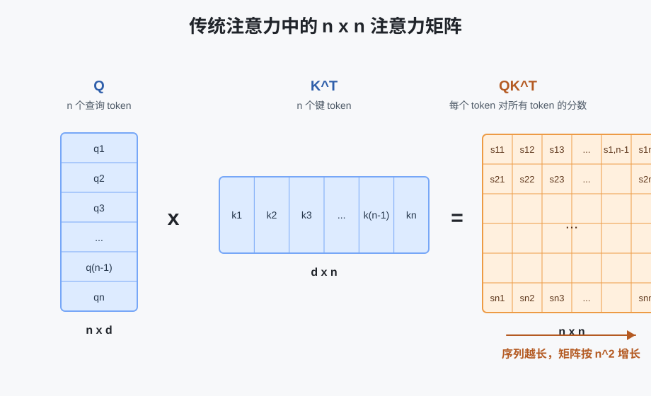
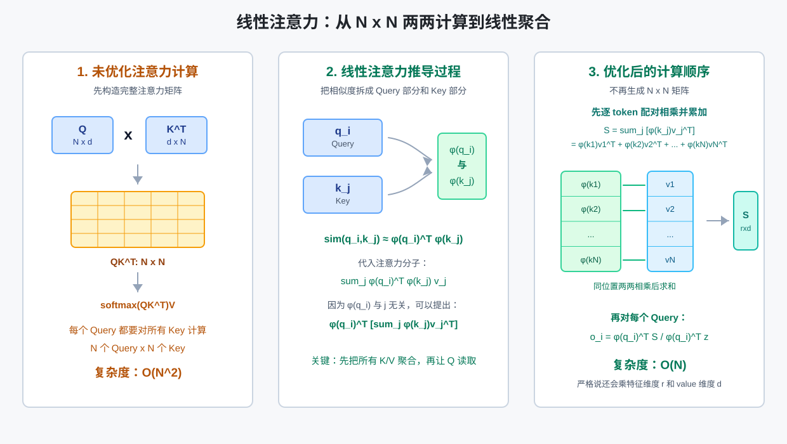

# 线性注意力机制

## 传统注意力机制存在的问题

传统 Transformer 使用的是标准的 Softmax Attention，核心公式为：

```math
\text{Attention}(Q,K,V)=\text{softmax}\Big(\frac{QK^T}{\sqrt{d_k}}\Big)V
```
其中 $QK^T$ 会计算序列中每个 token 与其他所有 token 的相关性。如果序列长度为 $n$，那么注意力分数矩阵的大小就是 $n \times n$。这带来了传统注意力机制最主要的问题：**计算复杂度和显存开销都会随序列长度平方级增长**。



### 1. 计算复杂度高

在标准注意力中，每个 token 都要和序列中的所有 token 做一次相似度计算。

如果序列长度是 $n$，隐藏维度是 $d$，那么计算 $QK^T$ 的复杂度约为：

```math
O(n^2d)
```
当序列较短时，这个开销可以接受；但当序列长度从几千扩展到几万、几十万时，$n^2$ 会迅速变得非常大。例如：

|序列长度 $n$|注意力矩阵大小 $n \times n$|
|---|---|
|1,000|1,000,000|
|10,000|100,000,000|
|100,000|10,000,000,000|

也就是说，序列长度增加 10 倍，注意力矩阵的规模会增加 100 倍。

### 2. 显存占用高

标准注意力需要显式保存 $QK^T$ 得到的注意力矩阵，并在 Softmax 后继续保存注意力权重，用于后续与 $V$ 相乘以及反向传播。

这意味着显存复杂度同样是：

```math
O(n^2)
```
对于长文本、高清视频、长时间序列、基因序列等任务，输入长度可能非常大。此时注意力矩阵本身就会占用大量显存，甚至还没有进入后续 FFN 层，显存就已经成为瓶颈。

### 3. 长序列推理速度慢

在自回归生成任务中，例如大语言模型生成文本时，每生成一个新 token，都需要和历史 token 建立注意力关系。历史上下文越长，注意力计算越慢。

虽然 KV Cache 可以避免重复计算历史的 $K$ 和 $V$，但新 token 仍然需要和所有历史 token 做注意力匹配。因此上下文越长，每一步生成的代价也越高。

这会导致：

- 长上下文生成速度下降；
- 推理延迟增加；
- 服务端部署成本变高；
- 难以高效支持超长上下文窗口。

### 4. 不适合处理超长上下文

标准注意力的全局两两交互能力很强，这是它的优势；但这种优势是以平方复杂度为代价换来的。

对于很多任务来说，并不是每个 token 都必须和所有 token 做完整的精确注意力计算。例如：

- 文档理解中，很多 token 只和局部段落或少数关键位置强相关；
- 视频建模中，相邻帧之间的信息通常更密集；
- 时间序列中，远距离依赖可能存在，但不一定需要完整的两两比较；
- 长文本检索或摘要中，模型更需要高效聚合全局信息，而不是保存完整注意力矩阵。

因此，标准注意力在长序列场景中会出现“能力强但代价太高”的问题。

## 线性注意力机制是怎么做的

线性注意力机制的目标是：**在尽量保留注意力建模能力的同时，将复杂度从平方级降低到线性级**。

标准注意力的瓶颈来自先计算 $QK^T$，再做 Softmax：

```math
\text{softmax}(QK^T)V
```
这个过程会显式构造 $n \times n$ 的注意力矩阵。线性注意力的核心思路是通过核函数、特征映射或计算顺序变换，避免直接构造完整的注意力矩阵。

一种常见形式是将注意力近似改写为：

```math
\text{Attention}(Q,K,V) \approx \phi(Q)(\phi(K)^TV)
```

其中 $\phi(\cdot)$ 是一个特征映射函数。这样可以先计算 $\phi(K)^TV$，再与 $\phi(Q)$ 相乘。

计算顺序发生变化后，就不再需要显式生成 $n \times n$ 的矩阵，复杂度可以降低为：

```math
O(nd^2)
```

### 公式推导过程

这里的数学推理过程如下：



**1.对标准注意力进行抽象：**

这里先回顾一下 softmax 的公式：

```math
\operatorname{softmax}(z)_i
=
\frac{e^{z_i}}{\sum_{j=1}^{K}e^{z_j}},

```

$\quad i=1,\cdots,K$

若用 $\alpha_{ij}$ 表示第 $i$ 个 token 对第 $j$ 个 token 的注意力权重，则有：

```math
\alpha_{ij}
=
\frac{
\exp\left(\frac{q_i k_j^T}{\sqrt d}\right)
}{
\sum_{l=1}^{N}
\exp\left(\frac{q_i k_l^T}{\sqrt d}\right)
}
\quad [1]
```

* $q_i$：第 $i$ 个 token 的 Query，表示“我想找什么信息”
* $k_j$：第 $j$ 个 token 的 Key，表示“我能提供什么匹配特征”
* $q_i k_j^T$：计算第 $i$ 个 token 和第 $j$ 个 token 的相关性分数
* $\sqrt d$：缩放项，防止分数过大
* softmax：对固定的 $i$，把 $q_i$ 与所有 $k_1,k_2,\cdots,k_N$ 的相关性分数转换成概率权重。

这里的 $\exp(x)$ 代表的是 $e^x$，那么 $\exp\left(\frac{q_i k_j^T}{\sqrt d}\right)$ 则为 $e^{\left(\frac{q_i k_j^T}{\sqrt d}\right)}\quad[2]$。

将【2】式带入【1】式得到单个注意力权重：

```math
\alpha_{ij}=
\frac{
e^{\left(\frac{q_i k_j^T}{\sqrt d}\right)}
}{
\sum_{l=1}^{N}
e^{\left(\frac{q_i k_l^T}{\sqrt d}\right)}
} \quad [3]
```

这里的【3】式表示了一个 token 对一个 token的单个权重 

而第 $i$ 个 token 的最终注意力输出则是要把它对所有 token 的贡献都加起来。这里会先拿它的查询向量 $q_i$ 依次和所有 Key token 对应的 $k_1,k_2,\cdots,k_N$ 计算相关性分数，得到一组分数：

```math
\left[
\frac{q_i k_1^T}{\sqrt d},
\frac{q_i k_2^T}{\sqrt d},
\cdots,
\frac{q_i k_j^T}{\sqrt d}
\right] \quad [4]
```

这里将【4】中的值依次带入得：

```math
\sum_{r=1}^{j}\alpha_{ir}=
\frac{e^{\left(\frac{q_i k_1^T}{\sqrt d}\right)}}{\sum_{l=1}^{N}e^{\left(\frac{q_i k_l^T}{\sqrt d}\right)}}
+
\frac{e^{\left(\frac{q_i k_2^T}{\sqrt d}\right)}}{\sum_{l=1}^{N}e^{\left(\frac{q_i k_l^T}{\sqrt d}\right)}}
+
\cdots
+
\frac{e^{\left(\frac{q_i k_j^T}{\sqrt d}\right)}}{\sum_{l=1}^{N}e^{\left(\frac{q_i k_l^T}{\sqrt d}\right)}}
```
这里的分母都是相同的，因此可以化简为：

```math
\sum_{r=1}^{j}\alpha_{ir}
=
\frac{
\sum_{r=1}^{j}e^{\left(\frac{q_i k_r^T}{\sqrt d}\right)}
}{
\sum_{l=1}^{N}e^{\left(\frac{q_i k_l^T}{\sqrt d}\right)}
} \quad [5]
```

其中 $\alpha_{ij}$ 表示第 $i$ 个 token 对第 $j$ 个 token 的关注比例。最终，第 $i$ 个 token 的注意力输出为：

```math
o_i=\sum_{j=1}^{N}\alpha_{ij}v_j
```

这里用 $\mathrm{sim}(q_i,k_j)$ 表示未归一化的相似度分数，即三式中的分子项：

```math
\mathrm{Attention}(q_i)
=
\frac{
\sum_{j=1}^{N} \mathrm{sim}(q_i,k_j)v_j
}{
\sum_{j=1}^{N} \mathrm{sim}(q_i,k_j)
}
\quad [6]
```

**2.将 $\mathrm{sim}(q_i,k_j)$ 转换为 $\phi(q_i)^T \phi(k_j)$**

这一步的目的主要是为了把 $n^2$ 的复杂度转换为 $n$

标准注意力中的未归一化相似度可以写成：

```math
\mathrm{sim}(q_i,k_j)
=
\exp\left(\frac{q_i k_j^T}{\sqrt d}\right)
```
为了方便推导，先忽略缩放项 $\sqrt d$，只看 $\exp(q_i k_j^T)$。

泰勒展开的作用是：把一个复杂函数表示成无穷多个多项式项的和。对于指数函数 $e^x$，在 $x=0$ 处的泰勒展开为：

```math
e^x
=
1+x+\frac{x^2}{2!}+\frac{x^3}{3!}+\cdots
=
\sum_{m=0}^{\infty}\frac{x^m}{m!}
```
这里：

* $m=0$ 时，$\frac{x^0}{0!}=1$
* $m=1$ 时，$\frac{x^1}{1!}=x$
* $m=2$ 时，$\frac{x^2}{2!}$
* $m=3$ 时，$\frac{x^3}{3!}$

现在令：

```math
x=q_i k_j^T
```
把它代入 $e^x$ 的泰勒展开，就得到：

```math
\exp(q_i k_j^T)
=
\sum_{m=0}^{\infty}\frac{(q_i k_j^T)^m}{m!}
```
如果把前几项展开写出来，就是：

```math
\exp(q_i k_j^T)
=
1
+
q_i k_j^T
+
\frac{(q_i k_j^T)^2}{2!}
+
\frac{(q_i k_j^T)^3}{3!}
+
\cdots
```

这里的每一项都可以理解为不同阶数的相似度：

* $1$：常数项，表示一个固定偏置
* $q_i k_j^T$：一阶相似度，也就是原始向量的点积
* $(q_i k_j^T)^2$：二阶相似度，可以理解为两个向量特征两两组合后的相似度
* $(q_i k_j^T)^3$：三阶相似度，可以理解为三个特征组合后的相似度

也就是说，指数相似度不只包含原始点积，还包含二阶、三阶、直到无穷阶的特征交互。

这里我们可将泰勒展开当中的一个项表示为如下形式：

```math
e^{q_i k_j^T}
=
1
+
q_i k_j^T
+
\frac{(q_i k_j^T)^2}{2!}
+
\frac{(q_i k_j^T)^3}{3!}
+
\cdots
```

这里利用多项式展开以 $(qk^T)^2$ 为例又有：

```math
(qk^T)^2
=
(q_1k_1+q_2k_2)^2
```

1. 根据平方展开：

    ```math
    (q_1k_1+q_2k_2)^2
    =
    q_1^2k_1^2+2q_1q_2k_1k_2+q_2^2k_2^2
    ```

2. 再看这两个向量的内积：

    ```math
    [q_1^2,\sqrt{2}q_1q_2,q_2^2]
    \cdot
    [k_1^2,\sqrt{2}k_1k_2,k_2^2]^T
    ```
3. 点积就是对应位置相乘再相加：

    ```math
    q_1^2k_1^2
    +
    (\sqrt{2}q_1q_2)(\sqrt{2}k_1k_2)
    +
    q_2^2k_2^2
    ```
    中间项：

    ```math
    (\sqrt{2}q_1q_2)(\sqrt{2}k_1k_2)
    =
    2q_1q_2k_1k_2
    ```
    所以整个点积等于：

    ```math
    q_1^2k_1^2+2q_1q_2k_1k_2+q_2^2k_2^2
    ```
    这正好就是：

    ```math
    (q_1k_1+q_2k_2)^2
    ```
4. 所以可以说：

    ```math
    (qk^T)^2
    =
    \phi_2(q)^T\phi_2(k)
    ```
    其中二阶特征映射可以写成：

    ```math
    \phi_2(q)=[q_1^2,\sqrt{2}q_1q_2,q_2^2]
    ```
    ```math
    \phi_2(k)=[k_1^2,\sqrt{2}k_1k_2,k_2^2]
    ```
上面这一段可以外推到每一项都可以写成某一阶特征的内积：

```math
1=\phi_0(q_i)^T\phi_0(k_j)
```

```math
q_i k_j^T=\phi_1(q_i)^T\phi_1(k_j)
```

```math
(q_i k_j^T)^2=\phi_2(q_i)^T\phi_2(k_j)
```

```math
(q_i k_j^T)^3=\phi_3(q_i)^T\phi_3(k_j)
```

代回去：

```math
e^{q_i k_j^T}
=
\phi_0(q_i)^T\phi_0(k_j)
+
\frac{1}{1!}\phi_1(q_i)^T\phi_1(k_j)
+
\frac{1}{2!}\phi_2(q_i)^T\phi_2(k_j)
+
\frac{1}{3!}\phi_3(q_i)^T\phi_3(k_j)
+
\cdots
```

然后把这些不同阶的特征拼成一个大向量：

```math
\phi(q_i)
=
[
\phi_0(q_i),
\frac{1}{\sqrt{1!}}\phi_1(q_i),
\frac{1}{\sqrt{2!}}\phi_2(q_i),
\frac{1}{\sqrt{3!}}\phi_3(q_i),
\cdots
] =
[
\underbrace{1}_{0\text{阶}},
\underbrace{q_1,q_2}_{1\text{阶}},
\underbrace{\frac{q_1^2}{\sqrt{2!}},\frac{\sqrt{2}q_1q_2}{\sqrt{2!}},\frac{q_2^2}{\sqrt{2!}}}_{2\text{阶}},
\underbrace{\frac{q_1^3}{\sqrt{3!}},\frac{\sqrt{3}q_1^2q_2}{\sqrt{3!}},\frac{\sqrt{3}q_1q_2^2}{\sqrt{3!}},\frac{q_2^3}{\sqrt{3!}}}_{3\text{阶}},
\cdots
]
```
同样：

```math
\phi(k_j)
=
[
\phi_0(k_j),
\frac{1}{\sqrt{1!}}\phi_1(k_j),
\frac{1}{\sqrt{2!}}\phi_2(k_j),
\frac{1}{\sqrt{3!}}\phi_3(k_j),
\cdots
] = [\underbrace{1}_{0\text{阶}},
\underbrace{k_1,k_2}_{1\text{阶}},
\underbrace{\frac{k_1^2}{\sqrt{2!}},\frac{\sqrt{2}k_1k_2}{\sqrt{2!}},\frac{k_2^2}{\sqrt{2!}}}_{2\text{阶}},
\underbrace{\frac{k_1^3}{\sqrt{3!}},\frac{\sqrt{3}k_1^2k_2}{\sqrt{3!}},\frac{\sqrt{3}k_1k_2^2}{\sqrt{3!}},\frac{k_2^3}{\sqrt{3!}}}_{3\text{阶}},
\cdots]
```
这两个大向量做内积时，就是对应位置相乘再相加：

```math
\phi(q_i)^T\phi(k_j)
```
展开后正好是：

```math
\phi_0(q_i)^T\phi_0(k_j)
+
\frac{1}{1!}\phi_1(q_i)^T\phi_1(k_j)
+
\frac{1}{2!}\phi_2(q_i)^T\phi_2(k_j)
+
\frac{1}{3!}\phi_3(q_i)^T\phi_3(k_j)
+
\cdots
```
也就是：

```math
e^{q_i k_j^T}
```
所以最后能写成：

```math
e^{q_i k_j^T}
=
\phi(q_i)^T\phi(k_j)
```
所以：

```math
\exp\left(\frac{q_i k_j^T}{\sqrt d}\right)
=
\phi(q_i)^T\phi(k_j)
```
理论上，如果 $\phi(\cdot)$ 是无限维的，上式可以精确成立；但实际计算中不会真的使用无限维特征，所以通常选择一个有限维的特征映射来近似：

```math
\mathrm{sim}(q_i,k_j)
\approx
\phi(q_i)^T\phi(k_j)
```
这就是线性注意力能够把相似度函数拆成 Query 特征和 Key 特征内积的原因。

这里相当于把原先 $QK^T$ 复杂度为 $n^2$ 的运算转换成了复杂度为 $n$ 的运算。

**3. 得到最终结果：**

```math
\mathrm{Attention}(q_i)=
\frac{
\sum_{j=1}^{N} \phi(q_i)^T \phi(k_j)v_j
}{
\sum_{j=1}^{N} \phi(q_i)^T \phi(k_j)
}
```
因为 $\phi(q_i)$ 与求和下标 $j$ 无关，所以可以把它提出来：

```math
\mathrm{Attention}(q_i)=
\frac{
\phi(q_i)^T \left(\sum_{j=1}^{N} \phi(k_j)v_j^T\right)
}{
\phi(q_i)^T \left(\sum_{j=1}^{N} \phi(k_j)\right)
}
```
### 具体实现

在线性注意力真正训练时，前面的输入流程和标准 Transformer 是一样的：先把 token 转成向量表示，再通过三个可学习矩阵得到 $Q,K,V$。

假设输入序列表示为：

```math
X\in \mathbb{R}^{N\times d_{\text{model}}}
```
其中 $N$ 是 token 数量，$d_{\text{model}}$ 是每个 token 的向量维度。然后通过线性变换得到：

```math
Q=XW_Q,\quad K=XW_K,\quad V=XW_V
```
也就是对每个 token：

```math
q_i=x_iW_Q,\quad k_i=x_iW_K,\quad v_i=x_iW_V
```
到这里为止，线性注意力和标准注意力完全一样。区别从下一步开始：标准注意力会直接计算 $QK^T$，而线性注意力会先对 $Q$ 和 $K$ 做特征映射：

```math
Q'=\phi(Q),\quad K'=\phi(K)
```
也就是：

```math
q_i\rightarrow \phi(q_i),\quad k_i\rightarrow \phi(k_i)
```
这里可以理解为：不是简单地把 $q_i$、$k_i$ 按维度拆开，而是基于原始维度构造新的特征数组。例如从泰勒展开的角度看，如果：

```math
q_i=[q_1,q_2]
```
那么 $\phi(q_i)$ 可以理解为包含多阶特征组合的新数组：

```math
\phi(q_i)
=
[
1,
q_1,q_2,
q_1^2,q_1q_2,q_2^2,
q_1^3,q_1^2q_2,q_1q_2^2,q_2^3,
\cdots
]
```
$\phi(k_i)$ 也是同样的形式。这样做的目的，是让原来的相似度函数可以近似写成：

```math
\mathrm{sim}(q_i,k_j)\approx \phi(q_i)^T\phi(k_j)
```
不过真实工程中不一定真的手动展开这些多项式。常见做法可能是使用简单的正值映射，例如 $\phi(x)=\mathrm{elu}(x)+1$，也可能使用随机特征映射来近似 softmax kernel。无论具体 $\phi$ 怎么设计，它的目标都是把 $Q,K$ 变成更适合线性化计算的新表示。

得到 $Q'$ 和 $K'$ 后，线性注意力不再构造 $N\times N$ 的注意力矩阵，而是先聚合所有 Key 和 Value：

```math
S=K'^TV
```
再计算归一化项：

```math
z=K'^T\mathbf{1}
```
其中 $\mathbf{1}$ 表示长度为 $N$ 的全 1 向量，所以 $z$ 等价于把所有 $\phi(k_j)$ 加起来：

```math
z=\sum_{j=1}^{N}\phi(k_j)
```
然后对每个 query 计算输出：

```math
o_i=
\frac{
\phi(q_i)^TS
}{
\phi(q_i)^Tz
}
```
把所有 token 合在一起，矩阵形式可以写成：

```math
O=
\frac{
Q'(K'^TV)
}{
Q'(K'^T\mathbf{1})
}
```
其中分母按 token 位置对输出做归一化。

整个过程可以总结为：

```text
输入 token 向量 X
        |
        v
Q = XW_Q, K = XW_K, V = XW_V
        |
        v
Q' = phi(Q), K' = phi(K)
        |
        v
S = K'^T V,  z = K'^T 1
        |
        v
O_i = phi(q_i)^T S / phi(q_i)^T z
```

所以线性注意力的关键不是改变 $Q,K,V$ 的来源，而是在得到 $Q,K,V$ 之后，把 $Q,K$ 映射成 $\phi(Q),\phi(K)$，再通过改变计算顺序避免显式计算 $QK^T$。

## 线性注意力的好处是什么？

当 $d$ 远小于 $n$ 时，这个复杂度相对于 $O(n^2d)$ 更适合长序列任务。简化理解就是：

|机制|是否构造 $n \times n$ 注意力矩阵|复杂度|
|---|---|---|
|传统注意力|需要|$O(n^2)$|
|线性注意力|不需要显式构造|$O(n)$ 或近似线性|

线性注意力机制主要解决以下问题：

1. **降低长序列计算成本**：避免每个 token 和所有 token 显式两两计算，使长文本、长视频、长时间序列建模更加可行。
2. **减少显存占用**：不保存完整的注意力矩阵，训练和推理时都更节省显存。
3. **提升推理效率**：尤其适合长上下文场景，可以降低随着上下文增长带来的推理开销。
4. **支持更长输入**：在相同硬件条件下，线性注意力可以处理更长的序列。

不过，线性注意力并不是无条件替代标准注意力。标准 Softmax Attention 能够精确表达任意 token 之间的全局关系，而线性注意力通常会通过近似、核函数或结构假设来换取效率。因此它的核心取舍是：

> 用一定的表达能力或精确性损失，换取长序列场景下更低的计算复杂度和显存开销。

所以，线性注意力机制的出现，本质上是为了解决 Transformer 在长序列场景中的扩展性问题。
