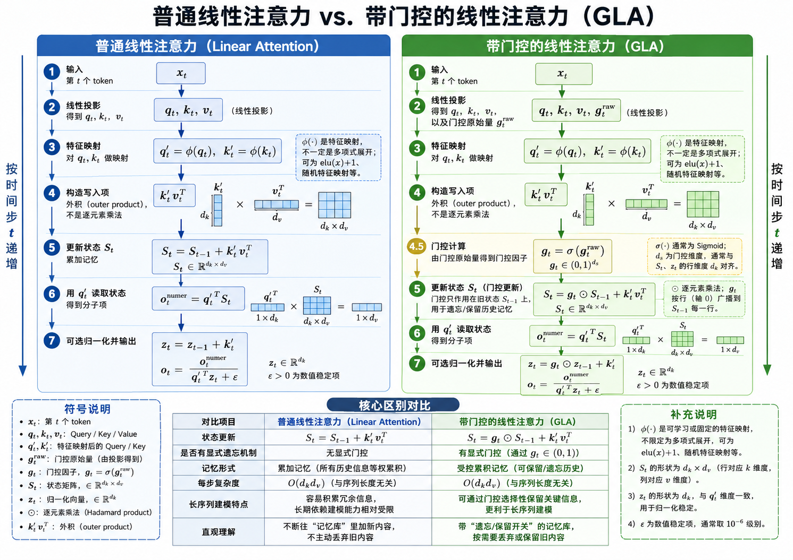
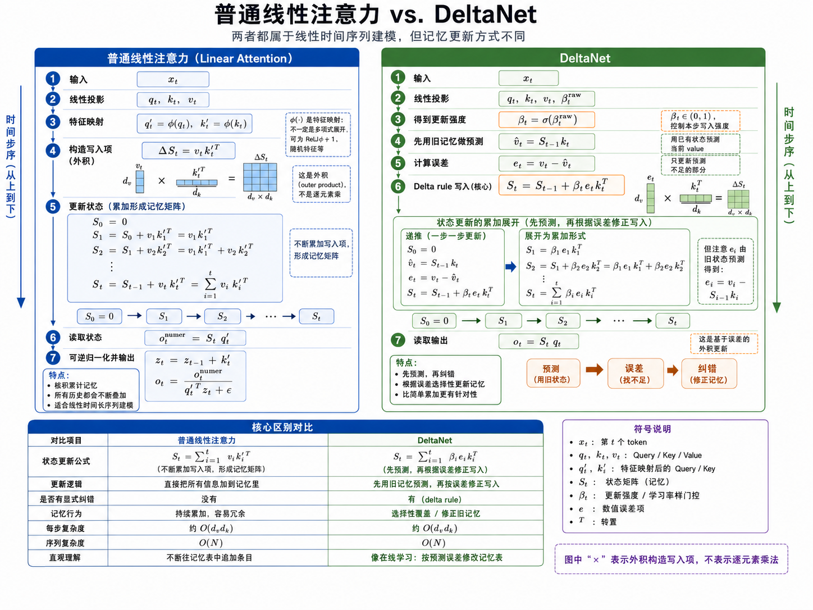

# 线性注意力机制

## 传统注意力机制存在的问题

传统 Transformer 使用的是标准的 Softmax Attention，核心公式为：

```math
\text{Attention}(Q,K,V)=\text{softmax}\Big(\frac{QK^T}{\sqrt{d_k}}\Big)V
```

其中 $QK^T$ 会计算序列中每个 token 与其他所有 token 的相关性。如果序列长度为 $n$，那么注意力分数矩阵的大小就是 $n \times n$。这带来了传统注意力机制最主要的问题：**计算复杂度和显存开销都会随序列长度平方级增长**。


### 1. 计算复杂度高

在标准注意力中，每个 token 都要和序列中的所有 token 做一次相似度计算。

如果序列长度是 $n$，隐藏维度是 $d$，那么计算 $QK^T$ 的复杂度约为：

```math
O(n^2d)
```

当序列较短时，这个开销可以接受；但当序列长度从几千扩展到几万、几十万时，$n^2$ 会迅速变得非常大。例如：

| 序列长度$n$ | 注意力矩阵大小$n \times n$ |
| ------------- | ---------------------------- |
| 1,000         | 1,000,000                    |
| 10,000        | 100,000,000                  |
| 100,000       | 10,000,000,000               |

也就是说，序列长度增加 10 倍，注意力矩阵的规模会增加 100 倍。

### 2. 显存占用高

标准注意力需要显式保存 $QK^T$ 得到的注意力矩阵，并在 Softmax 后继续保存注意力权重，用于后续与 $V$ 相乘以及反向传播。

这意味着显存复杂度同样是：

```math
O(n^2)
```

对于长文本、高清视频、长时间序列、基因序列等任务，输入长度可能非常大。此时注意力矩阵本身就会占用大量显存，甚至还没有进入后续 FFN 层，显存就已经成为瓶颈。

### 3. 长序列推理速度慢

在自回归生成任务中，例如大语言模型生成文本时，每生成一个新 token，都需要和历史 token 建立注意力关系。历史上下文越长，注意力计算越慢。

虽然 KV Cache 可以避免重复计算历史的 $K$ 和 $V$，但新 token 仍然需要和所有历史 token 做注意力匹配。因此上下文越长，每一步生成的代价也越高。

这会导致：

- 长上下文生成速度下降；
- 推理延迟增加；
- 服务端部署成本变高；
- 难以高效支持超长上下文窗口。

### 4. 不适合处理超长上下文

标准注意力的全局两两交互能力很强，这是它的优势；但这种优势是以平方复杂度为代价换来的。

对于很多任务来说，并不是每个 token 都必须和所有 token 做完整的精确注意力计算。例如：

- 文档理解中，很多 token 只和局部段落或少数关键位置强相关；
- 视频建模中，相邻帧之间的信息通常更密集；
- 时间序列中，远距离依赖可能存在，但不一定需要完整的两两比较；
- 长文本检索或摘要中，模型更需要高效聚合全局信息，而不是保存完整注意力矩阵。

因此，标准注意力在长序列场景中会出现“能力强但代价太高”的问题。

## 线性注意力机制是怎么做的

线性注意力机制的目标是：**在尽量保留注意力建模能力的同时，将复杂度从平方级降低到线性级**。

标准注意力的瓶颈来自先计算 $QK^T$，再做 Softmax：

```math
\text{softmax}(QK^T)V
```

这个过程会显式构造 $n \times n$ 的注意力矩阵。线性注意力的核心思路是通过核函数、特征映射或计算顺序变换，避免直接构造完整的注意力矩阵。

一种常见形式是将注意力近似改写为：

```math
\text{Attention}(Q,K,V) \approx \phi(Q)(\phi(K)^TV)
```

其中 $\phi(\cdot)$ 是一个特征映射函数。这样可以先计算 $\phi(K)^TV$，再与 $\phi(Q)$ 相乘。

计算顺序发生变化后，就不再需要显式生成 $n \times n$ 的矩阵，复杂度可以降低为：

```math
O(nd^2)
```

### 公式推导过程

这里的数学推理过程如下：


**1.对标准注意力进行抽象：**

这里先回顾一下 softmax 的公式：

```math
\mathrm{softmax}(z)_i
=
\frac{e^{z_i}}{\sum_{j=1}^{K}e^{z_j}},
\quad i=1,\cdots,K
```

若用 $\alpha_{ij}$ 表示第 $i$ 个 token 对第 $j$ 个 token 的注意力权重，则有：

```math
\alpha_{ij}
=
\frac{
\exp\left(\frac{q_i k_j^T}{\sqrt d}\right)
}{
\sum_{l=1}^{N}
\exp\left(\frac{q_i k_l^T}{\sqrt d}\right)
}
\quad [1]
```

* $q_i$：第 $i$ 个 token 的 Query，表示“我想找什么信息”
* $k_j$：第 $j$ 个 token 的 Key，表示“我能提供什么匹配特征”
* $q_i k_j^T$：计算第 $i$ 个 token 和第 $j$ 个 token 的相关性分数
* $\sqrt d$：缩放项，防止分数过大
* softmax：对固定的 $i$，把 $q_i$ 与所有 $k_1,k_2,\cdots,k_N$ 的相关性分数转换成概率权重。

这里的 $\exp(x)$ 代表的是 $e^x$，那么 $\exp\left(\frac{q_i k_j^T}{\sqrt d}\right)$ 则为 $e^{\left(\frac{q_i k_j^T}{\sqrt d}\right)}\quad[2]$。

将【2】式带入【1】式得到单个注意力权重：

```math
\alpha_{ij}=
\frac{
e^{\left(\frac{q_i k_j^T}{\sqrt d}\right)}
}{
\sum_{l=1}^{N}
e^{\left(\frac{q_i k_l^T}{\sqrt d}\right)}
} \quad [3]
```

这里的【3】式表示了一个 token 对一个 token的单个权重

而第 $i$ 个 token 的最终注意力输出则是要把它对所有 token 的贡献都加起来。这里会先拿它的查询向量 $q_i$ 依次和所有 Key token 对应的 $k_1,k_2,\cdots,k_N$ 计算相关性分数，得到一组分数：

```math
\left[
\frac{q_i k_1^T}{\sqrt d},
\frac{q_i k_2^T}{\sqrt d},
\cdots,
\frac{q_i k_j^T}{\sqrt d}
\right] \quad [4]
```

这里将【4】中的值依次带入得：

```math
\sum_{r=1}^{j}\alpha_{ir}=
\frac{e^{\left(\frac{q_i k_1^T}{\sqrt d}\right)}}{\sum_{l=1}^{N}e^{\left(\frac{q_i k_l^T}{\sqrt d}\right)}}
+
\frac{e^{\left(\frac{q_i k_2^T}{\sqrt d}\right)}}{\sum_{l=1}^{N}e^{\left(\frac{q_i k_l^T}{\sqrt d}\right)}}
+
\cdots
+
\frac{e^{\left(\frac{q_i k_j^T}{\sqrt d}\right)}}{\sum_{l=1}^{N}e^{\left(\frac{q_i k_l^T}{\sqrt d}\right)}}
```

这里的分母都是相同的，因此可以化简为：

```math
\sum_{r=1}^{j}\alpha_{ir}
=
\frac{
\sum_{r=1}^{j}e^{\left(\frac{q_i k_r^T}{\sqrt d}\right)}
}{
\sum_{l=1}^{N}e^{\left(\frac{q_i k_l^T}{\sqrt d}\right)}
} \quad [5]
```

其中 $\alpha_{ij}$ 表示第 $i$ 个 token 对第 $j$ 个 token 的关注比例。最终，第 $i$ 个 token 的注意力输出为：

```math
o_i=\sum_{j=1}^{N}\alpha_{ij}v_j
```

这里用 $\mathrm{sim}(q_i,k_j)$ 表示未归一化的相似度分数，即三式中的分子项：

```math
\mathrm{Attention}(q_i)
=
\frac{
\sum_{j=1}^{N} \mathrm{sim}(q_i,k_j)v_j
}{
\sum_{j=1}^{N} \mathrm{sim}(q_i,k_j)
}
\quad [6]
```

**2.将 $\mathrm{sim}(q_i,k_j)$ 转换为 $\phi(q_i)^T \phi(k_j)$**

这一步的目的主要是为了把 $n^2$ 的复杂度转换为 $n$

标准注意力中的未归一化相似度可以写成：

```math
\mathrm{sim}(q_i,k_j)
=
\exp\left(\frac{q_i k_j^T}{\sqrt d}\right)
```

为了方便推导，先忽略缩放项 $\sqrt d$，只看 $\exp(q_i k_j^T)$。

泰勒展开的作用是：把一个复杂函数表示成无穷多个多项式项的和。对于指数函数 $e^x$，在 $x=0$ 处的泰勒展开为：

```math
e^x
=
1+x+\frac{x^2}{2!}+\frac{x^3}{3!}+\cdots
=
\sum_{m=0}^{\infty}\frac{x^m}{m!}
```

这里：

* $m=0$ 时，$\frac{x^0}{0!}=1$
* $m=1$ 时，$\frac{x^1}{1!}=x$
* $m=2$ 时，$\frac{x^2}{2!}$
* $m=3$ 时，$\frac{x^3}{3!}$

现在令：

```math
x=q_i k_j^T
```

把它代入 $e^x$ 的泰勒展开，就得到：

```math
\exp(q_i k_j^T)
=
\sum_{m=0}^{\infty}\frac{(q_i k_j^T)^m}{m!}
```

如果把前几项展开写出来，就是：

```math
\exp(q_i k_j^T)
=
1
+
q_i k_j^T
+
\frac{(q_i k_j^T)^2}{2!}
+
\frac{(q_i k_j^T)^3}{3!}
+
\cdots
```

这里的每一项都可以理解为不同阶数的相似度：

* $1$：常数项，表示一个固定偏置
* $q_i k_j^T$：一阶相似度，也就是原始向量的点积
* $(q_i k_j^T)^2$：二阶相似度，可以理解为两个向量特征两两组合后的相似度
* $(q_i k_j^T)^3$：三阶相似度，可以理解为三个特征组合后的相似度

也就是说，指数相似度不只包含原始点积，还包含二阶、三阶、直到无穷阶的特征交互。

这里我们可将泰勒展开当中的一个项表示为如下形式：

```math
e^{q_i k_j^T}
=
1
+
q_i k_j^T
+
\frac{(q_i k_j^T)^2}{2!}
+
\frac{(q_i k_j^T)^3}{3!}
+
\cdots
```

这里利用多项式展开以 $(qk^T)^2$ 为例又有：

```math
(qk^T)^2
=
(q_1k_1+q_2k_2)^2
```

1. 根据平方展开：

   ```math
   (q_1k_1+q_2k_2)^2
   =
   q_1^2k_1^2+2q_1q_2k_1k_2+q_2^2k_2^2
   ```
2. 再看这两个向量的内积：

   ```math
   [q_1^2,\sqrt{2}q_1q_2,q_2^2]
   \cdot
   [k_1^2,\sqrt{2}k_1k_2,k_2^2]^T
   ```
3. 点积就是对应位置相乘再相加：

   ```math
   q_1^2k_1^2
   +
   (\sqrt{2}q_1q_2)(\sqrt{2}k_1k_2)
   +
   q_2^2k_2^2
   ```

   中间项：

   ```math
   (\sqrt{2}q_1q_2)(\sqrt{2}k_1k_2)
   =
   2q_1q_2k_1k_2
   ```

   所以整个点积等于：

   ```math
   q_1^2k_1^2+2q_1q_2k_1k_2+q_2^2k_2^2
   ```

   这正好就是：

   ```math
   (q_1k_1+q_2k_2)^2
   ```
4. 所以可以说：

   ```math
   (qk^T)^2
   =
   \phi_2(q)^T\phi_2(k)
   ```

   其中二阶特征映射可以写成：

   ```math
   \phi_2(q)=[q_1^2,\sqrt{2}q_1q_2,q_2^2]
   ```

   ```math
   \phi_2(k)=[k_1^2,\sqrt{2}k_1k_2,k_2^2]
   ```

上面这一段可以外推到每一项都可以写成某一阶特征的内积：

```math
1=\phi_0(q_i)^T\phi_0(k_j)
```

```math
q_i k_j^T=\phi_1(q_i)^T\phi_1(k_j)
```

```math
(q_i k_j^T)^2=\phi_2(q_i)^T\phi_2(k_j)
```

```math
(q_i k_j^T)^3=\phi_3(q_i)^T\phi_3(k_j)
```

代回去：

```math
e^{q_i k_j^T}
=
\phi_0(q_i)^T\phi_0(k_j)
+
\frac{1}{1!}\phi_1(q_i)^T\phi_1(k_j)
+
\frac{1}{2!}\phi_2(q_i)^T\phi_2(k_j)
+
\frac{1}{3!}\phi_3(q_i)^T\phi_3(k_j)
+
\cdots
```

然后把这些不同阶的特征拼成一个大向量：

```math
\phi(q_i)
=
[
\phi_0(q_i),
\frac{1}{\sqrt{1!}}\phi_1(q_i),
\frac{1}{\sqrt{2!}}\phi_2(q_i),
\frac{1}{\sqrt{3!}}\phi_3(q_i),
\cdots
] =
[
\underbrace{1}_{0\text{阶}},
\underbrace{q_1,q_2}_{1\text{阶}},
\underbrace{\frac{q_1^2}{\sqrt{2!}},\frac{\sqrt{2}q_1q_2}{\sqrt{2!}},\frac{q_2^2}{\sqrt{2!}}}_{2\text{阶}},
\underbrace{\frac{q_1^3}{\sqrt{3!}},\frac{\sqrt{3}q_1^2q_2}{\sqrt{3!}},\frac{\sqrt{3}q_1q_2^2}{\sqrt{3!}},\frac{q_2^3}{\sqrt{3!}}}_{3\text{阶}},
\cdots
]
```

同样：

```math
\phi(k_j)
=
[
\phi_0(k_j),
\frac{1}{\sqrt{1!}}\phi_1(k_j),
\frac{1}{\sqrt{2!}}\phi_2(k_j),
\frac{1}{\sqrt{3!}}\phi_3(k_j),
\cdots
] = [\underbrace{1}_{0\text{阶}},
\underbrace{k_1,k_2}_{1\text{阶}},
\underbrace{\frac{k_1^2}{\sqrt{2!}},\frac{\sqrt{2}k_1k_2}{\sqrt{2!}},\frac{k_2^2}{\sqrt{2!}}}_{2\text{阶}},
\underbrace{\frac{k_1^3}{\sqrt{3!}},\frac{\sqrt{3}k_1^2k_2}{\sqrt{3!}},\frac{\sqrt{3}k_1k_2^2}{\sqrt{3!}},\frac{k_2^3}{\sqrt{3!}}}_{3\text{阶}},
\cdots]
```

这两个大向量做内积时，就是对应位置相乘再相加：

```math
\phi(q_i)^T\phi(k_j)
```

展开后正好是：

```math
\phi_0(q_i)^T\phi_0(k_j)
+
\frac{1}{1!}\phi_1(q_i)^T\phi_1(k_j)
+
\frac{1}{2!}\phi_2(q_i)^T\phi_2(k_j)
+
\frac{1}{3!}\phi_3(q_i)^T\phi_3(k_j)
+
\cdots
```

也就是：

```math
e^{q_i k_j^T}
```

所以最后能写成：

```math
e^{q_i k_j^T}
=
\phi(q_i)^T\phi(k_j)
```

所以：

```math
\exp\left(\frac{q_i k_j^T}{\sqrt d}\right)
=
\phi(q_i)^T\phi(k_j)
```

理论上，如果 $\phi(\cdot)$ 是无限维的，上式可以精确成立；但实际计算中不会真的使用无限维特征，所以通常选择一个有限维的特征映射来近似：

```math
\mathrm{sim}(q_i,k_j)
\approx
\phi(q_i)^T\phi(k_j)
```

这就是线性注意力能够把相似度函数拆成 Query 特征和 Key 特征内积的原因。

这里相当于把原先 $QK^T$ 复杂度为 $n^2$ 的运算转换成了复杂度为 $n$ 的运算。

**3. 得到最终结果：**

```math
\mathrm{Attention}(q_i)=
\frac{
\sum_{j=1}^{N} \phi(q_i)^T \phi(k_j)v_j
}{
\sum_{j=1}^{N} \phi(q_i)^T \phi(k_j)
}
```

因为 $\phi(q_i)$ 与求和下标 $j$ 无关，所以可以把它提出来：

```math
\mathrm{Attention}(q_i)=
\frac{
\phi(q_i)^T \left(\sum_{j=1}^{N} \phi(k_j)v_j^T\right)
}{
\phi(q_i)^T \left(\sum_{j=1}^{N} \phi(k_j)\right)
}
```

### 具体实现

在线性注意力真正训练时，前面的输入流程和标准 Transformer 是一样的：先把 token 转成向量表示，再通过三个可学习矩阵得到 $Q,K,V$。

假设输入序列表示为：

```math
X\in \mathbb{R}^{N\times d_{\text{model}}}
```

其中 $N$ 是 token 数量，$d_{\text{model}}$ 是每个 token 的向量维度。然后通过线性变换得到：

```math
Q=XW_Q,\quad K=XW_K,\quad V=XW_V
```

也就是对每个 token：

```math
q_i=x_iW_Q,\quad k_i=x_iW_K,\quad v_i=x_iW_V
```

到这里为止，线性注意力和标准注意力完全一样。区别从下一步开始：标准注意力会直接计算 $QK^T$，而线性注意力会先对 $Q$ 和 $K$ 做特征映射：

```math
Q'=\phi(Q),\quad K'=\phi(K)
```

也就是：

```math
q_i\rightarrow \phi(q_i),\quad k_i\rightarrow \phi(k_i)
```

这里可以理解为：不是简单地把 $q_i$、$k_i$ 按维度拆开，而是基于原始维度构造新的特征数组。例如从泰勒展开的角度看，如果：

```math
q_i=[q_1,q_2]
```

那么 $\phi(q_i)$ 可以理解为包含多阶特征组合的新数组：

```math
\phi(q_i)
=
[
1,
q_1,q_2,
q_1^2,q_1q_2,q_2^2,
q_1^3,q_1^2q_2,q_1q_2^2,q_2^3,
\cdots
]
```

$\phi(k_i)$ 也是同样的形式。这样做的目的，是让原来的相似度函数可以近似写成：

```math
\mathrm{sim}(q_i,k_j)\approx \phi(q_i)^T\phi(k_j)
```

不过真实工程中不一定真的手动展开这些多项式。常见做法可能是使用简单的正值映射，例如 $\phi(x)=\mathrm{elu}(x)+1$，也可能使用随机特征映射来近似 softmax kernel。无论具体 $\phi$ 怎么设计，它的目标都是把 $Q,K$ 变成更适合线性化计算的新表示。

得到 $Q'$ 和 $K'$ 后，线性注意力不再构造 $N\times N$ 的注意力矩阵，而是先聚合所有 Key 和 Value：

```math
S=K'^TV
```

再计算归一化项：

```math
z=K'^T\mathbf{1}
```

其中 $\mathbf{1}$ 表示长度为 $N$ 的全 1 向量，所以 $z$ 等价于把所有 $\phi(k_j)$ 加起来：

```math
z=\sum_{j=1}^{N}\phi(k_j)
```

然后对每个 query 计算输出：

```math
o_i=
\frac{
\phi(q_i)^TS
}{
\phi(q_i)^Tz
}
```

把所有 token 合在一起，矩阵形式可以写成：

```math
O=
\frac{
Q'(K'^TV)
}{
Q'(K'^T\mathbf{1})
}
```

其中分母按 token 位置对输出做归一化。

整个过程可以总结为：

```text
输入 token 向量 X
        |
        v
Q = XW_Q, K = XW_K, V = XW_V
        |
        v
Q' = phi(Q), K' = phi(K)
        |
        v
S = K'^T V,  z = K'^T 1
        |
        v
O_i = phi(q_i)^T S / phi(q_i)^T z
```

所以线性注意力的关键不是改变 $Q,K,V$ 的来源，而是在得到 $Q,K,V$ 之后，把 $Q,K$ 映射成 $\phi(Q),\phi(K)$，再通过改变计算顺序避免显式计算 $QK^T$。

## 线性注意力的好处是什么？

当 $d$ 远小于 $n$ 时，这个复杂度相对于 $O(n^2d)$ 更适合长序列任务。简化理解就是：

| 机制       | 是否构造$n \times n$ 注意力矩阵 | 复杂度              |
| ---------- | --------------------------------- | ------------------- |
| 传统注意力 | 需要                              | $O(n^2)$          |
| 线性注意力 | 不需要显式构造                    | $O(n)$ 或近似线性 |

线性注意力机制主要解决以下问题：

1. **降低长序列计算成本**：避免每个 token 和所有 token 显式两两计算，使长文本、长视频、长时间序列建模更加可行。
2. **减少显存占用**：不保存完整的注意力矩阵，训练和推理时都更节省显存。
3. **提升推理效率**：尤其适合长上下文场景，可以降低随着上下文增长带来的推理开销。
4. **支持更长输入**：在相同硬件条件下，线性注意力可以处理更长的序列。

不过，线性注意力并不是无条件替代标准注意力。标准 Softmax Attention 能够精确表达任意 token 之间的全局关系，而线性注意力通常会通过近似、核函数或结构假设来换取效率。因此它的核心取舍是：

> 用一定的表达能力或精确性损失，换取长序列场景下更低的计算复杂度和显存开销。

所以，线性注意力机制的出现，本质上是为了解决 Transformer 在长序列场景中的扩展性问题。

## 线性注意力机制存在的问题与其发展路径

前面介绍的基础线性注意力，核心是把历史 Key-Value 信息压缩成一个固定大小的状态矩阵：

```math


S=K'^TV,\quad o_i=\phi(q_i)^TS


```

如果写成自回归生成时的递推形式，可以理解为：

```math


S_t=S_{t-1}+\phi(k_t)v_t^T


```

也就是说，每来一个新 token，就把当前的 $\phi(k_t)v_t^T$ 加到历史记忆 $S_{t-1}$ 里面。这个 $S_t$ 像一个固定大小的“记忆矩阵”，里面压缩保存前面 token 的信息。

这种基础形式的优势是高效：它不用构造 $N\times N$ 的注意力矩阵，也不用保存完整 KV cache。但它也有两个明显问题：

1.**只会累加，不会遗忘**：上下文变长后，旧信息、无关信息、过期信息都会堆进同一个固定大小状态里，容易造成 memory collision；

2.**只会写入，不会修正**：如果旧记忆对某个 key 的映射已经不准确，简单累加不会主动替换或纠正旧的 key-value 关联。

因此在线性注意力后续发展的道路上主要围绕着这两点的改造展开。

```text

基础线性注意力
   |
   |---> GLA / Mamba2：加入门控/衰减，解决“不会忘”
   |
   |---> DeltaNet：加入 Delta Rule，解决“不会改”
             |
             v
      Gated DeltaNet：把门控/衰减 + Delta Rule 合并
             |
             v
      KDA：在 Gated DeltaNet 基础上，把粗粒度门控升级为更细粒度门控
```

## 带门控的线性注意力机制 GLA



GLA，全称是 **Gated Linear Attention**，可以理解为在基础线性注意力上加入“遗忘门控”的版本。

基础线性注意力的状态更新是：

```math
S_t=S_{t-1}+\phi(k_t)v_t^T
```

它的含义是：每来一个 token，就把当前 token 的 key-value 信息继续累加进状态矩阵 $S_t$。这种方式很高效，但问题是旧信息会一直保留，模型没有显式机制决定哪些历史信息应该衰减。

GLA 在这个基础上加入门控项 $g_t$：

```math
S_t=g_t\odot S_{t-1}+\phi(k_t)v_t^T
```

其中：

- $S_{t-1}$ 是旧的记忆状态；
- $\phi(k_t)v_t^T$ 是当前 token 写入的新信息；
- $g_t$ 是门控值，也可以理解为遗忘比例；
- $\odot$ 表示逐元素相乘。

如果 $g_t$ 接近 1，说明旧记忆大部分保留；如果 $g_t$ 接近 0，说明旧记忆被大量遗忘。

所以 GLA 的核心思想是：

```text
基础线性注意力：
只会不断累加历史信息。

GLA：
在累加新信息前，先用门控 g_t 控制旧状态保留多少。
```

### GLA 的门控是怎么来的？

门控 $g_t$ 通常也是由当前 token 的隐藏表示 $x_t$ 通过可学习参数生成的，例如：

```math
g_t=\sigma(x_tW_g)
```

这里 $\sigma$ 通常是 sigmoid 函数，用来把门控值压到 0 到 1 之间。

可以直观理解为：

```text
当前 token x_t
      |
      v
通过可学习矩阵 W_g
      |
      v
经过 sigmoid 得到 g_t
      |
      v
用 g_t 控制旧状态 S_{t-1} 保留多少
```

### GLA 和普通线性注意力的区别

普通线性注意力：

```math
S_t=S_{t-1}+\phi(k_t)v_t^T
```

GLA：

```math
S_t=g_t\odot S_{t-1}+\phi(k_t)v_t^T
```

二者最大的区别是：GLA 在更新状态之前，多了一步对旧记忆的门控衰减。

| 对比项       | 普通线性注意力   | GLA                    |
| ------------ | ---------------- | ---------------------- |
| 旧记忆处理   | 直接保留         | 先经过门控衰减         |
| 是否会遗忘   | 没有显式遗忘     | 有显式遗忘             |
| 状态更新     | 累加式记忆       | 受控累加式记忆         |
| 长上下文问题 | 容易累积无关信息 | 可以过滤一部分无关信息 |

### GLA 解决了什么，又没解决什么？

GLA 主要解决的是基础线性注意力“不会忘”的问题。它让模型可以根据当前 token 动态决定旧状态保留多少，从而减少无关历史信息一直堆积在 $S_t$ 中。

但是 GLA 仍然有一个限制：它主要是在做“遗忘/保留”，并没有像 DeltaNet 那样显式检查旧记忆对当前 key 的映射是否准确，也不会根据预测误差去修正旧的 key-value 关联。

所以可以这样理解：

```text
GLA：
解决“不会忘”的问题。

DeltaNet：
解决“不会改”的问题。

Gated DeltaNet：
把“会忘”和“会改”结合起来。
```

因此，GLA 是从基础线性注意力走向 Gated DeltaNet 的一条重要思路：它先引入门控机制，让固定大小的状态矩阵具备选择性遗忘能力。

## DeltaNet



前面说 GLA 主要解决“不会忘”的问题，而 DeltaNet 主要解决的是“不会改”的问题。

这里 DeltaNet 没有继续沿用“用 $\phi(q),\phi(k)$ 近似 softmax kernel”这条路继续推，而是换了一个视角：

> 把线性注意力里的状态矩阵 $S_t$ 看成一个固定大小的 key-value 关联记忆。

也就是说，基础线性注意力的状态：

```math
S_t=S_{t-1}+\phi(k_t)v_t^T
```

可以理解为不断把 key-value 外积写进记忆矩阵。为了和前文保持一致，这里先使用状态矩阵：

```math
S_t\in \mathbb{R}^{d_k\times d_v}
```

读取时：

```math
o_t=S_t^Tq_t
```

如果 query 正好接近某个 key，模型就希望从 $S_t$ 中读出对应的 value。

更完整实现中，$q_t$、$v_t$ 也可能经过卷积、激活和归一化等处理。

### 基础线性注意力为什么会有“不会改”的问题？

普通线性注意力的写入方式是简单累加：

```math
S_t=S_{t-1}+k_tv_t^T
```

这里的 $k_t$ 表示模型生成出的 key，即 $v_t=x_tW_V$

这个累加式写入可以理解为：

```text
看到一个新的 key-value，就直接追加进记忆。
```

但问题是，如果旧记忆里已经有和当前 $k_t$ 相关的内容，而且这个旧内容不准确，简单累加并不会先把旧内容改掉。它只会继续往 $S$ 里面叠加新信息。

所以基础线性注意力更像：

```text
不断记笔记，但不检查旧笔记是否需要修改。
```

DeltaNet 的想法是：

```text
当前 key k_t 进来时，先看看旧记忆 S_{t-1} 用这个 key 能不能读出正确的 value。
如果读出来不对，就对旧记忆做一次修正。
```

### DeltaNet 的修正目标

首先旧记忆 $S_{t-1}$ 根据当前 key $k_t$ 读出的预测 value 是：

```math
\hat v_t=S_{t-1}^Tk_t
```

如果 $\hat v_t$ 和真实的 $v_t$ 不一致，就说明旧记忆在当前 key 方向上不准确。

于是 DeltaNet 定义一个重建损失：

```math
L_t(S)=\frac{1}{2}\|S^Tk_t-v_t\|^2 \quad[1]
```

在这里我们希望通过记忆矩阵 S 与 key k_t 做计算时，输出尽量接近 value v_t。而损失函数正是用来描述这种误差，所以我们的目标就转化为了对损失函数关于记忆矩阵 $S$ 求梯度，并沿着负梯度方向更新 $S$。

### 推导过程

#### 1.明确损失函数

这里我们先记损失为：

```math
e_t =\hat v_t-v_t =S^Tk_t-v_t \quad[2]
```

将2式带入1式得：

```math
L_t(S)=\frac{1}{2}\|e_t\|^2
```

而向量二范数平方满足：

```math
\|e_t\|^2=e_t^Te_t
```

所以 DeltaNet 的损失函数最终可以写成：

```math
L_t(S)=\frac{1}{2}e_t^Te_t
```

从上面的公式中我们可以看出，损失函数 L_t 的值依赖于误差 e_t，而 e_t 又依赖于记忆矩阵 S；因此我们先求 S 的变化如何影响 e_t，再求 e_t 的变化如何影响 L_t，最后合起来得到 L_t 对 S 的梯度。

#### 2. 对 S 做一个很小的扰动，得到对误差 e_t 的影响

令：

```math
S \rightarrow S+dS
```

那么误差从：

```math
e_t=S^Tk_t-v_t
```

变成：

```math
e_t+de_t=(S+dS)^Tk_t-v_t
```

展开：

```math
e_t+de_t=S^Tk_t+dS^Tk_t-v_t
```

所以得到，在对记忆矩阵 S 进行改变后，误差 $e_t$ 则会随之产生变化：

```math
de_t=dS^Tk_t
```

#### 3.损失函数的变化

因为：

```math
L_t(S)=\frac{1}{2}e_t^Te_t
```

所以：

```math
dL_t=d\left(\frac{1}{2}e_t^Te_t\right)
```

平方误差的微分是：

```math
dL_t=e_t^Tde_t
```

将下面的公式代入上面的公式：

```math
de_t=dS^Tk_t
```

得到：

```math
dL_t=e_t^TdS^Tk_t
```

#### 整理为 trace 形式

这个标量可以调整顺序写成 trace 形式：

```math
dL_t = \mathrm{tr}(e_t^TdS^Tk_t) = \mathrm{tr}(k_te_t^TdS^T) = \mathrm{tr}((k_te_t^T)^TdS)
```

根据矩阵微分定义：

```math
dL_t=\mathrm{tr}((\nabla_SL_t)^TdS)
```

因为：

```math
dL_t=\mathrm{tr}((\nabla_SL_t)^TdS)=e_t^TdS^Tk_t
```

所以：

```math
\nabla_SL_t(S)=k_te_t^T
```

再把 $e_t=S^Tk_t-v_t$ 代回去：

```math
\nabla_SL_t(S)=k_t(S^Tk_t-v_t)^T
```

代入梯度下降：

```math
S_t=S_{t-1}-\beta_tk_t(S_{t-1}^Tk_t-v_t)^T
```

把括号里的符号反过来，也可以写成更直观的误差修正形式：

```math
S_t=S_{t-1}+\beta_tk_t(v_t-S_{t-1}^Tk_t)^T
```

其中：

```math
v_t-S_{t-1}^Tk_t
```

就是“真实 value”和“旧记忆预测 value”之间的误差。

所以这个式子的意思是：

```text
新记忆 = 旧记忆 + 当前 key × 预测误差 × 修正步长
```

误差大，修正就大；误差小，修正就小。

### 得到 DeltaNet 的经典形式

把上面的式子展开：

```math
S_t
=
S_{t-1}
+\beta_tk_t(v_t-S_{t-1}^Tk_t)^T
```

因为：

```math
(v_t-S_{t-1}^Tk_t)^T=v_t^T-k_t^TS_{t-1}
```

所以：

```math
S_t
=
S_{t-1}
+\beta_tk_tv_t^T
-\beta_tk_tk_t^TS_{t-1}
```

把关于 $S_{t-1}$ 的两项合并：

```math
S_t
=
(I-\beta_tk_tk_t^T)S_{t-1}
+\beta_tk_tv_t^T
```

这就是 DeltaNet 的经典更新公式。

而在下面的式子当中 $\beta_tk_t(v_t-S_{t-1}^Tk_t)^T$ 就是在沿着负梯度方向进行更新。

```math
S_t=S_{t-1}+\beta_tk_t(v_t-S_{t-1}^Tk_t)^T
```

这个式子可以直接看出 DeltaNet 的修正含义：

- $v_t-S_{t-1}^Tk_t$ 是旧记忆读出的预测 value 和真实 value 之间的误差；
- $k_t$ 决定这次修正发生在哪个 key 方向；
- $\beta_t$ 控制这次修正的强度。

如果 $k_t$ 已经归一化，并且 $\beta_t=1$，那么更新后有一个很直观的性质：

```math
S_t^Tk_t=v_t
```

也就是说，在当前 key 这个方向上，记忆会被直接修正到能读出当前 value。这就是 Delta Rule 的“纠错”含义。

### 从第一个 token 开始，状态是怎么一步步来的？

DeltaNet 的状态矩阵一开始通常初始化为空记忆：

```math
S_0=0
```

其中：

```math
S_0\in \mathbb{R}^{d_k\times d_v}
```

含义是：序列刚开始时，还没有读入任何 token，所以记忆矩阵里没有历史 key-value 信息。

对于第 1 个 token，模型先从 $x_1$ 得到：

```math
k_1,\quad v_1,\quad q_1,\quad \beta_1
```

然后用 DeltaNet 的更新公式：

```math
S_1=(I-\beta_1k_1k_1^T)S_0+\beta_1k_1v_1^T
```

因为 $S_0=0$，所以：

```math
S_1=\beta_1k_1v_1^T
```

也就是说，第一个 token 会把自己的 key-value 映射写入空记忆。

对于第 2 个 token，模型从 $x_2$ 得到：

```math
k_2,\quad v_2,\quad q_2,\quad \beta_2
```

此时旧记忆已经是 $S_1$，所以：

```math
S_2=(I-\beta_2k_2k_2^T)S_1+\beta_2k_2v_2^T
```

也就是：

```text
先根据当前 key k_2 修正旧记忆 S_1，
再写入当前 key-value 映射 k_2 -> v_2。
```

对于第 3 个 token：

```math
S_3=(I-\beta_3k_3k_3^T)S_2+\beta_3k_3v_3^T
```

继续往后就是：

```math
S_t=(I-\beta_tk_tk_t^T)S_{t-1}+\beta_tk_tv_t^T
```

所以完整流程可以概括为：

```text
S_0 = 空记忆
第 1 个 token: x_1 -> k_1,v_1 -> 写入得到 S_1
第 2 个 token: x_2 -> k_2,v_2 -> 修正 S_1 并写入得到 S_2
第 3 个 token: x_3 -> k_3,v_3 -> 修正 S_2 并写入得到 S_3
...
第 t 个 token: x_t -> k_t,v_t -> 修正 S_{t-1} 并写入得到 S_t
```

当前 token 的输出则通过 query 从状态中读取：

```math
o_t=S_t^Tq_t
```

这里的关键点是：每一步都不需要和所有历史 token 两两计算，而是只和固定大小的状态矩阵 $S_{t-1}$ 交互。

### DeltaNet 和线性注意力的关系

DeltaNet 看起来不像基础线性注意力，是因为它不再强调：

```math
\exp(q^Tk)\approx \phi(q)^T\phi(k)
```

这条 softmax kernel 近似路线。

它继承的是线性注意力的另一个核心思想：

```text
用固定大小的状态矩阵 S 存储历史 key-value 信息，
当前 token 只和这个固定大小的 S 交互，
而不是和所有历史 token 两两计算注意力。
```

所以二者的关系可以这样理解：

```text
基础线性注意力：
把 key-value 不断累加到状态 S 中。

DeltaNet：
仍然维护固定大小状态 S，
但写入前会根据当前 key-value 误差修正旧状态。
```

因此，DeltaNet 不是“基础线性注意力的 φ 映射增强版”，而是“基础线性注意力的状态记忆更新规则增强版”。

还有一个很重要的区别：**DeltaNet 不再显式得到一组 softmax attention distribution**。

标准注意力会先计算：

```math
\alpha_{tj}=\mathrm{softmax}(q_t^Tk_j)
```

然后得到一组当前 token 对所有历史 token 的注意力权重：

```text
token 1 权重多少
token 2 权重多少
token 3 权重多少
...
```

最后再按权重加权求和：

```math
o_t=\sum_j\alpha_{tj}v_j
```

DeltaNet 不是这样。它没有显式构造每个历史 token 的注意力权重分布，而是先把历史信息压缩进状态矩阵 $S_t$，然后当前 query 直接从 $S_t$ 中读取：

```math
o_t=S_t^Tq_t
```

所以 DeltaNet 的读取更像是：

```text
历史 token 已经被压缩进一个固定大小记忆矩阵 S_t；
当前 q_t 像一个检索 key；
模型直接从 S_t 里读出结果。
```

以最基础的线性注意力为例，如果：

```math
S_t=\sum_{i=1}^{t}k_iv_i^T
```

那么读取时：

```math
o_t=S_t^Tq_t
```

展开就是：

```math
o_t=\sum_{i=1}^{t}v_i(k_i^Tq_t)
```

这里的 $k_i^Tq_t$ 确实有点像“历史 token 的权重”，但它不是 softmax 概率分布：

```text
它不一定非负；
它不一定归一化；
所有权重加起来不一定等于 1；
它不一定能解释成标准 attention map。
```

DeltaNet 更进一步，因为 $S_t$ 不是简单累加，而是经过多步 Delta Rule 修正后的状态：

```math
S_t=(I-\beta_tk_tk_t^T)S_{t-1}+\beta_tk_tv_t^T
```

因此，历史 token 对当前输出的贡献已经经过多轮状态修正和混合，不再容易还原成一组清晰的 token-level attention 权重。

所以可以总结为：

```text
标准 attention：
显式 token-to-token 注意力分布。

基础线性注意力：
没有显式 attention map，但展开后还能看到类似 k_i^T q_t 的隐式权重。

DeltaNet：
仍然没有显式 attention map，而且状态经过纠错更新后，更像一个隐式关联记忆。
```

这也是 DeltaNet 和标准 Transformer 注意力的重要区别：它牺牲了显式注意力分布和一部分可解释性，换来了固定状态、线性复杂度和在线修正记忆的能力。

## Gated DeltaNet
